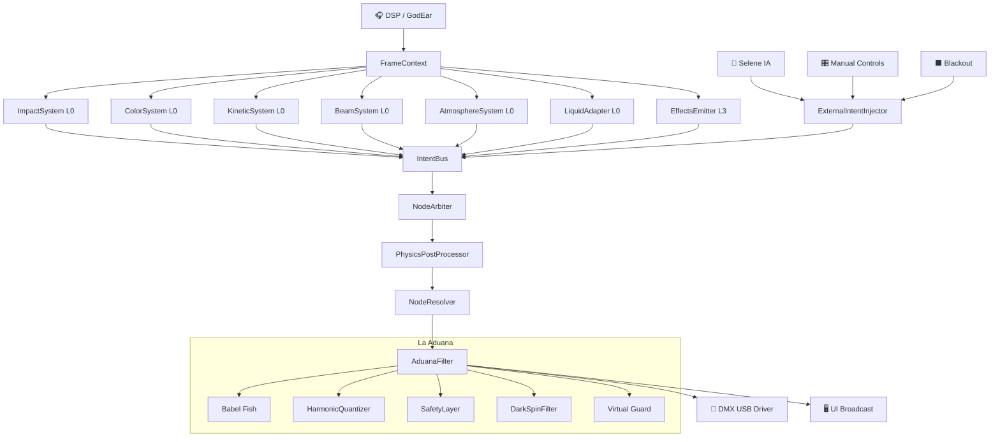

# 🌌 WAVE 3506 — THE ECOSYSTEM INTEGRATION BLUEPRINT

> **Documento**: Arquitectura de acoplamiento V0.88 ↔ Aether Matrix  
> **Versión**: 3506.1.0  
> **Autor**: Lead Developer / Quantum Architect  
> **Estado**: DISEÑO ESTRATÉGICO — No implementar sin aprobación  
> **Prerrequisito**: WAVE 3505 (Aether Matrix Contracts & Implementations)

---

## 0. MANIFIESTO DE INTEGRACIÓN

La Aether Matrix (WAVE 3505) ya corre en paralelo al pipeline legacy:
`NodeGraph`, `IntentBus`, `BaseSystem`/`ImpactSystem`/`ColorSystem`/`KineticSystem`,
`NodeArbiter` y `NodeResolver` — todos operativos a 44 Hz con zero-allocation.

**La misión de WAVE 3506** es tender los puentes que conecten el 100% de la
funcionalidad de V0.88 a este motor agnóstico. El resultado: un show que hoy
corre en el pipeline legacy podrá correr íntegramente sobre Aether sin que el
operador note un solo cambio, excepto menor latencia y mayor expresividad.

### Principios Inquebrantables

| # | Principio | Validación |
|---|-----------|------------|
| 1 | **Zero Functionality Loss** | Cada feature de V0.88 tiene un mapping explícito en Aether |
| 2 | **Zero-Allocation Hot Path** | `process()`, `push()`, `resolve()` — 0 heap allocs |
| 3 | **ECS Puro** | Systems no conocen hardware; Nodes no ejecutan lógica |
| 4 | **Hardware Respetado** | El HAL (Quantizer + DarkSpin) sigue siendo La Aduana final |
| 5 | **Migración Gradual** | El pipeline legacy y Aether pueden coexistir por subsistema |

---

## 1. LA CAPA ESPACIAL — La Forja & Stagebuilder

### 1.1 Estado Actual (V0.88)

**La Forja** (`ForgeView/FixtureForgeEmbedded.tsx`) construye `FixtureDefinition`
objetos con:
- Lista plana de **channels** (`{index, name, type, is16bit, defaultValue}`)
- `PhysicsProfile` (`motorType`, `maxAcceleration`, `maxVelocity`, `orientation`)
- `colorEngine` (`rgb | cmy | wheel | hybrid | none`)
- `colorWheel` con slots DMX + RGB mapping
- `capabilities` flags (`hasMovementChannels`, `has16bitMovement`, etc.)

**Stagebuilder** (`StageConstructorView.tsx` + `StageGrid3D.tsx`) persiste
`FixtureV2` en `stageStore`:
- `position: Position3D` (metros reales, coordenadas escénicas)
- `rotation: Rotation3D` (pitch/yaw/roll)
- `zone: CanonicalZone` (9 zonas semánticas)
- `calibration` (panOffset, tiltOffset, panInvert, tiltInvert)
- `channels[]` inline (copias de la librería para supervivencia)

**ShowFileV2** (`core/stage/ShowFileV2.ts`) agrega:
- `FixtureGroup` con `FixtureSelector` avanzado (zona + parity + stereo + phase)
- `normalizeZone()` — traductor universal de zonas legacy

### 1.2 Objetivo en Aether

Que La Forja produzca **IDeviceDefinition + ICapabilityNode[]** en lugar de
channels brutos, y que el Stagebuilder mapee `Position3D` ↔ `ICapabilityNode.position`.

### 1.3 Flujo de Datos: Forja → NodeGraph

```
┌───────────────────────────────────────────────────────────────────┐
│                    LA FORJA (Editor de Fixtures)                   │
│                                                                   │
│  FixtureDefinition V0.88                                          │
│  ├── channels[]        ──────► NodeExtractionPipeline             │
│  ├── physicsProfile    ──────►  ├── extractColorNodes()           │
│  ├── colorEngine       ──────►  ├── extractImpactNodes()          │
│  ├── colorWheel        ──────►  ├── extractKineticNodes()         │
│  └── capabilities      ──────►  ├── extractBeamNodes()     [NEW]  │
│                                 └── extractAtmosphereNodes()[NEW]  │
│                                        │                          │
│                                        ▼                          │
│                              IDeviceDefinition                    │
│                              ├── deviceId: DeviceId               │
│                              ├── name: string                     │
│                              ├── nodes: ICapabilityNode[]         │
│                              ├── dmxFootprint: number             │
│                              └── calibration: IDeviceCalibration  │
└───────────────────────────────┬───────────────────────────────────┘
                                │
                                ▼
                   NodeGraph.registerDevice(device)
                   ├── Asigna NodeIds a cada nodo
                   ├── Inserta en dense arrays por familia
                   └── Indexa por deviceId, familia, rol
```

### 1.4 `INodeExtractionPipeline` — Interfaz Clave

```typescript
/**
 * Pipeline que convierte una FixtureDefinition legacy a
 * un IDeviceDefinition compatible con Aether.
 *
 * Se ejecuta UNA VEZ en patch time (no en hot path).
 * Puede alocar libremente.
 */
interface INodeExtractionPipeline {
  /**
   * Convierte una FixtureDefinition V0.88 + FixtureV2 metadata
   * en una IDeviceDefinition con todos sus ICapabilityNode.
   *
   * @param definition  — Datos de La Forja (channels, physics, color)
   * @param fixtureV2   — Datos del Stagebuilder (position, zone, calibration)
   * @returns IDeviceDefinition lista para NodeGraph.registerDevice()
   */
  extract(
    definition: FixtureDefinition,
    fixtureV2: FixtureV2,
  ): IDeviceDefinition

  /**
   * Re-extrae solo los nodos afectados cuando el operador modifica
   * un fixture en vivo (e.g. cambia zona o calibración).
   * No toca nodos que no cambiaron.
   */
  reextract(
    deviceId: DeviceId,
    patch: Partial<FixtureV2>,
  ): IDeviceDefinition
}
```

### 1.5 Reglas de Extracción de Nodos

| Canal(es) V0.88 | NodeFamily | NodeRole Sugerido | Notas |
|---|---|---|---|
| `dimmer`, `dimmer_fine` | `IMPACT` | `primary` | Siempre. 1 nodo por fixture. |
| `shutter`, `strobe` | `IMPACT` | `percussion` | Sub-nodo del dimmer; controla gate. |
| `r`, `g`, `b` / `c`, `m`, `y` / `color_wheel` | `COLOR` | `primary` | 1 nodo COLOR principal. |
| `white`, `amber`, `uv` | `COLOR` | `accent` | Sub-emisores como nodos adicionales. |
| `pan`, `tilt`, `pan_fine`, `tilt_fine` | `KINETIC` | `primary` | 1 nodo KINETIC. |
| `speed`, `pan_speed` | `KINETIC` | — | Metadata del nodo, no nodo separado. |
| `zoom`, `focus`, `iris` | `BEAM` | `primary` | **[NEW]** 1 nodo BEAM. |
| `gobo`, `gobo_rotation`, `prism`, `prism_rotation` | `BEAM` | `decoration` | **[NEW]** Texturas. |
| `fog`, `haze`, `fan`, `fan_speed` | `ATMOSPHERE` | `ambient` | **[NEW]** 1 nodo ATMOSPHERE. |
| `laser_mode`, `laser_pattern` | `ATMOSPHERE` | `atmosphere` | **[NEW]** Dispositivos de aire. |

### 1.6 Flujo de Datos: Stagebuilder → NodeGraph (Coordenadas Espaciales)

```
┌─────────────────────────────────────────────────────────────────┐
│                   STAGEBUILDER (Layout 3D)                       │
│                                                                 │
│  FixtureV2.position (metros)                                    │
│  ├── x: -3.5  (izquierda del escenario)                       │
│  ├── y: 4.0   (truss a 4m de altura)                          │
│  └── z: 1.0   (1m delante del centro)                         │
│                                                                 │
│  FixtureV2.zone = 'movers-left'                                │
│  FixtureV2.calibration = { panOffset: -15, tiltInvert: true }  │
│                          │                                      │
│                          ▼                                      │
│              SpatialRegistrar (nuevo)                            │
│              ├── Escribe position en ICapabilityNode.position   │
│              ├── Calcula neighborIds por proximity              │
│              ├── Asigna NodeRole heurístico según zone          │
│              └── Inyecta calibration en IDeviceCalibration      │
└──────────────────────────┬──────────────────────────────────────┘
                           │
                           ▼
              NodeGraph (ahora con datos espaciales)
              ├── getByPosition(bbox) → nodos en volumen 3D
              ├── getNeighbors(nodeId) → nodos cercanos
              └── getByZone(zone) → nodos por zona semántica
```

### 1.7 `ISpatialRegistrar` — Interfaz Clave

```typescript
/**
 * Sincroniza datos espaciales del Stagebuilder con el NodeGraph.
 * Se ejecuta cada vez que el operador mueve/rota un fixture en 3D.
 *
 * NO es hot path — se llama en user-interaction time.
 */
interface ISpatialRegistrar {
  /**
   * Actualiza la posición de todos los nodos de un Device
   * basándose en la Position3D del fixture en el stage.
   */
  updateDevicePosition(
    deviceId: DeviceId,
    position: Position3D,
    rotation: Rotation3D,
  ): void

  /**
   * Recalcula la tabla de vecinos para Selene IA.
   * Selene usa vecindad para propagar intenciones espaciales
   * (ej. "ola de luz de izquierda a derecha").
   */
  rebuildNeighborGraph(): void

  /**
   * Asigna NodeRoles heurísticos basándose en zone + position.
   * Ej: movers-left con y > 3m → role 'accent';
   *     front con y < 1m → role 'ambient'.
   */
  assignHeuristicRoles(deviceId: DeviceId, zone: CanonicalZone): void
}
```

### 1.8 Impacto en La Forja UI

| Cambio | Descripción | Breaking? |
|--------|-------------|-----------|
| **Nuevo panel "Node Preview"** | Muestra los nodos que se extraerán del fixture editado. | No |
| **NodeFamily badges en channels** | Cada canal muestra a qué familia pertenece (COLOR, IMPACT, etc). | No |
| **Sub-emisor editor** | Permite crear nodos COLOR adicionales (White, Amber, UV) con roles explícitos. | No |
| **Exportación dual** | `.fxt` legacy + `.aether-device` para el NodeGraph. | No |

### 1.9 Garantía de Zero Functionality Loss

| Feature V0.88 | Mapping Aether | Estado |
|---|---|---|
| Editar channels manualmente | Se mantiene en Forja; nodos se re-extraen automáticamente | ✅ Compatible |
| PhysicsProfile (motorType, maxAccel) | Mapea a `IDeviceCalibration` | ✅ Compatible |
| ColorEngine (RGB/CMY/Wheel/Hybrid) | Mapea a `ColorMixingType` en `IColorNodeData` | ✅ Compatible |
| ColorWheel slots | Mapea a `ColorWheelDefinition` en `IColorNodeData` | ✅ Compatible |
| Position3D del Stagebuilder | Mapea a `ICapabilityNode.position` | ✅ Compatible |
| Calibration offsets | Mapea a `IDeviceCalibration` del device | ✅ Compatible |
| CanonicalZone → routing | Mapea a `NodeRole` + spatial queries | ✅ Compatible |
| FixtureSelector avanzado | Se implementa sobre `NodeGraph.getByZone()` + filters | ✅ Compatible |

---

## 2. LA CAPA CINÉTICA Y FLUIDA — LiquidEngine & VMM

### 2.1 Estado Actual (V0.88)

**VibeMovementManager** (`engine/movement/VibeMovementManager.ts`):
- Genera `MovementIntent` con `centerX/centerY` (-1 a +1), `amplitude`, `pattern`
- 12 "Golden Patterns" (scan_x, scan_y, circle, figure8, square, diamond, etc.)
- Configurable por `VibeConfig` (patrones ponderados, estéreo, fase)
- Recibe `AudioContext` (beatPhase, energy, transient) + `MusicalContext` (section, mood)

**FixturePhysicsDriver** (`engine/movement/FixturePhysicsDriver.ts`):
- Traduce `AbstractPosition` (-1,+1) → `DMXPosition` (0-255) con inercia
- Dos modos: **SNAP** (delta * snapFactor + REV_LIMIT) y **CLASSIC** (aceleración/frenado)
- Safety: SAFETY_CAP → Vibe Request → Hardware Limit (3-tier hierarchy)
- Per-fixture: `PhysicsProfile`, `InstallationPreset`, NaN guards, anti-jitter

**MovementGenerators** (`engine/generators/MovementGenerators.ts`):
- `generateStereoMovement()` — pipeline VMM → gearbox → stereo intent
- `buildMechanicsBypassIntent()` — coordenadas directas sin VMM

**TitanEngine** (`engine/TitanEngine.ts`):
- Orquesta: si hay `mechanicsBypass` → bypass; si no → VMM + gearbox
- El resultado es un `LightingIntent.movement` con `centerX/Y` en (0-1)

### 2.2 Objetivo en Aether

El VMM y el LiquidEngine deben escribir **NodeIntents al IntentBus**
directamente, sin pasar por `LightingIntent` ni `TitanEngine`.
El `FixturePhysicsDriver` se absorbe en el post-processing del `NodeResolver`.

### 2.3 Flujo de Datos: VMM → IntentBus

```
┌──────────────────────────────────────────────────────────────────────┐
│                                                                      │
│    AudioMetrics ─────┐                                               │
│    MusicalContext ────┤                                               │
│    VibeProfile ──────┤                                               │
│                      ▼                                               │
│             ┌─────────────────┐                                      │
│             │  KineticSystem  │  (ya existe en Aether — WAVE 3505.3) │
│             │  process()      │                                      │
│             └────────┬────────┘                                      │
│                      │                                               │
│                      │ Para cada nodo KINETIC en la view:            │
│                      │                                               │
│                      ▼                                               │
│     ┌────────────────────────────────────┐                           │
│     │  VMM Adapter (nuevo)               │                           │
│     │                                    │                           │
│     │  1. Lee node.position para stereo  │                           │
│     │  2. Lee node.data.motorType        │                           │
│     │  3. Llama VMM.calculate() puro     │                           │
│     │  4. Produce pan/tilt normalizados  │                           │
│     └───────────────┬────────────────────┘                           │
│                     │                                                │
│                     ▼                                                │
│              bus.push({                                              │
│                nodeId:  kinNode.nodeId,                              │
│                values:  { pan: 0.72, tilt: 0.45 },                  │
│                source:  'kinetic-system',                            │
│                priority: IntentSource.SYSTEM,                        │
│              })                                                      │
│                                                                      │
└──────────────────────────────────────────────────────────────────────┘
```

### 2.4 Adaptador VMM: `IVMMAdapter`

```typescript
/**
 * Adaptador que envuelve el VibeMovementManager existente
 * para producir valores normalizados (0-1) compatibles con NodeIntent.
 *
 * REGLA CLAVE: El VMM sigue calculando en coordenadas abstractas (-1,+1).
 * El adaptador solo normaliza: abstract_value → (value + 1) / 2 → 0-1.
 *
 * ZERO-ALLOC: El adaptador pre-aloca su MovementIntent interno
 * y lo reutiliza en cada llamada.
 */
interface IVMMAdapter {
  /**
   * Calcula pan/tilt normalizados para un nodo KINETIC.
   *
   * @param nodePosition — Position3D del nodo (para cálculo de fase estéreo)
   * @param audioMetrics — Métricas de audio del frame
   * @param vibeProfile  — Perfil del vibe activo
   * @param musicalCtx   — Contexto musical
   * @param deltaMs      — Delta de tiempo del frame
   * @param out          — Objeto pre-allocated donde escribir {pan, tilt}
   */
  calculate(
    nodePosition: Position3D,
    audioMetrics: AudioMetrics,
    vibeProfile: VibeProfile,
    musicalCtx: MusicalContext,
    deltaMs: number,
    out: { pan: number; tilt: number },
  ): void
}
```

### 2.5 Absorción del FixturePhysicsDriver

El `FixturePhysicsDriver` actual vive en el HAL y aplica inercia **después**
de que el intent ya se tradujo a DMX. En Aether, esta lógica se divide:

| Responsabilidad | Dónde vive en Aether | Razón |
|---|---|---|
| Coordenada abstracta → normalizada | `IVMMAdapter` | Antes del bus |
| Inercia + SNAP/CLASSIC | **`PhysicsPostProcessor`** (nuevo) | Post-arbitración, pre-resolver |
| Safety limits (SAFETY_CAP) | `IDeviceCalibration` + Resolver | Patch time config |
| NaN guards, anti-jitter | `PhysicsPostProcessor` | Per-frame safety |
| Installation presets | `IDeviceCalibration.orientation` | Ya en el contrato Aether |

```
                        PIPELINE AETHER CON PHYSICS
                        ═══════════════════════════

  IntentBus ──► NodeArbiter ──► ArbitratedNodeMap
                                       │
                                       ▼
                            PhysicsPostProcessor (nuevo)
                            ├── Lee motorType de IDeviceCalibration
                            ├── Aplica inercia (SNAP/CLASSIC) a pan/tilt
                            ├── Aplica REV_LIMIT por vibe
                            ├── Anti-jitter filter
                            └── NaN guard
                                       │
                                       ▼
                              PhysicsProcessedMap
                                       │
                                       ▼
                              NodeResolver.resolve()
                              ├── Aplica TransferCurves
                              ├── Escala a DMX (0-255)
                              ├── Aplica IDeviceCalibration offsets
                              └── Escribe en Uint8Array por universo
```

### 2.6 `IPhysicsPostProcessor` — Interfaz Clave

```typescript
/**
 * Post-procesador de physics que se ejecuta DESPUÉS del Arbiter
 * y ANTES del Resolver. Opera sobre valores normalizados (0-1).
 *
 * Solo procesa nodos KINETIC — los demás pasan transparentes.
 *
 * ZERO-ALLOC: Mantiene estado de inercia por nodo en arrays
 * pre-allocated (posición actual, velocidad, último frame).
 */
interface IPhysicsPostProcessor {
  /**
   * Procesa el ArbitratedNodeMap in-place, aplicando inercia
   * a los canales pan/tilt de nodos KINETIC.
   *
   * @param arbitrated — Mapa de nodos arbitrados (se muta in-place)
   * @param nodeGraph  — Para obtener IDeviceCalibration de cada nodo
   * @param deltaMs    — Delta de tiempo del frame
   * @param vibeId     — ID del vibe activo (para REV_LIMIT lookup)
   */
  process(
    arbitrated: ArbitratedNodeMap,
    nodeGraph: INodeGraph,
    deltaMs: number,
    vibeId: string,
  ): void

  /**
   * Registra un nodo para tracking de inercia.
   * Se llama en patch time cuando se registra un dispositivo.
   */
  registerNode(nodeId: NodeId): void

  /**
   * Limpia el estado de inercia cuando cambia el vibe
   * (evita artefactos de velocidad residual).
   */
  onVibeChange(newVibeId: string): void
}
```

### 2.7 LiquidEngine → IntentBus

El `LiquidEngine` (físicas fotónicas agua/fuego) actualmente produce
intensidades que TitanEngine inyecta en `LightingIntent.zones`.
En Aether, se convierte en un **efecto-sistema** que escribe intents:

```typescript
/**
 * Adaptador del LiquidEngine legacy → IntentBus.
 *
 * El LiquidEngine calcula physics (wave propagation, fire simulation)
 * y produce intensidades normalizadas por zona. Este adaptador
 * las traduce a NodeIntents sobre nodos IMPACT + COLOR.
 */
interface ILiquidEngineAdapter {
  /**
   * Procesa un frame del LiquidEngine y escribe intents.
   * Se registra como un System adicional en el Orchestrator.
   *
   * @param impactView — Vista de nodos IMPACT
   * @param colorView  — Vista de nodos COLOR (para tinte de agua/fuego)
   * @param context    — FrameContext estándar
   * @param bus        — IntentBus para escribir
   */
  process(
    impactView: INodeView<IImpactCapabilityNode>,
    colorView: INodeView<IColorCapabilityNode>,
    context: FrameContext,
    bus: IIntentBus,
  ): void
}
```

### 2.8 Garantía de Zero Functionality Loss

| Feature V0.88 | Mapping Aether | Estado |
|---|---|---|
| 12 Golden Patterns del VMM | `IVMMAdapter.calculate()` delega al VMM existente | ✅ Compatible |
| Estéreo por posición X | `IVMMAdapter` lee `nodePosition.x` para fase | ✅ Compatible |
| SNAP/CLASSIC physics modes | `PhysicsPostProcessor` preserva ambos modos | ✅ Compatible |
| REV_LIMIT per-vibe | `PhysicsPostProcessor.onVibeChange()` | ✅ Compatible |
| SAFETY_CAP 3-tier | `IDeviceCalibration` + `PhysicsPostProcessor` | ✅ Compatible |
| PhysicsProfile per-fixture | `IDeviceCalibration.physicsProfile` | ✅ Compatible |
| Anti-jitter, NaN guard | `PhysicsPostProcessor` | ✅ Compatible |
| LiquidEngine (agua/fuego) | `ILiquidEngineAdapter` como System extra | ✅ Compatible |
| Mechanics bypass | Intent directo en bus con `source: 'manual'` | ✅ Compatible |

---

## 3. LA EXPANSIÓN DE NODOS — Effects, BeamSystem & AtmosphereSystem

### 3.1 Estado Actual (V0.88)

**EffectsEngine** (`engine/color/EffectsEngine.ts`):
- `LayerStack`: 3 capas (Base → Effects → Optics) que se fusionan
- `EffectManager`: Gestiona efectos con duración (strobe, pulse, blinder, shake, dizzy, police, rainbow, breathe, beam, prism)
- `OpticEngine`: Gobos + Prismas con MECHANICAL_DEBOUNCE (2000ms)
- `EffectsOutput`: flags legacy (`strobe`, `blinder`, `smoke`, `laser`)

**TitanEngine Effects** (`engine/TitanEngine.ts`):
- `calculateEffects()` produce `EffectIntent[]` basándose en audio + vibe
- `EffectManager.update()` + `getCombinedOutput()` para HTP blending
- Efectos triggerizados automáticamente (strobe en peaks) o manualmente

**Gaps Identificados**:
- ❌ No existe `BeamSystem` en Aether (gobos, prismas, zoom, focus, iris)
- ❌ No existe `AtmosphereSystem` en Aether (humo, chispas, láseres, fan)
- ❌ Los efectos legacy (strobe, rainbow, etc.) no hablan NodeIntent
- ❌ El `OpticEngine` tiene debounce propio que duplicaría al DarkSpin

### 3.2 Objetivo en Aether

Crear `BeamSystem` y `AtmosphereSystem` como Systems completos, y migrar
el `EffectManager` existente a un emisor de NodeIntents multi-layer.

### 3.3 Arquitectura del BeamSystem

```
┌──────────────────────────────────────────────────────────────────────┐
│                        BeamSystem (NUEVO)                            │
│                    family: NodeFamily.BEAM                           │
│                                                                      │
│   FrameContext ───►│                                                 │
│                    │  Para cada nodo BEAM en la view:                │
│                    │                                                 │
│                    │  1. ZOOM: f(vibe.beamExpressiveness, section)   │
│                    │     ├── Drop → beam cerrado (0.1)              │
│                    │     ├── Build → zoom medio (0.5)               │
│                    │     └── Break → wash abierto (0.9)             │
│                    │                                                 │
│                    │  2. FOCUS: f(movementIntensity, beamWidth)      │
│                    │     └── Más movimiento → focus más suave       │
│                    │                                                 │
│                    │  3. GOBO: f(sectionElapsed, texture target)     │
│                    │     └── MECHANICAL_HOLD guard interno          │
│                    │                                                 │
│                    │  4. PRISM: f(fragmentation, dropImminent)       │
│                    │     └── MECHANICAL_HOLD guard interno          │
│                    │                                                 │
│                    │  5. GOBO_ROTATION: f(beatPhase, speed)          │
│                    │     └── Continuo — sin debounce               │
│                    │                                                 │
│                    ▼                                                 │
│              bus.push({                                              │
│                nodeId: beamNode.nodeId,                              │
│                values: {                                             │
│                  zoom: 0.15,                                        │
│                  focus: 0.80,                                       │
│                  gobo: 3,           // gobo index (normalizado)     │
│                  gobo_rotation: 0.6,                                │
│                  prism: 1.0,        // on/off como 0 o 1            │
│                  prism_rotation: 0.3,                               │
│                },                                                   │
│                source: 'beam-system',                               │
│                priority: IntentSource.SYSTEM,                       │
│              })                                                      │
└──────────────────────────────────────────────────────────────────────┘
```

### 3.4 `BeamSystem` — Interfaz Clave

```typescript
/**
 * BeamSystem — Sistema de ópticas inteligentes.
 *
 * Controla zoom, focus, iris, gobos, prismas y sus rotaciones.
 * Lee vibe.beamExpressiveness para decidir cuánta libertad
 * creativa tiene sobre la óptica.
 *
 * MECHANICAL SAFETY:
 * Los cambios de gobo y prisma tienen holdTime interno
 * (equivalente al MECHANICAL_HOLD_TIME_MS = 2000ms del OpticEngine).
 * El BeamSystem NO confía en el DarkSpin para esto — la protección
 * mecánica de ópticas es responsabilidad del System, no de La Aduana.
 * (DarkSpin solo protege ruedas de COLOR, no gobos.)
 *
 * @implements IAetherSystem<IBeamCapabilityNode>
 */
class BeamSystem extends BaseSystem<IBeamCapabilityNode>
  implements IAetherSystem<IBeamCapabilityNode> {

  readonly name = 'BeamSystem'
  readonly family = NodeFamily.BEAM

  // Pre-allocated state por nodo (gobo hold timers, prism hold timers)
  private _goboHoldTimers:  Map<NodeId, number>  // last change timestamp
  private _prismHoldTimers: Map<NodeId, number>

  process(
    view: INodeView<IBeamCapabilityNode>,
    context: FrameContext,
    bus: IIntentBus,
  ): void
}
```

### 3.5 Arquitectura del AtmosphereSystem

```
┌──────────────────────────────────────────────────────────────────────┐
│                    AtmosphereSystem (NUEVO)                          │
│                 family: NodeFamily.ATMOSPHERE                        │
│                                                                      │
│   FrameContext ───►│                                                 │
│                    │  Para cada nodo ATMOSPHERE en la view:          │
│                    │                                                 │
│                    │  switch (node.data.atmosphereType):             │
│                    │                                                 │
│                    │  case 'fog':                                    │
│                    │    ├── sectionIntensity → fog level             │
│                    │    ├── Drop → MÁXIMO humo                      │
│                    │    └── Safety: maxContinuousMs (overheat)      │
│                    │                                                 │
│                    │  case 'haze':                                   │
│                    │    ├── Constante baja — atmosfera de fondo     │
│                    │    └── Modulado por vibe.intensity              │
│                    │                                                 │
│                    │  case 'fan':                                    │
│                    │    └── Speed → f(energy, vibe)                  │
│                    │                                                 │
│                    │  case 'spark':                                  │
│                    │    ├── SOLO en transients fuertes               │
│                    │    └── Safety: cooldownMs entre disparos       │
│                    │                                                 │
│                    │  case 'laser':                                  │
│                    │    ├── Pattern → f(section, beatPhase)         │
│                    │    └── Safety: maxPower limiter                │
│                    │                                                 │
│                    ▼                                                 │
│              bus.push({                                              │
│                nodeId: atmosNode.nodeId,                             │
│                values: { level: 0.8, speed: 0.5 },                  │
│                source: 'atmosphere-system',                         │
│                priority: IntentSource.SYSTEM,                       │
│              })                                                      │
└──────────────────────────────────────────────────────────────────────┘
```

### 3.6 `AtmosphereSystem` — Interfaz Clave

```typescript
/**
 * AtmosphereSystem — Control inteligente de dispositivos atmosféricos.
 *
 * SAFETY FIRST:
 * Los dispositivos atmosféricos tienen riesgos físicos reales
 * (sobrecalentamiento de máquinas de humo, chispas cerca de cortinas,
 * potencia láser). El AtmosphereSystem implementa safety gates
 * independientes del HAL — defensa en profundidad.
 *
 * NOTA: Estos safety gates son ADICIONALES al HAL.
 * Si el AtmosphereSystem falla, el HAL aún protege.
 *
 * @implements IAetherSystem<IAtmosphereCapabilityNode>
 */
class AtmosphereSystem extends BaseSystem<IAtmosphereCapabilityNode>
  implements IAetherSystem<IAtmosphereCapabilityNode> {

  readonly name = 'AtmosphereSystem'
  readonly family = NodeFamily.ATMOSPHERE

  // Safety state pre-allocated
  private _fogDutyTracker:   Map<NodeId, { onSinceMs: number; cooldownUntilMs: number }>
  private _sparkCooldowns:   Map<NodeId, number>
  private _laserPowerBudget: Map<NodeId, number>

  process(
    view: INodeView<IAtmosphereCapabilityNode>,
    context: FrameContext,
    bus: IIntentBus,
  ): void
}
```

### 3.7 Migración del EffectManager → EffectsLayer en Aether

Los 10 efectos legacy (`strobe`, `pulse`, `blinder`, `shake`, `dizzy`,
`police`, `rainbow`, `breathe`, `beam`, `prism`) se convierten en un
**EffectsIntentEmitter** que opera en la capa L3 (Effects Layer) del Arbiter.

```
┌──────────────────────────────────────────────────────────────────────┐
│                   EffectsIntentEmitter (NUEVO)                      │
│               Capa: IntentSource.EFFECT (L3)                        │
│                                                                      │
│   trigger('strobe', { rate: 10 }, 500ms)                            │
│        │                                                             │
│        ▼                                                             │
│   ActiveEffect Registry (pre-allocated pool)                        │
│   ├── effect[0]: { type: 'strobe', endTime: now+500 }              │
│   ├── effect[1]: null  (slot libre)                                 │
│   └── effect[N]: ...                                                │
│        │                                                             │
│        ▼  Cada frame, process():                                    │
│                                                                      │
│   Para cada efecto activo:                                          │
│     Para cada nodo afectado (por FixtureSelector):                  │
│                                                                      │
│       if (type === 'strobe'):                                       │
│         bus.push({ nodeId, values: { dimmer: on?1:0 }, L3 })       │
│                                                                      │
│       if (type === 'rainbow'):                                      │
│         bus.push({ nodeId, values: { r, g, b }, L3 })              │
│                                                                      │
│       if (type === 'shake'):                                        │
│         bus.push({ nodeId, values: { pan: offset, tilt: offset },  │
│                    L3 })                                             │
│                                                                      │
│   El Arbiter fusiona L3 con L0 (System) usando HTP/LTP/ADD         │
│   según la MergeStrategy del efecto.                                │
└──────────────────────────────────────────────────────────────────────┘
```

### 3.8 Mapeo de Efectos Legacy → NodeIntent Layer

| Efecto Legacy | Familia Afectada | Canal(es) | MergeStrategy | Capa |
|---|---|---|---|---|
| `strobe` | IMPACT | `dimmer` | **LTP** (override total) | L3 |
| `pulse` | IMPACT | `dimmer` | **MUL** (multiplica base) | L3 |
| `blinder` | IMPACT + COLOR | `dimmer` + `r,g,b` | **LTP** | L3 |
| `shake` | KINETIC | `pan`, `tilt` | **ADD** (offset sobre base) | L3 |
| `dizzy` | KINETIC | `pan`, `tilt` | **ADD** | L3 |
| `police` | COLOR | `r`, `g`, `b` | **LTP** | L3 |
| `rainbow` | COLOR | `r`, `g`, `b` | **LTP** | L3 |
| `breathe` | IMPACT | `dimmer` | **MUL** | L3 |
| `beam` | BEAM | `zoom`, `focus` | **LTP** | L3 |
| `prism` | BEAM | `prism`, `prism_rotation` | **LTP** | L3 |

> **NOTA**: Se introduce `MUL` (multiply) como nueva MergeStrategy para
> efectos de modulación que escalan el valor base sin reemplazarlo.

### 3.9 Ruteo de Intenciones: Selene IA & Controles Manuales

```
┌───────────────────────────────────────────────────────────────────┐
│                      FUENTES DE INTENCIONES                       │
│                                                                   │
│   L0: Systems (Impact, Color, Kinetic, Beam, Atmosphere)         │
│       └── Audio-reactive, automáticos                             │
│                                                                   │
│   L1: Selene IA                                                   │
│       ├── Decisiones creativas de alto nivel                      │
│       ├── "Quiero beam cerrado con gobos en el drop"             │
│       └── Escribe intents con source: 'selene'                   │
│                                                                   │
│   L2: Manual (Operador)                                           │
│       ├── Faders, XY Pad, botones de efecto                      │
│       ├── Override absoluto: siempre gana sobre L0/L1            │
│       └── Escribe intents con source: 'manual'                   │
│                                                                   │
│   L3: Effects (EffectsIntentEmitter)                              │
│       ├── Temporales, con duración                                │
│       └── Merge configurable por efecto (HTP/LTP/ADD/MUL)       │
│                                                                   │
│   L4: Blackout / Emergency                                        │
│       └── Override total: dimmer=0 para TODOS los nodos          │
│                                                                   │
│                          │                                        │
│                          ▼                                        │
│                    ┌─────────────┐                                │
│                    │ NodeArbiter │                                │
│                    └──────┬──────┘                                │
│                           │                                       │
│                           ▼                                       │
│                  ArbitratedNodeMap                                │
│                  (valor final por nodo × canal)                   │
└───────────────────────────────────────────────────────────────────┘
```

### 3.10 Garantía de Zero Functionality Loss

| Feature V0.88 | Mapping Aether | Estado |
|---|---|---|
| 10 efectos predefinidos | `EffectsIntentEmitter` + pool pre-allocated | ✅ Compatible |
| OpticEngine gobos/prismas | `BeamSystem` con hold timers | ✅ Compatible |
| MECHANICAL_HOLD_TIME_MS | `BeamSystem._goboHoldTimers` | ✅ Compatible |
| EffectsOutput (smoke, laser) | `AtmosphereSystem` como nodos nativos | ✅ Compatible |
| LayerStack merge (Base+Effects+Optics) | `NodeArbiter` multi-capa (L0-L4) | ✅ Compatible |
| Selene trigger de efectos | L1 intent con source='selene' | ✅ Compatible |
| Manual override (faders) | L2 intent con source='manual' | ✅ Compatible |
| Blackout | L4 con dimmer=0 global | ✅ Compatible |

---

## 4. RESPETO A LA ADUANA — El HAL, Quantizer & DarkSpin

### 4.1 Estado Actual (V0.88)

**HardwareAbstraction** (`hal/HardwareAbstraction.ts`):
- `render()`: Pipeline completo LightingIntent → FixtureState[]
  1. Router de zonas (7-zone stereo por posición X)
  2. Physics (decay/inertia por zona)
  3. Mapper (intent → fixture state con colores, movimiento)
  4. Effects + Overrides
  5. FixturePhysicsDriver (inercia pan/tilt, SNAP/CLASSIC)
  6. Calibration offsets
  7. Color translation (Babel Fish: RGB → Color Wheel)
  8. **HarmonicQuantizer** → SafetyLayer → **DarkSpinFilter**
  9. `flushToDriver()` → DMX USB

**HarmonicQuantizer** (`hal/translation/HarmonicQuantizer.ts`):
- Gate de cambios de color sincronizado con BPM
- Encuentra el "período resonante" (subdivisión musical ≥ minChangeTimeMs)
- Solo afecta canal de color — dimmer/shutter/movement son transparentes
- Por fixture (Map de `FixtureQuantizerState`)

**DarkSpinFilter** (`hal/translation/DarkSpinFilter.ts`):
- Blackout transitorio durante tránsito de rueda de color
- Detecta cambio de `colorWheelDmx` → `dimmer = 0` durante `transitDurationMs`
- Safety margin configurable (1.1× minChangeTimeMs)
- Fail-safe con límite de 2× duración para evitar deadlock

**FixturePhysicsDriver** (`engine/movement/FixturePhysicsDriver.ts`):
- Traduce abstracto → DMX con inercia (SNAP + REV_LIMIT, CLASSIC)
- 3-tier safety: SAFETY_CAP → Vibe → Hardware
- Per-fixture config (installation, physics profile, anti-jitter)

### 4.2 Objetivo en Aether

**Toda intención resuelta por el NodeResolver DEBE pasar por La Aduana** antes
de llegar al driver USB. Esto significa que Quantizer y DarkSpin se mantienen
como filtros post-resolver, operando sobre DMX crudo — NO sobre intents normalizados.

### 4.3 Pipeline Completo: Aether → Aduana → USB

```
┌─────────────────────────────────────────────────────────────────────────────┐
│                         FRAME LOOP (44 Hz)                                  │
│                                                                             │
│  ┌──────────┐   ┌──────────┐   ┌─────────────┐   ┌──────────────────────┐ │
│  │ Systems  │──►│ IntentBus│──►│ NodeArbiter │──►│ PhysicsPostProcessor│ │
│  │ (L0-L4)  │   │ (buffer) │   │ (HTP/LTP/  │   │ (inercia pan/tilt)  │ │
│  └──────────┘   └──────────┘   │  ADD/MUL)   │   └──────────┬───────────┘ │
│                                └─────────────┘              │              │
│                                                              ▼              │
│                                                   ┌──────────────────────┐ │
│                                                   │    NodeResolver      │ │
│                                                   │  ├── TransferCurves  │ │
│                                                   │  ├── Scale to DMX    │ │
│                                                   │  ├── Calibration     │ │
│                                                   │  └── Clamp           │ │
│                                                   └──────────┬───────────┘ │
│                                                              │              │
│                                                    IDMXPacket[] (Uint8Array)│
│                                                              │              │
│  ═══════════════ LA ADUANA (POST-RESOLVER) ═══════════════  │              │
│                                                              ▼              │
│                                                   ┌──────────────────────┐ │
│                                                   │   AduanaFilter       │ │
│                                                   │  (nuevo orquestador) │ │
│                                                   │                      │ │
│                                                   │  1. Color Translation│ │
│                                                   │     (Babel Fish)     │ │
│                                                   │     RGB → Wheel DMX  │ │
│                                                   │                      │ │
│                                                   │  2. HarmonicQuantizer│ │
│                                                   │     BPM-sync gate    │ │
│                                                   │                      │ │
│                                                   │  3. SafetyLayer      │ │
│                                                   │     Debounce mecánico│ │
│                                                   │                      │ │
│                                                   │  4. DarkSpinFilter   │ │
│                                                   │     Blackout transit │ │
│                                                   │                      │ │
│                                                   │  5. Virtual Guard    │ │
│                                                   │     isVirtual? → skip│ │
│                                                   └──────────┬───────────┘ │
│                                                              │              │
│                                                              ▼              │
│                                                   ┌──────────────────────┐ │
│                                                   │   DMX USB Driver     │ │
│                                                   │   (Physical Output)  │ │
│                                                   └──────────────────────┘ │
│                                                                             │
│                                              ┌──────────────────────────┐  │
│                                              │   UI Broadcast           │  │
│                                              │   (FixtureState[] para   │  │
│                                              │    frontend visualization)│  │
│                                              └──────────────────────────┘  │
└─────────────────────────────────────────────────────────────────────────────┘
```

### 4.4 `IAduanaFilter` — Interfaz Clave

```typescript
/**
 * La Aduana — Filtro post-resolver que protege el hardware.
 *
 * Opera sobre DMX crudo (Uint8Array), NO sobre intents normalizados.
 * Se ejecuta DESPUÉS del NodeResolver y ANTES del USB driver.
 *
 * REGLA INVIOLABLE:
 * Ningún byte DMX alcanza el hardware sin pasar por La Aduana.
 * Ni el NodeResolver, ni los Systems, ni el Arbiter pueden
 * saltarse este filtro. Es la última línea de defensa.
 *
 * ZERO-ALLOC: Opera in-place sobre los Uint8Array del NodeResolver.
 * Los sub-filtros (Quantizer, DarkSpin) mantienen estado por fixture
 * en Maps pre-allocated que crecen solo en patch time.
 */
interface IAduanaFilter {
  /**
   * Filtra un array de DMXPackets in-place.
   *
   * @param packets   — DMXPackets del NodeResolver (se mutan in-place)
   * @param nodeGraph — Para obtener IDeviceDefinition por nodo
   * @param bpm       — BPM actual (para HarmonicQuantizer)
   * @param bpmConf   — Confianza del BPM (0-1)
   */
  filter(
    packets: IDMXPacket[],
    nodeGraph: INodeGraph,
    bpm: number,
    bpmConfidence: number,
  ): void

  /**
   * Registra un device para tracking de estado.
   * Se llama en patch time.
   */
  registerDevice(deviceId: DeviceId): void

  /**
   * Reset de emergencia — libera todos los estados de tránsito.
   */
  emergencyReset(): void
}
```

### 4.5 Reglas de Paso por La Aduana

| Canal DMX | Quantizer | SafetyLayer | DarkSpin | Notas |
|---|---|---|---|---|
| `dimmer` | ❌ No | ❌ No | ✅ Sí (puede forzar 0) | DarkSpin bloquea dimmer durante tránsito |
| `color_wheel` | ✅ Sí | ✅ Sí | ✅ Sí | Pipeline completo |
| `r`, `g`, `b`, `w` | ❌ No | ❌ No | ❌ No | RGB es electrónico — no hay mecánica |
| `pan`, `tilt` | ❌ No | ❌ No | ❌ No | Physics ya aplicada por PostProcessor |
| `gobo`, `prism` | ❌ No | ✅ Sí (hold time) | ❌ No | BeamSystem ya aplica hold timer |
| `fog`, `laser`, `spark` | ❌ No | ❌ No | ❌ No | AtmosphereSystem tiene safety gates propios |
| `shutter`, `strobe` | ❌ No | ❌ No | ❌ No | Valores electrónicos |
| `zoom`, `focus`, `iris` | ❌ No | ❌ No | ❌ No | Movimiento continuo, sin riesgo mecánico |

### 4.6 Color Translation (Babel Fish) en Aether

El Babel Fish (RGB → Color Wheel DMX) se mantiene como sub-paso de La Aduana,
pero con una mejora: ahora tiene acceso al `IColorNodeData.colorWheelDefinition`
directamente desde el NodeGraph, en lugar de buscar en fixture profiles cached.

```typescript
/**
 * Adaptador del ColorTranslator legacy para Aether.
 * Lee IColorNodeData.colorWheelDefinition del NodeGraph
 * en lugar de cached fixture profiles.
 */
interface IBabelFishAdapter {
  /**
   * Traduce RGB target a colorWheelDmx si el nodo tiene rueda de color.
   *
   * @param nodeId     — ID del nodo COLOR
   * @param targetRGB  — Color deseado (extraído del DMXPacket)
   * @param nodeGraph  — Para obtener IColorNodeData
   * @returns colorWheelDmx (0-255) o null si no aplica
   */
  translate(
    nodeId: NodeId,
    targetRGB: { r: number; g: number; b: number },
    nodeGraph: INodeGraph,
  ): number | null
}
```

### 4.7 Virtual Fixture Guard

`FixtureV2.isVirtual` se respeta en La Aduana:
- Si el device es virtual → el DMXPacket se **retira** del array antes de enviar al USB
- Pero el FixtureState SÍ se envía al UI broadcast (para visualización)

### 4.8 Garantía de Zero Functionality Loss

| Feature V0.88 | Mapping Aether | Estado |
|---|---|---|
| HarmonicQuantizer (BPM sync) | Sub-filtro de `AduanaFilter` | ✅ Compatible |
| DarkSpinFilter (blackout transit) | Sub-filtro de `AduanaFilter` | ✅ Compatible |
| SafetyLayer (debounce mecánico) | Sub-filtro de `AduanaFilter` | ✅ Compatible |
| Babel Fish (RGB → Wheel) | `IBabelFishAdapter` con NodeGraph | ✅ Compatible |
| isVirtual flag | Virtual Guard en `AduanaFilter` | ✅ Compatible |
| SAFETY_CAP 3-tier | `IDeviceCalibration` + `PhysicsPostProcessor` | ✅ Compatible |
| Per-fixture physics profiles | `IDeviceCalibration.physicsProfile` | ✅ Compatible |
| 7-zone stereo routing | Reemplazado por spatial queries en NodeGraph | ✅ Compatible |

---

## 5. EL ORCHESTRATOR — Loop Principal Aether

### 5.1 Estado Actual (V0.88)

El `TitanEngine` actúa como orquestador:
1. Lee audio del DSP
2. Calcula energía, consciencia, paleta, movimiento, efectos
3. Construye `LightingIntent` monolítico
4. El HAL lo renderiza a `FixtureState[]`
5. El Orchestrator envía al frontend + USB

### 5.2 Orchestrator Aether

```
┌─────────────────────────────────────────────────────────────────┐
│                   AetherOrchestrator (NUEVO)                     │
│                   44 Hz Frame Loop                               │
│                                                                  │
│   1. Build FrameContext                                          │
│      ├── audio  ← DSP (GodEar)                                 │
│      ├── musical ← Selene IA / Heurísticas                     │
│      ├── vibe   ← VibeStore                                     │
│      ├── nowMs  ← performance.now()                             │
│      ├── deltaMs ← nowMs - lastFrameMs                          │
│      └── frameIndex++                                            │
│                                                                  │
│   2. Reset IntentBus                                             │
│      bus.clear()                                                 │
│                                                                  │
│   3. Execute Systems (parallelizable en futuro)                  │
│      ├── impactSystem.process(impactView, ctx, bus)             │
│      ├── colorSystem.process(colorView, ctx, bus)               │
│      ├── kineticSystem.process(kineticView, ctx, bus)           │
│      ├── beamSystem.process(beamView, ctx, bus)          [NEW]  │
│      ├── atmosphereSystem.process(atmosView, ctx, bus)   [NEW]  │
│      ├── liquidAdapter.process(impactView, colorView, ctx, bus) │
│      └── effectsEmitter.process(allViews, ctx, bus)      [NEW]  │
│                                                                  │
│   4. Inject External Intents (Selene L1, Manual L2, Blackout L4)│
│      └── externalIntentInjector.flush(bus)                      │
│                                                                  │
│   5. Arbitrate                                                   │
│      arbitrated = arbiter.arbitrate(bus)                         │
│                                                                  │
│   6. Physics Post-Process                                        │
│      physicsPostProcessor.process(arbitrated, graph, deltaMs)   │
│                                                                  │
│   7. Resolve to DMX                                              │
│      packets = resolver.resolve(arbitrated)                     │
│                                                                  │
│   8. La Aduana                                                   │
│      aduanaFilter.filter(packets, graph, bpm, bpmConf)          │
│                                                                  │
│   9. Output                                                      │
│      ├── usbDriver.send(packets)     — hardware                │
│      └── uiBroadcast(fixtureStates)  — frontend                │
│                                                                  │
│  10. Telemetry                                                   │
│      ├── frameTimeMs                                             │
│      ├── intentCount                                             │
│      └── activeNodeCount                                         │
└─────────────────────────────────────────────────────────────────┘
```

### 5.3 `IAetherOrchestrator` — Interfaz Clave

```typescript
/**
 * Orquestador del frame loop Aether.
 *
 * RESPONSABILIDADES:
 * - Mantener el FrameContext reutilizable (zero-alloc)
 * - Ejecutar Systems en orden
 * - Coordinar Arbiter → Physics → Resolver → Aduana → Output
 *
 * NO ES RESPONSABLE DE:
 * - Lógica de negocio (eso es de los Systems)
 * - Hardware specifics (eso es del HAL/Aduana)
 * - UI rendering (eso es del frontend)
 */
interface IAetherOrchestrator {
  /**
   * Ejecuta un frame completo.
   * Se llama desde el timer del main process a 44 Hz.
   */
  tick(): void

  /**
   * Registra un System para ejecución en el loop.
   */
  registerSystem(system: IAetherSystem<any>): void

  /**
   * Inyecta intents externos (Selene, Manual, Blackout)
   * que se acumulan entre frames.
   */
  injectIntent(intent: INodeIntent): void

  /**
   * Cambia el vibe activo. Propaga a Systems y PhysicsPostProcessor.
   */
  setVibe(vibeId: string): void

  /**
   * Emergency stop — blackout inmediato, reset de todos los estados.
   */
  emergencyStop(): void

  /**
   * Métricas del último frame para telemetría.
   */
  getFrameMetrics(): {
    frameTimeMs: number
    intentCount: number
    activeNodeCount: number
    systemTimings: Record<string, number>
  }
}
```

### 5.4 Coexistencia con TitanEngine (Modo Dual)

Durante la migración gradual, ambos pipelines coexisten:

```
┌─────────────────────────────────────────────────────┐
│               MODO DUAL (Transición)                 │
│                                                      │
│   AudioMetrics                                       │
│       │                                              │
│       ├──► TitanEngine (legacy)                      │
│       │    └── LightingIntent                        │
│       │        └── HAL.render()                      │
│       │            └── FixtureState[] (LEGACY)      │
│       │                                              │
│       └──► AetherOrchestrator (nuevo)               │
│            └── Systems → Arbiter → Resolver          │
│                └── DMXPacket[] (AETHER)             │
│                                                      │
│   MasterSwitch (por subsistema):                     │
│   ┌──────────────────┬────────────────┐             │
│   │ Subsistema       │ Pipeline       │             │
│   ├──────────────────┼────────────────┤             │
│   │ Color            │ AETHER ✅      │             │
│   │ Impact           │ AETHER ✅      │             │
│   │ Kinetic          │ LEGACY ⏳      │             │
│   │ Beam             │ LEGACY ⏳      │             │
│   │ Atmosphere       │ LEGACY ⏳      │             │
│   └──────────────────┴────────────────┘             │
│                                                      │
│   Regla: Solo UN pipeline controla cada canal DMX.  │
│   No hay mezcla — el switch es atómico por familia. │
└─────────────────────────────────────────────────────┘
```

---

## 6. ESTRATEGIA DE MIGRACIÓN

### 6.1 Fases de Ejecución

| Fase | WAVE | Entregable | Dependencias | Riesgo |
|---|---|---|---|---|
| **F1** | 3507 | `INodeExtractionPipeline` + `ISpatialRegistrar` | ShowFileV2, Forja | Bajo |
| **F2** | 3508 | `IVMMAdapter` + `PhysicsPostProcessor` | F1 + KineticSystem | Medio |
| **F3** | 3509 | `BeamSystem` + `AtmosphereSystem` | F1 + tipos de nodo BEAM/ATMOS | Medio |
| **F4** | 3510 | `EffectsIntentEmitter` + MUL MergeStrategy | F1 + F3 + Arbiter update | Bajo |
| **F5** | 3511 | `AduanaFilter` (Quantizer + DarkSpin + Babel Fish) | F1 + NodeResolver | Medio |
| **F6** | 3512 | `AetherOrchestrator` + Modo Dual + MasterSwitch | F1-F5 | Alto |
| **F7** | 3513 | Migración completa — eliminar pipeline legacy | F6 + QA completo | Alto |

### 6.2 Regla de Roll-Forward / Roll-Back

Cada fase incluye:
1. **Feature flag**: `aether.{subsystem}.enabled` (default: `false`)
2. **A/B test**: ambos pipelines corren en paralelo; diff detecta discrepancias
3. **Rollback**: desactivar feature flag retorna al pipeline legacy sin downtime

### 6.3 Orden Recomendado de Migración por Familia

```
         IMPACT ────► COLOR ────► KINETIC ────► BEAM ────► ATMOSPHERE
         (F1)         (F1)        (F2)          (F3)        (F3)
          │             │           │              │            │
          └──── Ya operativos ─────┘              │            │
                en Aether 3505                     └── NUEVOS ─┘
```

- **IMPACT + COLOR**: Ya tienen Systems implementados (3505.3). Migración directa.
- **KINETIC**: Requiere VMM Adapter + PhysicsPostProcessor. Migración media.
- **BEAM + ATMOSPHERE**: Requieren Systems nuevos desde cero. Más trabajo.

---

## 7. VERIFICACIÓN Y TESTING

### 7.1 Tests de Integración Requeridos

| Test | Qué valida | Criterio de éxito |
|---|---|---|
| `extraction-pipeline.test` | Forja → IDeviceDefinition correcta | Channels legacy → Nodes 1:1 |
| `spatial-registrar.test` | Position3D ↔ NodeGraph consistency | Mover fixture → nodos actualizados |
| `vmm-adapter.test` | VMM patterns → intents normalizados | 12 patterns producen (0-1) values |
| `physics-postprocessor.test` | SNAP/CLASSIC inercia correcta | Misma respuesta que FixturePhysicsDriver legacy |
| `beam-system.test` | Gobos/prismas con hold timers | Cambio < 2000ms → bloqueado |
| `atmosphere-system.test` | Safety gates (fog, spark, laser) | Overheat protection activo |
| `effects-emitter.test` | 10 efectos → intents correctos | Strobe=L3/LTP, shake=L3/ADD |
| `aduana-filter.test` | Quantizer + DarkSpin pipeline | Blackout durante tránsito de rueda |
| `orchestrator-e2e.test` | Frame loop completo 44Hz | < 5ms por frame, 0 allocs |
| `dual-mode.test` | Legacy ↔ Aether A/B diff | Diff < 1 DMX value por canal |

### 7.2 Benchmarks de Performance

| Métrica | Target | Método |
|---|---|---|
| Frame time (44 Hz) | < 5ms | `performance.now()` delta |
| Heap allocations per frame | 0 | `--expose-gc` + heap snapshot diff |
| Intent throughput | > 10,000/frame | Stress test con 200 fixtures × 50 nodos |
| Arbiter latency | < 0.5ms | Isolated benchmark |
| Resolver latency | < 1ms | Isolated benchmark |
| Aduana latency | < 0.5ms | Isolated benchmark |

---

## 8. APÉNDICE — INTERFACES CONSOLIDADAS POR FASE

### 8.1 Nuevas Interfaces a Implementar

```
Phase F1 (WAVE 3507):
├── INodeExtractionPipeline
├── ISpatialRegistrar
└── NodeGraph extensions:
    ├── getByPosition(bbox)
    ├── getNeighbors(nodeId)
    └── getByZone(zone)

Phase F2 (WAVE 3508):
├── IVMMAdapter
├── IPhysicsPostProcessor
└── KineticSystem upgrade (delegate to VMM)

Phase F3 (WAVE 3509):
├── BeamSystem (IAetherSystem<IBeamCapabilityNode>)
├── AtmosphereSystem (IAetherSystem<IAtmosphereCapabilityNode>)
└── IBeamNodeData + IAtmosphereNodeData extensions (if needed)

Phase F4 (WAVE 3510):
├── EffectsIntentEmitter
├── MergeStrategy.MUL (new)
└── FixtureSelector → NodeGraph resolver adapter

Phase F5 (WAVE 3511):
├── IAduanaFilter
├── IBabelFishAdapter
└── Virtual Fixture Guard

Phase F6 (WAVE 3512):
├── IAetherOrchestrator
├── MasterSwitch (per-family pipeline selector)
├── ExternalIntentInjector (Selene, Manual, Blackout)
└── Dual-mode telemetry diff
```

### 8.2 Mermaid: Flujo Completo de un Frame Aether



### 8.3 Glosario Rápido

| Término | Definición |
|---|---|
| **Node** | Unidad atómica de capacidad (color, impact, kinetic, beam, atmosphere) |
| **Device** | Contenedor físico de nodos (= fixture) |
| **Intent** | Deseo normalizado (0-1) sobre un canal de un nodo |
| **Bus** | Buffer zero-alloc de intents por frame |
| **Arbiter** | Resuelve conflictos multi-capa (HTP/LTP/ADD/MUL) |
| **Resolver** | Traduce nodos arbitrados a DMX crudo (Uint8Array) |
| **Aduana** | Filtro post-DMX: Quantizer + DarkSpin + BabelFish |
| **System** | Lógica pura que lee contexto y escribe intents |
| **Orchestrator** | Loop principal que coordina todo a 44 Hz |
| **PhysicsPostProcessor** | Inercia pan/tilt entre Arbiter y Resolver |
| **MasterSwitch** | Selector per-family: legacy vs Aether |

---

> **FIN DEL BLUEPRINT WAVE 3506**
>
> Este documento es la fuente de verdad para la integración.
> Cualquier implementación que contradiga este diseño debe ser
> discutida y aprobada antes de proceder.
>
> *"La luz no conoce la oscuridad hasta que pasa por La Aduana."*
