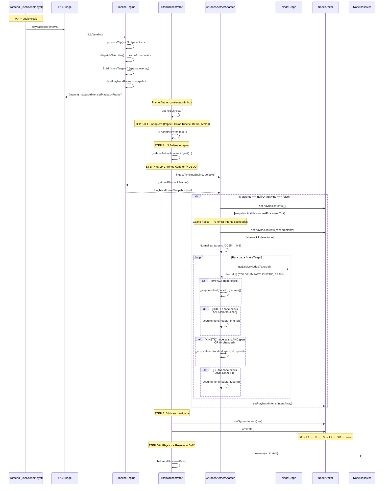
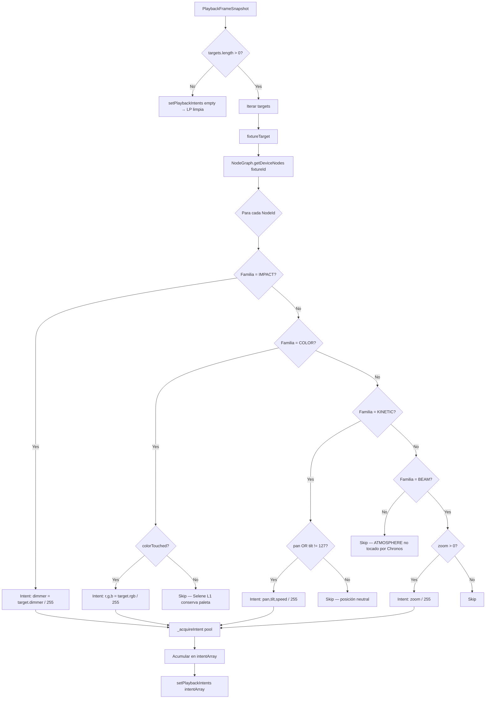

# WAVE 3517 — THE CHRONOS BLUEPRINT

> **Blueprint de Integración: Chronos Playback → Aether Matrix (Capa LP)**
> Estado: DISEÑO ARQUITECTÓNICO — PROHIBIDO ESCRIBIR CÓDIGO
> Exclusión explícita: Hephaestus / Diamond Data no se diseña en esta WAVE.
> Documentos de entrada: `AETHER-MATRIX-STATE.md`, `WAVE-4525-CHRONOS-LEGACY-MAP.md`

---

## 0. HALLAZGOS DE LA AUDITORÍA

Antes de diseñar, resumo las fricciones detectadas entre los dos mundos:

| # | Fricción | Detalle |
|---|----------|---------|
| F1 | **Impedancia temporal** | Chronos recibe ticks asincrónicos del frontend vía IPC (`useScenePlayer` → `playback:tick(timeMs)`). Aether corre a 44 Hz constantes en `processFrame()`. El tick de Chronos puede llegar 0 o 2 veces entre frames Aether. |
| F2 | **Impedancia semántica** | Chronos produce `FixtureLightingTarget[]` completos (fixtureId + dimmer/RGB/pan/tilt DMX 0-255). Aether consume `INodeIntent` atómicos (nodeId + canales normalizados 0-1). |
| F3 | **Granularidad de fixture vs nodo** | Un fixture legacy es una unidad monolítica. En Aether, un fixture se descompone en N `CapabilityNodes` por familia (COLOR, IMPACT, KINETIC, BEAM). |
| F4 | **Escala de valores** | Chronos escribe DMX crudo (0-255). Aether trabaja normalizado (0-1). Los canales de color ya están en RGB; no hay reconversión HSL. |
| F5 | **Doble pipeline coexistente** | Hoy Chronos → `ArbitrationDirector.setPlaybackFrame()` → pipeline legacy. El adapter Aether debe ofrecer una ruta paralela sin interferir con la existente hasta completar la migración. |
| F6 | **BlendMode per-fixture** | Chronos asigna `blendMode` (HTP/LTP/ADD) por fixture, no por capa global. El `NodeArbiter` aplica estrategias por canal (HTP para dimmer, LTP para el resto). |

---

## 1. PRINCIPIOS DE DISEÑO

1. **Cache-and-replay**: El adapter cachea el último frame recibido de Chronos y lo re-emite en cada tick Aether hasta que llegue un frame nuevo. Esto resuelve F1 sin bloquear el hot-path.
2. **Zero-alloc en frame-time**: Scratch objects pre-allocated. El adapter reutiliza los mismos `INodeIntent` cada frame.
3. **DeviceId = fixtureId**: La `NodeExtractionPipeline` usa `fixture.id` como `DeviceId`. Chronos produce `fixtureId`. Son la misma identidad — no se necesita un mapa de traducción.
4. **Normalización en ingesta, no en emisión**: Los valores DMX (0-255) se normalizan a (0-1) una sola vez cuando llega el frame de Chronos, no en cada tick Aether.
5. **Exclusión de Hephaestus**: Los clips `heph-custom` se ignoran en este adapter. Se integrarán en una WAVE separada.
6. **Capa LP dedicada**: Los intents van a `NodeArbiter.setPlaybackIntents()` — el slot LP ya existe y está implementado.

---

## 2. VISIÓN GENERAL DEL PIPELINE

```
┌─────────────────────────────────────────────────────────────────────────────────────┐
│                     CHRONOS AETHER ADAPTER (Capa LP)                                │
│                                                                                     │
│  ┌──────────────┐    ┌──────────────────┐    ┌──────────────┐    ┌──────────────┐  │
│  │ TimelineEngine│    │  PlaybackCache   │    │  Fixture→Node │    │ IntentEmitter │  │
│  │ .tick()       │───▶│ (último frame    │───▶│  Decomposer   │───▶│ (push a       │  │
│  │ (asíncrono)   │    │  cacheado,       │    │ (DeviceId →   │    │  _playback    │  │
│  │               │    │  pre-normalizado)│    │  NodeId[] →   │    │  Intents[])   │  │
│  └──────────────┘    └──────────────────┘    │  INodeIntent) │    └──────────────┘  │
│                                              └──────────────┘           │            │
│                                                                         ▼            │
│                                                              ┌──────────────────┐   │
│                                                              │  NodeArbiter     │   │
│                                                              │  .setPlayback    │   │
│                                                              │   Intents()      │   │
│                                                              └──────────────────┘   │
└─────────────────────────────────────────────────────────────────────────────────────┘
```

---

## 3. FASE A — INGESTA Y CACHE TEMPORAL

### 3.1 Superficie de ingesta

Hoy, `TimelineEngine.tick()` produce un `fixtureTargets[]` y lo inyecta en `masterArbiter.setPlaybackFrame()`. El adapter Aether necesita acceso al mismo dato.

**Decisión arquitectónica — ¿Cómo obtiene el adapter el frame?**

| Opción | Pros | Contras | Veredicto |
|--------|------|---------|-----------|
| A. Leer desde `TimelineEngine` directamente | Simple, sin duplicar código | TimelineEngine no expone `lastFrame` — habría que añadir un getter | ⭐ **Elegida** |
| B. Escuchar evento IPC duplicado | Desacoplado | Duplica el tick IPC, latencia extra, asincronía | ❌ |
| C. Leer desde `ArbitrationDirector.currentPlaybackFrame` | Ya existe como Map | Es un Map de `FixtureLightingTarget` ya procesado por el legacy arbiter, con merge HTP/LTP aplicado | ❌ Datos post-merge |

**Solución**: Añadir a `TimelineEngine` un getter `getLastPlaybackFrame()` que exponga el `fixtureTargets[]` del último tick (el array que ya construye antes de pasarlo a `setPlaybackFrame()`). Este getter retorna una referencia al array cacheado — zero-alloc.

```typescript
// En TimelineEngine — nueva superficie pública:
private _lastPlaybackFrame: PlaybackFrameSnapshot | null = null

getLastPlaybackFrame(): PlaybackFrameSnapshot | null {
  return this._lastPlaybackFrame
}
```

```typescript
interface PlaybackFrameSnapshot {
  /** Fixture targets producidos por el último tick */
  readonly targets: readonly ChronosFixtureTarget[]
  /** ¿Hay algún vibe clip activo? */
  readonly hasActiveVibe: boolean
  /** vibeId del vibe clip activo, o null */
  readonly vibeId: string | null
  /** Timestamp del tick que produjo este frame */
  readonly tickMs: number
}

interface ChronosFixtureTarget {
  readonly fixtureId: string
  readonly dimmer: number        // 0-255
  readonly red: number           // 0-255
  readonly green: number         // 0-255
  readonly blue: number          // 0-255
  readonly white: number         // 0-255
  readonly pan: number           // 0-255
  readonly tilt: number          // 0-255
  readonly zoom: number          // 0-255
  readonly speed: number         // 0-255
  readonly colorTouched: boolean // WAVE 2070
  readonly blendMode: 'HTP' | 'LTP' | 'ADD'
}
```

### 3.2 Cache y re-emisión

El adapter cachea el snapshot y lo re-emite en cada frame Aether hasta que un nuevo tick lo actualice:

```
Frame Aether N:   ¿Hay nuevo snapshot? → Sí → Normalizar + cachear → Emitir
Frame Aether N+1: ¿Hay nuevo snapshot? → No → Emitir cached (mismo intent array)
Frame Aether N+2: ¿Hay nuevo snapshot? → Sí → Normalizar + cachear → Emitir
...
Stop signal:      → Limpiar cache → Emitir array vacío
```

**Detección de cambio**: Comparar `snapshot.tickMs` con el último `tickMs` procesado. Si son iguales, el cache ya está fresco — skip normalización, emitir directamente.

**Detección de stop**: Si `timelineEngine.playing === false` o `getLastPlaybackFrame() === null`, el adapter emite un array vacío → `setPlaybackIntents([])` → LP se limpia.

---

## 4. FASE B — DESCOMPOSICIÓN: Fixture → Nodos Aether

### 4.1 El mapeo DeviceId → NodeId[]

La `NodeExtractionPipeline` registra cada fixture legacy con `DeviceId = fixture.id`. El `NodeGraph` indexa esos devices en `_deviceIndex: Map<DeviceId, NodeId[]>`.

```
ChronosFixtureTarget.fixtureId  ←→  DeviceId en NodeGraph
                                         │
                                         ▼
                                 NodeGraph.getDeviceNodes(fixtureId)
                                         │
                                         ▼
                                    NodeId[]
                                   (COLOR, IMPACT, KINETIC, BEAM, ATMOSPHERE)
```

El adapter usa `NodeGraph.getDeviceNodes(fixtureId)` para obtener todos los nodos del fixture, luego filtra por familia para emitir el intent correcto.

### 4.2 Mapeo de canales legacy → canales Aether por familia

| Canal Legacy (0-255) | Familia Aether | Canal Aether (0-1) | Transformación |
|----------------------|----------------|--------------------|----|
| `dimmer` | IMPACT | `dimmer` | `value / 255` |
| `red` | COLOR | `r` | `value / 255` |
| `green` | COLOR | `g` | `value / 255` |
| `blue` | COLOR | `b` | `value / 255` |
| `white` | COLOR | `white` | `value / 255` |
| `pan` | KINETIC | `pan` | `value / 255` |
| `tilt` | KINETIC | `tilt` | `value / 255` |
| `zoom` | BEAM | `zoom` | `value / 255` |
| `speed` | KINETIC | `speed` | `value / 255` |

**Nota sobre pan/tilt**: Chronos emite `pan/tilt` normalizados en el rango legacy (0-255 → 0-1). El `KineticAdapter` (L0) emite `targetX/Y/Z` en metros para IK. El arbiter LP (Chronos) sobrescribirá por LTP los canales de movimiento, que el `NodeResolver` interpretará directamente como DMX normalizados — **no** como coordenadas 3D para IK. Esto es correcto: Chronos dicta posiciones absolutas de fixture, no coordenadas escénicas.

### 4.3 Determinación de NodeFamily por NodeId

Cada `NodeId` tiene formato `"<deviceId>:<nodeLabel>"`. El `nodeLabel` revela la familia:

```
beam-2r-01:color    → COLOR
beam-2r-01:impact   → IMPACT
beam-2r-01:kinetic  → KINETIC
beam-2r-01:beam     → BEAM
```

Pero parsear strings en hot-path es costoso. Solución: **pre-construir un mapa `NodeId → NodeFamily` en patch-time** usando `NodeGraph.getNode(nodeId).family`.

**Alternativa más eficiente**: Usar `NodeGraph.getDeviceNodes()` que retorna todos los NodeIds, y para cada uno consultar el `_slotIndex` (que contiene la familia). Pero esto requiere un accessor público. Decisión: construir un `Map<NodeId, NodeFamily>` una vez en el constructor del adapter, consultando `getNode()` para cada `DeviceId` registrado.

### 4.4 colorTouched flag

WAVE 2070 introduce `colorTouched: boolean` en el frame del `TimelineEngine`. Cuando es `false`, significa que ningún efecto Chronos envió color explícitamente — el color de Selene/Titan debería mantenerse.

**Mapeo a Aether**: Si `colorTouched === false` para un fixture, el adapter **NO** emite intents de canal COLOR (`r`, `g`, `b`) para ese fixture. Solo emite IMPACT (`dimmer`). Esto preserva la paleta de Selene en L1 sin que Chronos la sobrescriba con ceros.

---

## 5. FASE C — EMISIÓN DE INTENTS

### 5.1 Capa y prioridad

```typescript
const LP_PRIORITY = 200  // Rango LP: Playback (200-299) — entre L1 (100) y L3 (300)
const LP_SOURCE: IntentSource = 'chronos'
```

El `NodeArbiter.arbitrate()` ya aplica LP entre L1 y L3 (líneas 169-172 de `NodeArbiter.ts`):

```typescript
// LP: Playback (Chronos Timeline) — entre L1 y L3
for (let i = 0; i < this._playbackIntents.length; i++) {
  this._applyIntent(this._playbackIntents[i])
}
```

### 5.2 Estrategia de merge por blendMode

El `blendMode` por fixture de Chronos debe traducirse a la semántica del `NodeArbiter`:

| Chronos blendMode | Efecto deseado | Implementación en Aether |
|-------------------|---------------|-------------------------|
| `HTP` | Dimmer: el mayor gana. Color: Chronos domina. | Dimmer ya es HTP en el Arbiter. Color se sobrescribe por LTP (LP > L0/L1). Comportamiento natural. |
| `LTP` | Chronos manda 100%. Ignora la base. | Misma semántica que HTP en el arbiter — la capa LP ya sobrescribe L0/L1 por orden. El dimmer se fuerza con prioridad. |
| `ADD` | Dimmer: se suma al base. Color: additive. | Emitir intent con canales `dimmer_add` o usar un flag. **Decisión**: Para esta WAVE, los intents LP no soportan ADD nativo. Se mapea a HTP (el mayor gana). |

**Simplificación arquitectónica**: El `NodeArbiter` no soporta per-intent merge strategies — aplica HTP a `dimmer/strobe/shutter` y LTP a todo lo demás, determinado por la capa de orden (no por el intent individual). Esto significa:

- **HTP dimmer** ya es el comportamiento natural del arbiter para el canal `dimmer`.
- **LTP dimmer** (blendMode='LTP' de Chronos, para strobes/blackouts): Se implementa emitiendo el dimmer en un canal especial `dimmer_ltp` que el arbiter trate como LTP, O (más simple) **emitiendo el dimmer con un valor que ya refleja la intención LTP** — dado que LP sobrescribe L0/L1 por orden de capa, el dimmer LP ya domina si es ≥ base. Para el caso de **blackout** (dimmer=0, LTP), el adapter puede emitir `dimmer: 0` + `shutter: 0` para forzar el blackout.

**Decisión final**: Para blendMode `LTP` y `ADD`, el adapter emite los mismos canales pero con `confidence: 1.0`. La semántica real del merge depende del orden de capas del `NodeArbiter`, que ya garantiza que LP domina sobre L0/L1. El caso de blackout LTP se resuelve emitiendo `dimmer: 0` + `shutter: 0` — el HTP del dimmer no bajará la base, pero el `shutter: 0` (LTP) sí cortará la salida.

### 5.3 Scratch objects pre-allocated

```typescript
// Pool de intents pre-allocated — crece en warm-up, estable después
private _intentPool: INodeIntent[] = []
private _intentCursor = 0

// Scratch values por familia — shapes estables para V8
private readonly _impactValues: Record<string, number> = { dimmer: 0 }
private readonly _colorValues: Record<string, number> = { r: 0, g: 0, b: 0 }
private readonly _kineticValues: Record<string, number> = { pan: 0, tilt: 0, speed: 0 }
private readonly _beamValues: Record<string, number> = { zoom: 0 }
```

El intent pool se reinicia cada frame (`_intentCursor = 0`) y se reutiliza:

```typescript
private _acquireIntent(nodeId: NodeId, values: Record<string, number>): INodeIntent {
  if (this._intentCursor < this._intentPool.length) {
    const intent = this._intentPool[this._intentCursor++]
    // Mutate in-place (pool objects are mutable)
    ;(intent as any).nodeId = nodeId
    ;(intent as any).values = values
    return intent
  }
  // Pool exhausto — crear uno nuevo (solo en warm-up)
  const intent: INodeIntent = {
    nodeId,
    values,
    priority: LP_PRIORITY,
    confidence: 1.0,
    source: LP_SOURCE,
  }
  this._intentPool.push(intent)
  this._intentCursor++
  return intent
}
```

**Nota**: A diferencia del `IntentBus.push()` que copia valores, `setPlaybackIntents()` recibe un array `readonly INodeIntent[]` por referencia. El adapter posee el array y lo muta entre frames. El arbiter lo consume sincrónicamente dentro del mismo frame.

---

## 6. DIAGRAMA DE SECUENCIA COMPLETO



---

## 7. GESTIÓN DEL CICLO DE VIDA

### 7.1 Load

```
timelineEngine.loadProject(project) → playing = true
  → Primer tick llega vía IPC
    → ChronosAetherAdapter detecta snapshot no-null
      → Normaliza + emite intents LP
```

### 7.2 Stop

```
timelineEngine.stop() → playing = false, _lastPlaybackFrame = null
  → ChronosAetherAdapter detecta null
    → setPlaybackIntents([]) → LP se limpia
      → NodeArbiter ignora LP en el merge → L0/L1 vuelven a dominar
```

### 7.3 Pause (gap entre clips)

Chronos es un **transparent overlay** (WAVE 2065). Si ningún clip FX está activo, `fixtureTargets` es un array vacío. El adapter detecta `targets.length === 0` y emite `setPlaybackIntents([])`, devolviendo el control a L0/L1.

### 7.4 Hot-patch (nuevo fixture registrado durante playback)

Si `NodeGraph.registerDevice()` se llama durante playback, el adapter debe invalidar su cache de `DeviceId → NodeId[]`. Solución: el adapter consulta `NodeGraph.getDeviceNodes()` en cada frame (O(1) Map.get()). No necesita cache propio — el NodeGraph ya es O(1).

---

## 8. INYECCIÓN EN EL ORCHESTRATOR

### 8.1 Punto de inserción

En `TitanOrchestrator.processFrame()`, dentro del bloque Aether, **después** del `SeleneAetherAdapter` (STEP 4) y **antes** del arbitraje (STEP 5):

```
// STEP 4: L3 Selene Adapter
this._seleneAetherAdapter.ingest(consciousnessOutput, effectOutput, deltaMs, bus)

// ═══ NEW: STEP 4.5 — LP Chronos Adapter ═══
this._chronosAetherAdapter.ingest(this._timelineEngine, deltaMs)

// STEP 5: Arbitraje multicapa
this._aetherArbiter.setSystemIntents(this._aetherBus)
const arbitrated = this._aetherArbiter.arbitrate()
```

### 8.2 Instanciación

```typescript
// En TitanOrchestrator — NUEVA instancia:
private readonly _chronosAetherAdapter = new ChronosAetherAdapter(this._aetherGraph)
```

El adapter recibe el `NodeGraph` para resolver `DeviceId → NodeId[]`.

### 8.3 Dependencia en TimelineEngine

El adapter **no** posee el `TimelineEngine`. Recibe la referencia como argumento de `ingest()`. Esto mantiene la single-ownership del lifecycle en el módulo `timelineEngine` singleton.

---

## 9. INTERFAZ PÚBLICA DEL ADAPTER

```typescript
class ChronosAetherAdapter {

  constructor(graph: INodeGraph)

  /**
   * Ingesta por frame Aether. Lee el último snapshot de Chronos,
   * normaliza si es nuevo, y emite intents LP al NodeArbiter.
   *
   * ZERO-ALLOC: scratch objects + intent pool pre-allocated.
   * CACHE: Si el tick no cambió, re-emite los mismos intents sin recalcular.
   *
   * @param timelineEngine — Referencia al singleton TimelineEngine
   * @param deltaMs        — Delta time del frame Aether
   * @param arbiter        — NodeArbiter donde inyectar los intents LP
   */
  ingest(
    timelineEngine: { getLastPlaybackFrame(): PlaybackFrameSnapshot | null; playing: boolean },
    deltaMs: number,
    arbiter: INodeArbiter,
  ): void

  /**
   * Fuerza limpieza de la capa LP (e.g., ante un stop externo).
   */
  clear(arbiter: INodeArbiter): void
}
```

---

## 10. DIAGRAMA DE DESCOMPOSICIÓN DE FIXTURE



---

## 11. GESTIÓN DE CONFLICTOS CON EL PIPELINE LEGACY

### 11.1 Coexistencia durante migración

Durante la transición, **ambos pipelines deben funcionar simultáneamente**:

```
Pipeline Legacy:  TimelineEngine.tick() → masterArbiter.setPlaybackFrame() → HAL.flushToDriver()
Pipeline Aether:  ChronosAetherAdapter.ingest() → nodeArbiter.setPlaybackIntents() → HAL.sendUniverseRaw()
```

Un fixture solo puede estar en **uno** de los dos pipelines (regla ya establecida en AETHER-MATRIX-STATE §3.3). Los fixtures registrados en `_aetherGraph` son controlados por Aether. Los no registrados siguen en legacy. No hay conflicto.

### 11.2 Protección de fixtures Chronos

En el pipeline legacy, `ArbitrationDirector` protege fixtures tocados por Chronos con `getPlaybackAffectedFixtureIds()`. En Aether, la protección es natural: los intents LP sobrescriben L0/L1 por orden de capa. No se necesita una protección explícita.

### 11.3 Interacción L3 (Effects) sobre LP (Chronos)

El `NodeArbiter` aplica L3 **después** de LP. Esto significa:

- **HTP dimmer**: Si un efecto L3 tiene dimmer mayor que Chronos LP → el efecto gana. Correcto: un `SolarFlare` ilumina por encima de la escena Chronos.
- **LTP color**: Si un efecto L3 emite color → sobrescribe el color de Chronos. Correcto: un efecto activo domina visualmente.
- **Sin efecto L3 activo**: LP domina sin interferencia.

Esta semántica es idéntica a la del pipeline legacy (ArbitrationDirector aplica effects layer 3 sobre playback frame) — la migración es transparent.

---

## 12. EXTENSIONES FUTURAS (NO IMPLEMENTAR AHORA)

### 12.1 Hephaestus Diamond Data

Los clips `heph-custom` producen curvas de keyframes evaluadas por `HephaestusRuntime`. Hoy se aplican post-HAL en el Orchestrator. La integración Aether de Hephaestus requiere:
- Evaluar curvas en el `ChronosAetherAdapter` (o un adapter dedicado).
- Traducir los valores resultantes a intents por canal.
- Esto es **scope de la siguiente WAVE**.

### 12.2 Vibe clips en Aether

Los `VibeClip` hoy llaman `orchestrator.setVibe()`. Esto ya modifica los motores base (Selene paleta, VMM patterns) que alimentan los adapters L0/L1. No se necesita un adapter dedicado — el efecto ya fluye a través de Aether vía los adapters existentes.

### 12.3 Interpolación temporal

El diseño actual usa cache-and-replay (hold). Una mejora futura podría interpolar linealmente entre frames de Chronos cuando llegan a frecuencia menor que 44Hz. Para la mayoría de efectos visuales, el hold es suficiente — el ojo no detecta la diferencia a 44Hz.

---

## 13. RESUMEN DE DECISIONES ARQUITECTÓNICAS

| # | Decisión | Alternativa rechazada | Razón |
|---|----------|-----------------------|-------|
| D1 | Getter `getLastPlaybackFrame()` en TimelineEngine | Leer desde ArbitrationDirector | Los datos en el Arbiter ya tienen merge HTP/LTP aplicado — queremos el frame crudo |
| D2 | DeviceId = fixtureId (identidad directa) | Construir un mapa de traducción | NodeExtractionPipeline ya usa `fixture.id` como DeviceId — no hay gap |
| D3 | Cache-and-replay (hold) | Interpolación entre ticks | Hold es suficiente a 44Hz; interpolar agrega complejidad sin beneficio visible |
| D4 | Intent pool pre-allocated | Crear intents en cada frame | Zero-alloc obligatorio en hot-path |
| D5 | colorTouched → skip intents COLOR | Emitir siempre RGB | Preserva la paleta Selene L1 cuando Chronos no tiene opinión de color |
| D6 | Priority LP=200 | Priority dinámica por blendMode | Simplicidad; el orden de capas del Arbiter ya resuelve la semántica |
| D7 | No soportar ADD nativo en LP | Implementar ADD en el Arbiter | Complejidad no justificada; HTP dimmer cubre el caso mayoritario |
| D8 | Consultar getDeviceNodes() cada frame | Cache propio del mapping | getDeviceNodes() ya es O(1) Map.get() — cache propio es overhead sin beneficio |
| D9 | No traducir pan/tilt a targetX/Y/Z | Usar IK para posiciones Chronos | Chronos dicta posiciones DMX absolutas, no coordenadas escénicas. IK no aplica. |
| D10 | Excluir heph-custom | Integrar en este adapter | Separación de concerns; Hephaestus tiene su propio runtime con curvas complejas |

---

## 14. PLAN DE EJECUCIÓN

| Paso | Descripción | Dependencias | Riesgo |
|------|-------------|-------------|--------|
| P1 | Añadir `getLastPlaybackFrame()` + `PlaybackFrameSnapshot` a TimelineEngine | Ninguna | 🟢 Bajo |
| P2 | Implementar `ChronosAetherAdapter` con intent pool + normalización | P1, NodeGraph existente | 🟡 Medio (primer adapter con cache temporal) |
| P3 | Añadir `'chronos'` a `IntentSource` si no existe | Verificar `types.ts` | 🟢 Ya existe |
| P4 | Instanciar `_chronosAetherAdapter` en TitanOrchestrator | P2 | 🟢 Bajo |
| P5 | Insertar `ingest()` en el bloque Aether del frame loop (STEP 4.5) | P4 | 🟢 Bajo |
| P6 | Tests: adapter emite intents correctos para fixture con IMPACT+COLOR | P2 | 🟡 Medio |
| P7 | Tests: colorTouched=false → no emite COLOR intents | P2 | 🟢 Bajo |
| P8 | Tests: stop → LP se limpia | P2 | 🟢 Bajo |
| P9 | Tests: cache-and-replay → mismo tick no recalcula | P2 | 🟢 Bajo |

---

## 15. RIESGOS Y MITIGACIONES

| Riesgo | Probabilidad | Mitigación |
|--------|-------------|------------|
| Dual pipeline: mismo fixture en legacy + Aether recibe comandos 2× | 🟡 Media | Regla ya establecida: un fixture solo vive en uno de los dos pipelines. Enforced por `registerAetherDevice()`. |
| Intent pool overflow con muchos fixtures × familias | 🟢 Baja | Pool crece en warm-up y se estabiliza. Un show de 20 fixtures × 4 familias = ~80 intents LP — bajo el cap de 4096 del IntentBus. |
| TimelineEngine tick llega DURANTE `arbitrate()` (race condition) | 🟢 Muy baja | Ambos corren en el main process de Electron (single-threaded). El tick IPC se serializa — no hay concurrencia real. |
| Blackout LTP no se expresa bien con HTP dimmer en el Arbiter | 🟡 Media | Emitir `shutter: 0` (LTP) junto con `dimmer: 0` fuerza el corte visual. El Arbiter aplica LTP a shutter. |
| `getDeviceNodes()` retorna vacío para fixtures no registrados en Aether | 🟢 Esperado | El adapter hace `if (nodeIds.length === 0) continue` — fixture ignorado silenciosamente. Solo fixtures en Aether reciben intents. |

---

*Documento generado bajo directiva WAVE 3517 — THE CHRONOS BLUEPRINT*
*Blueprint completado. Sin código escrito. Listo para implementación.*
