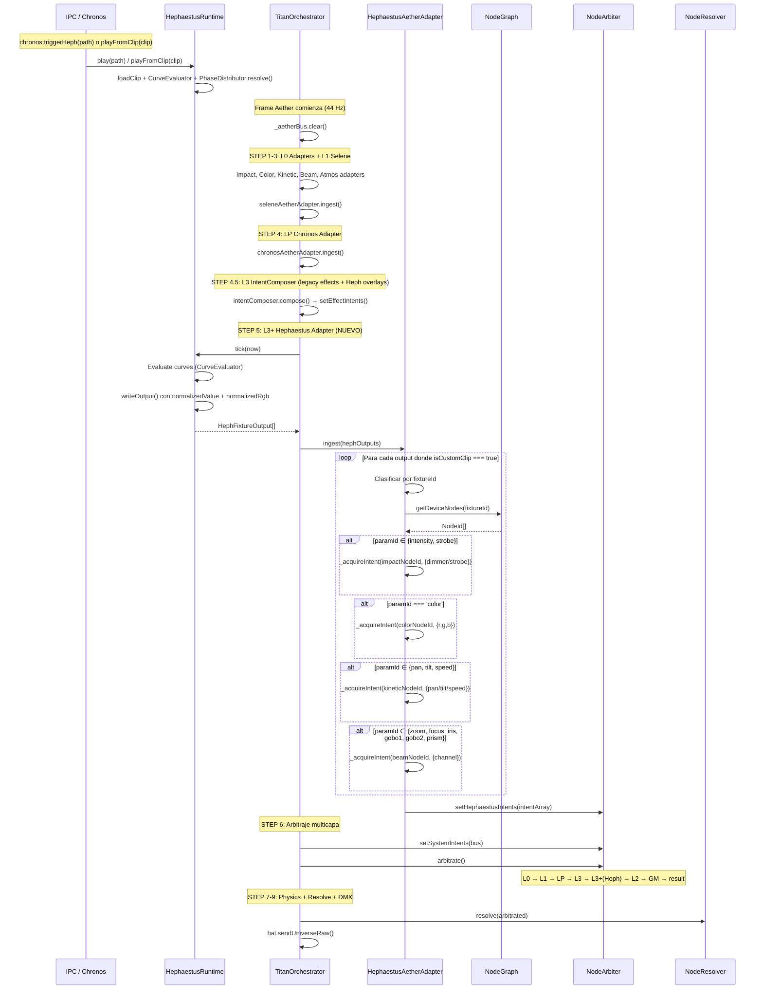
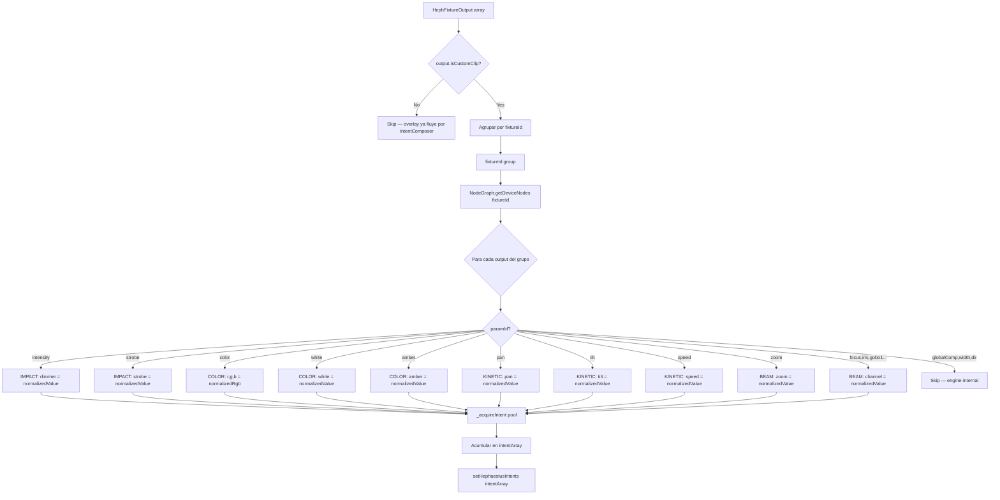

# WAVE 3520 — THE FORGE BLUEPRINT (Hephaestus → Aether)

> **Blueprint de Integración: Hephaestus Diamond Data FX → Aether Matrix (Capa L3)**
> Estado: DISEÑO ARQUITECTÓNICO — PROHIBIDO ESCRIBIR CÓDIGO
> Documentos de entrada: `AETHER-MATRIX-STATE.md`
> Prerequisito: Chronos integrado en LP (`WAVE-3517-CHRONOS-BLUEPRINT.md`)

---

## 0. HALLAZGOS DE LA AUDITORÍA

### 0.1 El Motor Hephaestus (Estado Actual)

`HephaestusRuntime` es un evaluador de curvas paramétricas que ejecuta clips `.lfx` en tiempo real. Sus componentes clave:

| Componente | Responsabilidad | Archivo |
|---|---|---|
| `CurveEvaluator` | Evaluación O(1) amortizado de curvas Bézier/lineal/hold con cursor cache | `CurveEvaluator.ts` |
| `HephaestusRuntime` | Carga `.lfx`, gestiona clips activos, tick + output DMX | `runtime/HephaestusRuntime.ts` |
| `HephParameterOverlay` | Modula output de efectos base con curvas (absolute/relative/additive) | `HephParameterOverlay.ts` |
| `PhaseDistributor` | Distribución de fase per-fixture (spread, mirror, center-out, wings) | `runtime/PhaseDistributor.ts` |
| `HephUtils` | Funciones puras: `hslToRgb()`, `scaleToDMX()`, `scaleToDMX16()` | `runtime/HephUtils.ts` |

### 0.2 Fricciones Detectadas

| # | Fricción | Detalle |
|---|----------|---------|
| F1 | **Escalado prematuro a DMX** | `HephaestusRuntime.tick()` escala valores 0-1 → 0-255 vía `scaleToDMX()` ANTES de retornarlos. Aether necesita 0-1 normalizado. El adapter no puede consumir `HephFixtureOutput.value` directamente. |
| F2 | **Salida post-HAL** | Hephaestus actualmente se aplica POST-HAL (`fixtureStates` mutation en TitanOrchestrator, líneas 1326-1396). Aether necesita pre-HAL (antes del arbitraje). |
| F3 | **Dos tipos de clips** | (a) `heph_custom` — Hephaestus genera output directamente desde curvas. (b) Overlay — Hephaestus modula el output de un efecto base vía `HephParameterOverlay`. Solo (a) necesita el adapter Aether. |
| F4 | **HephParamId → Aether Families** | `HephParamId` tiene 16 parámetros que mapean a 4 familias Aether. El mapping es estático pero la resolución por nodo es dinámica (depende del `NodeGraph`). |
| F5 | **CurveMode (absolute/relative/additive)** | Para clips `heph_custom`, los valores son siempre absolutos. Para overlays, el modo modula un efecto base — pero esos ya fluyen por el pipeline existente (`IntentComposer`). |
| F6 | **PhaseDistributor + fixtureId** | Hephaestus resuelve `fixturePhases` en `play()` time, produciendo outputs per-fixture. La identidad `fixtureId = DeviceId` en Aether permite routing directo. |
| F7 | **Color en HSL, no RGB** | Las curvas de color producen HSL. Aether consume RGB normalizado (0-1). La conversión HSL→RGB debe ocurrir en el adapter, sin crear objetos nuevos. |

---

## 1. PRINCIPIOS DE DISEÑO

1. **Interceptar pre-DMX**: Exponer los valores crudos 0-1 del `CurveEvaluator` antes de que `scaleToDMX()` los transforme. Esto requiere una refactorización menor del `HephaestusRuntime`.
2. **Solo `heph_custom`**: El adapter solo procesa clips con `effectType === 'heph_custom'`. Los overlay clips ya se resuelven por la vía existente: `HephParameterOverlay.apply()` → `EffectManager` → `IntentComposer` → `_effectIntents`.
3. **L3 sub-slot dedicado**: Nuevo slot `_hephaestusIntents` en el `NodeArbiter`, aplicado DESPUÉS de `_effectIntents` pero ANTES de `_manualOverrides`. Hephaestus LTP domina sobre IntentComposer effects.
4. **Zero-alloc en hot-path**: Intent pool pre-allocated, scratch values reutilizados, HSL→RGB buffer compartido.
5. **DeviceId = fixtureId**: Misma identidad que en Chronos. `NodeGraph.getDeviceNodes(fixtureId)` → NodeId[].
6. **PhaseDistributor reutilizado**: El adapter consume las `fixturePhases` ya resueltas por el runtime — no recalcula fases.

---

## 2. ARQUITECTURA GENERAL

```
┌─────────────────────────────────────────────────────────────────────────────────────┐
│                   HEPHAESTUS AETHER ADAPTER (L3 — Diamond Path)                     │
│                                                                                     │
│  ┌──────────────┐    ┌──────────────────┐    ┌──────────────┐    ┌──────────────┐  │
│  │ HephRuntime   │    │ NormalizedOutput  │    │  Param→Family │    │ IntentEmitter │  │
│  │ .tickForAether│───▶│ Buffer           │───▶│  Decomposer   │───▶│ (push a       │  │
│  │ (pre-DMX,     │    │ (0-1 values +    │    │ (HephParamId  │    │  _hephaestus  │  │
│  │  0-1 values)  │    │  HSL→RGB inline) │    │  → NodeFamily │    │  Intents[])   │  │
│  └──────────────┘    └──────────────────┘    │  → INodeIntent)│    └──────────────┘  │
│                                              └──────────────┘           │            │
│                                                                         ▼            │
│                                                              ┌──────────────────┐   │
│                                                              │  NodeArbiter     │   │
│                                                              │  .setHephaestus  │   │
│                                                              │   Intents()      │   │
│                                                              └──────────────────┘   │
└─────────────────────────────────────────────────────────────────────────────────────┘
```

---

## 3. FASE A — REFACTORIZACIÓN MENOR DEL RUNTIME

### 3.1 El problema del escalado prematuro

Hoy, `tickWithPhase()` y `tickLegacy()` evalúan las curvas y escalan a DMX en el mismo paso:

```typescript
// tickWithPhase() — líneas 543-550
const rawValue = active.evaluator.getValue(paramName, fixtureTimeMs)  // ← 0-1 ✅
const withIntensity = rawValue * active.intensity                      // ← 0-1 ✅
const scaledValue = scaleToDMX(paramName, withIntensity)               // ← 0-255 ❌
this.writeOutput(fp.fixtureId, 'all', paramName, scaledValue, ...)    // ← DMX ❌
```

El valor `withIntensity` es exactamente lo que Aether necesita — pero se pierde tras el escalado.

### 3.2 Solución: Añadir `normalizedValue` al output buffer

**Refactorización mínima** — añadir UN campo a `HephFixtureOutput`:

```typescript
export interface HephFixtureOutput {
  fixtureId: string
  zone: EffectZone | 'all'
  parameter: string
  value: number            // DMX-scaled (legacy consumer)
  normalizedValue: number  // ← NUEVO: 0-1 (Aether consumer)
  rgb?: { r: number; g: number; b: number }           // DMX-scaled RGB
  normalizedRgb?: { r: number; g: number; b: number } // ← NUEVO: 0-1 RGB
  fine?: number
  source: 'hephaestus-runtime'
}
```

**Cambios en `writeOutput()`** — aceptar y almacenar el valor normalizado:

```typescript
private writeOutput(
  fixtureId: string,
  zone: EffectZone | 'all',
  parameter: string,
  value: number,
  normalizedValue: number,         // ← NUEVO
  rgb?: { r: number; g: number; b: number },
  normalizedRgb?: { r: number; g: number; b: number }, // ← NUEVO
  fine?: number
): void {
  const out = this.outputBuffer[this.outputCursor++]
  out.fixtureId = fixtureId
  out.zone = zone
  out.parameter = parameter
  out.value = value
  out.normalizedValue = normalizedValue
  out.rgb = rgb
  out.normalizedRgb = normalizedRgb
  out.fine = fine
}
```

**Cambios en `tickWithPhase()`** — pasar el valor crudo:

```typescript
// Para numéricos:
const rawValue = active.evaluator.getValue(paramName, fixtureTimeMs)
const withIntensity = rawValue * active.intensity
const scaledValue = scaleToDMX(paramName, withIntensity)
const fine = ...
this.writeOutput(fp.fixtureId, 'all', paramName, scaledValue, withIntensity, undefined, undefined, fine)
//                                                              ^^^^^^^^^^^^^^

// Para color:
const hsl = active.evaluator.getColorValue(paramName, fixtureTimeMs)
const modulatedL = (hsl.l / 100) * active.intensity
const rgb = hslToRgb(hsl.h, hsl.s / 100, modulatedL)  // 0-255
const normRgb = {
  r: (rgb.r / 255),
  g: (rgb.g / 255),
  b: (rgb.b / 255),
}
this.writeOutput(fp.fixtureId, 'all', paramName, 0, 0, rgb, normRgb)
```

**Impacto**: 2 campos nuevos en la struct, 2 params extra en `writeOutput()`. El pipeline legacy lee `value` y `rgb` como antes — zero regression. El adapter Aether lee `normalizedValue` y `normalizedRgb`.

### 3.3 Alternativa evaluada y rechazada

| Alternativa | Motivo de rechazo |
|---|---|
| Método `tickNormalized()` separado | Duplica lógica del tick. Dos paths divergen con el tiempo. |
| De-escalar en el adapter (`value / 255`) | Impreciso para 16-bit pan/tilt. Introduce artefactos de redondeo. |
| Acceder al `CurveEvaluator` directamente | Doble evaluación → 2× CPU. Los cursors cache se desincronizan. |

### 3.4 Filtrado de clips `heph_custom`

El adapter necesita saber qué clips activos son `heph_custom`. Añadir un accessor:

```typescript
// En HephaestusRuntime — nueva superficie:
getActiveCustomClipCount(): number {
  let count = 0
  for (const [, active] of this.activeClips) {
    if (active.clip.effectType === 'heph_custom') count++
  }
  return count
}
```

El output buffer ya contiene todos los clips mezclados (custom + overlay). El adapter puede filtrar en el consumer side: si el output viene de un clip que no es `heph_custom`, ignorarlo. Pero esto requiere saber qué clip produjo cada output.

**Solución más limpia**: Añadir un flag `isCustomClip: boolean` a `HephFixtureOutput`:

```typescript
export interface HephFixtureOutput {
  // ... campos existentes ...
  normalizedValue: number
  normalizedRgb?: { r: number; g: number; b: number }
  isCustomClip: boolean  // ← NUEVO: true si effectType === 'heph_custom'
}
```

El adapter hace `if (!output.isCustomClip) continue` — early exit sin overhead.

---

## 4. FASE B — MAPEO HephParamId → FAMILIAS AETHER

### 4.1 Tabla de mapeo estático

| HephParamId | Familia Aether | Canal Aether | Nota |
|---|---|---|---|
| `intensity` | IMPACT | `dimmer` | HTP en el arbiter |
| `strobe` | IMPACT | `strobe` | HTP en el arbiter |
| `color` | COLOR | `r`, `g`, `b` | Desde `normalizedRgb` |
| `white` | COLOR | `white` | Directo |
| `amber` | COLOR | `amber` | Directo |
| `pan` | KINETIC | `pan` | 0-1 normalizado |
| `tilt` | KINETIC | `tilt` | 0-1 normalizado |
| `speed` | KINETIC | `speed` | 0-1 passthrough |
| `zoom` | BEAM | `zoom` | 0-1 normalizado |
| `focus` | BEAM | `focus` | 0-1 normalizado |
| `iris` | BEAM | `iris` | 0-1 normalizado |
| `gobo1` | BEAM | `gobo1` | 0-1 normalizado |
| `gobo2` | BEAM | `gobo2` | 0-1 normalizado |
| `prism` | BEAM | `prism` | 0-1 normalizado |
| `globalComp` | — | — | Engine-internal, no produce intent |
| `width` | — | — | Engine-internal, no produce intent |
| `direction` | — | — | Engine-internal, no produce intent |

**Parámetros que NO producen intents**: `globalComp`, `width`, `direction` — son moduladores internos del efecto, no canales DMX. Se ignoran en el adapter.

### 4.2 Agrupación por familia para emitir intents

Cada fixture target del runtime puede tener múltiples parámetros (intensity + color + pan + zoom). El adapter agrupa por familia:

```
Output: fixtureId="beam-2r-01", paramId="intensity", normalizedValue=0.8
Output: fixtureId="beam-2r-01", paramId="color", normalizedRgb={r:1, g:0, b:0.5}
Output: fixtureId="beam-2r-01", paramId="pan", normalizedValue=0.3
Output: fixtureId="beam-2r-01", paramId="zoom", normalizedValue=0.6
        │
        ▼ NodeGraph.getDeviceNodes("beam-2r-01") → [":impact", ":color", ":kinetic", ":beam"]
        │
        ├─ IMPACT intent:  { nodeId:"beam-2r-01:impact",  values: { dimmer: 0.8 } }
        ├─ COLOR intent:   { nodeId:"beam-2r-01:color",   values: { r: 1, g: 0, b: 0.5 } }
        ├─ KINETIC intent: { nodeId:"beam-2r-01:kinetic", values: { pan: 0.3 } }
        └─ BEAM intent:    { nodeId:"beam-2r-01:beam",    values: { zoom: 0.6 } }
```

### 4.3 Resolución de NodeId por familia

El adapter necesita un mapa `(DeviceId, NodeFamily) → NodeId` para emitir intents al nodo correcto. Este mapa se construye en patch-time:

```typescript
// Construido una vez, O(D × F) donde D=devices, F=families
private _deviceFamilyMap: Map<string, Map<string, NodeId>> = new Map()
// Uso: _deviceFamilyMap.get(fixtureId)?.get('IMPACT') → nodeId
```

**Actualización**: Se invalida cuando `NodeGraph.registerDevice()` o `unregisterDevice()` se llama. El adapter puede escuchar un evento o reconstruir el mapa cada N frames (lazy rebuild). Dado que device registration es rara (patch-time), un rebuild cada ~44 frames (1 segundo) es suficiente.

**Alternativa más simple**: Consultar `NodeGraph.getDeviceNodes(fixtureId)` + `NodeGraph.getNode(nodeId).family` en cada frame. `getDeviceNodes()` es O(1) Map.get(). `getNode()` es O(1) slot lookup. Para 20 fixtures × 4 familias = ~80 lookups/frame — negligible.

**Decisión**: No cachear. Consultar directamente por frame. Evita la complejidad de invalidación.

---

## 5. FASE C — COEXISTENCIA L3: Hephaestus vs IntentComposer

### 5.1 El problema

Hoy el `NodeArbiter` tiene UN slot para L3: `_effectIntents`. Este recibe los intents del `IntentComposer` (que procesa `EffectManager.getCombinedOutput()` + `HephParameterOverlay` para clips overlay).

Si inyectamos Hephaestus `heph_custom` en el mismo slot, tendríamos que mergear dos arrays — y el orden de merge define quién gana LTP.

### 5.2 Solución: Sub-slot `_hephaestusIntents`

Añadir un segundo slot L3 al `NodeArbiter`:

```typescript
// En NodeArbiter:
private _hephaestusIntents: readonly INodeIntent[] = []

setHephaestusIntents(intents: readonly INodeIntent[]): void {
  this._hephaestusIntents = intents
}
```

Y aplicar DESPUÉS de `_effectIntents` en `arbitrate()`:

```typescript
// L3: Effect intents (IntentComposer — effectos procedurales + overlays Heph)
for (let i = 0; i < this._effectIntents.length; i++) {
  this._applyIntent(this._effectIntents[i])
}

// L3+: Hephaestus custom intents (Diamond Data — curvas directas)
for (let i = 0; i < this._hephaestusIntents.length; i++) {
  this._applyIntent(this._hephaestusIntents[i])
}
```

### 5.3 Semántica de merge

El orden L3 → L3+ produce el siguiente comportamiento:

| Canal | Estrategia | Resultado si ambos emiten |
|---|---|---|
| `dimmer` | HTP | El mayor de IntentComposer vs Hephaestus gana. Si Heph manda un strobe a dimmer=1.0 y un efecto procedural tiene dimmer=0.6, Heph gana. |
| `strobe` | HTP | Máximo de ambos. |
| `r`, `g`, `b` (color) | LTP | Hephaestus sobrescribe el color del efecto procedural. Correcto: el usuario definió esa curva de color en Hephaestus → debe dominar. |
| `pan`, `tilt` | LTP | Hephaestus controla posición. Los efectos procedurales quedan subordinados. |
| `zoom`, `focus`, etc. | LTP | Hephaestus domina ópticas. |

**¿Es correcto que Heph domine siempre sobre IntentComposer?**

Sí. Hephaestus es un efecto **explícitamente diseñado por el usuario** con curvas manuales. Los efectos procedurales de IntentComposer son algorítmicos. El contenido humano debe dominar el contenido generado. Si el usuario quiere que un efecto procedural domine, simplemente no activa un clip Hephaestus en ese rango temporal.

### 5.4 Interacción con otras capas

```
L0 (Systems):      Base — audio reactivo, paleta, VMM patterns
L1 (Selene IA):    Overrides cognitivos
LP (Chronos):      Playback timeline
L3 (Effects):      Efectos procedurales + overlays Heph (IntentComposer)
L3+ (Hephaestus):  Diamond Data custom clips ← NUEVO
L2 (Manual):       MIDI/OSC/faders — domina todo excepto blackout
GM:                Grand Master scaling
L4 (Blackout):     Colapso total
```

Hephaestus L3+ domina sobre LP (Chronos). Esto es correcto: si el usuario tiene un clip Hephaestus activo durante un playback de Chronos, las curvas manuales de Heph deben ganar (LTP). Para dimmer, HTP aplica — el mayor de ambos.

---

## 6. FASE D — EMISIÓN DE INTENTS

### 6.1 Prioridad y Source

```typescript
const L3_HEPH_PRIORITY = 350  // L3 Effects range: 300-399. Heph > IntentComposer (300)
const L3_HEPH_SOURCE: IntentSource = 'hephaestus'
```

**Nota**: Añadir `'hephaestus'` al union type `IntentSource` en `types.ts`.

### 6.2 Scratch Objects Pre-Allocated

```typescript
// Pool de intents reutilizable — crece en warm-up
private _intentPool: INodeIntent[] = []
private _intentCursor = 0

// Scratch values por familia — shapes V8 estables
private readonly _impactValues: Record<string, number> = { dimmer: 0, strobe: 0 }
private readonly _colorValues: Record<string, number>  = { r: 0, g: 0, b: 0, white: 0, amber: 0 }
private readonly _kineticValues: Record<string, number> = { pan: 0, tilt: 0, speed: 0 }
private readonly _beamValues: Record<string, number>   = { zoom: 0, focus: 0, iris: 0, gobo1: 0, gobo2: 0, prism: 0 }

// HSL→RGB buffer (zero-alloc)
private readonly _rgbBuffer = { r: 0, g: 0, b: 0 }
```

### 6.3 Intent Acquisition (Pool Pattern)

```typescript
private _acquireIntent(nodeId: NodeId, values: Record<string, number>): INodeIntent {
  if (this._intentCursor < this._intentPool.length) {
    const intent = this._intentPool[this._intentCursor++]
    ;(intent as any).nodeId = nodeId
    ;(intent as any).values = values
    return intent
  }
  const intent: INodeIntent = {
    nodeId,
    values,
    priority: L3_HEPH_PRIORITY,
    confidence: 1.0,
    source: L3_HEPH_SOURCE,
  }
  this._intentPool.push(intent)
  this._intentCursor++
  return intent
}
```

---

## 7. DIAGRAMA DE SECUENCIA COMPLETO



---

## 8. DIAGRAMA DE DESCOMPOSICIÓN DE PARÁMETROS



---

## 9. INTERFAZ PÚBLICA DEL ADAPTER

```typescript
class HephaestusAetherAdapter {

  constructor(graph: INodeGraph)

  /**
   * Procesa los outputs de HephaestusRuntime.tick() y emite intents L3+.
   *
   * Filtra solo outputs de clips `heph_custom` (isCustomClip === true).
   * Mapea HephParamId → familias Aether, normaliza desde `normalizedValue`.
   * Emite al NodeArbiter vía setHephaestusIntents().
   *
   * ZERO-ALLOC: scratch objects + intent pool pre-allocated.
   *
   * @param hephOutputs — Array de HephFixtureOutput del último tick del runtime
   * @param arbiter     — NodeArbiter donde inyectar los intents L3+
   */
  ingest(
    hephOutputs: readonly HephFixtureOutput[],
    arbiter: INodeArbiter,
  ): void

  /**
   * Fuerza limpieza del slot L3+ (e.g., stopAll del runtime).
   */
  clear(arbiter: INodeArbiter): void
}
```

---

## 10. GESTIÓN DEL CICLO DE VIDA

### 10.1 Play

```
User trigger → chronos:triggerHeph(path) / playFromClip(clip)
  → HephaestusRuntime.play() → activeClip registrado
    → Siguiente tick: runtime produce outputs con isCustomClip=true
      → HephaestusAetherAdapter detecta outputs
        → Emite intents L3+ → NodeArbiter.setHephaestusIntents()
```

### 10.2 Stop (clip individual)

```
HephaestusRuntime.stop(instanceId) → clip removido de activeClips
  → Siguiente tick: no hay outputs para ese clip
    → Adapter emite menos intents
      → NodeArbiter: nodos que Heph controlaba vuelven a L3/LP/L1/L0
```

### 10.3 Stop All

```
HephaestusRuntime.stopAll() → activeClips.clear()
  → Siguiente tick: hephOutputs = [] (vacío)
    → Adapter: setHephaestusIntents([])
      → L3+ se limpia → L3/LP/L1/L0 dominan
```

### 10.4 Clip expirado (no-loop)

El `HephaestusRuntime.tick()` ya gestiona la expiración automática — clips no-loop se eliminan de `activeClips` cuando `elapsedMs >= durationMs`. El adapter no necesita lógica extra.

### 10.5 Hot-patch (nuevo fixture durante playback Heph)

El adapter consulta `NodeGraph.getDeviceNodes()` por frame — O(1). Si un nuevo fixture se registra, automáticamente aparece en los lookups del siguiente frame. Sin cache que invalidar.

---

## 11. INYECCIÓN EN EL ORCHESTRATOR

### 11.1 Punto de inserción

En `TitanOrchestrator.processFrame()`, **DESPUÉS** del `IntentComposer` (STEP 4.5) y **ANTES** del arbitraje final (STEP 6):

```
// STEP 4.5: L3 IntentComposer (effects + Heph overlays)
masterArbiter.setEffectIntents(intentMap)

// ═══ NEW: STEP 5 — L3+ Hephaestus Adapter ═══
const hephRuntime = getHephaestusRuntime()
const hephOutputs = hephRuntime.tick(now)
if (hephOutputs.length > 0) {
  this._hephaestusAetherAdapter.ingest(hephOutputs, this._aetherArbiter)
} else {
  this._hephaestusAetherAdapter.clear(this._aetherArbiter)
}

// STEP 6: Arbitraje multicapa
const arbitrated = this._aetherArbiter.arbitrate()
```

### 11.2 Relación con el pipeline legacy

Hoy Hephaestus se aplica POST-HAL (líneas 1326-1396 del Orchestrator). Con el adapter Aether, el pipeline se bifurca:

```
                    tick()
                      │
        ┌─────────────┼──────────────┐
        ▼                             ▼
  Pipeline LEGACY                Pipeline AETHER
  (post-HAL mutation)            (pre-arbitrage)
        │                             │
  Fixtures en legacy            Fixtures en NodeGraph
  (no registrados               (registrados en Aether)
   en Aether)                         │
        │                             ▼
        ▼                    HephaestusAetherAdapter
  fixtureStates mutation      → setHephaestusIntents()
  (applyOutputs)              → NodeArbiter.arbitrate()
        │                             │
        ▼                             ▼
  HAL legacy path             NodeResolver → DMX
```

**Regla de coexistencia**: Un fixture solo vive en UN pipeline. Los fixtures registrados en `NodeGraph` se controlan exclusivamente por Aether. El adapter solo emite intents para fixtures que existen en el `NodeGraph` (verificado vía `getDeviceNodes().length > 0`).

El pipeline legacy POST-HAL (Heph mutation en fixtureStates) sigue activo para fixtures no migrados. Cuando TODOS los fixtures estén en Aether, el bloque post-HAL completo se elimina.

### 11.3 Instanciación

```typescript
// En TitanOrchestrator — NUEVA instancia:
private readonly _hephaestusAetherAdapter = new HephaestusAetherAdapter(this._aetherGraph)
```

---

## 12. MODIFICACIONES REQUERIDAS AL NODEARBITER

### 12.1 Nuevo slot `_hephaestusIntents`

```typescript
// En NodeArbiter — NUEVO estado:
private _hephaestusIntents: readonly INodeIntent[] = []

// NUEVO setter:
setHephaestusIntents(intents: readonly INodeIntent[]): void {
  this._hephaestusIntents = intents
}
```

### 12.2 Nuevo bloque en `arbitrate()`

Insertar DESPUÉS de L3 (`_effectIntents`) y ANTES de L2 (`_manualOverrides`):

```typescript
// L3: Effect intents
for (let i = 0; i < this._effectIntents.length; i++) {
  this._applyIntent(this._effectIntents[i])
}

// L3+: Hephaestus custom intents (Diamond Data) ← NUEVO
for (let i = 0; i < this._hephaestusIntents.length; i++) {
  this._applyIntent(this._hephaestusIntents[i])
}

// L2: Manual overrides
for (const [nodeId, channels] of this._manualOverrides) { ... }
```

### 12.3 Actualizar documentación del módulo

Actualizar el comentario de capas en `NodeArbiter.ts`:

```
* CAPAS (menor a mayor prioridad):
* - L0: IntentBus (Systems — ColorSystem, ImpactSystem, KineticSystem…)
* - L1: Selene IA overrides
* - LP: Playback intents (Chronos Timeline)
* - L3: Effect intents (IntentComposer — efectos procedurales + overlays Heph)
* - L3+: Hephaestus custom intents (Diamond Data — curvas directas) ← NUEVO
* - L2: Manual overrides (MIDI, OSC, UI faders)
* - L4: Blackout (siempre gana)
```

---

## 13. PHASE DISTRIBUTION EN AETHER

### 13.1 El flujo PhaseDistributor ya está resuelto

El `HephaestusRuntime` resuelve las `fixturePhases` en `play()` time y evalúa per-fixture en `tickWithPhase()`. Los outputs ya llegan con `fixtureId` concreto — el adapter NO necesita resolver fases. Solo mapea `fixtureId → DeviceId → NodeId[]`.

### 13.2 Zone-based outputs (tickLegacy path)

Cuando un clip no tiene `PhaseConfig`, el runtime usa `tickLegacy()` que ya resuelve fixture IDs vía `resolveZoneTags()`. Los outputs también llegan con `fixtureId` concreto (WAVE 2544.3). El adapter los trata igual.

---

## 14. EXTENSIONES FUTURAS (NO IMPLEMENTAR AHORA)

### 14.1 CurveMode relative/additive para clips custom

Hoy se asume absolute para `heph_custom`. Si en el futuro se quieren curvas que modulen la salida de L0/L1 (ej: un dimmer envelope relativo a lo que Selene produce), se necesitaría:
- Leer el valor arbitrado de capas inferiores ANTES de emitir el intent Heph.
- Multiplicar (relative) o sumar (additive) sobre el valor base.
- Esto requiere un `preArbitrateRead()` que no existe hoy.
- **Complejidad alta, valor marginal — dejar para futuro.**

### 14.2 Audio bindings en Aether

`HephKeyframe.audioBinding` modula keyframes con datos de audio en tiempo real. Hoy esto funciona en el `CurveEvaluator` (si implementado). Los valores normalizados resultantes ya incluyen la modulación de audio — el adapter los consume transparentemente.

### 14.3 Eliminación del pipeline legacy post-HAL

Una vez que TODOS los fixtures estén migrados a Aether, el bloque post-HAL del Orchestrator (líneas 1284-1396) puede eliminarse por completo. La única dependencia sería verificar que no existan fixtures legacy sin registrar en el NodeGraph.

---

## 15. RESUMEN DE CAMBIOS POR ARCHIVO

| Archivo | Cambio | Tipo |
|---|---|---|
| `runtime/HephaestusRuntime.ts` | Añadir `normalizedValue`, `normalizedRgb`, `isCustomClip` a `HephFixtureOutput`. Actualizar `writeOutput()` y ambos `tickWithPhase()`/`tickLegacy()` para pasar valores crudos. | Refactorización menor |
| `aether/types.ts` | Añadir `'hephaestus'` a `IntentSource` union. | 1 línea |
| `aether/NodeArbiter.ts` | Añadir `_hephaestusIntents` slot + `setHephaestusIntents()` + bloque L3+ en `arbitrate()`. | ~10 líneas |
| `aether/intent-bus.ts` | Actualizar `INodeArbiter` interface con `setHephaestusIntents()`. | ~3 líneas |
| `aether/adapters/hephaestus-aether-adapter.ts` | **NUEVO**: Adapter completo con intent pool, scratch objects, param→family mapping. | ~200 líneas |
| `orchestrator/TitanOrchestrator.ts` | Instanciar adapter. Mover `hephRuntime.tick()` antes del arbitraje Aether. Llamar `ingest()`. | ~15 líneas |

---

## 16. RESUMEN DE DECISIONES ARQUITECTÓNICAS

| # | Decisión | Alternativa rechazada | Razón |
|---|----------|-----------------------|-------|
| D1 | Exponer `normalizedValue` en `HephFixtureOutput` | Método `tickNormalized()` separado | Evita duplicar la lógica del tick. Un solo path de evaluación. |
| D2 | Solo procesar `heph_custom` clips | Procesar todos los clips incluyendo overlays | Los overlays ya fluyen por `HephParameterOverlay` → `IntentComposer` → `_effectIntents`. Procesarlos dos veces sería doble conteo. |
| D3 | Sub-slot `_hephaestusIntents` separado de `_effectIntents` | Mergear en un solo array L3 | Separación de concerns. Ordenamiento explícito (Heph domina). Sin merge de arrays por frame. |
| D4 | L3+ (Heph) domina sobre L3 (IntentComposer) | Prioridad configurable per-clip | Contenido humano (curvas diseñadas) siempre domina sobre contenido generado (efectos procedurales). Regla simple y predecible. |
| D5 | Consultar `getDeviceNodes()` por frame (sin cache) | Cache propio `DeviceId→NodeFamily→NodeId` | `getDeviceNodes()` es O(1). Cache propio agrega complejidad de invalidación sin beneficio. |
| D6 | `isCustomClip` flag en output | Filtrar por `effectType` del clip en el adapter | El adapter no tiene acceso al clip — solo al output. El flag es la vía más limpia. |
| D7 | Heph `tick()` se mueve ANTES del arbitraje | Mantener post-HAL | Aether necesita datos pre-arbitraje. El pipeline legacy sigue funcionando para fixtures no migrados. |
| D8 | HSL→RGB inline con buffer compartido | Usar `hslToRgb()` de `HephUtils` (crea objeto) | Zero-alloc. El adapter reutiliza `_rgbBuffer` mutado in-place. |
| D9 | `IntentSource = 'hephaestus'` | Reutilizar `'effect'` | Telemetría clara. Distinguir Heph de IntentComposer en logs y debugging. |
| D10 | No cachear evaluaciones entre legacy y Aether | Cache compartido de snapshots | El runtime ya evalúa una sola vez por tick. El adapter lee el output post-evaluación. Zero overhead extra. |

---

## 17. PLAN DE EJECUCIÓN

| Paso | Descripción | Dependencias | Riesgo |
|------|-------------|-------------|--------|
| P1 | Añadir `normalizedValue`, `normalizedRgb`, `isCustomClip` a `HephFixtureOutput` | Ninguna | 🟢 Bajo — backward compatible |
| P2 | Actualizar `writeOutput()` firma y calls en `tickWithPhase()` + `tickLegacy()` | P1 | 🟡 Medio — muchos call sites |
| P3 | Añadir `'hephaestus'` a `IntentSource` | Ninguna | 🟢 Trivial |
| P4 | Añadir `_hephaestusIntents` slot + `setHephaestusIntents()` en `NodeArbiter` | P3 | 🟢 Bajo — pattern idéntico a `_playbackIntents` |
| P5 | Añadir bloque L3+ en `NodeArbiter.arbitrate()` | P4 | 🟢 Bajo — 3 líneas |
| P6 | Implementar `HephaestusAetherAdapter` con intent pool y param→family mapping | P1, P4 | 🟡 Medio — adapter más complejo (16 params vs 5 de Chronos) |
| P7 | Instanciar adapter en `TitanOrchestrator` e insertar en el frame loop | P6 | 🟢 Bajo |
| P8 | Mover `hephRuntime.tick()` antes del arbitraje Aether en el Orchestrator | P7 | 🟡 Medio — cambio de orden en el frame loop |
| P9 | Tests: adapter emite intents correctos para clip `heph_custom` con intensity+color | P6 | 🟡 Medio |
| P10 | Tests: overlay clip (effectType !== 'heph_custom') es ignorado por adapter | P6 | 🟢 Bajo |
| P11 | Tests: L3+ domina L3 para LTP channels, HTP max para dimmer | P5, P6 | 🟢 Bajo |
| P12 | Tests: stop/expire → intents se limpian → capas inferiores vuelven a dominar | P6 | 🟢 Bajo |

---

## 18. RIESGOS Y MITIGACIONES

| Riesgo | Probabilidad | Mitigación |
|--------|-------------|------------|
| Doble conteo de overlays (IntentComposer + adapter) | 🟡 Media | El adapter filtra `isCustomClip === true`. Overlays solo fluyen por IntentComposer. |
| `writeOutput()` refactoring rompe tests existentes | 🟡 Media | Los nuevos campos son opcionales (valor por defecto 0/undefined). Tests legacy no los leen. |
| Performance del adapter con 50 fixtures × 16 params | 🟢 Baja | 800 outputs/frame max. Con O(1) lookups y pool reuse, <0.5ms/frame. |
| Race condition: `tick()` modifica `activeClips` durante `ingest()` | 🟢 Muy baja | Single-threaded (main process Electron). `tick()` y `ingest()` son secuenciales en el frame loop. |
| Fixture en Aether recibe Heph post-HAL mutation Y Aether intents | 🟡 Media | El adapter verifica `getDeviceNodes().length > 0`. El bloque post-HAL debería hacer el check inverso: skip si fixture está en Aether. |
| `normalizedRgb` allocation para color outputs | 🟢 Baja | Pre-allocar en el output buffer pool (igual que `rgb`). El buffer se muta in-place. |

---

*Documento generado bajo directiva WAVE 3520 — THE FORGE BLUEPRINT*
*Blueprint completado. Sin código escrito. Listo para implementación.*
