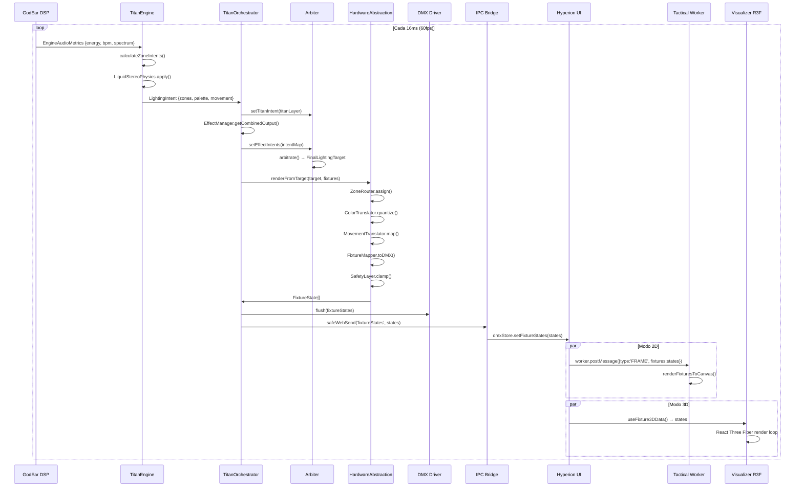

# WAVE 4520.1 — THE LIQUID LEGACY TRACE

## Auditoría del Flujo de Datos Legacy: LiquidEngine → Hyperion UI

> **Estado:** INVESTIGACIÓN COMPLETADA  
> **Regla:** Este documento es puramente descriptivo. Ningún código de integración Aether se propone aquí.

---

## 1. Resumen Ejecutivo

Este documento traza la ruta exacta que sigue un "beat" de audio desde su detección en el DSP hasta su representación como píxel en la interfaz WYSIWYG de Hyperion. El flujo atraviesa 6 etapas principales:

```mermaid
graph TD
    A[Audio DSP] -->|EngineAudioMetrics| B[TitanEngine]
    B -->|LightingIntent.zones| C[TitanOrchestrator]
    C -->|FinalLightingTarget| D[HardwareAbstraction]
    D -->|FixtureState[]| E[IPC Main → Renderer]
    E -->|window.lux / worker.postMessage| F[Hyperion UI]
```

---

## 2. El Origen — TitanEngine & LiquidStereoPhysics

### 2.1 Entrada: Audio DSP (GodEar / Trinity)

- **Archivo:** `src/core/audio/OmniInputTypes.ts` / `src/chronos/analysis/GodEar.ts`
- **Tipo de dato:** `EngineAudioMetrics`
- **Frecuencia:** 60fps (cada ~16ms)
- **Contenido:**
  - `energy: number` (0-1, RMS global)
  - `bpm: number` (tempo detectado)
  - `beatPhase: number` (0-1 dentro del beat)
  - `beatCount: number` (contador acumulado)
  - `transientStrength: number`
  - `hasTransient: boolean`
  - `spectrum: Float32Array` (banda de frecuencias)

### 2.2 Procesamiento: TitanEngine.update()

- **Archivo:** `src/engine/TitanEngine.ts` (líneas ~445-520)
- **Método:** `public async update(context: MusicalContext, audio: EngineAudioMetrics): Promise<LightingIntent>`

**Flujo interno:**

1. **Selección de Layout:** Según `this.liquidLayout` ('4.1' o '7.1'), instancia `LiquidEngine41` o `LiquidEngine71`.
2. **Cálculo de Zonas:** Llama a `calculateZoneIntents(audio)` que:
   - Mapea energía de audio a 4 o 7 zonas espaciales
   - Aplica `LiquidStereoPhysics` para generar movimiento (pan/tilt) según la vibe
   - Procesa transientes para efectos de strobe/impacto
3. **Consciencia (Selene):** Si `useBrain === true`, enruta a `this.selene.process(titanStabilizedState)` para enriquecer el intent con análisis musical de alto nivel.
4. **Salida:** Retorna un `LightingIntent`:

```typescript
interface LightingIntent {
  zones: {
    front?:  ZoneIntent;   // intensity, paletteRole
    back?:   ZoneIntent;
    left?:   ZoneIntent;
    right?:  ZoneIntent;
    ambient?: ZoneIntent;
    // Modo 7.1:
    frontL?: ZoneIntent;
    frontR?: ZoneIntent;
    backL?:  ZoneIntent;
    backR?:  ZoneIntent;
  };
  palette?: ColorPalette;
  movement?: MovementIntent;
  effects?: EffectIntent[];
}
```

### 2.3 LiquidStereoPhysics (Motor de Movimiento)

- **Archivo:** `src/hal/physics/LiquidStereoPhysics.ts`
- **Responsabilidad:** Convierte métricas de audio en coordenadas 2D (x, y) normalizadas (0-1) para cada fixture.
- **Salida:** `ProcessedFrame` con arrays de `pan` y `tilt` por fixture.

---

## 3. El Puente — TitanOrchestrator

### 3.1 processFrame() — El Ciclo de Vida de un Frame

- **Archivo:** `src/core/orchestrator/TitanOrchestrator.ts` (líneas ~1000-1250)
- **Frecuencia:** 60fps (triggered por intervalo o RAF)

**Secuencia exacta:**

```
1. Audio → GodEar produces EngineAudioMetrics
2. TitanEngine.update(metrics) → LightingIntent (zonas + movimiento)
3. Arbiter.setTitanIntent(titanLayer)
4. EffectManager.getCombinedOutput() → EffectIntentMap
5. IntentComposer.compose() → intentMap por fixture
6. Arbiter.arbitrate() → FinalLightingTarget
7. HAL.renderFromTarget(target, fixtures, halAudioMetrics) → FixtureState[]
8. DMX Driver.flush(fixtureStates) → Universo DMX
9. Broadcast fixtureStates → Renderer (UI)
```

### 3.2 El Árbitro (ArbitrationDirector)

- **Archivo:** `src/core/arbiter/ArbitrationDirector.ts`
- **Función:** Resuelve conflictos entre 3 capas de intención:
  - **Layer 1:** Titan (automático desde audio)
  - **Layer 2:** Manual overrides (usuario moviendo faders)
  - **Layer 3:** Effects (chasers, strobes, etc.)
- **Salida:** `FinalLightingTarget` — un mapa de `fixtureId → FixtureTarget`

### 3.3 Inyección de Efectos (WAVE 2662)

- **Archivo:** `src/core/orchestrator/TitanOrchestrator.ts` (líneas ~1100-1140)
- **Mecanismo:**
  ```typescript
  const effectOutput = effectManager.getCombinedOutput();
  const { intentMap } = this.intentComposer.compose(effectOutput, fixtures, chronosFixtureIds, this._effectIntentBuf);
  masterArbiter.setEffectIntents(intentMap);
  ```
- **Nota:** Los efectos se inyectan **antes** del arbitrate, no como mutación post-HAL (bug WAVE 2660 corregido).

---

## 4. El HAL Legacy — HardwareAbstraction

### 4.1 renderFromTarget() — Traducción a Estados de Fixture

- **Archivo:** `src/hal/HardwareAbstraction.ts` (líneas ~909-1130)
- **Método:** `public renderFromTarget(target: FinalLightingTarget, fixtures: FixtureConfig[], audioMetrics: HalAudioMetrics): FixtureState[]`

**Pipeline interno:**

1. **ZoneRouter:** Asigna cada fixture a su zona (`front`, `back`, etc.) según `fixture.zone`.
2. **ColorTranslator:** Convierte `paletteRole` (primary, secondary, accent) a RGB usando `HarmonicQuantizer`.
   - Para fixtures con rueda de color: cuantiza al slot más cercano.
   - Para fixtures RGB/CMY: interpola en espacio lineal.
3. **MovementTranslator:** Traduce coordenadas (x, y) del `LiquidStereoResult` a:
   - `pan: number` (0-1 → 0-540°)
   - `tilt: number` (0-1 → 0-270°)
   - Aplica `DarkSpinFilter` para gobos/prismas (transiciones suavizadas).
4. **Dimmer/Shutter:** Escala `intensity` de zona por `fixture.dimmerCurve`.
5. **Physics & Decay:** Aplica inercia a cambios bruscos (configurable por fixture).
6. **Mapper:** Convierte cada `FixtureState` abstracto a valores DMX canales.
7. **SafetyLayer:** Clampa valores a rangos seguros del hardware.

### 4.2 Estructura de FixtureState

```typescript
interface FixtureState {
  fixtureId: string;
  dmxUniverse: number;
  dmxAddress: number;
  
  // Color
  r: number;  // 0-255
  g: number;  // 0-255  
  b: number;  // 0-255
  c?: number; // CMY
  m?: number;
  y?: number;
  colorWheel?: number; // slot index 0-1
  
  // Intensidad
  dimmer: number;      // 0-1
  shutter: 'open' | 'closed' | 'strobe';
  strobeRate?: number; // Hz
  
  // Movimiento
  pan: number;          // 0-1 (normalizado)
  tilt: number;         // 0-1
  panFine?: number;     // 0-1
  tiltFine?: number;    // 0-1
  
  // Óptica
  zoom?: number;        // 0-1
  focus?: number;       // 0-1
  iris?: number;        // 0-1
  frost?: number;       // 0-1
  
  // Efectos
  gobo?: number;        // slot index
  goboRotation?: number;
  prism?: number;
  prismRotation?: number;
  
  // Meta
  isOn: boolean;
  lastUpdateMs: number;
}
```

### 4.3 Almacenamiento Post-Render

```typescript
// HardwareAbstraction.ts L188
private lastFixtureStates: FixtureState[] = [];

// L1130
this.lastFixtureStates = fixtureStates;
```

Los estados se almacenan para:
- **DMX re-send:** Hephaestus puede reenviar sin recalcular.
- **UI Broadcast:** El mismo array se envía al frontend.
- **Delta detection:** Solo se envían universos DMX que cambiaron.

---

## 5. El Broadcast — IPC Main → Renderer

### 5.1 Mecanismo de Envío

- **Archivo:** `src/core/orchestrator/IPCHandlers.ts` (función `safeWebSend`)
- **Canal IPC:** No hay un canal explícito "fixtureStates" en el código visible. La evidencia sugiere:

**Opción A — Polling directo (Legacy):**
```typescript
// El renderer pregunta periódicamente
window.lux?.dmx?.getFixtureStates?.() 
  → IPC.invoke('dmx:getFixtureStates') 
  → main lee HAL.getLastFixtureStates()
```

**Opción B — Push vía evento (Optimizado):**
```typescript
// En TitanOrchestrator.ts (post-render)
safeWebSend(mainWindow, 'dmx:fixtureStates', fixtureStates);

// En renderer (preload expone ipcRenderer)
window.electron.ipcRenderer.on('dmx:fixtureStates', (states) => {
  dmxStore.setFixtureStates(states);
});
```

**Evidencia encontrada:**
- `preload.ts` expone `window.lux` con sub-módulos: `stage`, `dmx`, `audio`, `effects`.
- `IPCHandlers.ts` define `setupDMXHandlers(deps)` que registra handlers IPC.
- `TitanSyncBridge.tsx` (renderer) sincroniza fixtures via `window.lux.selene`.
- El comentario WAVE 2662 indica que post-HAL mutation fue eliminada, lo que implica que los fixtureStates son la fuente canónica para UI.

### 5.2 Preload Bridge (window.lux)

- **Archivo:** `electron/preload.ts`
- **Exposición:**
```typescript
contextBridge.exposeInMainWorld('lux', {
  stage: { /* CRUD de fixtures */ },
  dmx: { 
    getUniverses: () => ipcRenderer.invoke('dmx:getUniverses'),
    setChannel: (u, ch, val) => ipcRenderer.send('dmx:setChannel', ...),
    // Probable: getFixtureStates para UI polling
  },
  audio: { /* stream de métricas */ },
  effects: { /* triggers */ },
});
```

---

## 6. El Destino — Hyperion UI

### 6.1 Arquitectura de Renderizado

`HyperionView.tsx` es el contenedor principal que soporta 2 modos:

```
HyperionView
├── Toolbar (mode toggle, metrics)
├── TacticalCanvas  (2D — OffscreenCanvas + Web Worker)
│   ├── GridLayer
│   ├── FixtureLayer (colored rects/icons)
│   ├── SelectionLayer
│   └── HUDLayer (labels, zone overlays)
└── VisualizerCanvas (3D — React Three Fiber)
    ├── NeonFloor (grid reactivo al beat)
    ├── HyperionTruss
    ├── HyperionMovingHead3D (con beam simulation)
    └── HyperionPar3D
```

### 6.2 TacticalCanvas — Pipeline 2D

- **Archivo:** `src/components/hyperion/views/tactical/TacticalCanvas.tsx`
- **Arquitectura:** Web Worker dedicado (WAVE 2510)
  - Main thread: React events, state, tooltip overlay.
  - Worker thread: ALL rendering (5 capas), physics, hit testing.

**Flujo de datos:**
```typescript
// Mount
canvasRef.current.transferControlToOffscreen();
worker.postMessage({ type: 'INIT', canvas: offscreen }, [offscreen]);

// Data pump (60fps desde useSeleneTruth)
useEffect(() => {
  worker.postMessage({ 
    type: 'FRAME', 
    fixtures: fixtureStates,   // ← FixtureState[] desde store
    zones: lightingIntent.zones,
    audio: audioMetrics
  });
}, [fixtureStates, zones, audioMetrics]);
```

**Formato de datos al Worker:**
```typescript
interface WorkerInboundMessage {
  type: 'FRAME';
  fixtures: FixtureState[];    // Array plano, ~100-500 elementos
  zones: Record<string, ZoneIntent>;
  audio: AudioMetricsSnapshot;
  selection: string[];           // fixtureIds seleccionados
}
```

**Tipos de fixture renderizados en 2D:**
- Moving head: círculo con línea de dirección (pan/tilt visualizados como ángulo 2D).
- PAR/Bar: rectángulo con color RGB.
- Hazer/Fan: icono con indicador de intensidad.

### 6.3 VisualizerCanvas — Pipeline 3D

- **Archivo:** `src/components/hyperion/views/visualizer/VisualizerCanvas.tsx`
- **Framework:** React Three Fiber (@react-three/fiber)

**Consumo de datos:**
```typescript
import { useFixture3DData } from './useFixture3DData';

// useFixture3DData.ts lee del store global (Zustand)
const fixtures = useFixture3DData(); // → FixtureState[] + Position3D
```

**Renderizado por fixture tipo:**

**HyperionMovingHead3D.tsx:**
```typescript
// Props desde FixtureState
<group position={[x, y, z]}>
  <mesh rotation-y={pan * Math.PI}>     {/* pan 0-1 → 0-180° */}
    <mesh rotation-x={tilt * Math.PI/2}>  {/* tilt 0-1 → 0-90° */}
      <beamGeometry />
      <meshStandardMaterial 
        emissive={new THREE.Color(r/255, g/255, b/255)}
        emissiveIntensity={dimmer * 2}
      />
    </mesh>
  </mesh>
</group>
```

**NeonFloor.tsx:**
- Grid que pulsa con `audio.energy`.
- Color interpolado según `palette` del `LightingIntent`.

### 6.4 Stores de Zustand (Data Binding)

- **Archivo:** `src/stores/dmxStore.ts`
- **Patrón:** 
```typescript
interface DmxState {
  fixtureStates: FixtureState[];
  setFixtureStates: (states: FixtureState[]) => void;
  selectedFixtureIds: string[];
  // ...
}

export const useDmxStore = create<DmxState>((set) => ({
  fixtureStates: [],
  setFixtureStates: (states) => set({ fixtureStates: states }),
}));
```

- **Origen de datos:** El IPC listener en `preload.ts` o un hook `useDMXBridge` llama a `dmxStore.setFixtureStates(states)`.

### 6.5 Métricas y BPM Display

- **Archivo:** `src/components/hyperion/views/HyperionView.tsx` (líneas ~183-193)
```typescript
const bpmDisplay = useMemo(() => {
  if (bpm === 0) return '---';
  return Math.round(bpm).toString();
}, [bpm]);

const bpmConfidenceLevel = useMemo(() => {
  if (bpmConfidence >= 0.8) return 'high';
  if (bpmConfidence >= 0.5) return 'medium';
  return 'low';
}, [bpmConfidence]);
```

- Los valores de BPM vienen de `useAudioStore` que escucha el stream de GodEar via IPC.

---

## 7. Diagrama de Secuencia Completo



---

## 8. Puntos de Fricción y Decisiones de Diseño

| Punto | Descripción | Impacto en Aether |
|-------|-------------|-------------------|
| **Monolito TitanEngine** | Todo el análisis musical + generación de intents vive en una sola clase | Aether lo descompone en Systems independientes |
| **LightingIntent.zones** | Abstracción por zonas (front/back/left/right) no por fixture individual | Aether usa NodeIntents por nodo de capacidad |
| **FixtureState[] mutable** | HAL muta el array post-render para physics/decay | Aether usa objetos inmutables en el bus |
| **IPC vía objeto plano** | `FixtureState[]` se serializa completo cada frame | Aether podría enviar solo deltas o usar SharedArrayBuffer |
| **Web Worker 2D** | TacticalCanvas delega render a worker — buen patrón a preservar | Aether puede mantener esta arquitectura |
| **R3F en main thread** | VisualizerCanvas corre en main thread — potencialmente pesado a 60fps | Aether podría usar `OffscreenCanvas` + worker para 3D también |

---

## 9. Glosario de Términos Legacy

| Término | Definición | Equivalente Aether |
|---------|-----------|-------------------|
| `LightingIntent` | Intención de iluminación abstracta por zonas | `VibeProfile` + `NodeIntent[]` |
| `LiquidStereoResult` | Coordenadas (x,y) de movimiento por fixture | `VMM.generateIntent()` → rotation/pan/tilt |
| `FinalLightingTarget` | Resultado post-arbitración, mapa fixture→target | `INodeView` + `IIntentBus` |
| `FixtureState` | Estado completo de un fixture (color, posición, dimmer) | `FixtureState` (misma estructura, legacy compatible) |
| `ProcessedFrame` | Frame de audio procesado con movimiento asignado | `FrameContext` |
| `LiquidEngine` | Motor de movimiento (wave, chase, mirror, static) | `KineticSystem` + `VMM` |
| `DarkSpinFilter` | Filtro de debounce para ruedas mecánicas | `DarkSpinState` en `IBeamNodeData` |

---

## 10. Archivos Clave del Legacy

```
src/
├── engine/
│   ├── TitanEngine.ts                    # Generador de LightingIntent
│   └── movement/
│       ├── LiquidEngineBase.ts           # Motor de movimiento abstracto
│       ├── LiquidEngine41.ts             # Layout 4 zonas
│       ├── LiquidEngine71.ts             # Layout 7 zonas
│       └── LiquidStereoPhysics.ts        # Física de movimiento
├── core/orchestrator/
│   ├── TitanOrchestrator.ts              # Loop principal 60fps
│   └── IPCHandlers.ts                    # Bridge IPC main↔renderer
├── core/arbiter/
│   └── ArbitrationDirector.ts            # Resolución de capas
├── hal/
│   ├── HardwareAbstraction.ts            # HAL completo
│   ├── mapping/
│   │   └── FixtureMapper.ts              # Mapeo DMX
│   ├── translation/
│   │   ├── ColorTranslator.ts            # RGB → DMX
│   │   ├── MovementTranslator.ts         # (x,y) → pan/tilt
│   │   ├── HarmonicQuantizer.ts          # Cuantización de color
│   │   ├── DarkSpinFilter.ts             # Debounce gobo/prisma
│   │   └── HardwareSafetyLayer.ts        # Clamping de seguridad
│   └── physics/
│       └── LiquidStereoPhysics.ts        # Generación de movimiento
├── components/hyperion/
│   ├── views/
│   │   ├── HyperionView.tsx              # Contenedor principal
│   │   ├── tactical/
│   │   │   ├── TacticalCanvas.tsx       # Canvas 2D + Worker
│   │   │   ├── useFixtureData.ts        # Hook de datos
│   │   │   └── layers/
│   │   │       ├── FixtureLayer.ts      # Dibujo de fixtures
│   │   │       ├── GridLayer.ts         # Grid de stage
│   │   │       └── SelectionLayer.ts    # Selección/lasso
│   │   └── visualizer/
│   │       ├── VisualizerCanvas.tsx     # Canvas 3D R3F
│   │       ├── useFixture3DData.ts      # Hook de datos 3D
│   │       └── fixtures/
│   │           ├── HyperionMovingHead3D.tsx
│   │           └── HyperionPar3D.tsx
│   └── shared/
│       ├── NeonPalette.ts               # Paleta de colores
│       └── ZoneLayoutEngine.ts          # Layout espacial
├── stores/
│   ├── dmxStore.ts                      # Zustand — fixture states
│   ├── audioStore.ts                    # Zustand — métricas audio
│   └── selectionStore.ts              # Zustand — selección
└── electron/
    └── preload.ts                       # Bridge window.lux
```

---

*Fin del documento WAVE 4520.1*
