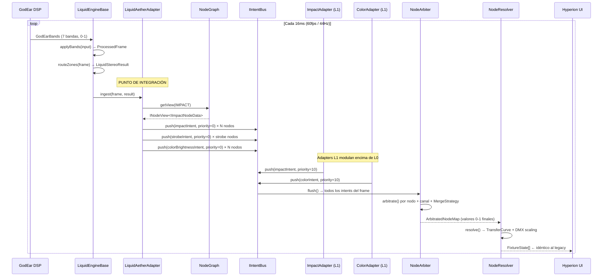

# WAVE 4521.1 — THE LIQUID-AETHER BRIDGE (Blueprint)

## Blueprint de Integración: LiquidAetherAdapter

> **Estado:** DISEÑO ARQUITECTÓNICO — PROHIBIDO ESCRIBIR CÓDIGO DE PRODUCCIÓN  
> **Referencia:** [WAVE-4520-LIQUID-LEGACY-MAP.md](./WAVE-4520-LIQUID-LEGACY-MAP.md)  
> **Autor:** Dirección de Arquitectura

---

## 1. Objetivo del Blueprint

Integrar `LiquidEngineBase` (fuente canónica de dinámicas fotónicas del sistema legacy) en la **Aether Matrix**, de manera que el `ProcessedFrame` emitido por el motor líquido se traduzca en `INodeIntent[]` inyectados en la **Capa L0** del `IIntentBus`.

**Restricción crítica:** La UI (TacticalCanvas, VisualizerCanvas) y el árbitro legacy **no requieren modificación** en esta fase. El `NodeResolver` de Aether construirá un `FixtureState[]` idéntico al legacy al final del pipeline.

---

## 2. Corrección de Contexto — La Fuente de Verdad Real

> ⚠️ **El mapa de WAVE 4520.1 menciona `LiquidStereoPhysics` como motor de movimiento, pero eso es incorrecto para el flujo de dinámicas fotónicas.**

La cadena real es:

```
LiquidEngineBase.applyBands(LiquidStereoInput)
    → ProcessedFrame  ← FUENTE DE VERDAD FOTÓNICA
        └── routeZones(frame)
              → LiquidStereoResult  ← Intensidades zonales mapeadas
```

### 2.1 `ProcessedFrame` — Estructura Canónica

```typescript
// src/hal/physics/LiquidEngineBase.ts
export interface ProcessedFrame {
  // Espectro crudo
  bands: GodEarBands           // subBass, bass, lowMid, mid, highMid, treble, ultraAir
  
  // Estado del motor
  morphFactor: number          // 0-1: profundidad melódica vs. percusiva
  recoveryFactor: number       // 0-1: recuperación post-silencio (AGC rebound)
  isBreakdown: boolean         // sección musical: breakdown / buildup
  isVetoed: boolean            // kick en ventana de veto (anti-doble-disparo)
  isKick: boolean              // señal cruda del IntervalBPMTracker
  isKickEdge: boolean          // kick con intervalo válido (el francotirador)
  acidMode: boolean            // harshness > harshnessAcidThreshold
  noiseMode: boolean           // flatness > flatnessNoiseThreshold
  harshness: number            // proxy de agresividad tonal
  flatness: number             // Wiener entropy (0=tonal, 1=ruido)
  spectralCentroid: number     // Hz — brillo tonal (0 si no disponible)
  rawTrebleDelta: number       // delta treble pre-filtro (platillos/crashes)
  rawHighMidDelta: number      // delta highMid (caja/rimshot)
  rawMidDelta: number          // delta mid (snare gordo/808)
  now: number                  // timestamp del frame (ms)

  // Intensidades zonales PRE-routeZones (señales puras del motor)
  frontLeft: number            // SubBass → envSubBass (El Océano)
  frontRight: number           // KickEdge → envKick (El Francotirador)
  backRight: number            // Transient Shaper → envSnare (El Látigo)
  snareAttack: number          // señal pre-envelope para sidechain en Mover R
  backLeft: number             // mid cross-filter → envHighMid (El Coro)
  moverLeft: number            // melody tonal gate → envTreble (El Galán)
  moverRight: number           // vocal EQ balancer → envVocal (La Dama)

  // Strobe
  strobeActive: boolean
  strobeIntensity: number      // 0-1
}
```

### 2.2 `LiquidStereoResult` — Intensidades Zonales Mapeadas

El hijo `LiquidEngine71` / `LiquidEngine41` implementa `routeZones(frame): LiquidStereoResult` que traduce el `ProcessedFrame` a:

```typescript
interface LiquidStereoResult {
  frontLeftIntensity: number   // ← frame.frontLeft (post-routeZones)
  frontRightIntensity: number  // ← frame.frontRight
  backLeftIntensity: number    // ← frame.backLeft
  backRightIntensity: number   // ← frame.backRight
  moverLeftIntensity: number   // ← frame.moverLeft
  moverRightIntensity: number  // ← frame.moverRight
  strobeActive: boolean        // ← frame.strobeActive
  strobeIntensity: number      // ← frame.strobeIntensity
}
```

---

## 3. Arquitectura del LiquidAetherAdapter

### 3.1 Posición en el Ecosistema

```mermaid
graph LR
    subgraph "Audio Pipeline"
        GE[GodEar DSP] -->|GodEarBands| LEB[LiquidEngineBase]
        LEB -->|applyBands| PF[ProcessedFrame]
    end

    subgraph "Aether Matrix — Systems Layer"
        PF -->|consume| LAA[LiquidAetherAdapter]
        LAA -->|push L0 intents| IB[IIntentBus]
        IB -->|arbitrate| NA[NodeArbiter]
        NA -->|ArbitratedNodeMap| NR[NodeResolver]
    end

    subgraph "Output"
        NR -->|FixtureState[]| UI[Hyperion UI]
        NR -->|DMXPacket| DMX[DMX Driver]
    end
```

### 3.2 Rol del Adaptador

`LiquidAetherAdapter` es un **Adaptador de Capa** (no un System en sentido estricto): en lugar de consumir el `FrameContext` de Aether, consume directamente el `ProcessedFrame` del motor líquido, y lo convierte en `INodeIntent[]` para el `IIntentBus`.

Responsabilidades:
1. Recibir el `ProcessedFrame` emitido por el motor.
2. Consultar el `NodeGraph` para encontrar nodos por zona.
3. Construir `INodeIntent` con prioridad L0 (prioridad = 0) para cada nodo afectado.
4. Inyectarlos en el `IIntentBus`.

**No** es responsable de: orchestration, DMX, IPC, color blending (eso es `ColorAdapter`), movimiento (eso es `KineticAdapter`).

---

## 4. Firma de la Interfaz

```typescript
// src/core/aether/adapters/LiquidAetherAdapter.ts

/**
 * WAVE 4521.1 — THE LIQUID-AETHER BRIDGE
 *
 * Adaptador que consume ProcessedFrame de LiquidEngineBase y lo traduce
 * a INodeIntent[] en la Capa L0 (prioridad 0) del IIntentBus.
 *
 * PUNTO DE INTEGRACIÓN ÚNICO: Esta clase es la única interfaz entre
 * el motor líquido legacy y la Aether Matrix. No hay código de integración
 * en ningún otro lugar.
 */
export class LiquidAetherAdapter {

  readonly name = 'LiquidAetherAdapter'

  // Pre-allocated — zero alloc en hot path
  private readonly _impactScratch: INodeIntent     // para nodos IMPACT
  private readonly _strobeScratch: INodeIntent     // para nodos STROBE
  private readonly _impactValues: Record<string, number>
  private readonly _strobeValues: Record<string, number>

  constructor(
    private readonly _nodeGraph: INodeGraph,
    private readonly _epicenter: { x: number; y: number; z: number },
    private readonly _maxRadiusM: number = 12.0,
  ) {}

  /**
   * Punto de entrada principal.
   * Llamar una vez por frame, después de que LiquidEngineBase.applyBands()
   * produzca el ProcessedFrame.
   *
   * Contrato:
   * - Solo escribe en el bus. No lee del bus.
   * - Zero allocations en hot path.
   * - Prioridad de todos los intents: L0 (= 0).
   */
  ingest(frame: ProcessedFrame, result: LiquidStereoResult, bus: IIntentBus): void {
    // 1. Enrutar intensidades de IMPACT nodes por zona espacial
    this._routeImpactNodes(result, bus)
    
    // 2. Enrutar señal de STROBE a nodos de tipo IMPACT con capacidad de strobe
    if (result.strobeActive) {
      this._routeStrobeNodes(result.strobeIntensity, bus)
    }
    
    // 3. Inyectar señales de MOOD a nodos COLOR (solo intensidad, no color — eso es ColorAdapter)
    this._routeMoodToColorIntensity(result, frame, bus)
  }

  // Métodos de enrutamiento — detallados en §5
  private _routeImpactNodes(result: LiquidStereoResult, bus: IIntentBus): void { /* §5.1 */ }
  private _routeStrobeNodes(intensity: number, bus: IIntentBus): void { /* §5.2 */ }
  private _routeMoodToColorIntensity(result: LiquidStereoResult, frame: ProcessedFrame, bus: IIntentBus): void { /* §5.3 */ }

  /** Llamar en patch-time para reubicar el epicentro de onda */
  setEpicenter(x: number, y: number, z: number): void { /* patch-time only */ }
}
```

---

## 5. Enrutamiento Espacial (Zone Routing)

### 5.1 IMPACT Nodes — Dimmer por Zona

El adaptador consulta el `NodeGraph` usando la posición 3D de cada nodo para seleccionar la intensidad zonal correcta del `LiquidStereoResult`.

**Mapa de Zonas → Intensidades:**

```
ProcessedFrame Signal     → LiquidStereoResult Field    → Zona Espacial
─────────────────────────────────────────────────────────────────────
frontLeft  (El Océano)    → frontLeftIntensity           → X < 0, Z ≥ 0
frontRight (Francotirador)→ frontRightIntensity          → X ≥ 0, Z ≥ 0
backLeft   (El Coro)      → backLeftIntensity            → X < 0, Z < 0
backRight  (El Látigo)    → backRightIntensity           → X ≥ 0, Z < 0
moverLeft  (El Galán)     → moverLeftIntensity           → |X| < 2m, Z ≥ 0, lado izq
moverRight (La Dama)      → moverRightIntensity          → |X| < 2m, Z ≥ 0, lado der
```

**Convención de coordenadas** (WAVE 3506.1.1 — Y-up unificado):
- `+X` = derecha del escenario
- `+Y` = altura (no participa en zoning)
- `+Z` = frente / downstage; `-Z` = fondo / upstage

**Consulta al NodeGraph:**
```typescript
// Dentro de _routeImpactNodes()
const impactNodes: INodeView<IImpactNodeData> = 
  this._nodeGraph.getView(NodeFamily.IMPACT)

impactNodes.forEach((node) => {
  const px = node.position?.x ?? 0
  const pz = node.position?.z ?? 0
  
  // Selección de zona usando la función pura reutilizada
  const zoneIntensity = selectZoneFromResult(result, px, pz)
  
  // Falloff por distancia al epicentro de la onda energética
  const falloff = computeEpicenterFalloff(node, this._epicenter, this._maxRadiusM)
  
  // Intent L0
  this._impactValues['dimmer'] = clamp01(zoneIntensity * falloff)
  this._impactScratch.nodeId   = node.nodeId
  this._impactScratch.priority = 0   // L0 — base líquida
  bus.push(this._impactScratch)
})
```

### 5.2 STROBE Nodes — Activación Binaria

El strobe en el `ProcessedFrame` es binario (`strobeActive: boolean`) con modulación de intensidad (`strobeIntensity: 0-1`).

```typescript
// Dentro de _routeStrobeNodes()
// Se aplica SOLO a nodos IMPACT con capacidad de strobe
// (determinado por presencia de canal tipo 'shutter' en node.channels)
const strobeNodes: INodeView<IImpactNodeData> = 
  this._nodeGraph.getView(NodeFamily.IMPACT)

strobeNodes.forEach((node) => {
  const hasShutter = node.channels.some(ch => ch.type === 'shutter')
  if (!hasShutter) return
  
  this._strobeValues['shutter']      = 1.0                   // abre obturador
  this._strobeValues['strobeRate']   = strobeIntensity        // 0-1 normalizado
  this._strobeScratch.nodeId         = node.nodeId
  this._strobeScratch.priority       = 0
  bus.push(this._strobeScratch)
})
```

### 5.3 COLOR Nodes — Intensidad de Mood (no color)

`LiquidAetherAdapter` inyecta **solo la intensidad** a nodos COLOR, no el color (eso sigue siendo responsabilidad exclusiva de `ColorAdapter`). Esta separación preserva la responsabilidad única de cada adaptador.

La señal de "mood intensity" se deriva del `morphFactor` y la energía global del frame:

```typescript
// Dentro de _routeMoodToColorIntensity()
const moodIntensity = clamp01(frame.morphFactor * frame.recoveryFactor)

const colorNodes: INodeView<IColorNodeData> = 
  this._nodeGraph.getView(NodeFamily.COLOR)

colorNodes.forEach((node) => {
  const px = node.position?.x ?? 0
  const pz = node.position?.z ?? 0
  
  const zoneIntensity = selectZoneFromResult(result, px, pz)
  const falloff       = computeEpicenterFalloff(node, this._epicenter, this._maxRadiusM)
  
  // Solo 'brightness' — el tinte RGB lo gestiona ColorAdapter en L0 también.
  // NodeArbiter resuelve el merge channel-by-channel.
  this._colorValues['brightness'] = clamp01(moodIntensity * zoneIntensity * falloff)
  this._colorScratch.nodeId       = node.nodeId
  this._colorScratch.priority     = 0
  bus.push(this._colorScratch)
})
```

---

## 6. La Capa L0 del IntentBus

El `IIntentBus` de Aether acepta intents con prioridad numérica. La convención de capas es:

```
Prioridad 0   → L0  — Sistema base: LiquidAetherAdapter (este adaptador)
Prioridad 10  → L1  — IA autónoma: ImpactAdapter, ColorAdapter, KineticAdapter
Prioridad 50  → L2  — Efectos: BeamSystem, AtmosphereSystem  
Prioridad 100 → L3  — Overrides manuales / Hephaestus
Prioridad 200 → L4  — Blackout / Seguridad
```

> **Decisión arquitectónica:** `LiquidAetherAdapter` opera en L0 porque es la señal bruta del motor físico — la "base energética" sobre la cual los otros sistemas modulan. Los adapters existentes (ImpactAdapter en prioridad 10) pueden sobreescribir o blendear encima de L0.

El `NodeArbiter` resuelve conflictos multi-canal usando la `MergeStrategy` del canal:
- `dimmer`: `HIGHEST_WINS` — prevalece la intensidad mayor entre capas.
- `shutter`: `PRIORITY_WINS` — prevalece la capa de mayor prioridad.
- `brightness`: `MULTIPLY` — las capas se multiplican (modulación).

---

## 7. Diagrama de Flujo del Frame



---

## 8. Meta Final — Retrocompatibilidad con la UI

### 8.1 El Contrato de Salida

El **NodeResolver** es la última pieza del pipeline Aether. Su salida es un `FixtureState[]` que **debe ser estructuralmente idéntico** al producido por `HardwareAbstraction.renderFromTarget()` del pipeline legacy.

Esto garantiza que:
- `TacticalCanvas` (Web Worker 2D) no requiere modificaciones.
- `VisualizerCanvas` (R3F 3D) no requiere modificaciones.
- Los stores de Zustand (`dmxStore`, `selectionStore`) no requieren modificaciones.
- El árbitro legacy (`ArbitrationDirector`) puede coexistir sin conflictos durante la transición.

### 8.2 Estructura FixtureState de Salida (Idéntica al Legacy)

El `NodeResolver` de Aether producirá objetos con la siguiente forma para ser consumidos sin modificaciones por la UI:

```typescript
// Salida del NodeResolver — idéntica a src/hal/mapping/FixtureMapper.ts
interface FixtureState {
  fixtureId: string
  dmxUniverse: number
  dmxAddress: number

  // Color (normalizado → NodeResolver escala a 0-255)
  r: number          // 0-255
  g: number          // 0-255
  b: number          // 0-255
  colorWheel?: number

  // Intensidad
  dimmer: number     // 0-1
  shutter: 'open' | 'closed' | 'strobe'
  strobeRate?: number

  // Movimiento
  pan: number        // 0-1
  tilt: number       // 0-1
  panFine?: number
  tiltFine?: number

  // Óptica
  zoom?: number
  focus?: number
  iris?: number
  frost?: number
  gobo?: number
  rotation?: number  // WAVE 4519: para fans (rotación continua)

  isOn: boolean
  lastUpdateMs: number
}
```

### 8.3 Ruta de Migración (Fases)

```
FASE ACTUAL   → LiquidEngineBase → TitanEngine → HAL.renderFromTarget() → FixtureState[]
FASE PUENTE   → LiquidEngineBase → LiquidAetherAdapter → IntentBus → NodeResolver → FixtureState[]
              ↑ Ambas rutas coexisten. Legacy como fallback. Aether como lead.
FASE FINAL    → Solo Aether. Legacy desactivado. UI sin cambios.
```

Durante **FASE PUENTE**: `TitanOrchestrator.processFrame()` ejecuta ambas rutas y compara los `FixtureState[]` para validar equivalencia antes de desactivar el legacy.

---

## 9. Módulos a Crear

| Módulo | Ruta | Responsabilidad |
|--------|------|----------------|
| `LiquidAetherAdapter` | `src/core/aether/adapters/LiquidAetherAdapter.ts` | Adaptador principal (este blueprint) |
| `selectZoneFromResult` | `src/core/aether/adapters/zoneUtils.ts` | Helper puro compartido entre todos los adapters |
| `computeEpicenterFalloff` | `src/core/aether/adapters/zoneUtils.ts` | Helper puro de física espacial |

> **Nota:** `selectZoneFromResult` actualmente está duplicado en `ImpactAdapter.ts` y `ColorAdapter.ts` como función local. El refactor a `zoneUtils.ts` está fuera del alcance de este blueprint pero se recomienda como deuda técnica inmediata.

---

## 10. Consideraciones de Performance

| Aspecto | Decisión | Justificación |
|---------|----------|---------------|
| **Allocations** | Zero en hot path | Pre-allocar `_impactScratch`, `_strobeScratch`, `_colorScratch` en constructor |
| **NodeGraph query** | `getView()` retorna `INodeView` pre-calculado | El view se recalcula solo en patch-time, no en hot path |
| **Math.sqrt** en falloff | Aceptable (nativa del motor JS) | Sin alternativa zero-alloc equivalente; ~2ns por llamada |
| **ProcessedFrame** | No se copia | `ingest()` recibe referencia; el frame es efímero (producido y consumido en el mismo tick) |
| **LiquidStereoResult** | Reutilizar el objeto retornado por `applyBands()` | El engine retorna el mismo objeto pre-allocated entre frames |
| **Frecuencia** | 44Hz (cada ~22ms) | Sincronizado con el pipeline de audio GodEar, no con el render a 60fps |

---

## 11. Invariantes de Diseño

1. **L0 es base, no override.** `LiquidAetherAdapter` nunca escribe en prioridad > 0. Las capas superiores (ImpactAdapter, overrides manuales) tienen siempre la última palabra.
2. **Un solo punto de integración.** Solo `LiquidAetherAdapter` conecta el motor líquido con Aether. Ningún otro archivo debe importar `ProcessedFrame` dentro del directorio `aether/`.
3. **Sin estado de sesión.** `LiquidAetherAdapter` no acumula estado entre frames. La física temporal (envelopes, kick detection) vive en `LiquidEngineBase`, no en el adaptador.
4. **Retrocompatibilidad garantizada.** La firma de `FixtureState` del `NodeResolver` es inmutable hasta que la UI sea formalmente migrada (fuera del alcance de esta WAVE).

---

*Fin del documento WAVE 4521.1 — THE LIQUID-AETHER BRIDGE*
