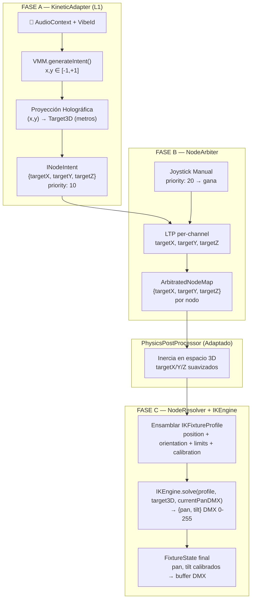
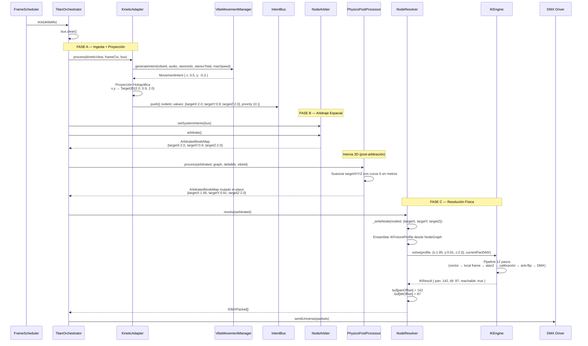
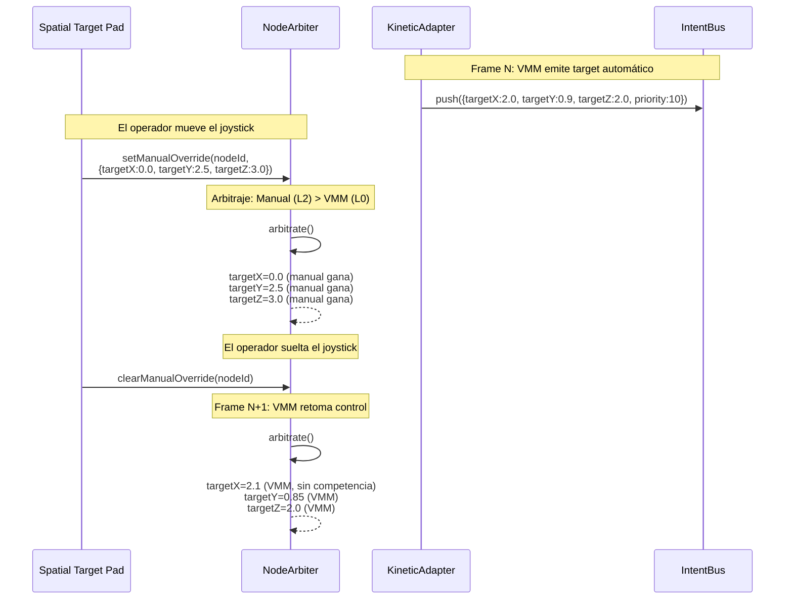
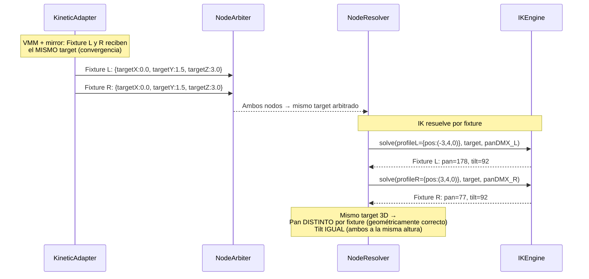

# WAVE 4523.3 — THE KINETIC-AETHER BRIDGE
## Blueprint de Integración: VMM + IK → Aether Matrix

> **Estado:** DISEÑO ARQUITECTÓNICO — PROHIBIDO ESCRIBIR CÓDIGO
> **Fecha:** 2026-05-02
> **Prerequisito:** WAVE-4523-KINETIC-LEGACY-MAP.md (Radiografía completada)
> **Autor:** Dirección de Arquitectura

---

## 0. RESUMEN EJECUTIVO

El pipeline de movimiento actual (WAVE 3508) opera en **espacio normalizado 2D** (pan/tilt 0-1). El `VMMAdapter` traduce la salida abstracta (-1,+1) del VMM directamente a canales `pan`/`tilt` normalizados que el `PhysicsPostProcessor` suaviza y el `NodeResolver` escala a DMX. Este flujo **ignora la geometría real del escenario**: dos fixtures en posiciones distintas apuntando al "mismo target conceptual" reciben el mismo valor pan/tilt, lo que produce haces divergentes en lugar de convergentes.

**Objetivo:** Rediseñar el pipeline en 3 fases para que Aether **piense en metros 3D**, delegando la conversión a Pan/Tilt DMX al `IKEngine` dentro del `NodeResolver`.

### Corrección Arquitectónica Detectada

Al analizar el código real, se identifican **dos flujos paralelos redundantes** para KINETIC:

| Componente | Archivo | Estado actual |
|-----------|---------|--------------|
| `VMMAdapter` | `adapters/KineticAdapter.ts` | L1 Adapter — llama al VMM, emite `pan`/`tilt` al bus |
| `KineticSystem` | `systems/KineticSystem.ts` | L0 System — genera sus propios patrones (sweep, scatter, converge, wave, build, drop) |

Ambos escriben intents `pan`/`tilt` al IntentBus para los mismos KINETIC_NODEs. El `NodeArbiter` aplica LTP y el último en ejecutar gana. Según `TitanOrchestrator.ts:1565`, el `_kineticAdapter` (VMMAdapter) se ejecuta **después** del paso de Systems, por lo que sus valores LTP sobreescriben al `KineticSystem` en la práctica.

**Decisión de diseño:** El `VMMAdapter` se refactoriza a `KineticAdapter` (Fase A). El `KineticSystem` existente se mantiene como **fuente de patrones estructurales** (section-aware: build, drop, converge) que no requieren VMM. Ambos escriben al bus con prioridades diferenciadas y el `NodeArbiter` resuelve el conflicto con la política existente (LTP: la prioridad más alta gana).

---

## 1. ARQUITECTURA TARGET — 3 FASES



---

## 2. FASE A — EL ADAPTADOR CINEMÁTICO (`KineticAdapter`)

### 2.1 Responsabilidad

Reemplaza al `VMMAdapter` actual. En lugar de emitir `pan`/`tilt` normalizados, emite **coordenadas espaciales 3D** (`targetX`, `targetY`, `targetZ`) en metros.

### 2.2 Pipeline Interno

```
AudioContext → VMM.generateIntent(vibeId, audio, stereoIndex, stereoTotal, maxPanSpeed)
            → MovementIntent { x, y } ∈ [-1, +1]
            → Proyección Holográfica → Target3D { x, y, z } en metros
            → INodeIntent { targetX, targetY, targetZ, speed } priority=10
            → bus.push()
```

### 2.3 Proyección Holográfica — El Plano Virtual

El VMM produce coordenadas abstractas en un plano normalizado (-1,+1). Necesitamos proyectarlas a un **plano virtual** posicionado en el espacio 3D del escenario.

**Parámetros del plano virtual** (configurables por show, defaults razonables):

| Parámetro | Default | Descripción |
|-----------|---------|-------------|
| `STAGE_WIDTH` | 8.0 m | Ancho útil del escenario |
| `STAGE_HEIGHT` | 4.0 m | Alto útil de proyección |
| `STAGE_DEPTH` | 2.0 m | Profundidad fija del plano (Z constante) |
| `STAGE_CENTER_Y` | 1.5 m | Altura del centro del plano sobre el suelo |

**Fórmulas de proyección:**

```
TargetX = x × (STAGE_WIDTH / 2)
TargetY = STAGE_CENTER_Y + y × (STAGE_HEIGHT / 2)
TargetZ = STAGE_DEPTH
```

**Ejemplo concreto:**
- VMM emite `(x=0.5, y=-0.3)` para techno-club
- `TargetX = 0.5 × 4.0 = 2.0 m` (2m a la derecha del centro)
- `TargetY = 1.5 + (-0.3) × 2.0 = 0.9 m` (90cm del suelo — pista de baile)
- `TargetZ = 2.0 m` (frente del escenario)

### 2.4 Canales Emitidos al IntentBus

| Canal | Tipo | Rango | Merge Strategy |
|-------|------|-------|---------------|
| `targetX` | spatial | metros (±∞ teórico, ±6 práctico) | LTP |
| `targetY` | spatial | metros (0 = suelo, ~6 techo) | LTP |
| `targetZ` | spatial | metros (-∞ back, +∞ front) | LTP |
| `speed` | normalized | 0-1 | LTP |

**Prioridad:** `10` (L0 — sistema base IA).

### 2.5 Stereo & Fanning

El VMM ya aplica mirror/snake en su salida `(x, y)`. Tras la proyección holográfica, cada fixture recibe un `Target3D` diferente automáticamente:

- **Mirror (Techno):** Fixture L recibe `TargetX = +2.0m`, fixture R recibe `TargetX = -2.0m`.
- **Snake (Latino):** Cada fixture tiene su fase rotada → targets en posiciones angulares distintas del plano.

No se requiere lógica stereo adicional en el adapter.

### 2.6 Valores Normalizados vs Metros — Decisión Arquitectónica

**Problema:** El `INodeIntent.values` actual usa rangos `0-1` normalizados. Los canales espaciales usan metros (valores fuera de 0-1).

**Solución:** Los canales `targetX`, `targetY`, `targetZ` **no pasan por TransferCurve ni escalado DMX** en el NodeResolver. Son canales de tipo **spatial** que el NodeResolver reconoce y desvía al IKEngine en lugar de escribir directamente al buffer DMX. El NodeArbiter los trata como cualquier otro canal LTP — solo los compara por prioridad, sin importar el rango de valores.

### 2.7 Corrección: `IKineticNodeData` — Extensión Requerida

El `IKineticNodeData` actual no contiene los datos necesarios para el IKEngine. Se requiere extender el tipo:

```typescript
export interface IKineticNodeData extends ICapabilityNode {
  // ... campos existentes ...

  // ── NUEVOS: Datos para IKEngine (WAVE 4523.3) ──
  /** Orientación de montaje para IK (ceiling/floor/truss + rotación custom) */
  readonly ikOrientation?: IKOrientation
  /** Límites mecánicos para IK (panRange, tiltRange, tiltLimits) */
  readonly ikLimits?: IKMechanicalLimits
  /** Calibración del fixture (offsets grados + inversiones) */
  readonly ikCalibration?: IKCalibration
}
```

Estos campos se populan desde `ShowFileV2.FixtureV2` durante el patch time en `NodeFactory`. Si no están presentes (fixture sin datos IK), el NodeResolver hace fallback al flujo legacy (pan/tilt normalizados → DMX directo).

---

## 3. FASE B — ARBITRAJE ESPACIAL (`NodeArbiter`)

### 3.1 Política de Merge para Canales Espaciales

El `NodeArbiter` actual ya soporta LTP para todos los canales no-HTP. Los canales `targetX`, `targetY`, `targetZ` se benefician directamente de este comportamiento sin modificación alguna.

**Tabla de prioridades para movimiento:**

| Fuente | Priority | Capa | Descripción |
|--------|----------|------|------------|
| `KineticAdapter` (VMM) | 10 | L0 | Coreografía automática IA |
| `KineticSystem` (section) | 5 | L0 | Patrones estructurales (build/drop) |
| Selene IA override | 100+ | L1 | Override inteligente |
| Joystick / Spatial Target Pad | 200 | L2 | Override manual del operador |
| LiveFX Engine | 300+ | L3 | Efectos de movimiento |
| Blackout | 900 | L4 | Emergencia |

**Resultado:** Un operador con joystick (priority 200) siempre gana sobre la coreografía automática (priority 10). Aether resuelve esto **per-canal**: el operador puede overridear solo `targetX` y dejar `targetY`/`targetZ` bajo control del VMM.

### 3.2 Zero Cambios en `NodeArbiter`

El `NodeArbiter` existente (`NodeArbiter.ts`) **no requiere modificación**. Su lógica de LTP/HTP por canal es genérica:

```typescript
// Línea 232-237 de NodeArbiter.ts — ya hace esto:
} else {
  // LTP: la última escritura (capa más alta) gana
  record[channel] = incoming
}
```

Los canales `targetX`/`targetY`/`targetZ` entran como cualquier otro canal string → LTP aplica automáticamente.

### 3.3 Aether Piensa en Metros

Después del arbitraje, el `ArbitratedNodeMap` contiene para cada KINETIC_NODE:

```typescript
{
  "device_1:kinetic": {
    targetX: 2.0,      // metros
    targetY: 0.9,      // metros
    targetZ: 2.0,      // metros
    speed:   0.35,     // 0-1 normalizado
  }
}
```

El motor ya **no piensa en grados DMX**. Piensa en puntos del espacio real.

---

## 4. FASE C — TRADUCCIÓN FÍSICA (`NodeResolver` + `IKEngine`)

### 4.1 Patrón de Referencia: `ColorTranslator`

El `NodeResolver` ya tiene un precedente exacto para este patrón: la traducción cromática (WAVE 4522.4). Para nodos COLOR, el resolver detecta canales abstractos `r/g/b` y los desvía al `ColorTranslator` que produce los canales físicos (`red`, `green`, `blue`, `white`, `cyan`, `magenta`, `yellow`, `color_wheel`) según el `mixingType` del fixture.

**El mismo patrón se replica para KINETIC:**

| Aspecto | ColorTranslator | KineticTranslator (IKEngine) |
|---------|----------------|---------------------------|
| Input abstracto | `r`, `g`, `b` (0-1) | `targetX`, `targetY`, `targetZ` (metros) |
| Output físico | `red`, `green`, `blue`, `white`, `color_wheel` | `pan`, `tilt` (DMX 0-255) |
| Parámetro de traducción | `mixingType` + `colorWheel` | `IKFixtureProfile` (position + orientation + calibration) |
| Función de traducción | `ColorTranslator.translate()` | `IKEngine.solve()` |

### 4.2 Pipeline del NodeResolver para KINETIC_NODEs

```
_writeNode(nodeId, channelValues):
  1. Detectar si channelValues contiene 'targetX' (canal espacial)
  2. SI → flujo IK:
     a. Leer targetX, targetY, targetZ del ArbitratedNodeMap
     b. Ensamblar IKFixtureProfile desde IKineticNodeData
     c. Leer currentPanDMX del estado del nodo (para anti-flip)
     d. IKEngine.solve(profile, target3D, currentPanDMX) → IKResult
     e. Escribir pan y tilt DMX (0-255) directamente al buffer
     f. Marcar _ikProcessed = true en el estado
  3. NO → flujo legacy (pan/tilt normalizados → TransferCurve → DMX)
```

### 4.3 Ensamblaje del `IKFixtureProfile`

El `NodeResolver` construye el `IKFixtureProfile` desde los datos del nodo KINETIC y la `IDeviceDefinition` del `NodeGraph`:

```typescript
// Pseudocódigo — el resolve lee estos datos del NodeGraph
const profile: IKFixtureProfile = {
  id:          node.deviceId,
  position:    node.physicalPosition,              // IKineticNodeData.physicalPosition
  orientation: node.ikOrientation ?? DEFAULT_ORIENTATION,
  limits:      node.ikLimits ?? DEFAULT_LIMITS,
  calibration: {
    panOffset:   device.calibration?.panOffset  ?? 0,
    tiltOffset:  device.calibration?.tiltOffset ?? 0,
    panInvert:   device.calibration?.invertPan  ?? false,
    tiltInvert:  device.calibration?.invertTilt ?? false,
  },
}
```

### 4.4 Offsets de Calibración Visual

El IKEngine ya aplica calibración en el paso 5 de su pipeline (offsets en grados) y en el paso 8 (inversión de ejes). Los `panOffset`/`tiltOffset` del `ShowFileV2` se almacenan en grados y representan la **corrección manual del operador** para compensar errores de montaje físico.

Dado que el `NodeResolver` actual ya aplica calibración en `_applyCalibration()` (inversión + offset + tiltLimits), hay **riesgo de doble calibración**. La solución es análoga al flag `_ikProcessed` del HAL legacy (WAVE 2603):

**Regla:** Si el valor DMX fue producido por `IKEngine.solve()`, el `NodeResolver` **salta** los pasos de `_applyCalibration()` para los canales `pan`/`tilt` de ese nodo, porque IKEngine ya integró la calibración internamente.

### 4.5 Anti-Flip en el Contexto Aether

El IKEngine necesita `currentPanDMX` para su algoritmo anti-flip (paso 7 del pipeline IK). En el flujo actual del Aether, la posición actual vive en `IKineticNodeData.currentPosition.pan` (0-1 normalizado).

**Conversión:** `currentPanDMX = currentPosition.pan × 255`

El `PhysicsPostProcessor` ya mantiene y actualiza `currentPosition.pan/tilt` cada frame, así que este dato está siempre fresco.

### 4.6 Resultado Final

```typescript
const ikResult = solve(profile, { x: targetX, y: targetY, z: targetZ }, currentPanDMX)

// Escribir directamente al buffer DMX (sin TransferCurve ni _applyCalibration)
buf[baseAddr + panChannelOffset]  = clamp(ikResult.pan, 0, 255)
buf[baseAddr + tiltChannelOffset] = clamp(ikResult.tilt, 0, 255)
```

---

## 5. ADAPTACIÓN DEL `PhysicsPostProcessor`

### 5.1 Problema

El `PhysicsPostProcessor` actual opera sobre canales `pan`/`tilt` (0-1 normalizado). Con la nueva arquitectura, los canales del ArbitratedNodeMap son `targetX`/`targetY`/`targetZ` (metros). La inercia debe aplicarse **en espacio 3D**, no en espacio de ejes motorizados.

### 5.2 Solución

Extender el `PhysicsPostProcessor` para detectar canales espaciales y aplicar inercia en metros:

```
process(arbitrated, nodeGraph, deltaMs, vibeId):
  forEach KINETIC node:
    IF entry has 'targetX' (flujo espacial):
      → Aplicar inercia 3D a targetX, targetY, targetZ
      → Usar distancia euclídea para brake distance
      → Velocity máxima en m/s (derivada de maxPanSpeed: deg/s → m/s aprox.)
    ELSE (flujo legacy pan/tilt):
      → Comportamiento actual sin cambios
```

**Ventaja:** La inercia en espacio 3D produce movimientos físicamente coherentes. Un target que se mueve de `(2,1,2)` a `(-2,1,2)` (cruce horizontal) produce una trayectoria suave en metros, y el IKEngine en el NodeResolver lo traduce a los pan/tilt correctos para cada fixture individualmente.

### 5.3 Slots de Estado Extendidos

```
SLOT_TARGET_X_POS  = 0   // posición actual X (metros)
SLOT_TARGET_Y_POS  = 1   // posición actual Y (metros)
SLOT_TARGET_Z_POS  = 2   // posición actual Z (metros)
SLOT_TARGET_X_VEL  = 3   // velocidad X (m/s)
SLOT_TARGET_Y_VEL  = 4   // velocidad Y (m/s)
SLOT_TARGET_Z_VEL  = 5   // velocidad Z (m/s)
STATE_3D_SLOTS     = 6
```

---

## 6. DIAGRAMAS DE SECUENCIA

### 6.1 Flujo Completo: Latido de Audio → DMX



### 6.2 Override Manual (Joystick) Interrumpe Coreografía



### 6.3 Dos Fixtures, Mismo Target → Pan/Tilt Distintos



---

## 7. MAPA DE CAMBIOS POR ARCHIVO

| Archivo | Cambio | Complejidad |
|---------|--------|-------------|
| `adapters/KineticAdapter.ts` | Refactorizar: emitir `targetX/Y/Z` en lugar de `pan/tilt`. Añadir proyección holográfica. | **MEDIA** |
| `systems/KineticSystem.ts` | Adaptar: emitir `targetX/Y/Z` en lugar de `pan/tilt` para los patrones section-aware. | **MEDIA** |
| `resolver/PhysicsPostProcessor.ts` | Extender: detectar canales espaciales, aplicar inercia 3D con slots de estado extendidos. | **ALTA** |
| `resolver/NodeResolver.ts` | Extender `_writeNode()`: detectar `targetX` → desviar al IKEngine. Skip calibración para IK results. | **ALTA** |
| `capability-node.ts` | Extender `IKineticNodeData`: añadir campos `ikOrientation`, `ikLimits`, `ikCalibration`. | **BAJA** |
| `types.ts` | Registrar nuevos `AetherChannelType`: `targetX`, `targetY`, `targetZ`. | **BAJA** |
| `intent-bus.ts` | Sin cambios (ya soporta canales arbitrarios). | **NINGUNA** |
| `NodeArbiter.ts` | Sin cambios (LTP ya aplica a canales espaciales). | **NINGUNA** |
| `engine/movement/VibeMovementManager.ts` | Sin cambios (sigue emitiendo x,y ∈ [-1,+1]). | **NINGUNA** |
| `engine/movement/InverseKinematicsEngine.ts` | Sin cambios (se consume directamente). | **NINGUNA** |

---

## 8. FASE D — FUERA DE ALCANCE: StageConstructor UI

> **⚠️ EXPLÍCITAMENTE DIFERIDO a un wave posterior.**

La refactorización del Grid 3D de la UI (captura de posiciones, drag de fixtures en el escenario virtual, preview de haces IK en tiempo real) se abordará en un wave posterior dedicado al subsistema visual.

**Asunciones para este blueprint:**

1. Las posiciones 3D de los fixtures (`physicalPosition`) ya existen en el `ShowFileV2` y están disponibles en `IKineticNodeData.physicalPosition`.
2. La orientación de montaje (`ikOrientation`) se provee desde el perfil del fixture o desde datos manuales del show file.
3. Los offsets de corrección manual (`panOffset`, `tiltOffset`) se configuran a través de la interfaz de calibración existente y se almacenan en `device.calibration`.
4. Los parámetros del plano virtual (STAGE_WIDTH, STAGE_HEIGHT, STAGE_DEPTH, STAGE_CENTER_Y) se definen como constantes del show con defaults razonables. Una futura UI de StageConstructor permitirá al usuario ajustarlos visualmente.

---

## 9. INVARIANTES Y CONTRATOS DE SEGURIDAD

1. **Zero-Alloc Hot Path:** El `KineticAdapter` reutiliza `_intentScratch` y `_valuesDict` heredados de `BaseSystem`. La proyección holográfica usa solo aritmética de stack (multiplicaciones de primitivos).

2. **Fallback Graceful:** Si un `IKineticNodeData` no tiene campos IK (`ikOrientation === undefined`), el `NodeResolver` revierte al flujo legacy `pan/tilt → DMX`. Esto garantiza compatibilidad backward con fixtures no calibrados en 3D.

3. **Anti-Double-Calibration:** Los valores DMX producidos por `IKEngine.solve()` ya incluyen calibración (invert + offset + tiltLimits). El `NodeResolver` debe **saltar** `_applyCalibration()` para canales pan/tilt cuando el resultado proviene del IK.

4. **Anti-Flip Continuity:** El `PhysicsPostProcessor` suaviza los targets 3D **antes** del IK. Esto elimina saltos bruscos de target que causarían anti-flip innecesarios en el IKEngine.

5. **Gimbal Lock Resilience:** Si `IKEngine.solve()` detecta gimbal lock (`horizontalDist < 0.001m`), preserva el último pan conocido. El `currentPanDMX` se mantiene actualizado frame a frame por el PhysicsPostProcessor vía `currentPosition.pan`.

6. **Reachability:** Si `IKResult.reachable === false`, el NodeResolver escribe los valores de pan/tilt más cercanos posibles (el IKEngine ya los clampea a los límites mecánicos). Un flag de telemetría se emite para monitoreo.

---

## 10. GLOSARIO EXTENDIDO

| Término | Definición |
|---------|-----------|
| Proyección Holográfica | Mapeo lineal del plano abstracto VMM (-1,+1) a un plano virtual en el espacio 3D del escenario (metros). |
| Canal Espacial | Canal del IntentBus que transporta coordenadas en metros (`targetX`, `targetY`, `targetZ`) en lugar de valores normalizados 0-1. |
| Flujo IK | Ruta del NodeResolver que desvía canales espaciales al IKEngine para resolución geométrica, en contraste con el flujo legacy de pan/tilt directo. |
| Flujo Legacy | Ruta del NodeResolver que toma pan/tilt normalizados (0-1), aplica TransferCurve, escala a DMX y aplica calibración. Se mantiene como fallback. |
| Plano Virtual | Superficie rectangular conceptual en el espacio 3D donde el VMM "proyecta" sus patrones. Definido por ancho, alto, profundidad y altura del centro. |
| IKFixtureProfile Assembly | Proceso de construir un `IKFixtureProfile` desde los datos dispersos del `IKineticNodeData` y `IDeviceDefinition` del NodeGraph. |
| Inercia 3D | Modelo de física del PhysicsPostProcessor extendido para operar en coordenadas métricas (X, Y, Z) con distancia euclídea y velocidad en m/s. |
| Anti-Double-Calibration | Regla que impide que el NodeResolver aplique `_applyCalibration()` a valores DMX que el IKEngine ya calibró internamente (análogo al flag `_ikProcessed` del HAL legacy, WAVE 2603). |
