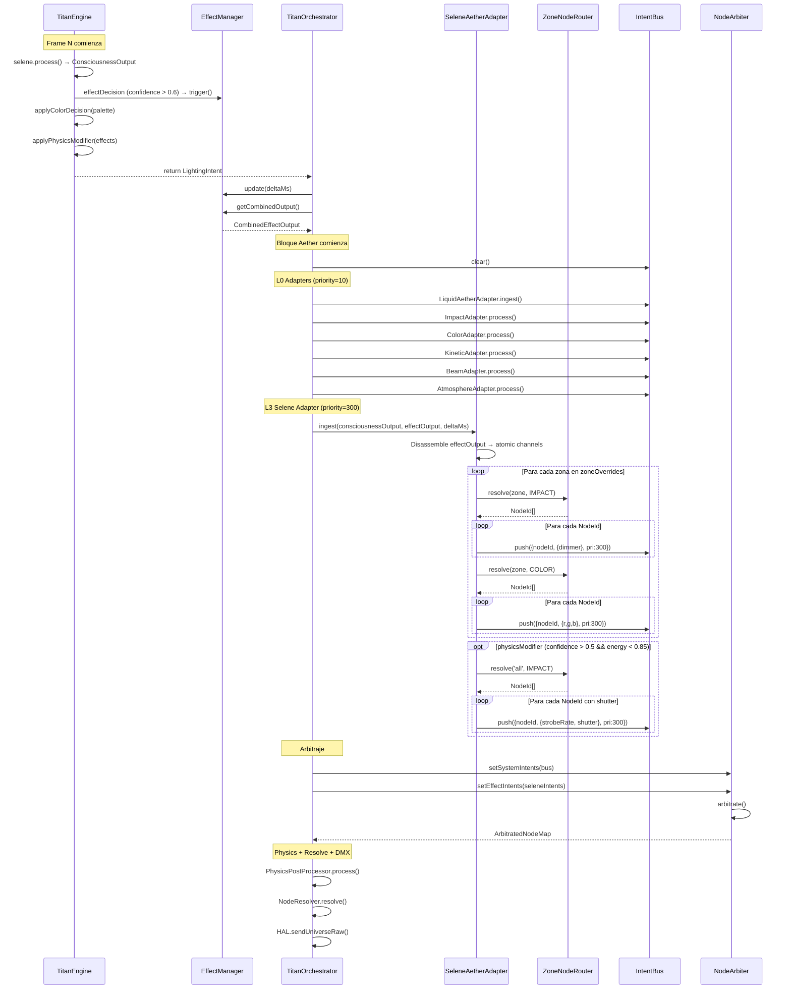
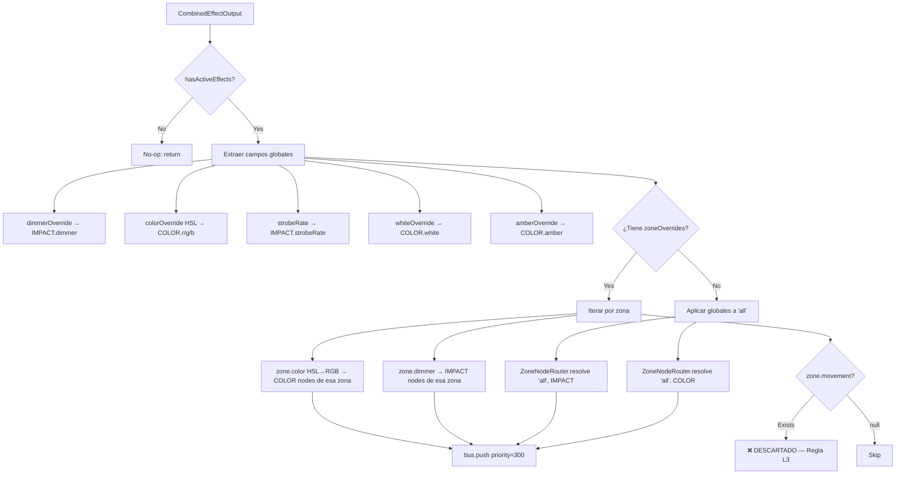

# WAVE 4524.2 — THE COGNITIVE-AETHER BRIDGE

> **Blueprint de Integración: Selene IA (Capa L3) → Aether Matrix**
> Estado: DISEÑO ARQUITECTÓNICO — PROHIBIDO ESCRIBIR CÓDIGO
> Exclusión explícita: Chronos/Timecoder no se diseña en esta WAVE.

---

## 0. PRINCIPIOS DE DISEÑO

1. **Pureza atómica de Aether**: El IntentBus solo habla en canales DMX normalizados (`dimmer`, `r`, `g`, `b`, `strobe`, `shutter`). Jamás en conceptos semánticos como `"solar_flare"`.
2. **Opacidad de Selene hacia el hardware**: Selene sigue hablando en zonas canónicas y efectos nominales. Nunca sabe qué fixtures existen ni cuántos canales tienen.
3. **Zero-alloc hot-path**: El adaptador reutiliza scratch objects pre-allocated. Cero `new` en el frame loop.
4. **Bloqueo de movimiento**: El `SeleneAetherAdapter` **NUNCA** emite `targetX`, `targetY`, `targetZ`. La coreografía espacial pertenece exclusivamente al `KineticAdapter` (L1).
5. **IntentSource**: Todos los intents emitidos usan `source: 'effect'` y `priority: 300` (rango L3 según la convención del IntentBus).

---

## 1. VISIÓN GENERAL DEL PIPELINE

```
┌─────────────────────────────────────────────────────────────────────────────────┐
│                         SELENE AETHER ADAPTER (L3)                              │
│                                                                                 │
│  ┌──────────────┐    ┌──────────────────┐    ┌─────────────┐    ┌────────────┐ │
│  │ ConsciousOut  │───▶│ EffectLifecycle   │───▶│ Disassembler │───▶│  ZoneRouter │─┐
│  │ (per frame)   │    │ Manager (trigger, │    │ (per active  │    │ (zone→NodeId│ │
│  │               │    │  update, decay)   │    │  effect)     │    │  expansion) │ │
│  └──────────────┘    └──────────────────┘    └─────────────┘    └────────────┘ │
│                                                                        │        │
│                                                                        ▼        │
│                                                              ┌──────────────┐   │
│                                                              │  IntentBus   │   │
│                                                              │  .push()     │   │
│                                                              │  priority=300│   │
│                                                              └──────────────┘   │
└─────────────────────────────────────────────────────────────────────────────────┘
```

---

## 2. FASE A — INGESTA Y CICLO DE VIDA

### 2.1 Contrato de entrada

El `SeleneAetherAdapter` recibe el `ConsciousnessOutput` completo cada frame, inyectado por el `TitanOrchestrator` **después** de que `TitanEngine.update()` lo produce.

```typescript
// En TitanOrchestrator.processFrame(), dentro del bloque Aether:
this._seleneAetherAdapter.ingest(consciousnessOutput, deltaMs)
```

### 2.2 Decisiones consumidas vs. ignoradas

| Campo de `ConsciousnessOutput` | ¿Consumido por el Adapter? | Razón |
|--------------------------------|---------------------------|-------|
| `effectDecision` | ✅ Sí | Dispara/gestiona efectos nominales |
| `colorDecision` | ✅ Sí | Modifica paleta cromática en nodos COLOR |
| `physicsModifier` | ✅ Sí | Modifica strobe/flash en nodos IMPACT |
| `movementDecision` | ❌ **NO** | Movimiento delegado 100% al KineticAdapter (L1) |

### 2.3 Gestión de efectos: Shadow EffectManager

El adaptador encapsula una instancia propia del `EffectManager` (o una versión minificada) que gestiona el ciclo de vida completo de los efectos `ILightEffect`:

```
ConsciousnessOutput.effectDecision
    → if confidence > 0.6:
        effectLifecycleManager.trigger({
            effectType,
            intensity,
            zones,
            source: 'hunt_strike',
            musicalContext,
        })

Cada frame:
    effectLifecycleManager.update(deltaMs)
    for each activeEffect:
        output = effect.getOutput()  // EffectFrameOutput | null
        if output !== null:
            → FASE B (Disassembler)
```

**Decisión arquitectónica — ¿Instancia propia o reusar el EffectManager legacy?**

Se recomienda **reusar la misma instancia singleton** del `EffectManager` que ya usa el pipeline legacy. Razones:
- Los efectos ya tienen cooldowns y guards anti-spam internos.
- Evita duplicar la biblioteca de ~30 efectos.
- El `EffectManager` ya gestiona conflictos entre efectos concurrentes.
- El output combinado ya está unificado en `CombinedEffectOutput`.

El adaptador **no dispara** efectos — eso sigue siendo responsabilidad del `TitanEngine`. El adaptador solo **lee** el output del `EffectManager` ya tickeado y lo traduce a intents atómicos.

```
┌──────────────────────────────────────────────────────────────────┐
│  TitanEngine.update()                                            │
│    └─ effectDecision → effectManager.trigger()  (ya existente)   │
│                                                                  │
│  TitanOrchestrator.processFrame()                                │
│    └─ effectManager.update(deltaMs)             (ya existente)   │
│    └─ effectManager.getCombinedOutput()          (ya existente)   │
│                                                                  │
│  SeleneAetherAdapter.ingest()                                    │
│    └─ Lee effectManager.getCombinedOutput()       (NUEVO)        │
│    └─ Traduce → INodeIntent[] con priority=300   (NUEVO)        │
│    └─ Empuja al IntentBus                        (NUEVO)        │
└──────────────────────────────────────────────────────────────────┘
```

### 2.4 colorDecision y physicsModifier: sin ciclo de vida

A diferencia de los efectos nominales (que tienen fases), `colorDecision` y `physicsModifier` son modificadores **instantáneos** por frame. Se traducen directamente a intents sin pasar por un lifecycle manager.

---

## 3. FASE B — TRADUCCIÓN ATÓMICA (Disassembler)

### 3.1 Desensamblaje de `CombinedEffectOutput` → Canales atómicos

El `CombinedEffectOutput` contiene propiedades semánticas que deben ser descompuestas en canales DMX normalizados (0-1):

| Propiedad Legacy | Canal Aether (IMPACT) | Canal Aether (COLOR) | Transformación |
|-------------------|-----------------------|----------------------|----------------|
| `dimmerOverride` | `dimmer` | — | Directo: valor 0-1 |
| `whiteOverride` | — | `white` | Directo: valor 0-1 |
| `amberOverride` | — | `amber` | Directo: valor 0-1 |
| `strobeRate` | `strobeRate` | — | Normalizar: Hz → 0-1 |
| `colorOverride` {h,s,l} | — | `r`, `g`, `b` | HSL→RGB→normalizar /255 |
| `globalComposition` | — | — | Usado como `confidence` del intent |
| `intensity` | `dimmer` (modulador) | — | Multiplicar × dimmerOverride |
| `zoneOverrides[z].color` | — | `r`, `g`, `b` (por zona) | HSL→RGB→/255 |
| `zoneOverrides[z].dimmer` | `dimmer` (por zona) | — | Directo |
| `zoneOverrides[z].movement` | — | — | **DESCARTADO** (regla L3) |

### 3.2 Desensamblaje de `ConsciousnessColorDecision` → Canales COLOR

La `colorDecision` no produce colores directos — modifica la paleta existente. Este flujo ya ocurre en `TitanEngine` vía `applyConsciousnessColorDecision()`. 

**Decisión**: El `ColorAdapter` (L1) ya consume la paleta modificada por Selene vía `setIngress()`. Por tanto, `colorDecision` **ya se refleja** en el pipeline Aether sin intervención adicional del `SeleneAetherAdapter`. No se duplica la traducción.

### 3.3 Desensamblaje de `ConsciousnessPhysicsModifier` → Canales IMPACT

| Propiedad | Canal Aether | Transformación |
|-----------|-------------|----------------|
| `strobeIntensity` | `strobeRate` | Directo 0-1 |
| `flashIntensity` | `dimmer` | HTP contra base |
| `triggerThresholdMod` | — | Meta-parámetro, no se traduce a canal |

Emisión: Solo cuando `confidence > 0.5` y `smoothedEnergy < 0.85` (preserva el Energy Override).

### 3.4 Regla de bloqueo de movimiento

```typescript
// PROHIBIDO — El adaptador NUNCA genera estos canales:
// values['targetX'] = ...  ← BLOQUEADO
// values['targetY'] = ...  ← BLOQUEADO
// values['targetZ'] = ...  ← BLOQUEADO
// values['pan']     = ...  ← BLOQUEADO
// values['tilt']    = ...  ← BLOQUEADO

// Si CombinedEffectOutput.movementOverride existe → SE IGNORA
// Si zoneOverrides[z].movement existe → SE IGNORA
```

---

## 4. FASE C — ENRUTAMIENTO (Zone Router)

### 4.1 El problema

Selene habla en zonas canónicas: `'front'`, `'movers-left'`, `'all'`.
Aether habla en `NodeId`: `'beam-2r-01:impact'`, `'led-bar-03:color'`.

Necesitamos un traductor que expanda zonas a NodeIds.

### 4.2 Diseño del ZoneNodeRouter

```typescript
interface IZoneNodeRouter {
  /**
   * Expande una zona canónica a los NodeIds del NodeGraph.
   * Usa el zoneId semántico asignado en patch-time a cada nodo.
   *
   * @param zone - Zona canónica de Selene ('front', 'movers-left', 'all', etc.)
   * @param family - Familia de nodos a filtrar (IMPACT, COLOR, etc.)
   * @returns Array de NodeIds que coinciden (pre-cached, zero-alloc)
   */
  resolve(zone: EffectZone, family: NodeFamily): readonly NodeId[]
}
```

### 4.3 Estrategia de mapeo

El `NodeGraph` ya tiene un índice `_zoneIndex: Map<ZoneId, NodeId[]>` y la vista `byZone()` en cada familia. El router aprovecha esta infraestructura existente:

```
Zona Selene          →  ZoneId(s) en NodeGraph
─────────────────────────────────────────────────
'front'              →  'front', 'floor-front', 'FRONT_PARS'
'back'               →  'back', 'floor-back', 'BACK_PARS'
'movers-left'        →  'ceiling-left', 'MOVING_LEFT'
'movers-right'       →  'ceiling-right', 'MOVING_RIGHT'
'all-movers'         →  'ceiling-left' + 'ceiling-right'
'all-pars'           →  'front' + 'back' + 'floor-*'
'all'                →  (todos los nodos de la familia)
```

**Implementación pre-cacheada**: En patch-time, cuando se registra un dispositivo Aether, el `ZoneNodeRouter` construye un `Map<EffectZone, Map<NodeFamily, NodeId[]>>`. En frame-time, `resolve()` es un doble `Map.get()` — O(1), zero-alloc.

### 4.4 Diagrama de expansión

```
CombinedEffectOutput.zoneOverrides = {
  'front':        { color: {h:30, s:100, l:50}, dimmer: 0.9 },
  'movers-left':  { color: {h:30, s:100, l:80}, dimmer: 0.7 },
}

          ┌─── ZoneNodeRouter.resolve('front', COLOR) ──────────────┐
          │  → ['led-bar-01:color', 'led-bar-02:color', ...]        │
          │                                                          │
          │  Para cada NodeId:                                       │
          │    bus.push({ nodeId, values: {r, g, b}, priority: 300 })│
          └──────────────────────────────────────────────────────────┘

          ┌─── ZoneNodeRouter.resolve('front', IMPACT) ─────────────┐
          │  → ['led-bar-01:impact', 'led-bar-02:impact', ...]      │
          │                                                          │
          │  Para cada NodeId:                                       │
          │    bus.push({ nodeId, values: {dimmer: 0.9}, pri: 300 }) │
          └──────────────────────────────────────────────────────────┘

          ┌─── ZoneNodeRouter.resolve('movers-left', COLOR) ────────┐
          │  → ['beam-2r-01:color']                                  │
          │                                                          │
          │  bus.push({ nodeId, values: {r, g, b}, priority: 300 }) │
          └──────────────────────────────────────────────────────────┘
```

---

## 5. FASE D — EMISIÓN AL BUS

### 5.1 Prioridad y source

```typescript
const L3_PRIORITY = 300     // Rango L3: Effects (300-399)
const L3_SOURCE: IntentSource = 'effect'
```

### 5.2 Estrategia de merge en el NodeArbiter

Los intents L3 (priority=300) dominan por LTP sobre los L0 (priority=10) y L1 (priority=100) para canales de color. Para `dimmer`, el NodeArbiter usa HTP — el mayor gana, lo que permite que los efectos **sumen** brillo sin poder apagar la base.

| Canal | MergeStrategy en NodeArbiter | Comportamiento L3 |
|-------|-----------------------------|--------------------|
| `dimmer` | HTP | Efecto solo puede subir, nunca bajar |
| `r`, `g`, `b` | LTP | Efecto reemplaza color base |
| `white`, `amber` | LTP | Efecto reemplaza |
| `strobeRate` | LTP | Efecto domina estrobo |
| `shutter` | LTP | Efecto domina obturador |
| `targetX/Y/Z` | — | **NUNCA emitido por L3** |

### 5.3 `globalComposition` como confidence

El campo `globalComposition` del `CombinedEffectOutput` (0.0-1.0) indica la "opacidad" del efecto sobre la capa física. Se mapea directamente al campo `confidence` del intent:

```
intent.confidence = globalComposition ?? 1.0
```

Esto permite al NodeArbiter hacer blending suave entre la base L0/L1 y los efectos L3, respetando la dinámica de crossfade fluido diseñada en WAVE 1080.

### 5.4 Scratch objects pre-allocated

```typescript
// Pre-allocated en el constructor — nunca new en hot-path
private readonly _impactValues: Record<string, number> = { dimmer: 0 }
private readonly _impactScratch = {
  nodeId: '' as NodeId,
  values: this._impactValues,
  priority: L3_PRIORITY,
  confidence: 1.0,
  source: L3_SOURCE,
}

private readonly _colorValues: Record<string, number> = { r: 0, g: 0, b: 0 }
private readonly _colorScratch = {
  nodeId: '' as NodeId,
  values: this._colorValues,
  priority: L3_PRIORITY,
  confidence: 1.0,
  source: L3_SOURCE,
}

private readonly _strobeValues: Record<string, number> = { shutter: 0, strobeRate: 0 }
private readonly _strobeScratch = {
  nodeId: '' as NodeId,
  values: this._strobeValues,
  priority: L3_PRIORITY,
  confidence: 1.0,
  source: L3_SOURCE,
}
```

---

## 6. DIAGRAMA DE SECUENCIA COMPLETO



---

## 7. DIAGRAMA DE DESENSAMBLAJE DE EFECTO



---

## 8. INYECCIÓN EN EL ORCHESTRATOR

### 8.1 Punto de inserción

Dentro de `TitanOrchestrator.processFrame()`, en el bloque `if (this._aetherHasDevices)`, **después** de los adaptadores L0/L1 y **antes** del arbitraje:

```
// Existing L0 adapters
this._impactAdapter.process(...)
this._colorAdapter.process(...)
this._kineticAdapter.process(...)
this._beamAdapter.process(...)
this._atmosphereAdapter.process(...)

// ═══ NEW: L3 — Selene Cognitive Bridge ═══
this._seleneAetherAdapter.ingest(
    this.lastConsciousnessOutput,
    effectManager.getCombinedOutput(),
    this._aetherCtx.deltaMs,
    this._aetherBus,
)

// Existing arbitration
this._aetherArbiter.setSystemIntents(this._aetherBus)
const arbitrated = this._aetherArbiter.arbitrate()
```

### 8.2 Dependencia en EffectManager

El `SeleneAetherAdapter` **no** posee el `EffectManager`. Recibe el `CombinedEffectOutput` como argumento de `ingest()`. Esto mantiene la single-ownership del lifecycle en el `TitanOrchestrator`.

---

## 9. INTERFAZ PÚBLICA DEL ADAPTER

```typescript
class SeleneAetherAdapter {
  constructor(
    nodeGraph: INodeGraph,           // Para construir el ZoneNodeRouter
    zoneRouter: IZoneNodeRouter,     // Expansión zone → NodeId[]
  )

  /**
   * Ingesta por frame. Traduce el output cognitivo de Selene
   * y los efectos activos a intents atómicos en el IntentBus.
   *
   * ZERO-ALLOC: usa scratch objects pre-allocated.
   * BLOQUEO DE MOVIMIENTO: nunca emite targetX/Y/Z ni pan/tilt.
   *
   * @param consciousness - Output del DecisionMaker (puede ser null = no-op)
   * @param effectOutput  - Output combinado del EffectManager
   * @param deltaMs       - Delta time del frame
   * @param bus           - IntentBus donde empujar los intents L3
   */
  ingest(
    consciousness: ConsciousnessOutput | null,
    effectOutput: CombinedEffectOutput,
    deltaMs: number,
    bus: IIntentBus,
  ): void
}
```

---

## 10. RESUMEN DE DECISIONES ARQUITECTÓNICAS

| # | Decisión | Alternativa rechazada | Razón |
|---|----------|-----------------------|-------|
| D1 | Reusar EffectManager singleton | Instancia propia | Evita duplicar ~30 efectos, cooldowns y guards |
| D2 | No duplicar `colorDecision` | Traducirlo en L3 | `ColorAdapter.setIngress()` ya refleja la paleta modificada |
| D3 | `globalComposition` → `confidence` | Ignorar globalComposition | Permite crossfade suave WAVE 1080 en el Arbiter |
| D4 | ZoneNodeRouter pre-cacheado | Resolución on-the-fly | O(1) en frame-time vs O(N) búsqueda lineal |
| D5 | Bloqueo total de movimiento | Permitir pan/tilt override | Separación de responsabilidades L1 (kinetic) vs L3 (effects) |
| D6 | `priority=300` fijo | Priority variable por efecto | Simplicidad; el merge HTP/LTP ya resuelve conflictos |
| D7 | Scratch pre-allocated por familia | Un scratch genérico | Hidden class estable en V8, shapes predecibles |
| D8 | `movement` en zoneOverrides descartado | Traducir a pan/tilt intents | Regla L3: movimiento ≡ KineticAdapter (L1) |

---

## 11. RIESGOS Y MITIGACIONES

| Riesgo | Probabilidad | Mitigación |
|--------|-------------|------------|
| Dual pipeline: efectos aplicados 2× (legacy + Aether) | 🟡 Media | Cuando Aether controle un device, excluirlo del pipeline legacy `HAL.renderFromTarget()` |
| IntentBus overflow por muchos nodos × zonas | 🟢 Baja | Capacity=4096 slots; un show típico tiene ~20 fixtures × 3 familias = ~60 intents L3 |
| Latencia de HSL→RGB en hot-path | 🟢 Baja | Conversión inline (6 multiplicaciones), sin alloc |
| `globalComposition=0` no cancela intents | 🟢 Baja | Si `globalComposition ≈ 0`, skip push (fast-path gate) |

---

*Documento generado bajo directiva WAVE 4524.2 — THE COGNITIVE-AETHER BRIDGE*
*Blueprint completado. Sin código escrito. Listo para implementación.*
