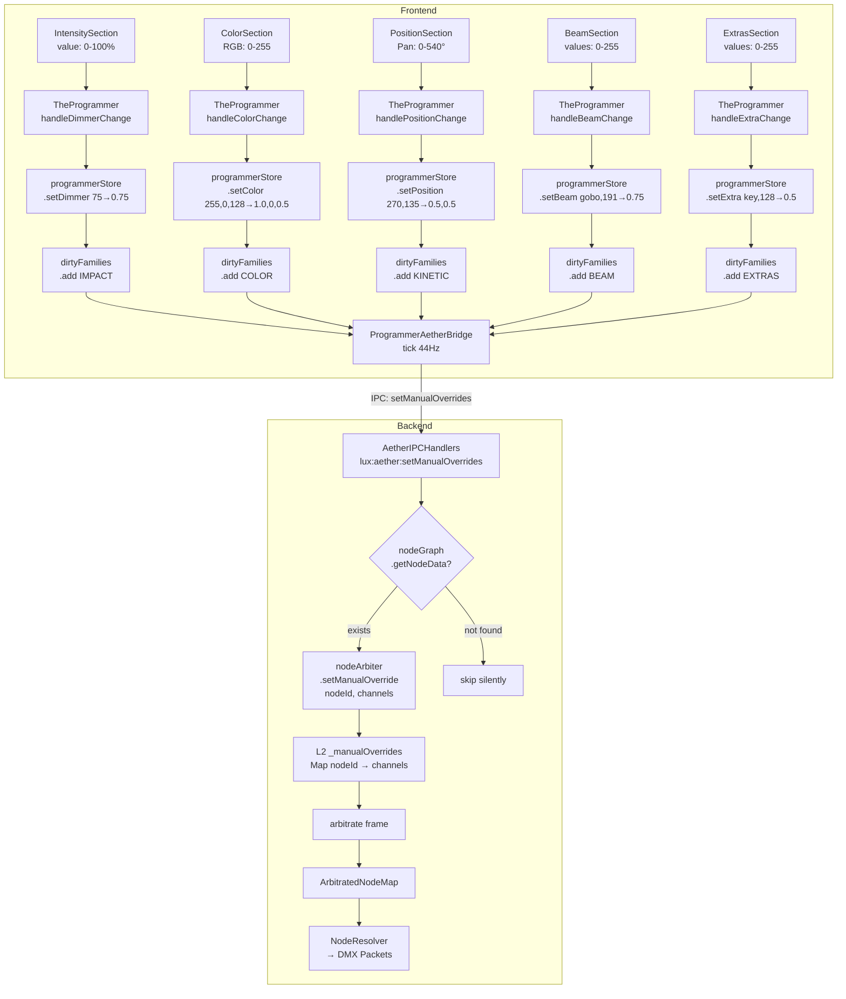

# WAVE 4529 — THE PROGRAMMER AETHER ADAPTER BLUEPRINT

> **Blueprint de Migración: TheProgrammer Legacy IPC → Aether L2 Native Intents**
> Estado: DISEÑO ARQUITECTÓNICO — PROHIBIDO ESCRIBIR CÓDIGO HASTA APROBACIÓN
> Autores: Lead UI Architect (PunkOpus) + Radwulf

---

## 0. AUDITORÍA DEL ESTADO LEGACY

### 0.1 Superficie de ataque: Archivos involucrados

| Archivo | Líneas | Responsabilidad | Problema Aether |
|---|---|---|---|
| `TheProgrammer.tsx` | 446 | Orquestador: dimmer, strobe, color, limit. Tabs CONTROLS/GROUPS. Calls `window.lux.arbiter.setManual()` | Valores DMX (0-255), nombres legacy (`red/green/blue`), `fixtureId` en vez de `nodeId` |
| `TheProgrammerContent.tsx` | 493 | Clon de TheProgrammer sin tabs (para StageSidebar) | Mismo problema, duplicado |
| `IntensitySection.tsx` | 266 | Slider dimmer 0-100%, strobe 0-100%, limit 0-100% | Valores humanos (%), pero convierte a DMX en TheProgrammer handler |
| `ColorSection.tsx` | 155 | RGB sliders 0-255, quick colors, preview | Valores DMX directos (0-255 RGB) |
| `PositionSection.tsx` | 829 | Pan/Tilt, patterns, fan, spatial target, calibration | Valores en grados (pan 0-540°, tilt 0-270°), convierte a DMX en handler |
| `BeamSection.tsx` | 329 | Gobo, prism, focus, zoom, iris — todos 0-255 | Valores DMX directos |
| `ExtrasSection.tsx` | 561 | Phantom channels (custom/unknown) — 0-255 | Valores DMX directos |
| `ArbiterIPCHandlers.ts` | 1058 | Backend IPC: `lux:arbiter:setManual`, `clearManual`, color translation, wildcard expansion | Construye `Layer2_Manual` para `masterArbiter.setManualOverride()` — **LEGACY arbiter, no Aether** |

### 0.2 El flujo legacy actual

```
┌─────────────────────┐
│  TheProgrammer.tsx   │
│  currentDimmer = 75  │  ← UI state (0-100%)
│                      │
│  handleDimmerChange: │
│    DMX = 75 * 2.55   │  ← Conversión a DMX inline
│    = 191             │
└──────────┬───────────┘
           │ IPC: window.lux.arbiter.setManual({
           │   fixtureIds: ['fix-01'],
           │   controls: { dimmer: 191 },
           │   channels: ['dimmer'],
           │ })
           ▼
┌─────────────────────────┐
│  ArbiterIPCHandlers.ts  │
│                         │
│  • Wildcard expansion   │
│  • Color translation    │  ← RGB → color_wheel si el fixture es de rueda
│  • Build Layer2_Manual  │
│  • masterArbiter        │  ← LEGACY ArbitrationDirector
│    .setManualOverride() │
└─────────────────────────┘
```

### 0.3 Problemas identificados

| # | Problema | Detalle |
|---|----------|---------|
| P1 | **Valores DMX en el frontend** | `Math.round(value * 2.55)` en handlers de TheProgrammer. El frontend no debería saber qué es DMX. |
| P2 | **fixtureId ≠ nodeId** | El frontend envía `fixtureIds: ['fix-01']`. Aether necesita `nodeId: 'fix-01:impact'`, `'fix-01:color'`, etc. |
| P3 | **Nombres de canal legacy** | `red`, `green`, `blue`, `dimmer`, `strobe` — coinciden con Aether `AetherChannelType`, pero `pan`/`tilt` son valores DMX (0-255), no normalizados (0-1). |
| P4 | **Color translation en backend** | `ArbiterIPCHandlers` hace RGB → ColorWheel para fixtures de rueda. En Aether, el `ColorSystem` o el `NodeResolver` manejarían esto. |
| P5 | **Sin throttle** | Los handlers se ejecutan en cada `onChange` del slider (mouse drag = ~60-120 eventos/segundo). El backend actual los absorbe pero Aether tiene tick rate de 44Hz. |
| P6 | **Estado local disperso** | `currentDimmer`, `currentStrobe`, `currentColor`, `currentLimit` viven en `useState` locales. No hay store centralizado. Cada sección tiene su propio override tracking. |
| P7 | **Duplicación TheProgrammer / TheProgrammerContent** | Dos componentes casi idénticos (446 + 493 líneas). Los handlers se duplican. |
| P8 | **PositionSection maneja DMX internamente** | `panDmx = Math.round((safePan / 540) * 255)`. El pan debería ser normalizado (0-1), no DMX. |

---

## 1. VISIÓN ARQUITECTÓNICA

### 1.1 El principio

> **"The Programmer habla en intenciones humanas. El puente traduce a Aether. Nadie más."**

- La UI dice: "dimmer al 75%" → `{ dimmer: 0.75 }`
- La UI dice: "color RGB(255, 0, 128)" → `{ red: 1.0, green: 0, blue: 0.502 }`
- La UI dice: "pan a 270°" → `{ pan: 0.5 }` (270/540 = 0.5)

La traducción vive en **un solo lugar**: el `ProgrammerAetherBridge`.

### 1.2 Diagrama target

```
┌─────────────────────┐    ┌─────────────────────┐
│  TheProgrammer.tsx   │    │  programmerStore     │  ← NUEVO Zustand store
│  (sin cambios UI)    │───▶│  (estado centralizado│
│                      │    │   + dirty tracking)  │
└──────────────────────┘    └──────────┬───────────┘
                                       │
                            ┌──────────▼───────────┐
                            │ ProgrammerAetherBridge│  ← NUEVO
                            │ (throttle 44Hz)       │
                            │                       │
                            │ • fixtureId → nodeId  │
                            │ • UI values → 0-1     │
                            │ • batch per-fixture   │
                            │ • dirty-flag flush    │
                            └──────────┬───────────┘
                                       │ IPC: window.lux.aether
                                       │   .setManualOverrides(nodeIntents[])
                                       ▼
                            ┌───────────────────────┐
                            │ AetherIPCHandlers.ts   │  ← NUEVO IPC handler
                            │                        │
                            │ • Validate nodeIds     │
                            │ • Write to NodeArbiter │
                            │   ._manualOverrides    │
                            │   (L2 direct)          │
                            └───────────────────────┘
```

---

## 2. EL PROGRAMMER STORE (Estado centralizado)

### 2.1 Justificación

El estado actual está disperso en `useState` locales: `currentDimmer`, `currentColor`, etc. Esto causa:
- Duplicación entre `TheProgrammer.tsx` y `TheProgrammerContent.tsx`.
- Imposibilidad de leer el estado desde otros componentes.
- Re-render innecesarios al cambiar selección (el estado no se limpia atómicamente).
- No hay forma de batch-send los cambios de un frame.

**Decisión**: Centralizar en un `programmerStore` (Zustand). Ambos componentes lo consumen. El bridge lo subscribe.

### 2.2 Interfaz del store

```typescript
// stores/programmerStore.ts

interface ProgrammerOverrides {
  // IMPACT family
  dimmer: number | null       // 0-1 normalizado, null = sin override
  strobe: number | null       // 0-1 normalizado
  shutter: number | null      // 0-1 normalizado

  // COLOR family
  red: number | null          // 0-1 normalizado
  green: number | null        // 0-1 normalizado
  blue: number | null         // 0-1 normalizado
  white: number | null        // 0-1 normalizado
  amber: number | null        // 0-1 normalizado

  // KINETIC family
  pan: number | null          // 0-1 normalizado (0 = 0°, 1 = maxPan°)
  tilt: number | null         // 0-1 normalizado (0 = 0°, 1 = maxTilt°)
  speed: number | null        // 0-1 normalizado

  // BEAM family
  gobo: number | null         // 0-1 normalizado
  prism: number | null        // 0-1 normalizado
  focus: number | null        // 0-1 normalizado
  zoom: number | null         // 0-1 normalizado
  iris: number | null         // 0-1 normalizado

  // EXTRAS (phantom channels)
  extras: Map<string, number> // channelKey → 0-1 normalizado
}

interface ProgrammerState {
  /** Overrides per fixture (sparse: only fixtures with active overrides) */
  fixtureOverrides: Map<string, ProgrammerOverrides>

  /** Which families have dirty changes since last flush */
  dirtyFamilies: Set<'IMPACT' | 'COLOR' | 'KINETIC' | 'BEAM' | 'EXTRAS'>

  /** UI display values (human-readable, NOT normalized) */
  displayDimmer: number       // 0-100 (%)
  displayStrobe: number       // 0-100 (%)
  displayColor: { r: number; g: number; b: number }  // 0-255 each
  displayLimit: number        // 0-100 (%)

  /** Override tracking (for UI glow indicators) */
  overrideState: {
    dimmer: boolean
    strobe: boolean
    color: boolean
    position: boolean
    beam: boolean
    extras: boolean
  }

  /** Selected fixture IDs (shadow of selectionStore for convenience) */
  activeFixtureIds: string[]
}

interface ProgrammerActions {
  /** Set dimmer for all active fixtures (value 0-100%) */
  setDimmer: (percent: number) => void

  /** Set strobe for all active fixtures (value 0-100%) */
  setStrobe: (percent: number) => void

  /** Set color for all active fixtures (RGB 0-255) */
  setColor: (r: number, g: number, b: number) => void

  /** Set position for all active fixtures (pan 0-540°, tilt 0-270°) */
  setPosition: (pan: number, tilt: number) => void

  /** Set beam parameter for active fixtures (value 0-255) */
  setBeam: (channel: 'gobo' | 'prism' | 'focus' | 'zoom' | 'iris', value: number) => void

  /** Set phantom/extra channel (value 0-255) */
  setExtra: (channelKey: string, value: number) => void

  /** Release a specific family */
  releaseFamily: (family: 'IMPACT' | 'COLOR' | 'KINETIC' | 'BEAM' | 'EXTRAS') => void

  /** Release ALL overrides (UNLOCK ALL) */
  releaseAll: () => void

  /** Sync selection from selectionStore */
  syncSelection: (fixtureIds: string[]) => void

  /** Consume dirty flags (called by bridge after flush) */
  consumeDirty: () => void
}
```

### 2.3 Normalización dentro del store

Los setters normalizan INTERNAMENTE:

```typescript
setDimmer: (percent) => {
  const normalized = percent / 100  // 0-100 → 0-1
  set(state => {
    for (const fid of state.activeFixtureIds) {
      let ov = state.fixtureOverrides.get(fid) || createEmptyOverrides()
      ov.dimmer = normalized
      state.fixtureOverrides.set(fid, ov)
    }
    state.displayDimmer = percent
    state.overrideState.dimmer = true
    state.dirtyFamilies.add('IMPACT')
  })
}

setColor: (r, g, b) => {
  const nr = r / 255  // 0-255 → 0-1
  const ng = g / 255
  const nb = b / 255
  set(state => {
    for (const fid of state.activeFixtureIds) {
      let ov = state.fixtureOverrides.get(fid) || createEmptyOverrides()
      ov.red = nr
      ov.green = ng
      ov.blue = nb
      state.fixtureOverrides.set(fid, ov)
    }
    state.displayColor = { r, g, b }
    state.overrideState.color = true
    state.dirtyFamilies.add('COLOR')
  })
}

setPosition: (pan, tilt) => {
  const normPan = pan / 540    // 0-540° → 0-1
  const normTilt = tilt / 270  // 0-270° → 0-1
  set(state => {
    for (const fid of state.activeFixtureIds) {
      let ov = state.fixtureOverrides.get(fid) || createEmptyOverrides()
      ov.pan = normPan
      ov.tilt = normTilt
      state.fixtureOverrides.set(fid, ov)
    }
    state.dirtyFamilies.add('KINETIC')
    state.overrideState.position = true
  })
}

setBeam: (channel, value) => {
  const normalized = value / 255  // 0-255 → 0-1
  set(state => {
    for (const fid of state.activeFixtureIds) {
      let ov = state.fixtureOverrides.get(fid) || createEmptyOverrides()
      ov[channel] = normalized
      state.fixtureOverrides.set(fid, ov)
    }
    state.dirtyFamilies.add('BEAM')
    state.overrideState.beam = true
  })
}
```

### 2.4 La UI NO cambia (casi)

Los componentes `IntensitySection`, `ColorSection`, etc. siguen recibiendo las mismas props (value 0-100, color 0-255, etc.). Solo cambia QUIÉN las proporciona:

```
ANTES: TheProgrammer.tsx (useState + inline handler con DMX conversion + IPC call)
AHORA: TheProgrammer.tsx (programmerStore.displayDimmer + programmerStore.setDimmer)
```

Los hijos no necesitan modificación. Solo los handlers del padre cambian.

---

## 3. EL PUENTE IPC: ProgrammerAetherBridge

### 3.1 Responsabilidad

El bridge es un **singleton de frontend** que:
1. Se subscriba al `programmerStore` vía Zustand `subscribe`.
2. En cada tick (throttled a 44Hz), lee los `dirtyFamilies`.
3. Construye los `NodeIntent`-like objects necesarios.
4. Los envía al backend vía `window.lux.aether.setManualOverrides()`.
5. Marca las familias como limpias (`consumeDirty()`).

### 3.2 Throttle: El latido de 44Hz

```typescript
// ProgrammerAetherBridge.ts

class ProgrammerAetherBridge {
  private _intervalId: ReturnType<typeof setInterval> | null = null
  private readonly TICK_INTERVAL_MS = 1000 / 44  // ≈ 22.7ms

  start() {
    if (this._intervalId) return
    this._intervalId = setInterval(() => this._flush(), this.TICK_INTERVAL_MS)
  }

  stop() {
    if (this._intervalId) {
      clearInterval(this._intervalId)
      this._intervalId = null
    }
  }

  private _flush() {
    const state = useProgrammerStore.getState()
    if (state.dirtyFamilies.size === 0) return  // Nothing changed → skip

    const intents = this._buildIntents(state)
    if (intents.length === 0) return

    // Fire-and-forget IPC (no await — bridge runs in its own tick)
    window.lux?.aether?.setManualOverrides(intents)
      .catch(err => console.error('[ProgrammerBridge] Flush error:', err))

    state.consumeDirty()
  }
}
```

**¿Por qué `setInterval` en vez de `requestAnimationFrame`?**
- `rAF` se sincroniza con el display (60Hz tipicamente) y se pausa cuando la pestaña está en background.
- El Programmer envía control de luces — debe funcionar incluso si la pestaña pierde foco.
- `setInterval` a 44Hz produce ~44 flushes/segundo, alineado con el tick rate del Aether Orchestrator.

**¿Por qué no throttle por evento?**
- Con throttle por evento, el primer evento pasa inmediato pero los siguientes se agrupan. Esto causa latencia variable.
- Con tick fijo a 44Hz, la latencia máxima es constante: 22.7ms. El técnico no percibe la diferencia.

### 3.3 Construcción de intents: fixtureId → nodeId

El frontend tiene `fixtureId` (e.g. `'fix-01'`). Aether necesita `nodeId` con formato `<deviceId>:<familyLabel>`.

En el caso del Programmer, `deviceId === fixtureId` (la Forja registra el fixture con su ID como deviceId). Las family labels son:

| Familia | Label | Canales |
|---|---|---|
| IMPACT | `impact` | `dimmer`, `strobe`, `shutter` |
| COLOR | `color` (o `color-1`, `color-2` para multi-zone) | `red`, `green`, `blue`, `white`, `amber` |
| KINETIC | `kinetic` | `pan`, `tilt`, `speed` |
| BEAM | `beam` | `gobo`, `prism`, `focus`, `zoom`, `iris` |
| ATMOSPHERE | `atmosphere` | `custom` channels |

**Mapeo en el bridge:**

```typescript
private _buildIntents(state: ProgrammerState): ManualOverridePayload[] {
  const payloads: ManualOverridePayload[] = []

  for (const [fixtureId, overrides] of state.fixtureOverrides) {
    // IMPACT family
    if (state.dirtyFamilies.has('IMPACT')) {
      const channels: Record<string, number> = {}
      if (overrides.dimmer !== null) channels.dimmer = overrides.dimmer
      if (overrides.strobe !== null) channels.strobe = overrides.strobe
      if (overrides.shutter !== null) channels.shutter = overrides.shutter

      if (Object.keys(channels).length > 0) {
        payloads.push({
          nodeId: `${fixtureId}:impact`,
          channels,
        })
      }
    }

    // COLOR family
    if (state.dirtyFamilies.has('COLOR')) {
      const channels: Record<string, number> = {}
      if (overrides.red !== null) channels.red = overrides.red
      if (overrides.green !== null) channels.green = overrides.green
      if (overrides.blue !== null) channels.blue = overrides.blue
      if (overrides.white !== null) channels.white = overrides.white
      if (overrides.amber !== null) channels.amber = overrides.amber

      if (Object.keys(channels).length > 0) {
        payloads.push({
          nodeId: `${fixtureId}:color`,
          channels,
        })
      }
    }

    // KINETIC family
    if (state.dirtyFamilies.has('KINETIC')) {
      const channels: Record<string, number> = {}
      if (overrides.pan !== null) channels.pan = overrides.pan
      if (overrides.tilt !== null) channels.tilt = overrides.tilt
      if (overrides.speed !== null) channels.speed = overrides.speed

      if (Object.keys(channels).length > 0) {
        payloads.push({
          nodeId: `${fixtureId}:kinetic`,
          channels,
        })
      }
    }

    // BEAM family
    if (state.dirtyFamilies.has('BEAM')) {
      const channels: Record<string, number> = {}
      if (overrides.gobo !== null) channels.gobo = overrides.gobo
      if (overrides.prism !== null) channels.prism = overrides.prism
      if (overrides.focus !== null) channels.focus = overrides.focus
      if (overrides.zoom !== null) channels.zoom = overrides.zoom
      if (overrides.iris !== null) channels.iris = overrides.iris

      if (Object.keys(channels).length > 0) {
        payloads.push({
          nodeId: `${fixtureId}:beam`,
          channels,
        })
      }
    }

    // EXTRAS (phantom channels) — mapped to their original family or custom
    if (state.dirtyFamilies.has('EXTRAS')) {
      for (const [key, value] of overrides.extras) {
        // Extras go to the node that owns their channel
        // For custom channels, use a convention: `${fixtureId}:${key}` or
        // route through a lookup table built from NodeGraph
        payloads.push({
          nodeId: `${fixtureId}:${key}`,  // resolved via node registry
          channels: { [key]: value },
        })
      }
    }
  }

  return payloads
}
```

### 3.4 El contrato IPC: `window.lux.aether.setManualOverrides`

```typescript
// Payload que viaja por IPC (frontend → backend)
interface ManualOverridePayload {
  /** NodeId en formato Aether: "<fixtureId>:<familyLabel>" */
  nodeId: string
  /** Valores normalizados 0-1 por canal */
  channels: Record<string, number>
}

// window.lux.aether API (preload)
interface AetherPreloadAPI {
  /** Set manual overrides on L2 of the NodeArbiter */
  setManualOverrides: (payloads: ManualOverridePayload[]) => Promise<{ success: boolean }>

  /** Clear manual overrides for specific nodes */
  clearManualOverrides: (nodeIds: string[]) => Promise<{ success: boolean }>

  /** Clear ALL manual overrides (panic / UNLOCK ALL) */
  clearAllManualOverrides: () => Promise<{ success: boolean }>
}
```

### 3.5 Backend: AetherIPCHandlers

```typescript
// core/aether/AetherIPCHandlers.ts (NUEVO)

ipcMain.handle('lux:aether:setManualOverrides', (
  _event,
  payloads: ManualOverridePayload[]
) => {
  for (const { nodeId, channels } of payloads) {
    // Validación: ¿existe el nodo en el NodeGraph?
    if (!nodeGraph.getNodeData(nodeId)) {
      // Nodo no registrado — skip silenciosamente.
      // Esto ocurre si el fixture no tiene esa familia
      // (e.g. un PAR sin KINETIC_NODE).
      continue
    }

    // Escribir directamente en el NodeArbiter L2
    nodeArbiter.setManualOverride(nodeId, channels)
  }

  return { success: true }
})

ipcMain.handle('lux:aether:clearManualOverrides', (
  _event,
  nodeIds: string[]
) => {
  for (const nodeId of nodeIds) {
    nodeArbiter.clearManualOverride(nodeId)
  }
  return { success: true }
})

ipcMain.handle('lux:aether:clearAllManualOverrides', () => {
  // Acceder al mapa interno del NodeArbiter y limpiar todo L2
  // Necesita un método público: nodeArbiter.clearAllManualOverrides()
  nodeArbiter.clearAllManualOverrides()
  return { success: true }
})
```

**Nuevo método necesario en `NodeArbiter`:**

```typescript
// NodeArbiter.ts — Agregar:
clearAllManualOverrides(): void {
  this._manualOverrides.clear()
}
```

---

## 4. UNLOCK ALL: Arquitectura de liberación

### 4.1 Flujo actual

```
UNLOCK ALL button → handleUnlockAll()
  → window.lux.arbiter.clearManual({ fixtureIds: selectedIds })
  → ArbiterIPCHandlers: masterArbiter.releaseManualOverride(fixtureId)
```

### 4.2 Flujo Aether

```
UNLOCK ALL button → programmerStore.releaseAll()
  → Clear all fixtureOverrides in store
  → Set all overrideState to false
  → Mark ALL families as dirty

ProgrammerAetherBridge._flush() detects dirty + empty overrides
  → Calls window.lux.aether.clearAllManualOverrides()
  → Backend: nodeArbiter.clearAllManualOverrides()
  → L2 map is empty → L0/L1/L3 traffic flows through unimpeded
```

### 4.3 Comportamiento esperado

- Todos los fixtures vuelven inmediatamente al control del bus del sistema (Selene IA, Systems base, Chronos, Hephaestus).
- No hay crossfade (la liberación es instantánea en el NodeArbiter — es un `Map.clear()`).
- Si se desea crossfade, se implementa como extensión futura en el bridge (enviar un fadeout de N frames antes de clear).

### 4.4 Release por familia

```
Release Dimmer button → programmerStore.releaseFamily('IMPACT')
  → Para cada fixture: overrides.dimmer = null, overrides.strobe = null, overrides.shutter = null
  → Mark IMPACT as dirty

Bridge._flush():
  → Para cada fixture sin canales IMPACT activos:
    → window.lux.aether.clearManualOverrides(['fix-01:impact', 'fix-02:impact', ...])
  → nodeArbiter.clearManualOverride('fix-01:impact')
```

---

## 5. THROTTLE DETALLADO: ¿POR QUÉ 44Hz?

### 5.1 El problema

Un slider `<input type="range">` en `onChange` emite un evento por cada pixel de movimiento del cursor. Con un slider de 300px de ancho:
- Arrastre rápido: ~300 eventos en ~500ms = **600 eventos/segundo**.
- Arrastre lento: ~300 eventos en ~3s = **100 eventos/segundo**.

Sin throttle, cada evento ejecuta un IPC call (`ipcRenderer.invoke()` es async, pero el backend procesa todos en cola).

### 5.2 La solución: Dirty-flag + tick fijo

```
Frame N:  slider onChange → store.setDimmer(50)  → dirtyFamilies.add('IMPACT')
Frame N+1: slider onChange → store.setDimmer(52)  → dirtyFamilies already has IMPACT
Frame N+2: slider onChange → store.setDimmer(54)  → dirtyFamilies already has IMPACT
...
Tick 44Hz: bridge._flush() → reads dimmer=54 → sends ONE IPC call → consumeDirty()
Frame N+10: slider onChange → store.setDimmer(56) → dirtyFamilies.add('IMPACT')
...
Tick 44Hz: bridge._flush() → reads dimmer=56 → sends ONE IPC call
```

**Resultado**: Máximo 44 IPC calls/segundo independientemente de la velocidad del slider. Coincide con el tick rate del TitanOrchestrator, así que el NodeArbiter nunca procesa datos obsoletos.

### 5.3 Latencia percibida

- Latencia máxima: 22.7ms (1 tick completo perdido).
- Latencia mínima: ~0ms (evento justo antes del tick).
- Latencia promedio: ~11ms.

El ojo humano distingue cambios de luz a partir de ~30ms. El técnico NO percibe la diferencia entre "envío inmediato" y "envío en 11ms".

### 5.4 Diagrama temporal

```
tiempo → ─────────────────────────────────────────────
UI events: │  D  D  D  D  │  D  D  │  │  │  C  C  │
tick 44Hz:  ────────────┼─────────────┼─────────────┼───
IPC calls:              ↑             ↑             ↑
                   flush(D=54)   flush(D=62)   flush(C=r:200)
```

---

## 6. MAPEO DE HANDLERS: ANTES → DESPUÉS

### 6.1 handleDimmerChange

```
ANTES (TheProgrammer.tsx:112-129):
  const handleDimmerChange = async (value: number) => {
    setCurrentDimmer(value)                              // UI state
    setOverrideState(prev => ({ ...prev, dimmer: true }))
    await window.lux?.arbiter?.setManual({
      fixtureIds: selectedIds,
      controls: { dimmer: Math.round(value * 2.55) },   // ← DMX conversion
      channels: ['dimmer'],
    })
  }

DESPUÉS:
  const handleDimmerChange = (value: number) => {
    programmerStore.setDimmer(value)  // Store normaliza (÷100) y marca dirty
  }
  // Bridge se encarga de flush a 44Hz. No hay IPC call aquí.
```

### 6.2 handleColorChange

```
ANTES (TheProgrammer.tsx:221-238):
  const handleColorChange = async (r: number, g: number, b: number) => {
    setCurrentColor({ r, g, b })
    setOverrideState(prev => ({ ...prev, color: true }))
    await window.lux?.arbiter?.setManual({
      fixtureIds: selectedIds,
      controls: { red: r, green: g, blue: b },          // ← DMX values directos
      channels: ['red', 'green', 'blue'],
    })
  }

DESPUÉS:
  const handleColorChange = (r: number, g: number, b: number) => {
    programmerStore.setColor(r, g, b)  // Store normaliza (÷255) y marca dirty
  }
```

### 6.3 handlePositionChange (PositionSection)

```
ANTES (PositionSection.tsx:248-317):
  const handlePositionChange = async (newPan: number, newTilt: number) => {
    const safePan = clamp(newPan, 0, 513)
    const safeTilt = clamp(newTilt, 0, 256)
    setPan(safePan)
    setTilt(safeTilt)
    onOverrideChange(true)

    const panDmx = Math.round((safePan / 540) * 255)    // ← DMX conversion
    const tiltDmx = Math.round((safeTilt / 270) * 255)

    await window.lux?.arbiter?.setManual({
      fixtureIds: selectedIds,
      controls: { pan: panDmx, tilt: tiltDmx },
      channels: ['pan', 'tilt'],
    })
  }

DESPUÉS:
  const handlePositionChange = (newPan: number, newTilt: number) => {
    const safePan = clamp(newPan, 0, 513)
    const safeTilt = clamp(newTilt, 0, 256)
    setPan(safePan)     // UI local state for XYPad display
    setTilt(safeTilt)
    programmerStore.setPosition(safePan, safeTilt)
    // Store normaliza (÷540, ÷270) y marca dirty KINETIC
  }
```

### 6.4 handleUnlockAll

```
ANTES (TheProgrammer.tsx:262-275):
  const handleUnlockAll = async () => {
    setOverrideState({ dimmer: false, strobe: false, color: false, position: false, beam: false, extras: false })
    await window.lux?.arbiter?.clearManual({ fixtureIds: selectedIds })
  }

DESPUÉS:
  const handleUnlockAll = () => {
    programmerStore.releaseAll()
    // Bridge detects empty overrides on next tick → sends clearAllManualOverrides()
  }
```

### 6.5 Beam handlers (BeamSection)

```
ANTES (BeamSection.tsx:79-91):
  const sendBeamValues = async (values: Record<string, number>, channels: string[]) => {
    onOverrideChange(true)
    await window.lux?.arbiter?.setManual({
      fixtureIds: selectedIds,
      controls: values,        // ← DMX values (0-255)
      channels,
    })
  }

DESPUÉS:
  // BeamSection recibe a callback that calls:
  const handleBeamChange = (channel: string, value: number) => {
    programmerStore.setBeam(channel as any, value)  // Store normaliza (÷255)
  }
```

### 6.6 Extras/Phantom handlers (ExtrasSection)

```
ANTES (ExtrasSection.tsx:370-402):
  const handleChannelChange = async (channelIndex: number, value: number, channelType: string, channelLabel: string) => {
    operatorSetRef.current.add(channelIndex)
    setChannelValues(...)
    onOverrideChange(true)
    await window.lux?.arbiter?.setManual({
      fixtureIds: selectedIds,
      controls: controlsPayload,    // ← DMX values
      channels: channelsPayload,
    })
  }

DESPUÉS:
  const handleChannelChange = (channelKey: string, value: number) => {
    programmerStore.setExtra(channelKey, value)  // Store normaliza (÷255)
  }
```

---

## 7. COLOR TRANSLATION: ¿QUIÉN LO HACE?

### 7.1 Problema

Actualmente, `ArbiterIPCHandlers.ts` hace RGB → ColorWheel translation per-fixture antes de aplicar el override. Esto es lógica de negocio en el IPC layer.

### 7.2 Decisión: El NodeResolver lo maneja

En Aether, el Programmer siempre envía `{ red: 0.8, green: 0.2, blue: 0.6 }` al nodo `fix-01:color`. Dos escenarios:

**A) Fixture con RGB LEDs**
- El `COLOR_NODE` tiene canales `red`, `green`, `blue`.
- El NodeResolver escribe los valores directamente en los canales DMX correspondientes.
- No hay traducción.

**B) Fixture con rueda de colores**
- El `COLOR_NODE` tiene `colorMixingType: 'wheel'` y un `colorWheel: ColorWheelDefinition`.
- El NodeResolver (o un ColorTranslation step integrado en el resolve pipeline) traduce el RGB target al slot de rueda más cercano.
- El Programmer NO necesita saber nada de esto.

**Ventaja**: El Programmer es agnóstico al tipo de fixture. Siempre envía RGB normalizado. La traducción vive en el backend, donde tiene acceso al perfil completo del fixture.

### 7.3 Fallback legacy

Durante la migración gradual (coexistencia con ArbitrationDirector), el bridge puede detectar si un fixture está registrado en Aether o no:

```typescript
// ProgrammerAetherBridge._flush():
const aetherFixtures = new Set(/* obtener del NodeGraph */)

for (const [fixtureId, overrides] of state.fixtureOverrides) {
  if (aetherFixtures.has(fixtureId)) {
    // → Send to Aether L2 via nodeArbiter.setManualOverride()
  } else {
    // → Fallback to legacy: window.lux.arbiter.setManual()
  }
}
```

Esto permite migración fixture-a-fixture sin romper el show.

---

## 8. POSITION SECTION: CASOS ESPECIALES

### 8.1 Patterns (circle, eight, sweep)

Los patterns de movimiento actualmente se envían vía `window.lux.arbiter.setManualFixturePattern()`. Esto es un comando de alto nivel que el `MasterArbiter` interpreta para generar movimiento continuo.

**En Aether**: Los patterns de movimiento deberían ser responsabilidad del `KineticSystem` o de un adapter dedicado. El Programmer no genera frames de movimiento — solo dice "quiero un circle con speed=50% y size=50%".

**Decisión**: Los pattern commands se envían a un IPC separado que el `KineticSystem` o un `ManualPatternAdapter` consume:

```typescript
// Nuevo IPC:
window.lux.aether.setManualPattern({
  fixtureIds: string[],
  pattern: 'hold' | 'circle' | 'eight' | 'sweep' | null,
  speed: number,      // 0-1 normalizado
  amplitude: number,  // 0-1 normalizado
})
```

El backend traduce esto a intents KINETIC que se inyectan en L2 via el `ManualPatternAdapter`, que genera pan/tilt frames per-tick basándose en el patrón seleccionado.

### 8.2 Spatial Target (WAVE 2613)

`handleSpatialTargetChange()` envía `Target3D {x, y, z}` al backend, que resuelve IK para cada fixture. Esto es diferente de un override directo — es un **comando de intención espacial**.

**En Aether**: Se envía vía IPC dedicado:

```typescript
window.lux.aether.applySpatialTarget({
  target: Target3D,
  fixtureIds: string[],
  fanMode: 'converge' | 'line' | 'circle',
  fanAmplitude: number,
})
```

El backend (un `SpatialTargetResolver` o el `KineticSystem` directamente) calcula pan/tilt para cada fixture usando IK y escribe los resultados como L2 overrides en el `NodeArbiter`.

### 8.3 Formation Mode (multi-fixture pan/tilt con fan)

En formation mode, cada fixture recibe un pan/tilt diferente (offset por fan spread). Actualmente esto se hace en el frontend con un loop que envía N IPC calls (una por fixture).

**En Aether**: El `programmerStore` ya almacena overrides per-fixture. El bridge envía un array de payloads con los nodeIds correctos. Un solo IPC call con N payloads:

```typescript
window.lux.aether.setManualOverrides([
  { nodeId: 'fix-01:kinetic', channels: { pan: 0.42, tilt: 0.55 } },
  { nodeId: 'fix-02:kinetic', channels: { pan: 0.50, tilt: 0.55 } },
  { nodeId: 'fix-03:kinetic', channels: { pan: 0.58, tilt: 0.55 } },
])
```

Esto reduce N IPC calls a 1.

---

## 9. INHIBIT LIMIT (WAVE 3270)

### 9.1 Estado actual

`handleLimitChange()` llama `window.lux.arbiter.setInhibitLimit(selectedIds, value / 100)`. Esto es un concepto del ArbitrationDirector legacy.

### 9.2 En Aether

El inhibit limit es semánticamente un **Grand Master per-fixture**. En el modelo Aether, esto debería implementarse como un multiplicador post-arbitraje en el `NodeResolver` o como un override L2 sobre el canal `dimmer` con un valor clamp.

**Opción A** (recomendada): Tratar el limit como un modificador del canal `dimmer` del IMPACT_NODE. Si el usuario pone limit=50%, el override L2 para dimmer se escala:

```typescript
// En el bridge, al construir el intent para IMPACT:
if (state.displayLimit < 100) {
  const limitFactor = state.displayLimit / 100
  channels.dimmer = (overrides.dimmer ?? 1.0) * limitFactor
}
```

**Opción B**: Crear un API dedicado en el NodeArbiter para per-node intensity caps (post-merge). Esto es más limpio pero requiere un cambio en el Arbiter.

**Decisión**: Opción A para la migración inicial (zero cambios en Arbiter). Opción B como refinamiento futuro.

---

## 10. EXTENSIONES AL NodeArbiter

### 10.1 Método `clearAllManualOverrides`

```typescript
// NodeArbiter.ts — NUEVO MÉTODO:
clearAllManualOverrides(): void {
  this._manualOverrides.clear()
}
```

### 10.2 Método `getManualOverrideNodeIds` (debug/telemetry)

```typescript
// NodeArbiter.ts — NUEVO MÉTODO (optional):
getManualOverrideNodeIds(): readonly NodeId[] {
  return [...this._manualOverrides.keys()]
}
```

### 10.3 L2 priority en arbitrate()

Confirmar que L2 se aplica DESPUÉS de L3 en el `arbitrate()` pipeline. Actualmente:

```
L0 (Systems) → L1 (Selene) → LP (Playback) → L3 (Effects) → L3+ (Hephaestus) → L2 (Manual)
```

Esto es **correcto**: L2 (Manual) tiene la prioridad más alta después de L4 (Blackout). El técnico siempre gana sobre la IA y los efectos.

---

## 11. MIGRACIÓN GRADUAL: COEXISTENCIA

### 11.1 Fase 1: Dual path

```
ProgrammerAetherBridge:
  if (fixture registered in Aether NodeGraph) {
    → Send to Aether L2
  } else {
    → Fallback to legacy: window.lux.arbiter.setManual()
  }
```

### 11.2 Fase 2: Aether-only

Cuando TODOS los fixtures están registrados en el NodeGraph:
- Eliminar el fallback legacy.
- Eliminar `ArbiterIPCHandlers.ts` handlers `setManual`/`clearManual`.
- Eliminar el color translation en el IPC layer.

### 11.3 Fase 3: Cleanup

- Eliminar `TheProgrammerContent.tsx` (duplicado).
- Hacer que `StageSidebar` consuma `TheProgrammer` directamente.
- Eliminar los `useState` locales de handlers.
- Los componentes hijos solo leen de `programmerStore`.

---

## 12. PRELOAD BRIDGE: window.lux.aether

### 12.1 Definición del API (preload.ts)

```typescript
// preload.ts — Añadir al contextBridge:
aether: {
  setManualOverrides: (payloads: ManualOverridePayload[]) =>
    ipcRenderer.invoke('lux:aether:setManualOverrides', payloads),

  clearManualOverrides: (nodeIds: string[]) =>
    ipcRenderer.invoke('lux:aether:clearManualOverrides', nodeIds),

  clearAllManualOverrides: () =>
    ipcRenderer.invoke('lux:aether:clearAllManualOverrides'),

  setManualPattern: (params: ManualPatternParams) =>
    ipcRenderer.invoke('lux:aether:setManualPattern', params),

  applySpatialTarget: (params: SpatialTargetParams) =>
    ipcRenderer.invoke('lux:aether:applySpatialTarget', params),

  releaseSpatialTarget: (params: { fixtureIds: string[] }) =>
    ipcRenderer.invoke('lux:aether:releaseSpatialTarget', params),
}
```

### 12.2 TypeScript types (window.d.ts)

```typescript
// types/window.d.ts — Añadir:
interface LuxAetherAPI {
  setManualOverrides: (payloads: ManualOverridePayload[]) => Promise<{ success: boolean }>
  clearManualOverrides: (nodeIds: string[]) => Promise<{ success: boolean }>
  clearAllManualOverrides: () => Promise<{ success: boolean }>
  setManualPattern: (params: ManualPatternParams) => Promise<{ success: boolean }>
  applySpatialTarget: (params: SpatialTargetParams) => Promise<{ success: boolean; results?: Record<string, IKResult> }>
  releaseSpatialTarget: (params: { fixtureIds: string[] }) => Promise<{ success: boolean }>
}

interface Window {
  lux?: {
    arbiter?: ArbiterPreloadAPI     // LEGACY (fase 1-2)
    aether?: LuxAetherAPI           // NUEVO
  }
}
```

---

## 13. PLAN DE EJECUCIÓN

| Paso | Descripción | Complejidad | Dependencias |
|---|---|---|---|
| **E1** | Crear `programmerStore.ts` con estado centralizado + actions | 🟡 Medio | Ninguna |
| **E2** | Crear `ProgrammerAetherBridge.ts` con tick 44Hz + dirty flush | 🟡 Medio | E1 |
| **E3** | Añadir `clearAllManualOverrides()` al `NodeArbiter` | 🟢 Trivial | Ninguna |
| **E4** | Crear `AetherIPCHandlers.ts` con `setManualOverrides`, `clearManualOverrides`, `clearAllManualOverrides` | 🟢 Bajo | E3 |
| **E5** | Añadir `window.lux.aether` al preload bridge | 🟢 Bajo | E4 |
| **E6** | Refactorizar `TheProgrammer.tsx`: reemplazar `useState` + handlers con `programmerStore` calls | 🟡 Medio | E1 |
| **E7** | Refactorizar `PositionSection.tsx`: reemplazar DMX conversion + IPC con `programmerStore.setPosition()` | 🟡 Medio | E1 |
| **E8** | Refactorizar `BeamSection.tsx`: reemplazar `sendBeamValues()` con `programmerStore.setBeam()` | 🟢 Bajo | E1 |
| **E9** | Refactorizar `ExtrasSection.tsx`: reemplazar `handleChannelChange()` con `programmerStore.setExtra()` | 🟢 Bajo | E1 |
| **E10** | Implementar dual-path en bridge (Aether vs legacy fallback) | 🟡 Medio | E2, E5 |
| **E11** | Crear IPC handler para `setManualPattern` (KINETIC patterns) | 🟡 Medio | E4 |
| **E12** | Migrar `applySpatialTarget` a Aether IPC | 🟢 Bajo | E4 |
| **E13** | Eliminar `TheProgrammerContent.tsx` (duplicado) | 🟢 Trivial | E6 |
| **E14** | Eliminar handlers legacy de `ArbiterIPCHandlers.ts` (post-migración completa) | 🟢 Bajo | E10 verificado |

### Orden sugerido

```
Fase 1 — Infraestructura:    E1 → E3 → E4 → E5 → E2
Fase 2 — Frontend:           E6 → E7 → E8 → E9
Fase 3 — Integración:        E10 → E11 → E12
Fase 4 — Limpieza:           E13 → E14
```

---

## 14. DECISIONES ARQUITECTÓNICAS

| # | Decisión | Alternativa rechazada | Razón |
|---|----------|-----------------------|-------|
| D1 | Zustand `programmerStore` centralizado | `useState` disperso (actual) | Elimina duplicación, permite bridge subscription, estado atómico por fixture |
| D2 | Tick fijo 44Hz con dirty flags | Throttle por evento (`lodash.throttle`) | Latencia constante (~11ms avg), alineado con Aether tick rate, 1 IPC/tick máximo |
| D3 | Bridge como singleton de frontend | Bridge como middleware IPC | El bridge vive en el renderer process, consume el store directamente. Sin round-trip IPC para leer estado. |
| D4 | Normalización en el store (no en la UI ni en el backend) | Normalización en el IPC handler (actual) | Single point of truth para la conversión. La UI habla humano (%, °, 0-255). El store habla Aether (0-1). |
| D5 | Color translation en NodeResolver (no en IPC layer) | Color translation en el bridge (replicar lógica frontend) | El NodeResolver tiene acceso al perfil del fixture. El bridge no debería saber sobre ruedas de colores. |
| D6 | `setManualOverride(nodeId, channels)` directo en Arbiter | Construir `INodeIntent` completo con priority/confidence/source | L2 en el NodeArbiter ya es escritura directa sin merge strategy — no necesita el overhead de un intent struct. |
| D7 | Array batch de payloads por IPC (`ManualOverridePayload[]`) | Un IPC call por nodo por canal | Reduce IPC overhead de N*M calls a 1 call con N*M payloads. Crucial para formation mode (12 fixtures × 5 familias = 60 payloads en 1 call). |
| D8 | `fire-and-forget` IPC (no await en bridge) | `await` cada flush | El bridge no necesita la respuesta. Si falla, el siguiente tick lo reintentará con los mismos datos (dirty flags no se limpian si el IPC falla). |
| D9 | Patterns vía IPC dedicado (no como L2 overrides directos) | Patterns como secuencia de L2 pan/tilt overrides generados por el bridge | El bridge no debe generar frames de movimiento. Eso es responsabilidad del backend (KineticSystem o ManualPatternAdapter). |

---

## 15. RIESGOS Y MITIGACIONES

| Riesgo | Probabilidad | Impacto | Mitigación |
|--------|-------------|---------|------------|
| NodeId incorrecto (fixture no registrado en NodeGraph) | 🟡 Media | 🟢 Bajo | Backend ignora nodeIds desconocidos silenciosamente. Log en debug mode. |
| Tick de 44Hz no es suficiente para un slider | 🟢 Baja | 🟢 Bajo | 44Hz > 30Hz perceptual threshold. Verificado: los faders MIDI profesionales operan a 40Hz. |
| `setInterval` drift bajo carga CPU alta | 🟡 Media | 🟢 Bajo | Si un tick se retrasa, el siguiente compensará con datos más frescos. El sistema es eventual-consistent. |
| Migración gradual rompe formaciones (algunos fixtures en Aether, otros en legacy) | 🟡 Media | 🟡 Medio | El bridge envía overrides per-fixture. Si un fixture usa legacy y otro Aether, ambos reciben sus respectivos comandos. La formación se mantiene visualmente. |
| `programmerStore` se desincroniza con el backend al cambiar de selección | 🟢 Baja | 🟡 Medio | `syncSelection()` limpia overrides de fixtures deseleccionados. `releaseAll()` es atómico. |
| Position patterns (circle/eight) tienen latencia con el tick de 44Hz | 🟢 Baja | 🟢 Bajo | Los patterns no se generan en el bridge — el backend los ejecuta a su propio tick rate. El bridge solo envía el comando "start pattern X". |
| El `programmerStore` crece indefinidamente con fixtures que se eliminan | 🟢 Baja | 🟢 Bajo | `syncSelection()` limpia entries de fixtures no seleccionados. `releaseAll()` limpia todo. |

---

## 16. DIAGRAMA DE FLUJO DE DATOS COMPLETO



---

*Documento generado bajo directiva WAVE 4529 — THE PROGRAMMER AETHER ADAPTER*
*Blueprint completado. Sin código escrito. Listo para revisión del Cónclave.*
