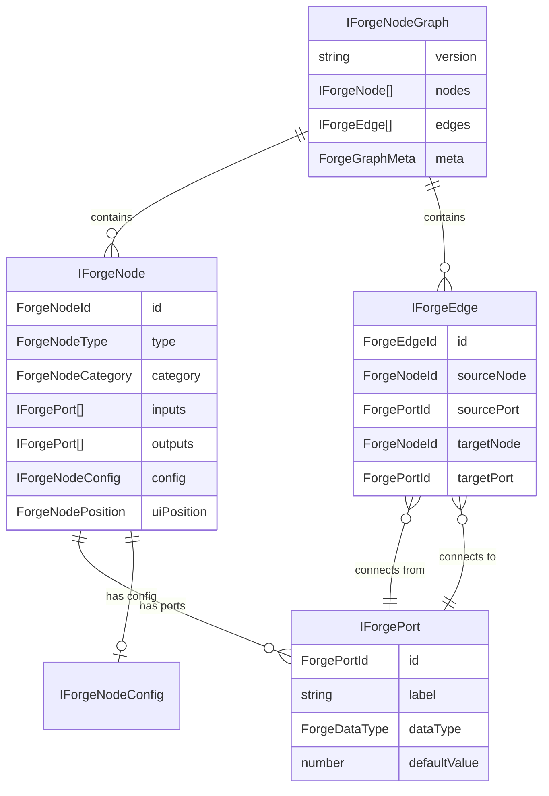
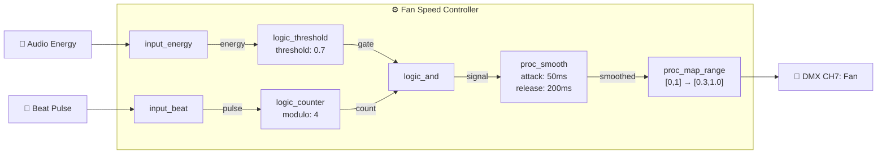
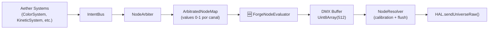
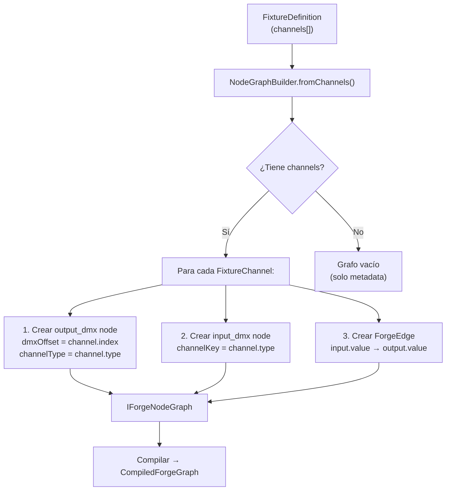
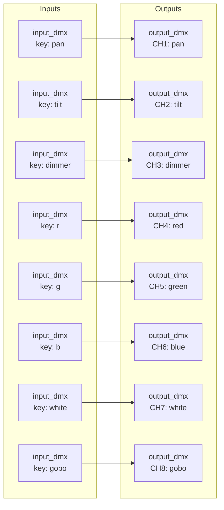
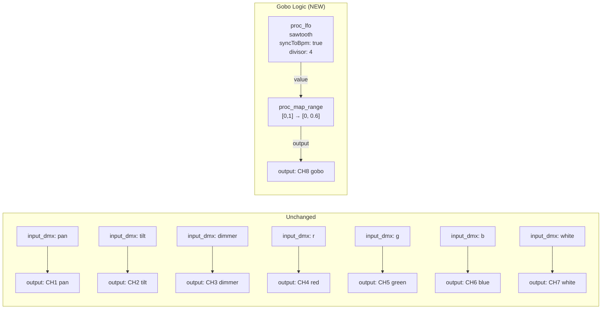

# WAVE 4548 — THE FORGE NODE BLUEPRINT

> **Refactorización de FixtureDefinition a Node Graph**
> Fecha: 2026-05-04 | Arquitecto: Cascade
> Estado: DISEÑO ARQUITECTÓNICO — PROHIBIDO ESCRIBIR CÓDIGO DE PRODUCCIÓN
> Prerequisito: AETHER-ARCH-AUDIT.md (WAVE 4547)
> Fases cubiertas: N1 (INodeGraph), N2 (NodeGraphBuilder), N3 (Dual-mode FixtureDefinition)

---

## 0. RESUMEN EJECUTIVO

El ADN actual de un fixture en LuxSync es un **array lineal indexado** (`FixtureChannel[]`). Cada slot del array mapea 1:1 a un offset DMX. Este modelo es incapaz de expresar:

- **LFOs internos** (un oscilador modulando la velocidad de un gobo)
- **Macros condicionales** (si energía > 0.7 Y beat % 4 === 0 → activar fan)
- **Subgraphs reutilizables** ("INGENIOS" — componentes lógicos empaquetados)
- **Feedback loops** (la salida de un nodo influye en la entrada de otro)

Este blueprint define la arquitectura para evolucionar de `FixtureChannel[]` a un **grafo de nodos evaluable** (`IForgeNodeGraph`), preservando **100% de backward compatibility** con las librerías existentes de `.json` y `.lux`.

### Nomenclatura

| Término | Significado |
|---------|-------------|
| **Aether NodeGraph** | El grafo de capacidad existente en `core/aether/NodeGraph.ts`. Gestiona CapabilityNodes a nivel de **show** (runtime, 44Hz). **NO se modifica.** |
| **Forge NodeGraph** | El **nuevo** grafo de nodos a nivel de **fixture definition** (design-time). Describe la lógica interna de un fixture. Es lo que este blueprint diseña. |
| **ForgeNode** | Un nodo dentro del Forge NodeGraph. Puede ser: Input, Process, Output, o Compound. |
| **ForgeEdge** | Una conexión entre un puerto de salida de un ForgeNode y un puerto de entrada de otro. |
| **ForgePort** | Un punto de conexión en un ForgeNode. Tiene dirección (in/out), tipo de dato, y un ID único dentro del nodo. |

---

## 1. EL MODELO DE DATOS: `IForgeNodeGraph`

### 1.1 Diagrama de Relaciones



### 1.2 Interfaces TypeScript

```typescript
// ═══════════════════════════════════════════════════════════════════════════
// IDENTITY TYPES
// ═══════════════════════════════════════════════════════════════════════════

/** ID único de un nodo dentro del grafo del fixture */
type ForgeNodeId = string    // e.g. "dimmer-out-1", "lfo-gobo-speed", "input-energy"

/** ID único de un puerto dentro de un nodo */
type ForgePortId = string    // e.g. "value", "trigger", "speed", "r", "g", "b"

/** ID único de una conexión */
type ForgeEdgeId = string    // e.g. "edge-001"

// ═══════════════════════════════════════════════════════════════════════════
// PORT — Punto de conexión atómico
// ═══════════════════════════════════════════════════════════════════════════

/** Tipos de dato que fluyen por los puertos */
type ForgeDataType = 
  | 'normalized'   // 0.0 – 1.0 (dimmer, color component, position)
  | 'dmx'          // 0 – 255 (raw DMX output)
  | 'boolean'      // 0.0 | 1.0 (gate open/closed)
  | 'frequency'    // Hz (LFO rate, BPM-derived)
  | 'angle'        // 0.0 – 1.0 representing 0° – 360° (phase)
  | 'unbounded'    // Any float (intermediate math results)

interface IForgePort {
  /** ID único dentro del nodo (e.g. "value", "r", "g", "b") */
  readonly id: ForgePortId
  /** Etiqueta para la UI */
  readonly label: string
  /** Tipo de dato que acepta/emite */
  readonly dataType: ForgeDataType
  /** Dirección: entrada o salida */
  readonly direction: 'in' | 'out'
  /** Valor por defecto cuando el puerto no está conectado */
  readonly defaultValue: number
  /**
   * ¿Es un puerto requerido? (solo para inputs)
   * Si true y no está conectado, el evaluador usa defaultValue.
   * Si false y no está conectado, el puerto se ignora en la evaluación.
   */
  readonly required?: boolean
}

// ═══════════════════════════════════════════════════════════════════════════
// NODE CATEGORIES & TYPES
// ═══════════════════════════════════════════════════════════════════════════

/**
 * Categoría funcional de un ForgeNode.
 * Determina dónde aparece en la paleta de la UI y cómo se evalúa.
 */
type ForgeNodeCategory =
  | 'input'      // Fuentes de dato (DMX input, audio band, beat, timer, constant)
  | 'process'    // Transformaciones matemáticas (math, LFO, smooth, map, delay)
  | 'logic'      // Lógica condicional (threshold, gate, switch, AND, OR)
  | 'output'     // Salida DMX física (dimmer, pan, tilt, red, green, blue, custom)
  | 'compound'   // Sub-graph empaquetado ("INGENIO")

/**
 * Tipo concreto de un ForgeNode.
 * Cada tipo tiene una firma de puertos fija (inputs/outputs predefinidos)
 * y una función de evaluación determinista.
 */
type ForgeNodeType =
  // ── INPUT NODES ──────────────────────────────────────────────────────
  | 'input_dmx'          // Recibe valor DMX del IntentBus (Aether L0-L3+)
  | 'input_audio_band'   // Recibe energía de una banda de frecuencia
  | 'input_beat'         // Emite pulso en cada beat (BPM-synced)
  | 'input_bpm'          // Emite BPM actual como valor normalizado
  | 'input_energy'       // Emite energía global RMS
  | 'input_constant'     // Emite un valor fijo configurable
  | 'input_time'         // Emite tiempo transcurrido (ms) como ramp
  // ── PROCESS NODES ────────────────────────────────────────────────────
  | 'proc_lfo'           // Oscilador (sine, triangle, saw, square, random)
  | 'proc_smooth'        // Suavizado exponencial (attack/release)
  | 'proc_map_range'     // Re-mapeo lineal de rango [a,b] → [c,d]
  | 'proc_math'          // Operación aritmética (add, multiply, subtract, divide)
  | 'proc_clamp'         // Clamp a [min, max]
  | 'proc_delay'         // Retardo temporal en frames (ring buffer)
  | 'proc_merge'         // Combina N inputs con estrategia (max, min, avg, sum)
  | 'proc_invert'        // 1.0 - input
  | 'proc_curve'         // Aplica TransferCurve (exponential, logarithmic, scurve)
  // ── LOGIC NODES ──────────────────────────────────────────────────────
  | 'logic_threshold'    // Si input > threshold → 1.0, sino → 0.0
  | 'logic_gate'         // Deja pasar signal solo si gate > 0.5
  | 'logic_switch'       // Selecciona entre input_a / input_b según selector
  | 'logic_and'          // Ambos inputs > 0.5 → 1.0
  | 'logic_or'           // Algún input > 0.5 → 1.0
  | 'logic_counter'      // Cuenta pulsos, resetea en N (modulo counter)
  // ── OUTPUT NODES ─────────────────────────────────────────────────────
  | 'output_dmx'         // Salida a canal DMX físico (el "slot" final)
  // ── COMPOUND NODES ───────────────────────────────────────────────────
  | 'compound_ingenio'   // Sub-graph empaquetado (ver §1.5)

// ═══════════════════════════════════════════════════════════════════════════
// NODE CONFIG — Datos internos configurables por tipo
// ═══════════════════════════════════════════════════════════════════════════

/**
 * Configuración interna de un ForgeNode.
 * Discriminated union por type.
 */
type IForgeNodeConfig =
  | IInputDmxConfig
  | IInputAudioBandConfig
  | IInputConstantConfig
  | IProcLfoConfig
  | IProcSmoothConfig
  | IProcMapRangeConfig
  | IProcMathConfig
  | IProcClampConfig
  | IProcDelayConfig
  | IProcMergeConfig
  | IProcCurveConfig
  | ILogicThresholdConfig
  | ILogicCounterConfig
  | ILogicSwitchConfig
  | IOutputDmxConfig
  | ICompoundIngenioConfig
  | IEmptyConfig       // Para nodos sin config (invert, and, or, gate, beat, etc.)

interface IInputDmxConfig {
  readonly nodeType: 'input_dmx'
  /** Canal Aether que este nodo lee del IntentBus. E.g. 'dimmer', 'pan', 'r' */
  readonly channelKey: string
}

interface IInputAudioBandConfig {
  readonly nodeType: 'input_audio_band'
  /** Banda de frecuencia: 'subBass' | 'bass' | 'mid' | 'highMid' | 'presence' | 'air' */
  readonly band: string
}

interface IInputConstantConfig {
  readonly nodeType: 'input_constant'
  /** Valor fijo emitido (0.0 – 1.0) */
  readonly value: number
}

interface IProcLfoConfig {
  readonly nodeType: 'proc_lfo'
  /** Forma de onda */
  readonly waveform: 'sine' | 'triangle' | 'sawtooth' | 'square' | 'random_hold'
  /** Frecuencia en Hz (si fijo) */
  readonly frequencyHz: number
  /** ¿Sincronizar al BPM? Si true, frequencyHz se ignora y se usa bpmDivisor */
  readonly syncToBpm: boolean
  /** Divisor de BPM (1 = cada beat, 2 = cada 2 beats, 0.5 = 2x por beat) */
  readonly bpmDivisor: number
  /** Fase inicial (0.0 – 1.0) */
  readonly phase: number
}

interface IProcSmoothConfig {
  readonly nodeType: 'proc_smooth'
  /** Tiempo de ataque en ms (transición hacia arriba) */
  readonly attackMs: number
  /** Tiempo de release en ms (transición hacia abajo) */
  readonly releaseMs: number
}

interface IProcMapRangeConfig {
  readonly nodeType: 'proc_map_range'
  readonly inputMin: number
  readonly inputMax: number
  readonly outputMin: number
  readonly outputMax: number
}

interface IProcMathConfig {
  readonly nodeType: 'proc_math'
  readonly operation: 'add' | 'subtract' | 'multiply' | 'divide' | 'modulo' | 'power'
}

interface IProcClampConfig {
  readonly nodeType: 'proc_clamp'
  readonly min: number
  readonly max: number
}

interface IProcDelayConfig {
  readonly nodeType: 'proc_delay'
  /** Retardo en frames (a 44Hz, 1 frame ≈ 22.7ms) */
  readonly delayFrames: number
}

interface IProcMergeConfig {
  readonly nodeType: 'proc_merge'
  readonly strategy: 'max' | 'min' | 'average' | 'sum'
}

interface IProcCurveConfig {
  readonly nodeType: 'proc_curve'
  readonly curveType: 'linear' | 'exponential' | 'logarithmic' | 'scurve' | 'gamma'
  readonly exponent?: number
  readonly gamma?: number
}

interface ILogicThresholdConfig {
  readonly nodeType: 'logic_threshold'
  readonly threshold: number  // 0.0 – 1.0
  readonly hysteresis: number // Dead zone para evitar oscilación (default: 0.05)
}

interface ILogicCounterConfig {
  readonly nodeType: 'logic_counter'
  readonly modulo: number     // Resetea al llegar a este valor
  readonly emitNormalized: boolean // true = emite count/modulo, false = emite count raw
}

interface ILogicSwitchConfig {
  readonly nodeType: 'logic_switch'
  readonly switchThreshold: number  // Si selector > threshold, usa input_b
}

interface IOutputDmxConfig {
  readonly nodeType: 'output_dmx'
  /** Tipo de canal DMX que este nodo produce */
  readonly channelType: ChannelType  // Reuses existing ChannelType from FixtureDefinition.ts
  /** Offset DMX relativo a la dirección base del Device (0-indexed) */
  readonly dmxOffset: number
  /** Nombre legible del canal (para canales custom) */
  readonly channelName?: string
  /** Default value DMX (0–255) cuando nada está conectado al input */
  readonly defaultDmxValue: number
  /** ¿Es canal de 16-bit? Si true, ocupa dmxOffset y dmxOffset+1 */
  readonly is16bit?: boolean
  /** ¿Rotación continua? (convención DMX: 0-127 CW, 128 stop, 129-255 CCW) */
  readonly continuousRotation?: boolean
}

interface ICompoundIngenioConfig {
  readonly nodeType: 'compound_ingenio'
  /** Nombre del INGENIO (e.g. "Fan Speed Controller", "Mirror Ball Sequence") */
  readonly ingenioName: string
  /** Sub-graph completo empaquetado como IForgeNodeGraph recursivo */
  readonly subGraph: IForgeNodeGraph
  /** Mapeo de puertos expuestos del INGENIO a nodos internos del sub-graph */
  readonly portMapping: {
    readonly inputs: ReadonlyArray<{
      readonly exposedPortId: ForgePortId
      readonly internalNodeId: ForgeNodeId
      readonly internalPortId: ForgePortId
    }>
    readonly outputs: ReadonlyArray<{
      readonly exposedPortId: ForgePortId
      readonly internalNodeId: ForgeNodeId
      readonly internalPortId: ForgePortId
    }>
  }
}

interface IEmptyConfig {
  readonly nodeType: 'empty'
}

// ═══════════════════════════════════════════════════════════════════════════
// FORGE NODE — El átomo del grafo
// ═══════════════════════════════════════════════════════════════════════════

interface IForgeNode {
  /** ID único dentro del grafo */
  readonly id: ForgeNodeId
  /** Tipo concreto del nodo (determina la función de evaluación) */
  readonly type: ForgeNodeType
  /** Categoría (para la UI: sección de la paleta) */
  readonly category: ForgeNodeCategory
  /** Puertos de entrada */
  readonly inputs: readonly IForgePort[]
  /** Puertos de salida */
  readonly outputs: readonly IForgePort[]
  /** Configuración interna del nodo */
  readonly config: IForgeNodeConfig
  /** Posición en el canvas de la UI (píxeles). Solo para rendering, no afecta evaluación. */
  readonly uiPosition: { readonly x: number; readonly y: number }
  /** Etiqueta legible para la UI */
  readonly label?: string
}

// ═══════════════════════════════════════════════════════════════════════════
// FORGE EDGE — Conexión entre puertos
// ═══════════════════════════════════════════════════════════════════════════

interface IForgeEdge {
  /** ID único de la conexión */
  readonly id: ForgeEdgeId
  /** Nodo de origen */
  readonly sourceNode: ForgeNodeId
  /** Puerto de salida del nodo origen */
  readonly sourcePort: ForgePortId
  /** Nodo de destino */
  readonly targetNode: ForgeNodeId
  /** Puerto de entrada del nodo destino */
  readonly targetPort: ForgePortId
}

// ═══════════════════════════════════════════════════════════════════════════
// FORGE NODE GRAPH — El grafo completo del fixture
// ═══════════════════════════════════════════════════════════════════════════

interface IForgeNodeGraph {
  /** Versión del schema (para migraciones futuras) */
  readonly version: '1.0.0'
  /** Lista de nodos */
  readonly nodes: readonly IForgeNode[]
  /** Lista de conexiones entre puertos */
  readonly edges: readonly IForgeEdge[]
  /** Metadata del grafo */
  readonly meta: ForgeGraphMeta
}

interface ForgeGraphMeta {
  /** Fecha de creación del grafo */
  readonly createdAt: string  // ISO 8601
  /** WAVE que generó este grafo */
  readonly generatorWave: string
  /** ¿Fue generado automáticamente desde channels[] legacy? */
  readonly autoMigrated: boolean
  /** Número total de canales DMX que este grafo produce (suma de output nodes) */
  readonly dmxFootprint: number
}
```

### 1.3 Reglas de Validación del Grafo

| Regla | Descripción | Error si viola |
|-------|-------------|----------------|
| **V1** | Todo `ForgeEdge.sourcePort` debe existir en el nodo `sourceNode` con `direction: 'out'` | `INVALID_EDGE_SOURCE` |
| **V2** | Todo `ForgeEdge.targetPort` debe existir en el nodo `targetNode` con `direction: 'in'` | `INVALID_EDGE_TARGET` |
| **V3** | Un puerto `in` acepta **máximo 1 edge entrante**. Para merge de múltiples señales, usar `proc_merge`. | `PORT_ALREADY_CONNECTED` |
| **V4** | Un puerto `out` puede tener **N edges salientes** (fan-out ilimitado). | — |
| **V5** | No puede haber ciclos directos (A→B→A) excepto a través de `proc_delay` (rompe el ciclo temporal). | `CYCLE_DETECTED` |
| **V6** | Todo grafo debe tener **al menos 1 `output_dmx` node**. | `NO_OUTPUT_NODES` |
| **V7** | Los `dmxOffset` de los `output_dmx` nodes no pueden solaparse (excepto 16-bit coarse/fine pares). | `DMX_OFFSET_COLLISION` |
| **V8** | Los `ForgeDataType` de puertos conectados deben ser compatibles (ver §1.4). | `TYPE_MISMATCH` |

### 1.4 Compatibilidad de Tipos de Puerto

```
normalized ──► normalized  ✅ directo
normalized ──► dmx         ✅ auto-escala *255
normalized ──► boolean     ✅ threshold a 0.5
normalized ──► unbounded   ✅ passthrough
dmx        ──► normalized  ✅ auto-escala /255
dmx        ──► dmx         ✅ directo
boolean    ──► normalized  ✅ 0.0 o 1.0
boolean    ──► boolean     ✅ directo
frequency  ──► normalized  ❌ TYPE_MISMATCH (requiere proc_map_range explícito)
frequency  ──► frequency   ✅ directo
unbounded  ──► normalized  ⚠️  auto-clamp [0,1] con warning
unbounded  ──► unbounded   ✅ directo
angle      ──► normalized  ✅ passthrough (ambos 0–1)
```

### 1.5 INGENIOS: Sub-Graphs Empaquetados

Un **INGENIO** es un `compound_ingenio` node cuya `config.subGraph` contiene un `IForgeNodeGraph` completo. Los puertos expuestos del INGENIO se mapean a nodos internos del sub-graph via `portMapping`.

**Ejemplo: Fan Speed Controller INGENIO**



**JSON serializado del INGENIO** (incluido en `FixtureDefinitionV2.nodeGraph`):

```jsonc
{
  "id": "ingenio-fan-ctrl",
  "type": "compound_ingenio",
  "category": "compound",
  "inputs": [
    { "id": "energy", "label": "Energy", "dataType": "normalized", "direction": "in", "defaultValue": 0 },
    { "id": "beat",   "label": "Beat",   "dataType": "boolean",    "direction": "in", "defaultValue": 0 }
  ],
  "outputs": [
    { "id": "speed", "label": "Fan Speed", "dataType": "normalized", "direction": "out", "defaultValue": 0 }
  ],
  "config": {
    "nodeType": "compound_ingenio",
    "ingenioName": "Fan Speed Controller",
    "subGraph": { /* ...IForgeNodeGraph recursivo... */ },
    "portMapping": {
      "inputs": [
        { "exposedPortId": "energy", "internalNodeId": "input-energy-1", "internalPortId": "value" },
        { "exposedPortId": "beat",   "internalNodeId": "input-beat-1",   "internalPortId": "pulse" }
      ],
      "outputs": [
        { "exposedPortId": "speed", "internalNodeId": "map-range-1", "internalPortId": "output" }
      ]
    }
  },
  "uiPosition": { "x": 400, "y": 200 }
}
```

---

## 2. EL MOTOR DE EVALUACIÓN: `ForgeNodeEvaluator`

### 2.1 Posición en el Pipeline



**Inserción**: El `ForgeNodeEvaluator` se interpone entre el `ArbitratedNodeMap` del Aether y la escritura al buffer DMX del `NodeResolver`. Para fixtures **legacy** (sin `nodeGraph`), el evaluador es un **passthrough** transparente: los valores arbitrados se escriben directamente como hoy.

### 2.2 Algoritmo de Evaluación

```
FORGE_EVALUATE(graph: CompiledForgeGraph, arbitrated: Record<string, number>, ctx: FrameContext) → Uint8Array
│
├── 1. INYECCIÓN DE INPUTS
│   Para cada nodo de categoría 'input':
│     input_dmx      → lee arbitrated[config.channelKey] (default: 0)
│     input_energy   → lee ctx.audioMetrics.energy
│     input_beat     → lee ctx.beatPulse (1.0 en frame de beat, 0.0 resto)
│     input_bpm      → lee ctx.bpm / 200.0 (normalizado a ~0-1)
│     input_constant → emite config.value
│     input_time     → emite (ctx.frameCount % 44000) / 44000.0
│     Escribe resultado en nodeOutputs[nodeId][portId]
│
├── 2. EVALUACIÓN TOPOLÓGICA
│   Para cada nodo en topoOrder[] (pre-compilado, excluye inputs y outputs):
│     a. Leer inputs: para cada inputPort, buscar edge entrante
│        → valor = nodeOutputs[sourceNodeId][sourcePortId]
│        → si no hay edge: valor = port.defaultValue
│        → aplicar coerción de tipo si necesario (§1.4)
│     b. Evaluar función del nodo (switch por type):
│        proc_math     → a OP b
│        proc_lfo      → waveform(phase + ctx.phaseAccum * freq)
│        proc_smooth   → lerp(prev, input, factor)
│        logic_threshold → input > threshold ? 1.0 : 0.0
│        ...etc
│     c. Escribir resultado en nodeOutputs[nodeId][portId]
│
├── 3. FLUSH A DMX BUFFER
│   Para cada nodo de categoría 'output' (output_dmx):
│     a. Leer input port "value"
│     b. Escalar: dmxValue = clamp(round(value * 255), 0, 255)
│     c. Escribir en dmxBuffer[config.dmxOffset] = dmxValue
│     d. Si is16bit: dmxBuffer[config.dmxOffset] = MSB, dmxBuffer[config.dmxOffset+1] = LSB
│
└── RETORNAR dmxBuffer
```

### 2.3 Compilación Pre-Frame (Patch Time)

El `ForgeNodeEvaluator` **no** ejecuta el grafo "raw" en cada frame. En **patch time** (cuando se carga un fixture o se modifica el grafo), se compila una representación optimizada:

```typescript
interface CompiledForgeGraph {
  /** Orden topológico pre-calculado. Solo nodos 'process' y 'logic'. */
  readonly topoOrder: readonly ForgeNodeId[]
  
  /** 
   * Mapa nodeId → array pre-allocated de valores de salida.
   * Indexado por portIndex (no por portId string) para evitar Map lookups.
   * Tamaño fijo: max(port count) across all nodes.
   */
  readonly nodeOutputSlots: Float64Array  // Flat array: nodeSlot * MAX_PORTS + portIndex
  
  /**
   * Para cada nodo en topoOrder: las instrucciones de lectura de inputs.
   * Pre-resuelve los edges a índices directos en nodeOutputSlots.
   */
  readonly inputWiring: ReadonlyArray<CompiledInputWire[]>
  
  /**
   * Para cada nodo en topoOrder: la función de evaluación (puntero a función).
   * Evita switch/case en hot-path — dispatch directo.
   */
  readonly evalFunctions: ReadonlyArray<EvalFunction>
  
  /**
   * Mapa de output nodes a dmxOffset.
   * Pre-compilado para flush directo sin buscar config.
   */
  readonly outputMap: ReadonlyArray<{ inputSlot: number; dmxOffset: number; is16bit: boolean }>
  
  /**
   * Estado mutable por nodo (para LFOs, smoothers, delays, counters).
   * Pre-allocated como Float64Array contiguo.
   */
  readonly mutableState: Float64Array
  
  /** Número máximo de puertos por nodo (para indexar nodeOutputSlots) */
  readonly MAX_PORTS: number
}

interface CompiledInputWire {
  /** Índice en nodeOutputSlots donde leer el valor */
  readonly sourceSlotIndex: number
  /** Índice del input port destino en el nodo actual */
  readonly targetPortIndex: number
  /** Factor de coerción de tipo (1.0 = passthrough, 255.0 = normalized→dmx, etc.) */
  readonly coercionFactor: number
}

/**
 * Función de evaluación de un nodo.
 * Recibe los inputs ya leídos en un scratch array y escribe outputs.
 * 
 * ZERO-ALLOC: inputs[] y outputs[] son slices de Float64Arrays pre-allocated.
 * La función no puede crear objetos, arrays, ni strings.
 */
type EvalFunction = (
  inputs: Float64Array,      // Slice: valores de los ports de entrada
  outputs: Float64Array,     // Slice: donde escribir los valores de salida
  state: Float64Array,       // Slice: estado mutable del nodo (LFO phase, smooth prev, etc.)
  stateOffset: number,       // Offset en el array de estado para este nodo
  config: IForgeNodeConfig,  // Config readonly del nodo
  ctx: ForgeFrameContext,    // BPM, beatPulse, deltaTime, frameCount
) => void
```

### 2.4 Garantías de Rendimiento

| Propiedad | Garantía | Mecanismo |
|-----------|----------|-----------|
| **Zero-alloc** | 0 allocations en hot-path | Todos los buffers son `Float64Array` pre-allocated en compile time. No hay `new`, `Map.get()`, ni string lookups en evaluate. |
| **Determinismo** | Mismo input → mismo output | No hay `Math.random()`. LFOs usan `ctx.phaseAccumulator`. Delays usan ring buffers con índice modular. |
| **Latencia** | < 0.5ms para 200 nodos | Evaluación lineal O(N) sobre array plano. N = `topoOrder.length`. Branch prediction favorable (nodos del mismo tipo contiguos tras sort). |
| **Ciclos** | Imposibles | Validación V5 + sort topológico en compile time. `proc_delay` rompe ciclos temporales (valor del frame anterior). |
| **Compound nodes** | Evaluados inline | El compilador "aplana" los INGENIOS: el sub-graph se inserta en el topoOrder principal con sus edges re-wired. No hay recursión en hot-path. |

### 2.5 ForgeFrameContext

```typescript
interface ForgeFrameContext {
  /** BPM actual (de ChronosEngine o BeatDetector) */
  readonly bpm: number
  /** 1.0 en frame de beat, 0.0 en los demás */
  readonly beatPulse: number
  /** Fase acumulada del beat (0.0 – 1.0, wraps) */
  readonly beatPhase: number
  /** Delta time desde el último frame (ms) — típicamente ~22.7ms a 44Hz */
  readonly deltaTimeMs: number
  /** Contador de frames monotónico */
  readonly frameCount: number
  /** Métricas de audio por banda */
  readonly audioMetrics: {
    readonly subBass: number
    readonly bass: number
    readonly mid: number
    readonly highMid: number
    readonly presence: number
    readonly air: number
    readonly energy: number
  }
}
```

---

## 3. ESTRATEGIA DE MIGRACIÓN: BACKWARD COMPATIBILITY

### 3.1 Principio Fundamental

> **Ningún archivo `.json` o `.lux` existente dejará de funcionar.**
> El sistema detecta automáticamente si un fixture usa `channels[]` (legacy) o `nodeGraph` (nuevo),
> y en el primer caso genera el grafo equivalente **al vuelo, en memoria, sin persistir**.

### 3.2 Dual-Mode FixtureDefinition

```typescript
/**
 * FixtureDefinitionV2: Extiende FixtureDefinition con soporte opcional de nodeGraph.
 * 
 * REGLA DE PRECEDENCIA:
 * Si `nodeGraph` existe y `nodeGraph.version` es reconocida → usar nodeGraph.
 * Si `nodeGraph` no existe → usar channels[] (legacy) → generar grafo al vuelo.
 * Si ambos existen → nodeGraph tiene precedencia. channels[] se mantiene como cache/fallback.
 */
interface FixtureDefinitionV2 extends FixtureDefinition {
  /**
   * Grafo de nodos del fixture (WAVE 4548).
   * Opcional: si ausente, se genera automáticamente desde channels[].
   * Cuando presente, es la fuente de verdad para evaluación y UI.
   */
  nodeGraph?: IForgeNodeGraph
}
```

**Impacto en serialización**: El campo `nodeGraph` es **opcional**. Los archivos legacy no lo tienen y siguen cargando normalmente. Cuando el usuario edita un fixture en la nueva Forge UI (con nodos), el `nodeGraph` se persiste. El `channels[]` se **regenera** desde los `output_dmx` nodes del grafo para mantener backward compat con herramientas externas que lean el JSON.

### 3.3 NodeGraphBuilder: Migración Legacy → Graph



**Firma del builder:**

```typescript
class NodeGraphBuilder {
  /**
   * Genera un IForgeNodeGraph equivalente desde un array de FixtureChannel[].
   * 
   * Para cada canal legacy:
   *   - Crea un `input_dmx` node que lee del IntentBus el canal correspondiente.
   *   - Crea un `output_dmx` node que escribe en el offset DMX del canal.
   *   - Conecta input.value → output.value con un edge directo.
   * 
   * El grafo resultante es funcionalmente idéntico al pipeline legacy:
   * la señal pasa directamente del IntentBus al buffer DMX sin transformación.
   * 
   * ZERO OVERHEAD: La compilación del grafo detecta que todos los paths son
   * directos (input → output sin nodos intermedios) y optimiza a un
   * memcpy-like loop en el evaluador.
   * 
   * @param channels — Array legacy de FixtureChannel
   * @param meta — Metadata para el grafo generado
   * @returns IForgeNodeGraph equivalente
   */
  static fromChannels(
    channels: readonly FixtureChannel[],
    meta?: Partial<ForgeGraphMeta>
  ): IForgeNodeGraph

  /**
   * Regenera channels[] desde un IForgeNodeGraph.
   * Recorre los output_dmx nodes y produce FixtureChannel[] equivalente.
   * Usado para mantener backward compat al exportar JSON.
   * 
   * @param graph — El grafo de nodos
   * @returns Array de FixtureChannel compatible con FixtureDefinition legacy
   */
  static toChannels(graph: IForgeNodeGraph): FixtureChannel[]

  /**
   * Valida un IForgeNodeGraph contra las reglas V1–V8.
   * @returns Array de errores (vacío = válido)
   */
  static validate(graph: IForgeNodeGraph): ForgeValidationError[]
}
```

### 3.4 Interceptor de Hidratación

Punto de intercepción: **`stageStore._syncDerivedState()`** y **`loadFixtureIntoEditor()`**.

```
LOAD FIXTURE (desde .json o .lux):
│
├── if fixture.nodeGraph exists AND version === '1.0.0'
│   └── Usar nodeGraph directamente
│       └── Compilar → CompiledForgeGraph (cache en WeakMap por fixture.id)
│
├── else if fixture.channels exists AND channels.length > 0
│   └── NodeGraphBuilder.fromChannels(fixture.channels)
│       └── Compilar → CompiledForgeGraph (cache)
│       └── ⚠️ NO persistir el grafo generado (read-only migration)
│       └── Si el usuario edita el grafo en la Forge UI → persistir como nodeGraph
│
└── else
    └── Error: fixture sin channels ni nodeGraph
```

### 3.5 Export Bidireccional

```
SAVE FIXTURE (a .json):
│
├── Si fixture tiene nodeGraph:
│   ├── Persistir nodeGraph completo
│   └── Regenerar channels[] = NodeGraphBuilder.toChannels(nodeGraph)
│       └── Persistir channels[] como fallback
│       └── Esto garantiza que herramientas externas que solo lean channels[] sigan funcionando
│
└── Si fixture solo tiene channels[] (nunca fue editado con nodos):
    └── Persistir channels[] como siempre (sin cambios)
```

---

## 4. RESOLUCIÓN DE LOS 7 ACOPLAMIENTOS CRÍTICOS

Referencia: AETHER-ARCH-AUDIT.md §4.2 — Acoplamientos A1–A7.

### A1: Array lineal de canales (`FixtureChannel[]`)

**Problema**: `fixture.channels` es un array plano indexado.
**Solución**: `FixtureDefinitionV2.nodeGraph` es la nueva fuente de verdad. `channels[]` se regenera automáticamente desde `output_dmx` nodes para backward compat. La UI de la Forge lee/escribe el grafo; nunca manipula `channels[]` directamente en modo node.

```
ANTES: fixture.channels[3] = { type: 'red', index: 3, ... }
AHORA: fixture.nodeGraph.nodes.find(n => n.config.dmxOffset === 3 && n.category === 'output')
```

### A2: DMX Ribbon

**Problema**: El ribbon visual itera `channels[0..N]` asumiendo orden lineal por offset DMX.
**Solución**: El nuevo **DMX Ribbon V2** lee los `output_dmx` nodes del grafo, los ordena por `config.dmxOffset`, y los renderiza. Los nodos intermedios (LFOs, gates) no aparecen en el ribbon — solo los outputs.

```typescript
function buildRibbonFromGraph(graph: IForgeNodeGraph): RibbonSlot[] {
  return graph.nodes
    .filter(n => n.type === 'output_dmx')
    .map(n => {
      const cfg = n.config as IOutputDmxConfig
      return {
        dmxOffset: cfg.dmxOffset,
        channelType: cfg.channelType,
        channelName: cfg.channelName || cfg.channelType,
        is16bit: cfg.is16bit ?? false,
        // Nuevo: indicador visual de si el output tiene lógica conectada
        hasUpstreamLogic: graph.edges.some(e => e.targetNode === n.id),
      }
    })
    .sort((a, b) => a.dmxOffset - b.dmxOffset)
}
```

**Indicador visual**: Los slots del ribbon que tienen lógica upstream (nodos de proceso/lógica antes del output) muestran un **icono de grafo** miniatura, invitando al usuario a abrir el editor de nodos para ver/editar la lógica.

### A3: Detección de capabilities (`deriveCapabilities`)

**Problema**: `deriveCapabilities(channels)` escanea el array buscando `ch.type === 'pan'`, etc.
**Solución**: Nueva función `deriveCapabilitiesFromGraph(graph)` que recorre los `output_dmx` nodes.

```typescript
function deriveCapabilitiesFromGraph(graph: IForgeNodeGraph): DerivedCapabilities {
  // Extraer los channelTypes de todos los output_dmx nodes
  const outputNodes = graph.nodes.filter(n => n.type === 'output_dmx')
  const types = new Set(outputNodes.map(n => (n.config as IOutputDmxConfig).channelType))
  
  // Rehusar la misma lógica existente de deriveCapabilities
  // pero operando sobre el Set de types extraído del grafo
  const hasRGB = types.has('red') && types.has('green') && types.has('blue')
  const hasWhite = types.has('white')
  const hasCMY = types.has('cyan') && types.has('magenta') && types.has('yellow')
  // ... exactamente igual que deriveCapabilities() actual
  
  // BONUS: detectar capabilities "avanzadas" que solo son posibles con nodos
  const hasLFO = graph.nodes.some(n => n.type === 'proc_lfo')
  const hasConditionalLogic = graph.nodes.some(n => n.category === 'logic')
  const hasIngenios = graph.nodes.some(n => n.type === 'compound_ingenio')
  
  return { /* ... */ }
}
```

**Unificación**: Un wrapper `deriveCapabilitiesUnified(fixture)` detecta si hay `nodeGraph` o `channels[]` y llama a la función correspondiente. Reemplaza todas las llamadas actuales a `deriveCapabilities()`.

### A4: Export/Import JSON

**Problema**: `JSON.stringify(fixture)` exporta `channels[]`. Si migramos a `nodeGraph`, los JSON existentes se rompen.
**Solución**: El export **siempre** incluye **ambos** campos:

```jsonc
{
  "id": "user-beam-2r-01",
  "name": "Beam 2R Custom",
  "channels": [ /* ...regenerado desde nodeGraph... */ ],
  "nodeGraph": { /* ...fuente de verdad... */ },
  "physics": { /* ...sin cambios... */ },
  "capabilities": { /* ...sin cambios... */ }
}
```

Herramientas externas que lean `channels[]` siguen funcionando. LuxSync al importar usa `nodeGraph` si presente, `channels[]` si no.

### A5: FUNCTION_PALETTE estática

**Problema**: `FUNCTION_PALETTE` es un catálogo cerrado de funciones drag-and-drop para slots lineales.
**Solución**: El catálogo evoluciona a **NODE_PALETTE** con secciones por categoría:

```typescript
const NODE_PALETTE: Record<ForgeNodeCategory, ForgeNodeTemplate[]> = {
  input: [
    { type: 'input_dmx',        label: 'DMX Input',     icon: '🔌', description: 'Lee un canal del Aether bus' },
    { type: 'input_audio_band', label: 'Audio Band',    icon: '🎵', description: 'Energía de una banda de frecuencia' },
    { type: 'input_beat',       label: 'Beat Pulse',    icon: '🥁', description: 'Pulso en cada beat' },
    { type: 'input_bpm',        label: 'BPM',           icon: '⏱️', description: 'BPM actual normalizado' },
    { type: 'input_energy',     label: 'Energy',        icon: '⚡', description: 'Energía global RMS' },
    { type: 'input_constant',   label: 'Constant',      icon: '🔢', description: 'Valor fijo configurable' },
    { type: 'input_time',       label: 'Time Ramp',     icon: '⏳', description: 'Rampa temporal cíclica' },
  ],
  process: [
    { type: 'proc_lfo',         label: 'LFO',           icon: '〰️', description: 'Oscilador (sine/tri/saw/sq)' },
    { type: 'proc_smooth',      label: 'Smoother',      icon: '🧈', description: 'Suavizado attack/release' },
    { type: 'proc_map_range',   label: 'Map Range',     icon: '📐', description: 'Re-mapeo [a,b]→[c,d]' },
    { type: 'proc_math',        label: 'Math',          icon: '➕', description: 'Operación aritmética' },
    { type: 'proc_clamp',       label: 'Clamp',         icon: '📎', description: 'Limitar a [min,max]' },
    { type: 'proc_delay',       label: 'Delay',         icon: '⏲️', description: 'Retardo temporal' },
    { type: 'proc_merge',       label: 'Merge',         icon: '🔀', description: 'Combinar N señales' },
    { type: 'proc_invert',      label: 'Invert',        icon: '🔄', description: '1.0 - input' },
    { type: 'proc_curve',       label: 'Curve',         icon: '📈', description: 'Aplicar TransferCurve' },
  ],
  logic: [
    { type: 'logic_threshold',  label: 'Threshold',     icon: '⚖️', description: 'Comparador > umbral' },
    { type: 'logic_gate',       label: 'Gate',          icon: '🚪', description: 'Deja pasar si gate > 0.5' },
    { type: 'logic_switch',     label: 'Switch',        icon: '🔀', description: 'A/B selector' },
    { type: 'logic_and',        label: 'AND',           icon: '∧',  description: 'Ambos > 0.5 → 1.0' },
    { type: 'logic_or',         label: 'OR',            icon: '∨',  description: 'Alguno > 0.5 → 1.0' },
    { type: 'logic_counter',    label: 'Counter',       icon: '🔢', description: 'Cuenta pulsos (modulo)' },
  ],
  output: [
    { type: 'output_dmx',       label: 'DMX Output',    icon: '💡', description: 'Canal DMX físico' },
  ],
  compound: [
    // Populated dynamically from INGENIO library
  ],
}
```

### A6: `FixtureFactory.createEmpty()`

**Problema**: Crea un fixture con 8 canales `unknown` pre-llenados.
**Solución**: `FixtureFactoryV2.createEmpty()` crea un fixture con un `nodeGraph` vacío (0 nodos, 0 edges):

```typescript
class FixtureFactoryV2 {
  static createEmpty(): FixtureDefinitionV2 {
    return {
      id: '',
      name: '',
      manufacturer: '',
      type: 'generic',
      channels: [],  // Vacío — se regenerará desde nodeGraph cuando haya outputs
      nodeGraph: {
        version: '1.0.0',
        nodes: [],
        edges: [],
        meta: {
          createdAt: new Date().toISOString(),
          generatorWave: 'WAVE-4548',
          autoMigrated: false,
          dmxFootprint: 0,
        },
      },
    }
  }
}
```

El usuario arranca con un canvas en blanco y arrastra nodos desde `NODE_PALETTE`.

### A7: Save callback contract

**Problema**: `onSave(fixture: FixtureDefinition, physics: PhysicsProfile)` asume `channels[]`.
**Solución**: La firma evoluciona a aceptar `FixtureDefinitionV2`:

```typescript
// ANTES:
onSave: (fixture: FixtureDefinition, physics: PhysicsProfile) => void

// DESPUÉS (retro-compatible porque FixtureDefinitionV2 extiende FixtureDefinition):
onSave: (fixture: FixtureDefinitionV2, physics: PhysicsProfile) => void
```

Dado que `FixtureDefinitionV2 extends FixtureDefinition`, todos los consumers existentes que lean `fixture.channels` siguen funcionando. Los consumers que quieran acceder al grafo pueden leer `fixture.nodeGraph` opcionalmente.

---

## 5. EJEMPLO COMPLETO: Moving Head RGBW con Gobo LFO

### 5.1 Fixture Legacy (channels[])

```jsonc
{
  "name": "Beam 5RX",
  "channels": [
    { "index": 0, "type": "pan",    "defaultValue": 127 },
    { "index": 1, "type": "tilt",   "defaultValue": 127 },
    { "index": 2, "type": "dimmer", "defaultValue": 255 },
    { "index": 3, "type": "red",    "defaultValue": 0 },
    { "index": 4, "type": "green",  "defaultValue": 0 },
    { "index": 5, "type": "blue",   "defaultValue": 0 },
    { "index": 6, "type": "white",  "defaultValue": 0 },
    { "index": 7, "type": "gobo",   "defaultValue": 0 }
  ]
}
```

### 5.2 Auto-migrado por NodeGraphBuilder (simple passthrough)



### 5.3 Editado por usuario: Gobo con LFO beat-synced

El usuario abre el node editor y añade un LFO al canal de gobo que cicla entre posiciones al ritmo del beat:



El `input_dmx: gobo` fue **desconectado** del output y reemplazado por la cadena LFO → MapRange. El canal de gobo ya no responde al IntentBus directamente — ahora cicla automáticamente entre posiciones de gobo al ritmo del beat.

---

## 6. RIESGOS Y MITIGACIONES

| Riesgo | Probabilidad | Impacto | Mitigación |
|--------|-------------|---------|------------|
| **Complejidad UX**: Los usuarios no-técnicos se abruman con nodos | 🔴 Alta | 🔴 Alto | **Modo Dual**: El Channel Rack lineal sigue disponible como "Simple Mode". Los nodos son "Advanced Mode". El usuario elige. |
| **Rendimiento**: Grafo complejo con 200+ nodos por fixture × 100 fixtures = 20,000 evaluaciones/frame | 🟡 Media | 🟡 Medio | El compilador aplana compound nodes y detecta passthrough chains (input→output directo) como memcpy. Target: <2ms para 100 fixtures con 50 nodos cada uno. |
| **Serialización**: JSON de un fixture con nodeGraph se vuelve grande | 🟡 Media | 🟢 Bajo | Los INGENIOS se referencian por ID desde una biblioteca compartida, no se incrustan inline (excepto al exportar standalone). |
| **Ciclos**: Usuario crea un feedback loop que diverge | 🟢 Baja | 🟡 Medio | Validación V5 bloquea ciclos en compile time. Solo `proc_delay` rompe ciclos (delay de 1 frame). |
| **Migration drift**: `channels[]` regenerado desde grafo no es idéntico al original | 🟡 Media | 🟡 Medio | `NodeGraphBuilder.toChannels()` preserva order por dmxOffset, types exactos, y defaultValues. Test de roundtrip: `toChannels(fromChannels(ch))` === ch. |
| **Aether integration**: `ForgeNodeEvaluator` compite con `NodeResolver` por escritura DMX | 🟡 Media | 🔴 Alto | El evaluador **reemplaza** la escritura directa de `NodeResolver` para dispositivos con nodeGraph. `NodeResolver` detecta `hasForgeGraph` y delega al evaluador. |

---

## 7. PLAN DE EJECUCIÓN POR FASES

### Fase N1: IForgeNodeGraph Schema (1 sprint)

- [ ] Crear `src/core/forge/types.ts` con todas las interfaces de §1.2
- [ ] Crear `src/core/forge/validation.ts` con reglas V1–V8
- [ ] Tests unitarios de validación
- [ ] **Entregable**: Schema importable, 0 dependencias de runtime

### Fase N2: NodeGraphBuilder (1 sprint)

- [ ] Crear `src/core/forge/NodeGraphBuilder.ts` con `fromChannels()`, `toChannels()`, `validate()`
- [ ] Tests de roundtrip: `toChannels(fromChannels(channels))` === channels para todos los fixtures de la librería del sistema
- [ ] Tests de edge cases: fixtures con 0 canales, 512 canales, canales 16-bit, canales custom
- [ ] **Entregable**: Migración automática sin pérdida

### Fase N3: FixtureDefinitionV2 + Interceptor (1 sprint)

- [ ] Extender `FixtureDefinition` → `FixtureDefinitionV2` con campo `nodeGraph?`
- [ ] Interceptor de hidratación en `stageStore._syncDerivedState()` y `loadFixtureIntoEditor()`
- [ ] Export bidireccional en `handleExportJSON()` y `handleSave()`
- [ ] `deriveCapabilitiesUnified()` wrapper
- [ ] Tests de integración: cargar fixture legacy → grafo generado → capabilities correctas
- [ ] **Entregable**: Sistema dual operativo, 0 breaking changes

### Fase N4: ForgeNodeEvaluator Runtime (2 sprints) — FUERA DE SCOPE DE ESTE BLUEPRINT

### Fase N5: Forge Node UI (react-flow canvas) (2 sprints) — FUERA DE SCOPE DE ESTE BLUEPRINT

### Fase N6: Deprecar channels[] como primary (1 sprint) — FUERA DE SCOPE DE ESTE BLUEPRINT

---

*Blueprint completado. Documento generado bajo directiva WAVE 4548.1.*
*Sin código de producción escrito. Listo para aprobación del Cónclave.*
*Prerequisito cumplido: AETHER-ARCH-AUDIT.md (WAVE 4547) consultado para §4.*
