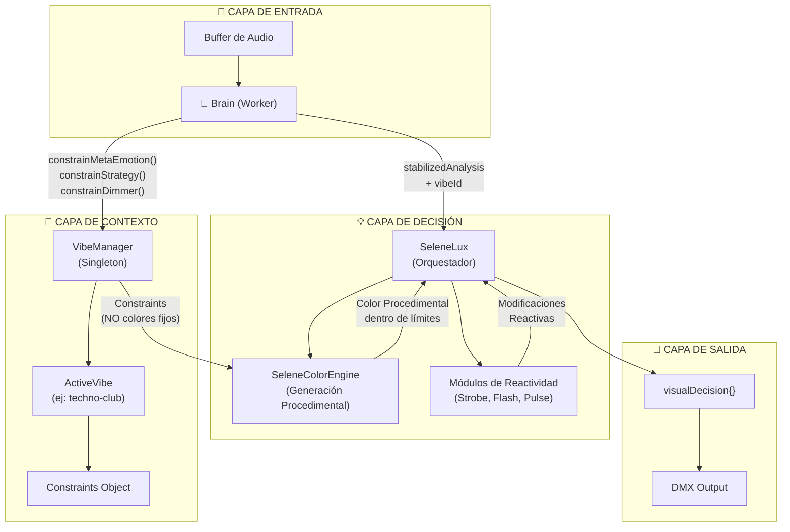
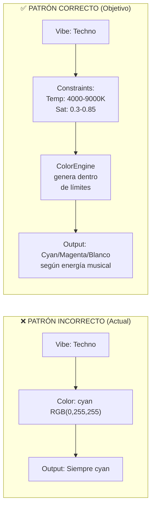
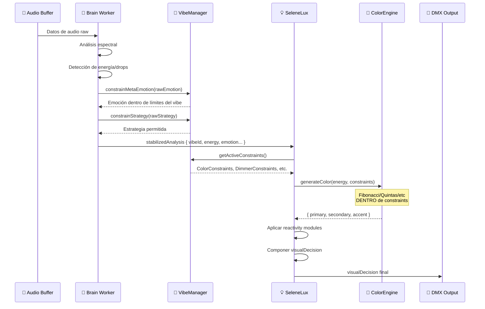
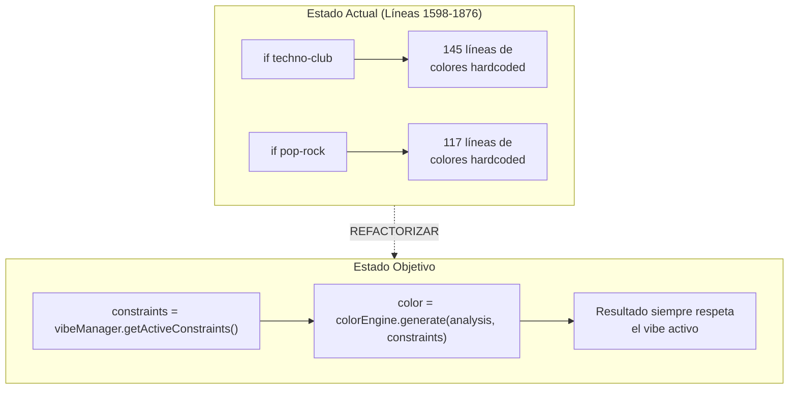
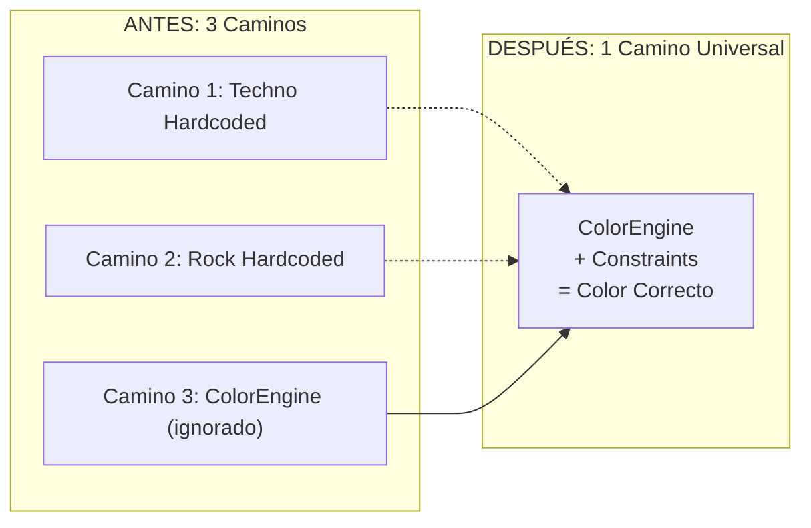
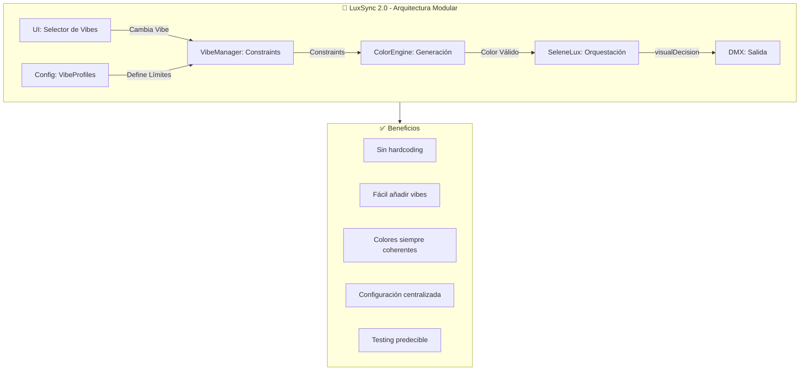

# 🏛️ WAVE 140: SYSTEM BLUEPRINT
## El Diseño Arquitectónico Ideal para LuxSync

**Fecha:** 2025-01-XX  
**Propósito:** Establecer la arquitectura objetivo para la Refactorización Modular Completa  
**Documento Hermano:** [VIBE-CONNECTION-AUDIT.md](./VIBE-CONNECTION-AUDIT.md)

---

## 📊 ARQUITECTURA OBJETIVO: FLUJO COMPLETO



---

## 🎯 PRINCIPIO FUNDAMENTAL: RESTRICCIONES, NO IMPOSICIONES

### El Contrato del VibeManager



---

## 📐 INTERFAZ DE CONSTRAINTS (YA EXISTE)

```typescript
// De VibeProfile.ts - Esta estructura YA existe y es correcta
interface ColorConstraints {
  temperature: { min: number; max: number };      // Kelvin
  saturation: { min: number; max: number };       // 0-1
  brightness: { min: number; max: number };       // 0-1
  hueRanges?: { start: number; end: number }[];   // Rangos permitidos
  forbiddenHues?: { start: number; end: number }[];  // Rangos prohibidos
}

interface VibeProfile {
  id: string;
  mood: MoodConstraints;
  color: ColorConstraints;
  drop: DropConstraints;
  dimmer: { minIntensity: number; maxIntensity: number };
  // ...más constraints
}
```

---

## 🔄 FLUJO DE DECISIÓN DETALLADO



---

## 🔧 REFACTORIZACIÓN PROPUESTA

### Paso 1: Conectar VibeManager a SeleneLux

```typescript
// SeleneLux.ts - CAMBIO REQUERIDO
import { VibeManager } from './context/VibeManager';

class SeleneLux {
  private vibeManager: VibeManager;
  
  constructor() {
    this.vibeManager = VibeManager.getInstance();
  }
  
  async lux(analysis: AnalysisResult): Promise<VisualDecision> {
    // Obtener constraints ANTES de cualquier decisión de color
    const constraints = this.vibeManager.getActiveConstraints();
    
    // Pasar constraints al ColorEngine
    const baseColor = this.colorEngine.generate(analysis, constraints);
    
    // El resto del flujo usa baseColor, no valores hardcoded
    // ...
  }
}
```

### Paso 2: Eliminar Bloques Hardcoded



### Paso 3: Unificar Flujo de Color



---

## 📋 CHECKLIST DE REFACTORIZACIÓN

### Fase 1: Conexión (Quick Win)
- [ ] Importar VibeManager en SeleneLux.ts
- [ ] Obtener constraints al inicio de lux()
- [ ] Crear método `vibeManager.getActiveConstraints()`

### Fase 2: Migración de Color
- [ ] Modificar SeleneColorEngine para aceptar constraints
- [ ] Reemplazar bloque Techno (líneas 1598-1742) por llamada al engine
- [ ] Reemplazar bloque Rock (líneas 1759-1876) por llamada al engine
- [ ] Verificar FiestaLatina y ChillLounge

### Fase 3: Limpieza
- [ ] Eliminar magic numbers (22+ constantes dispersas)
- [ ] Centralizar configuración en VibeProfiles
- [ ] Documentar API de constraints

### Fase 4: Validación
- [ ] Test: Cambiar vibe cambia colores
- [ ] Test: ColorEngine nunca genera fuera de constraints
- [ ] Test: Transiciones suaves entre vibes

---

## 🎨 EJEMPLO: TECHNO-CLUB POST-REFACTORIZACIÓN

### Antes (Hardcoded):
```typescript
// 145 líneas de if/else con valores mágicos
if (normalizedEnergy > 0.7) {
  targetHue = 180; // cyan hardcoded
} else if (normalizedEnergy > 0.4) {
  targetHue = 280; // magenta hardcoded
}
```

### Después (Constraint-Driven):
```typescript
// TechnoClubProfile.ts (ya existe, solo hay que usarlo)
const technoConstraints = {
  color: {
    temperature: { min: 4000, max: 9000 },
    saturation: { min: 0.3, max: 0.85 },
    hueRanges: [
      { start: 170, end: 200 },  // cyans
      { start: 270, end: 310 },  // magentas
      { start: 0, end: 30 }      // blancos/cool
    ]
  }
};

// SeleneLux.ts
const color = this.colorEngine.generate(analysis, constraints);
// ColorEngine internamente:
// 1. Calcula hue ideal según energía
// 2. Verifica que esté en hueRanges permitidos
// 3. Ajusta saturación dentro de min/max
// 4. Retorna color SIEMPRE válido para el vibe
```

---

## 🔮 VISIÓN FINAL



---

## 📝 CONCLUSIÓN

La arquitectura objetivo ya tiene **90% de los componentes construidos**:

| Componente | Estado | Acción Requerida |
|------------|--------|------------------|
| VibeManager | ✅ Funcional | Conectar a SeleneLux |
| VibeProfiles | ✅ Completos | Usar en lugar de hardcode |
| ColorEngine | ✅ Funcional | Pasar constraints |
| SeleneLux | ❌ Bypass | Eliminar bloques hardcoded |
| Worker | ✅ Integrado | Ya usa VibeManager |

### La Refactorización es QUIRÚRGICA, no RECONSTRUCTIVA

No hay que reescribir el sistema. Hay que:
1. **Conectar** lo que está desconectado
2. **Eliminar** lo que está duplicado
3. **Usar** lo que ya existe pero se ignora

---

**Próximo Wave:** Implementación de la conexión VibeManager → SeleneLux

---

*"La mejor arquitectura no es la más compleja, sino la que hace que las cosas correctas sean fáciles y las incorrectas sean difíciles."*
