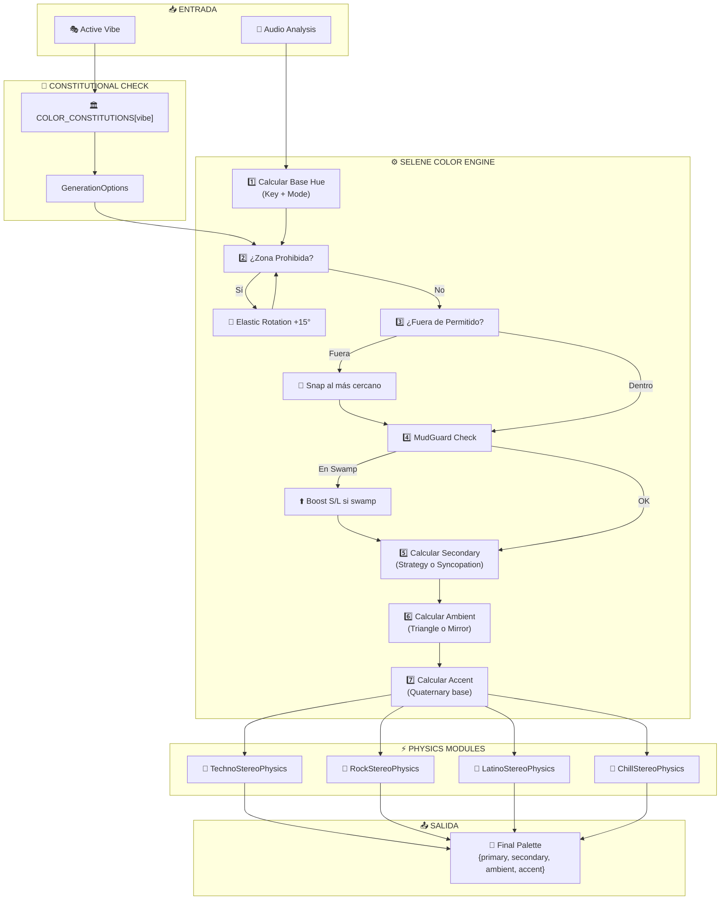

# 🏛️ WAVE 143: THE COLOR CONSTITUTION
## *"In Chroma We Trust"*

**Fecha**: 26 de Diciembre de 2025  
**Autor**: Selene Lux Architectural Council  
**Estado**: RATIFICADO ✅  
**Versión**: 1.0.0

---

## 📜 PREÁMBULO

> *"Nosotros, los arquitectos lumínicos de Selene, establecemos esta Constitución para formar una unión más perfecta entre Música y Luz, garantizar la tranquilidad visual, promover la reactividad inteligente, y asegurar las bendiciones de la Matemática Procedural para nosotros y nuestra posteridad cromática."*

Este documento establece las **Leyes Fundamentales del Color** que gobiernan el sistema Selene Lux. Ninguna Wave futura podrá contradecir estos principios sin una Enmienda Constitucional aprobada por unanimidad.

---

## 🎨 ARTÍCULO I: TOPOLOGÍA DE ZONAS
### *El Problema de los 4 Colores Resuelto*

El escenario se divide en **4 zonas cromáticas independientes**, cada una con un propósito visual distinto. Esta separación garantiza legibilidad escénica y evita el "efecto discoteca de los 80s" (todo parpadeando del mismo color).

```
                    ┌─────────────────────────────────────┐
                    │           BACK PARS (Accent)        │
                    │     "El Lienzo Reactivo"            │
                    │   ░░░░░░░░░░░░░░░░░░░░░░░░░░░░░░░░  │
                    └─────────────────────────────────────┘
                              ↑               ↑
                    ┌─────────┴───┐   ┌───────┴─────────┐
                    │  MOVING L   │   │   MOVING R      │
                    │ (Secondary) │   │   (Ambient)     │
                    │  "Melodía"  │   │  "Contrapunto"  │
                    │     🔦      │   │      🔦         │
                    └─────────────┘   └─────────────────┘
                              ↓               ↓
                    ┌─────────────────────────────────────┐
                    │         FRONT PARS (Primary)        │
                    │       "La Fundación Cromática"      │
                    │   ████████████████████████████████  │
                    └─────────────────────────────────────┘
                                    ↓
                              [ ARTISTA ]
```

### § 1.1 FRONT PARS (Primary Color)
**Rol**: La **Fundación Cromática**. El color que define la atmósfera base.

| Atributo | Valor |
|----------|-------|
| **Fuente** | `KEY_TO_HUE[musicalKey] + MODE_MODIFIER[mode]` |
| **Saturación** | 70-100% (nunca lavado) |
| **Luminosidad** | 50-60% (color sólido, no blanco) |
| **Reactividad** | NINGUNA - Estabilidad absoluta |

**Regla de Oro**: El Primary NUNCA parpadea. Es el ancla visual del espectáculo.

---

### § 1.2 MOVING L (Secondary Color)
**Rol**: La **Voz Melódica**. Sigue la estrategia de contraste según syncopation.

| Estrategia | Rotación | Cuando Aplica |
|------------|----------|---------------|
| `analogous` | +30° | Syncopation < 0.40 |
| `triadic` | +120° | 0.40 ≤ Syncopation < 0.65 |
| `complementary` | +180° | Syncopation ≥ 0.65 |
| `prism` | +60° | Techno-Club (forzado) |

**El Algoritmo Smart Prism**:
```typescript
// Si Secondary cae en zona prohibida del vibe...
while (isInForbiddenZone(secondaryHue, vibeProfile)) {
  secondaryHue = normalizeHue(secondaryHue + 15); // Elastic Rotation
  if (++iterations > 24) break; // Failsafe (24 × 15° = 360°)
}
```

---

### § 1.3 MOVING R (Ambient/Tertiary Color)
**Rol**: El **Contrapunto Visual**. Crea profundidad y tridimensionalidad.

**Regla del Triángulo Cromático**:
El Ambient DEBE ser calculado para maximizar la distancia respecto a Primary y Secondary.

```
         Primary (0°)
            /\
           /  \
          /    \
         /      \
Secondary (120°)────Ambient (240°)
        "El Triángulo Perfecto"
```

**Cálculo**:
```typescript
// Ambient busca el punto más alejado de Primary Y Secondary
const primaryAngle = primaryHue;
const secondaryAngle = secondaryHue;

// Centro de masas cromático (punto a evitar)
const centroid = (primaryAngle + secondaryAngle) / 2;

// Ambient se coloca en el punto opuesto al centroid
let ambientHue = normalizeHue(centroid + 180);

// Elastic Rotation si cae en zona prohibida
while (isInForbiddenZone(ambientHue, vibeProfile)) {
  ambientHue = normalizeHue(ambientHue + 15);
}
```

---

### § 1.4 BACK PARS (Accent Color)
**Rol**: El **Lienzo Reactivo**. Responde a eventos musicales.

**Estados**:

| Estado | Trigger | Color | Duración |
|--------|---------|-------|----------|
| `idle` | Ninguno | Cuaternario (Primary + 270°) | Permanente |
| `strobe_techno` | TreblePulse > 0.25 + Bass > 0.80 | `#FFFFFF` (Blanco Nuclear) | 1 frame |
| `flash_tungsten` | SnareHit (MidPulse > 0.32) | `hsl(40, 20%, 95%)` | 50ms |
| `kick_punch` | KickHit (BassPulse > 0.35) | Primary @ L:80% | 30ms |
| `solar_flare` | Latino High Energy | `hsl(Primary, 10%, 95%)` | 100ms |

**El Algoritmo Cuaternario** (Estado Idle):
```typescript
// El Accent idle debe ser visible pero no competir con los Moving Heads
const quaternaryHue = normalizeHue(primaryHue + 270); // Perpendicular al triángulo

// Verificar que no colisione con Secondary o Ambient
const minDistance = 30; // 30° de separación mínima
if (Math.abs(quaternaryHue - secondaryHue) < minDistance) {
  quaternaryHue = normalizeHue(quaternaryHue + 45);
}
if (Math.abs(quaternaryHue - ambientHue) < minDistance) {
  quaternaryHue = normalizeHue(quaternaryHue - 45);
}
```

---

## ⚖️ ARTÍCULO II: LAS 4 CONSTITUCIONES
### *Las Leyes de Cada Reino*

Cada género musical tiene su propia **Constitución Cromática** que no puede ser violada. Estas son las leyes fundamentales de cada vibe.

---

### 🏭 § 2.1 CONSTITUCIÓN TECHNO-CLUB
## *"Los Demonios de Neón"*

> *"En el reino del Techno, la calidez es herejía. Solo el frío sobrevive."*

```
   ╔═══════════════════════════════════════════════════════════════╗
   ║  🔵  ZONA SAGRADA: 170° - 302° (Cian → Violeta → Magenta)    ║
   ║  🔴  ZONA PROHIBIDA: 0° - 75° y 330° - 360° (Toda Calidez)   ║
   ║  🟢  ZONA LÁSER: 110° - 140° (Verde Ácido → Láser)           ║
   ╚═══════════════════════════════════════════════════════════════╝
```

**Mandamientos del Techno**:

1. **No tendrás colores cálidos delante de mí**
   - Naranja, Amarillo, Rojo-Naranja son ANATEMA
   - Si el Brain sugiere calidez, invertir +180°

2. **Honrarás la Saturación Máxima**
   - Mínimo 90% siempre
   - Los colores neón NO son negociables

3. **El Verde será Láser o no será**
   - Verde natural (90°-110°) → Forzar a 130° (Láser Cian)
   - "Césped" está prohibido en el club

4. **El Blanco será Cegador**
   - Strobes a 100% Luminosidad
   - El blanco tibio no existe en Techno

5. **El Ultravioleta será tu Suelo**
   - Ambient fijo en ~275° (Índigo UV)
   - Simula la "Luz Negra" del club

**GenerationOptions para Techno**:
```typescript
const TECHNO_CONSTITUTION: GenerationOptions = {
  forceStrategy: 'prism',
  forbiddenHueRanges: [[0, 75], [330, 360]],  // No warm
  allowedHueRanges: [[110, 302]],              // Cold spectrum only
  saturationRange: [90, 100],                   // Neon mandatory
  lightnessRange: [45, 55],                     // Solid colors
  elasticRotation: 15,                          // Degrees per iteration
  accentBehavior: 'strobe',
  strobeColor: { r: 255, g: 255, b: 255 },
  ambientLock: { h: 275, s: 100, l: 20 },      // UV floor
}
```

---

### 🌴 § 2.2 CONSTITUCIÓN FIESTA-LATINA
## *"La Jungla Tropical"*

> *"En el reino Latino, la vida es exuberancia. Los muertos no bailan."*

```
   ╔═══════════════════════════════════════════════════════════════╗
   ║  🟠  ZONA SOLAR: 0° - 60° (Rojo → Naranja → Amarillo Oro)    ║
   ║  🟢  ZONA SELVA: 120° - 180° (Verde Esmeralda → Turquesa)    ║
   ║  🔵  ZONA PROHIBIDA: 200° - 240° (Azul Metálico → Gris)      ║
   ╚═══════════════════════════════════════════════════════════════╝
```

**Mandamientos del Latino**:

1. **No tendrás colores muertos**
   - Grises, azules metálicos, colores "corporativos" = EXILIO
   - Si parece "oficina de contabilidad", está mal

2. **Honrarás el Contraste Tropical**
   - El MIRROR PRINCIPLE: Ambient = Secondary + 180°
   - Verde ↔ Magenta, Turquesa ↔ Coral, Naranja ↔ Azul Océano

3. **El Oro Brillará Siempre**
   - En momentos de alta energía, accent → Solar Flare
   - El blanco latino es DORADO (Hue ~40°, Sat ~20%)

4. **La Síncopa Abrirá el Espectro**
   - Syncopation < 0.40 → Análogo (vecinos tropicales)
   - Syncopation > 0.65 → Triada (explosión de carnaval)

5. **El Verde será Selva, no Césped**
   - Evitar verde "lima" puro (85°-95°)
   - Preferir Esmeralda (130°) o Turquesa (170°)

**GenerationOptions para Latino**:
```typescript
const LATINO_CONSTITUTION: GenerationOptions = {
  forceStrategy: undefined,  // Syncopation decide
  forbiddenHueRanges: [[200, 240]],  // No corporate blues
  allowedHueRanges: [[0, 60], [120, 195], [280, 330]],  // Warm + Jungle + Magenta
  saturationRange: [75, 100],         // Vibrant but not toxic
  lightnessRange: [45, 65],           // Bright and alive
  mudGuard: {
    enabled: true,
    swampZone: [40, 75],              // Orange-olive danger
    minLightness: 55,
    minSaturation: 85,
  },
  tropicalMirror: true,               // Ambient = Secondary + 180°
  solarFlareAccent: {
    h: 40,   // Golden
    s: 10,   // Almost white
    l: 95,   // Blinding
  },
}
```

---

### 🎸 § 2.3 CONSTITUCIÓN POP-ROCK
## *"Leyendas del Estadio"*

> *"En el reino del Rock, la simplicidad es poder. Los PAR64 reinan supremos."*

```
   ╔═══════════════════════════════════════════════════════════════╗
   ║  🔴  ZONA SANGRE: 350° - 10° (Rojo Puro Stadium)             ║
   ║  🔵  ZONA REAL: 220° - 250° (Azul Rey → Índigo)              ║
   ║  🟠  ZONA ÁMBAR: 35° - 50° (Tungsteno → Oro)                 ║
   ║  ⚪  ZONA FLASH: Blanco Cálido (3200K equivalente)           ║
   ╚═══════════════════════════════════════════════════════════════╝
```

**Mandamientos del Rock**:

1. **No tendrás colores ácidos intermedios**
   - Verde neón, cian tóxico, magenta eléctrico = PROHIBIDO
   - Si parece "rave de los 90s", está mal para rock

2. **Honrarás la Paleta Analógica**
   - Como los PAR64 con gelatinas: Rojo, Azul, Ámbar, Blanco
   - Simple pero PODEROSO

3. **El Tungsteno será tu Flash**
   - Snare Hit → Flash casi-blanco cálido (40°, 20%, 95%)
   - Simula el flashazo del kit de batería clásico

4. **El Complementario será tu Épica**
   - Rojo en Front → Cian en Back
   - Azul en Front → Ámbar en Back
   - Separación máxima = Drama máximo

5. **El Verde Lima será Rojo Sangre**
   - Si el Brain sugiere verde (80°-160°) → Forzar a 0° (Rojo)
   - El rock no crece en jardines

**GenerationOptions para Rock**:
```typescript
const ROCK_CONSTITUTION: GenerationOptions = {
  forceStrategy: 'complementary',  // Maximum drama
  forbiddenHueRanges: [[80, 160], [260, 300]],  // No greens, no dirty purples
  allowedHueRanges: [[0, 60], [210, 260], [340, 360]],  // Reds, Blues, Ambers
  saturationRange: [85, 100],        // Solid and punchy
  lightnessRange: [50, 65],          // Bright but not washed
  stageFilter: {
    greenToRed: [80, 160, 0],        // Map green zone to red
    dirtyPurpleToAmber: [260, 300, 40],  // Map dirty purple to amber
  },
  accentBehavior: 'drum-reactive',
  snareFlash: { h: 40, s: 20, l: 95 },  // Tungsten
  kickPunch: { usesPrimary: true, l: 80 },
}
```

---

### 🌊 § 2.4 CONSTITUCIÓN CHILL-LOUNGE
## *"Bioluminiscencia"*

> *"En el reino del Chill, la profundidad es infinita. Flotamos en luz líquida."*

```
   ╔═══════════════════════════════════════════════════════════════╗
   ║  🔵  ZONA ABISAL: 200° - 260° (Azul Profundo → Índigo)       ║
   ║  💜  ZONA MEDUSA: 270° - 310° (Violeta → Magenta Suave)      ║
   ║  🩵  ZONA CORAL: 170° - 195° (Turquesa → Cian)               ║
   ║  ⚫  ZONA PROHIBIDA: Negro total (siempre Dimmer > 5%)       ║
   ╚═══════════════════════════════════════════════════════════════╝
```

**Mandamientos del Chill**:

1. **No tendrás oscuridad absoluta**
   - Dimmer mínimo 5% siempre
   - La bioluminiscencia nunca se apaga completamente

2. **Honrarás la Transición Líquida**
   - Mínimo 2000ms entre cambios de color
   - Nada de cambios bruscos, todo fluye

3. **El Strobe es Anatema**
   - NINGÚN flash agresivo
   - Si hay accent reactivo, es un "pulse" suave de 500ms

4. **La Saturación será Moderada**
   - 50-80% - Los colores respiran
   - Nada de neón agresivo

5. **El Movimiento será Lento**
   - Transiciones de posición: mínimo 4 segundos
   - Pan/Tilt suaves como mareas

**GenerationOptions para Chill**:
```typescript
const CHILL_CONSTITUTION: GenerationOptions = {
  forceStrategy: 'analogous',  // Harmony over contrast
  forbiddenHueRanges: [[30, 80]],  // No oranges/yellows (too energetic)
  allowedHueRanges: [[170, 320]],  // Cool ocean spectrum
  saturationRange: [50, 80],       // Breathable, not neon
  lightnessRange: [35, 55],        // Deep but visible
  transitionConfig: {
    minDuration: 2000,             // 2 seconds minimum
    easing: 'sine-inout',          // Smooth waves
  },
  dimmingConfig: {
    floor: 0.05,                   // Never full black
    ceiling: 0.85,                 // Never full bright
  },
  strobeProhibited: true,          // Constitutional ban
  accentBehavior: 'breathing',     // Slow pulse, never flash
  pulseConfig: {
    duration: 4000,                // 4 second breath cycle
    amplitude: 0.15,               // Subtle variation
  },
}
```

---

## 📐 ARTÍCULO III: MATRIZ DE RESTRICCIONES TÉCNICAS
### *El Código de las Leyes*

Esta sección define la estructura de datos exacta que `SeleneColorEngine` deberá respetar.

### § 3.1 Interfaz GenerationOptions (Actualizada)

```typescript
/**
 * 🏛️ WAVE 143: CONSTITUTIONAL GENERATION OPTIONS
 * Estructura inmutable que define las restricciones de un Vibe.
 */
export interface GenerationOptions {
  // ═══════════════════════════════════════════════════════════════════
  // SECCIÓN A: RESTRICCIONES DE HUE (El Círculo Cromático)
  // ═══════════════════════════════════════════════════════════════════
  
  /**
   * Rangos de Hue PROHIBIDOS (grados 0-360).
   * Si el color calculado cae aquí, aplicar Elastic Rotation o Inversion.
   * @example [[30, 80], [330, 360]] // Prohibir naranjas y rojos cálidos
   */
  forbiddenHueRanges?: [number, number][];
  
  /**
   * Rangos de Hue PERMITIDOS (grados 0-360).
   * Si el color calculado cae FUERA, rotar al punto más cercano.
   * @example [[170, 302]] // Solo azules y violetas
   */
  allowedHueRanges?: [number, number][];
  
  /**
   * Grados de rotación para escapar de zonas prohibidas.
   * @default 15
   */
  elasticRotation?: number;
  
  /**
   * Mapeos forzados de hue.
   * Si el hue cae en [from, to], se reemplaza por 'target'.
   * @example [{ from: 80, to: 160, target: 0 }] // Verde → Rojo
   */
  hueRemapping?: Array<{ from: number; to: number; target: number }>;
  
  // ═══════════════════════════════════════════════════════════════════
  // SECCIÓN B: RESTRICCIONES DE SATURACIÓN Y LUMINOSIDAD
  // ═══════════════════════════════════════════════════════════════════
  
  /**
   * Rango de saturación permitido (0-100).
   * @example [90, 100] // Solo colores vibrantes
   */
  saturationRange?: [number, number];
  
  /**
   * Rango de luminosidad permitido (0-100).
   * @example [45, 60] // Evitar lavado y evitar oscuridad
   */
  lightnessRange?: [number, number];
  
  /**
   * Configuración Anti-Barro para vibes tropicales.
   * Evita que naranjas/amarillos se vean marrones.
   */
  mudGuard?: {
    enabled: boolean;
    swampZone: [number, number];  // Hue range peligroso
    minLightness: number;         // L mínimo en esa zona
    minSaturation: number;        // S mínimo en esa zona
  };
  
  // ═══════════════════════════════════════════════════════════════════
  // SECCIÓN C: ESTRATEGIA DE CONTRASTE
  // ═══════════════════════════════════════════════════════════════════
  
  /**
   * Estrategia de contraste forzada.
   * Si no se especifica, se calcula por syncopation.
   */
  forceStrategy?: 'analogous' | 'triadic' | 'complementary' | 'prism';
  
  /**
   * Activa el Tropical Mirror (Ambient = Secondary + 180°).
   * Usado en Fiesta Latina para máximo contraste.
   */
  tropicalMirror?: boolean;
  
  /**
   * Bloquea el Ambient en un color fijo.
   * Usado en Techno para el "suelo UV".
   */
  ambientLock?: { h: number; s: number; l: number };
  
  // ═══════════════════════════════════════════════════════════════════
  // SECCIÓN D: COMPORTAMIENTO DEL ACCENT
  // ═══════════════════════════════════════════════════════════════════
  
  /**
   * Modo de reactividad del Accent.
   * - 'strobe': Flash blanco instantáneo (Techno)
   * - 'drum-reactive': Flash en Snare/Kick (Rock)
   * - 'solar-flare': Flash dorado cálido (Latino)
   * - 'breathing': Pulso lento (Chill)
   * - 'quaternary': Color fijo derivado (Idle)
   */
  accentBehavior?: 'strobe' | 'drum-reactive' | 'solar-flare' | 'breathing' | 'quaternary';
  
  /**
   * Color del strobe (si accentBehavior = 'strobe').
   */
  strobeColor?: { r: number; g: number; b: number };
  
  /**
   * Configuración del Solar Flare (Latino).
   */
  solarFlareAccent?: { h: number; s: number; l: number };
  
  /**
   * Configuración del Snare Flash (Rock).
   */
  snareFlash?: { h: number; s: number; l: number };
  
  /**
   * Configuración del Kick Punch (Rock).
   */
  kickPunch?: { usesPrimary: boolean; l: number };
  
  /**
   * Configuración del Breathing Pulse (Chill).
   */
  pulseConfig?: { duration: number; amplitude: number };
  
  /**
   * Prohíbe strobes completamente (Chill).
   */
  strobeProhibited?: boolean;
  
  // ═══════════════════════════════════════════════════════════════════
  // SECCIÓN E: TRANSICIONES Y TIMING
  // ═══════════════════════════════════════════════════════════════════
  
  /**
   * Configuración de transiciones de color.
   */
  transitionConfig?: {
    minDuration: number;           // Duración mínima en ms
    maxDuration?: number;          // Duración máxima en ms
    easing?: 'linear' | 'ease-in' | 'ease-out' | 'sine-inout';
  };
  
  /**
   * Configuración de dimming general.
   */
  dimmingConfig?: {
    floor: number;    // Mínimo (0-1)
    ceiling: number;  // Máximo (0-1)
  };
}
```

---

### § 3.2 Registro de Constituciones

```typescript
/**
 * 🏛️ CONSTITUTIONAL REGISTRY
 * Las 4 Constituciones Cromáticas como constantes inmutables.
 */
export const COLOR_CONSTITUTIONS: Record<string, GenerationOptions> = {
  'techno-club': {
    forceStrategy: 'prism',
    forbiddenHueRanges: [[0, 75], [330, 360]],
    allowedHueRanges: [[110, 302]],
    saturationRange: [90, 100],
    lightnessRange: [45, 55],
    elasticRotation: 15,
    ambientLock: { h: 275, s: 100, l: 20 },
    accentBehavior: 'strobe',
    strobeColor: { r: 255, g: 255, b: 255 },
  },
  
  'fiesta-latina': {
    forbiddenHueRanges: [[200, 240]],
    allowedHueRanges: [[0, 60], [120, 195], [280, 330]],
    saturationRange: [75, 100],
    lightnessRange: [45, 65],
    tropicalMirror: true,
    mudGuard: {
      enabled: true,
      swampZone: [40, 75],
      minLightness: 55,
      minSaturation: 85,
    },
    accentBehavior: 'solar-flare',
    solarFlareAccent: { h: 40, s: 10, l: 95 },
  },
  
  'pop-rock': {
    forceStrategy: 'complementary',
    forbiddenHueRanges: [[80, 160], [260, 300]],
    allowedHueRanges: [[0, 60], [210, 260], [340, 360]],
    saturationRange: [85, 100],
    lightnessRange: [50, 65],
    hueRemapping: [
      { from: 80, to: 160, target: 0 },   // Green → Red
      { from: 260, to: 300, target: 40 }, // Dirty purple → Amber
    ],
    accentBehavior: 'drum-reactive',
    snareFlash: { h: 40, s: 20, l: 95 },
    kickPunch: { usesPrimary: true, l: 80 },
  },
  
  'chill-lounge': {
    forceStrategy: 'analogous',
    forbiddenHueRanges: [[30, 80]],
    allowedHueRanges: [[170, 320]],
    saturationRange: [50, 80],
    lightnessRange: [35, 55],
    transitionConfig: {
      minDuration: 2000,
      easing: 'sine-inout',
    },
    dimmingConfig: {
      floor: 0.05,
      ceiling: 0.85,
    },
    strobeProhibited: true,
    accentBehavior: 'breathing',
    pulseConfig: {
      duration: 4000,
      amplitude: 0.15,
    },
  },
  
  'idle': {
    // Sin restricciones - Libertad total para el ColorEngine
    saturationRange: [60, 100],
    lightnessRange: [40, 60],
    accentBehavior: 'quaternary',
  },
};
```

---

## 📊 ARTÍCULO IV: DIAGRAMA DE FLUJO CONSTITUCIONAL



---

## 🔏 ARTÍCULO V: CLÁUSULAS DE ENMIENDA

### § 5.1 Proceso de Enmienda
Una Constitución solo puede ser enmendada si:
1. Se documenta el problema con logs/métricas
2. Se propone la solución en un documento WAVE
3. Se verifica que no rompe las demás Constituciones
4. Se actualiza este documento

### § 5.2 Cláusula de Inmutabilidad
Los siguientes principios NO pueden ser enmendados:
1. **Separación de 4 Zonas**: Siempre habrá 4 colores distintos
2. **Primary Estable**: El Front nunca parpadea
3. **Accent Reactivo**: El Back siempre responde a la música
4. **Elastic Rotation**: Siempre hay un escape de zonas prohibidas

### § 5.3 Cláusula de Fallback
Si un Vibe no tiene Constitución definida, se aplica `idle` (libertad total con límites seguros).

---

## 📋 ANEXO A: CHECKLIST DE IMPLEMENTACIÓN

### Wave 144: Integrar Constituciones
- [ ] Crear `colorConstitutions.ts` con el registro
- [ ] Modificar `VibeManager.getCurrentProfile()` para incluir `GenerationOptions`
- [ ] Actualizar `SeleneColorEngine.generate()` para usar todos los campos
- [ ] Implementar `elasticRotation()` helper
- [ ] Implementar `hueRemapping()` helper

### Wave 145: Crear LatinoStereoPhysics
- [ ] Extraer lógica de Solar Flare a módulo dedicado
- [ ] Implementar detección de síncopa alta

### Wave 146: Crear ChillStereoPhysics  
- [ ] Implementar Breathing Pulse
- [ ] Implementar transiciones líquidas

### Wave 147: Eliminar Hardcoding Final
- [ ] Eliminar bloque `if (isTechnoVibe)` de SeleneLux
- [ ] Eliminar bloque `if (isPopRockVibe)` de SeleneLux
- [ ] Verificar que todo fluye por ColorEngine + Physics

---

## 🖋️ FIRMAS

```
Ratificado por el Consejo Arquitectónico de Selene Lux

📜 Chief Chromatic Officer: Selene
🔬 Physics Advisor: TechnoStereoPhysics v1.0
🎸 Stage Lighting Consultant: RockStereoPhysics v1.0
🌴 Tropical Affairs Minister: Pending (Wave 145)
🌊 Bioluminescence Curator: Pending (Wave 146)

Fecha de Ratificación: 26 de Diciembre de 2025
Número de Enmiendas: 0
```

---

> *"El color no es decoración. Es el alma visible de la música."*
> — Constitución de Color, Preámbulo Final
