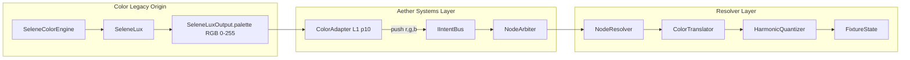
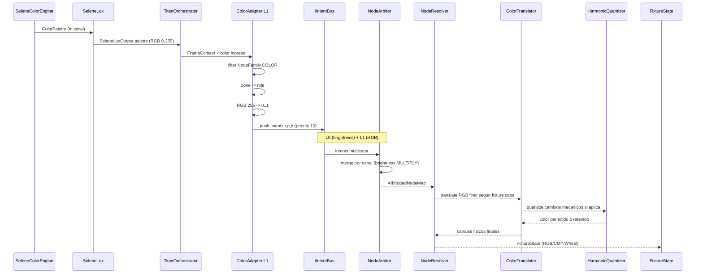

# WAVE 4522.2 — THE COLOR-AETHER BRIDGE (Blueprint)

## Blueprint de Integración: Ecosistema de Color en Aether Matrix

> Estado: DISENO ARQUITECTONICO — PROHIBIDO ESCRIBIR CODIGO DE PRODUCCION
> Referencia principal: [WAVE-4522-COLOR-LEGACY-MAP.md](./WAVE-4522-COLOR-LEGACY-MAP.md)
> Referencia L0 previa: [WAVE-4521-LIQUID-INTEGRATION-BLUEPRINT.md](./WAVE-4521-LIQUID-INTEGRATION-BLUEPRINT.md)
> Autor: Direccion de Arquitectura

---

## 1. Objetivo del Blueprint

Integrar la salida cromatica del pipeline legacy (SeleneColorEngine/SeleneLux) dentro de la Aether Matrix mediante un ColorAdapter en Capa L1 (prioridad 10), manteniendo el bus de intents en formato abstracto RGB normalizado y delegando toda traduccion mecanica de hardware al tramo final de resolucion.

Objetivo operativo:
- Entrada cromatica canonica desde SeleneLuxOutput.palette (RGB 0-255).
- Emision de intents L1 para nodos de familia COLOR.
- Conservacion de separacion de responsabilidades:
  - IntentBus: abstraccion de intencion
  - NodeArbiter: composicion multicapa
  - NodeResolver: traduccion a hardware

Restriccion critica:
- El ColorAdapter NO traduce a CMY ni color wheel.
- El ColorAdapter NO invoca ColorTranslator ni HarmonicQuantizer.

---

## 2. Fuente de Verdad Cromatica para Aether

### 2.1 Decision de ingesta

Fuente recomendada para ColorAdapter:
- SeleneLuxOutput.palette (RGB 0-255)

Justificacion:
1. Ya incorpora fisica de genero aplicada (Techno/Latino mutan componentes segun dinamica).
2. Evita conversiones HSL->RGB en el hot path de Aether.
3. Reduce desalineacion entre lo que decide SeleneLux y lo que consume Aether.
4. Encaja naturalmente con el contrato abstracto r,g,b del IntentBus.

Fallback de seguridad (si SeleneLux no esta disponible en un frame):
- LightingIntent.palette (HSL 0-1) convertido a RGB por utility pura de bajo costo.

### 2.2 Contrato de entrada minimo

```typescript
// Fuente de color consumida por ColorAdapter (normalizada al adaptador)
interface ColorIngressFrame {
  nowMs: number
  paletteRgb: {
    primary:   { r: number; g: number; b: number }  // 0-255
    secondary: { r: number; g: number; b: number }  // 0-255
    accent:    { r: number; g: number; b: number }  // 0-255
    ambient:   { r: number; g: number; b: number }  // 0-255
  }
}
```

---

## 3. Arquitectura del ColorAdapter (L1)

### 3.1 Posicion en el ecosistema



### 3.2 Responsabilidad de ColorAdapter

Responsabilidades:
1. Filtrar nodos de familia COLOR en NodeGraph.
2. Determinar rol cromatico por zona (primary/secondary/accent/ambient).
3. Leer color RGB del rol desde SeleneLuxOutput.palette.
4. Normalizar RGB de 0-255 a 0.0-1.0.
5. Publicar INodeIntent en prioridad 10 con canales r, g, b.

No responsabilidades:
- Traduccion RGB->CMY
- Matching a color wheel
- Cuantizacion armonica de cambios mecanicos
- Escritura DMX directa

### 3.3 Firma propuesta del adaptador

```typescript
// src/core/aether/adapters/ColorAdapter.ts

export class ColorAdapter implements IAetherSystem<IColorNodeData> {
  readonly name = 'ColorAdapter'
  readonly family = NodeFamily.COLOR
  readonly source = 'color_adapter_l1'

  // Capa L1 del ecosistema Aether
  private static readonly INTENT_PRIORITY = 10

  process(
    nodes: INodeView<IColorNodeData>,
    context: FrameContext,
    bus: IIntentBus,
  ): void
}
```

---

## 4. Zone Routing hacia Rol Cromatico

### 4.1 Regla de mapeo

El mapeo de zona espacial del nodo hacia rol cromatico se resuelve con helper puro compartido (zoneUtils o equivalente), desacoplado del adaptador.

Contrato sugerido:

```typescript
// src/core/aether/adapters/zoneUtils.ts (extension)

type ColorRole = 'primary' | 'secondary' | 'accent' | 'ambient'

function selectColorRoleFromZone(zoneId: string): ColorRole
```

Tabla recomendada base:
- frontLeft, frontRight -> primary
- backLeft, backRight -> secondary
- moverLeft, moverRight -> accent
- ambient, air, floor -> ambient

Fallback:
- zoneId desconocida -> ambient

Nota:
- Esta estrategia puede refinarse por vibe en fases posteriores, pero la base de WAVE 4522.2 debe ser determinista, simple y estable.

### 4.2 Normalizacion RGB

Regla canonica:
- rNorm = clamp01(r255 / 255)
- gNorm = clamp01(g255 / 255)
- bNorm = clamp01(b255 / 255)

Los intents publicados por ColorAdapter son siempre en rango 0.0-1.0.

---

## 5. Generacion de Intents L1

### 5.1 Contrato del intent emitido

```typescript
interface INodeIntent {
  nodeId: string
  values: Record<string, number>
  priority: number
  confidence?: number
  source?: string
}

// Output por nodo COLOR
{
  nodeId: colorNode.nodeId,
  values: {
    r: 0.0..1.0,
    g: 0.0..1.0,
    b: 0.0..1.0,
  },
  priority: 10,
  source: 'color_adapter_l1'
}
```

### 5.2 Pseudoflujo por nodo

```text
for each colorNode in NodeFamily.COLOR:
  role = selectColorRoleFromZone(colorNode.zoneId)
  rgb255 = ingress.paletteRgb[role]
  intent.values.r = rgb255.r / 255
  intent.values.g = rgb255.g / 255
  intent.values.b = rgb255.b / 255
  intent.priority = 10
  bus.push(intent)
```

---

## 6. Interaccion con L0 (LiquidAetherAdapter)

### 6.1 Objetivo de mezcla

L0 aporta respiracion energetica en brightness.
L1 aporta tinte cromatico en r,g,b.

Ambas capas deben coexistir sin acoplar adaptadores entre si.

### 6.2 Politica de merge en NodeArbiter

Se define politica por canal (diseno objetivo WAVE 4522.2):
- dimmer: HIGHEST_WINS (equivalente HTP)
- shutter/strobe: PRIORITY_WINS (equivalente LTP por capa)
- r,g,b: PRIORITY_WINS (L1 domina el tinte base)
- brightness: MULTIPLY

Formula conceptual de salida cromatica por nodo:

```text
rFinal = rL1 * brightnessComposite
gFinal = gL1 * brightnessComposite
bFinal = bL1 * brightnessComposite
```

donde brightnessComposite incluye la contribucion respiratoria de L0.

Resultado:
- L0 no cambia tinte.
- L0 modula intensidad perceptual del color de L1.

---

## 7. Delegacion de Hardware al NodeResolver

### 7.1 Decision arquitectonica clave

IntentBus se mantiene abstracto.
ColorAdapter solo publica intencion RGB normalizada.
NodeResolver es responsable de materializar la salida fisica segun capabilities de fixture.

### 7.2 Tramo final de traduccion en NodeResolver

Propuesta de pipeline de resolucion cromatica:

1. NodeResolver recibe ArbitratedNodeMap por nodo.
2. Para canales r,g,b arbitrados, compone target RGB final por fixture (0-255).
3. Invoca ColorTranslator con perfil del fixture:
   - RGB fixture: pass-through
   - RGBW fixture: deriva W y remanentes
   - CMY fixture: invierte a C,M,Y
   - Wheel fixture: calcula slot/DMX mas cercano
4. Si el fixture requiere rueda o mecanica con inercia:
   - Invoca HarmonicQuantizer para gate de cambio
5. Escribe FixtureState final con canales mecanicos correctos.

Contrato conceptual:

```typescript
interface NodeResolverColorStage {
  resolveFixtureColor(
    fixtureCaps: FixtureColorCapabilities,
    targetRgb: { r: number; g: number; b: number },
    timing: { nowMs: number; bpm?: number },
  ): {
    fixtureStateColor: {
      r?: number; g?: number; b?: number
      c?: number; m?: number; y?: number
      colorWheel?: number
    }
    quantizationApplied: boolean
    translationMode: 'RGB' | 'RGBW' | 'CMY' | 'WHEEL'
  }
}
```

### 7.3 Beneficio de esta separacion

- ColorAdapter permanece agnostico del hardware.
- La inteligencia mecanica legacy (ColorTranslator/HarmonicQuantizer) se reutiliza en un solo punto.
- El cambio de fixture profile no obliga cambios en sistemas Aether.

---

## 8. Flujo de secuencia propuesto



---

## 9. Firmas de interfaces propuestas

### 9.1 ColorAdapter

```typescript
export interface IColorIngress {
  getPaletteRgb(): {
    primary: { r: number; g: number; b: number }
    secondary: { r: number; g: number; b: number }
    accent: { r: number; g: number; b: number }
    ambient: { r: number; g: number; b: number }
  } | null
}

export class ColorAdapter implements IAetherSystem<IColorNodeData> {
  process(nodes: INodeView<IColorNodeData>, context: FrameContext, bus: IIntentBus): void
}
```

### 9.2 NodeResolver Color Stage

```typescript
export interface IColorTranslationBridge {
  translate(
    fixtureProfile: FixtureProfile,
    rgb255: { r: number; g: number; b: number },
    nowMs: number,
    bpm?: number,
  ): {
    output: { r?: number; g?: number; b?: number; c?: number; m?: number; y?: number; colorWheel?: number }
    wasQuantized: boolean
  }
}
```

### 9.3 Politica de canales para arbitraje

```typescript
type ChannelMergePolicy = {
  r: 'PRIORITY_WINS'
  g: 'PRIORITY_WINS'
  b: 'PRIORITY_WINS'
  brightness: 'MULTIPLY'
}
```

---

## 10. Invariantes de diseno

1. El ColorAdapter emite solo canales abstractos r,g,b en rango 0.0-1.0.
2. El ColorAdapter opera exclusivamente en nodos de familia COLOR.
3. Toda traduccion a hardware (CMY, colorWheel, timing mecanico) vive en NodeResolver.
4. La mezcla con L0 debe preservar semantica:
   - L0 modula intensidad (respiracion)
   - L1 define tinte
5. El pipeline mantiene determinismo por frame y evita logica de simulacion.

---

## 11. Fases de migracion propuestas

FASE A (Bridge Basico):
- ColorAdapter L1 emite r,g,b desde SeleneLuxOutput.palette.
- NodeResolver conserva salida RGB sin wheel/CMY (modo seguro).

FASE B (Bridge Fisico Completo):
- NodeResolver integra ColorTranslator + HarmonicQuantizer en tramo final.
- Fixtures mecanicos recuperan comportamiento legacy de rueda y gating armonico.

FASE C (Paridad de Produccion):
- Validacion fixture-by-fixture contra salida legacy.
- Conmutacion principal a ruta Aether para color.

---

## 12. Criterios de aceptacion arquitectonica

1. Existe un punto unico de ingesta cromatica para Aether (SeleneLuxOutput.palette).
2. Todos los intents de ColorAdapter son L1 prioridad 10 con canales r,g,b.
3. No hay conversion a hardware dentro de sistemas Aether.
4. NodeResolver contiene explicitamente la etapa de traduccion fisica de color.
5. La mezcla L0/L1 especifica y documenta brightness con semantica multiplicativa.

---

Fin del documento WAVE 4522.2 — THE COLOR-AETHER BRIDGE.
