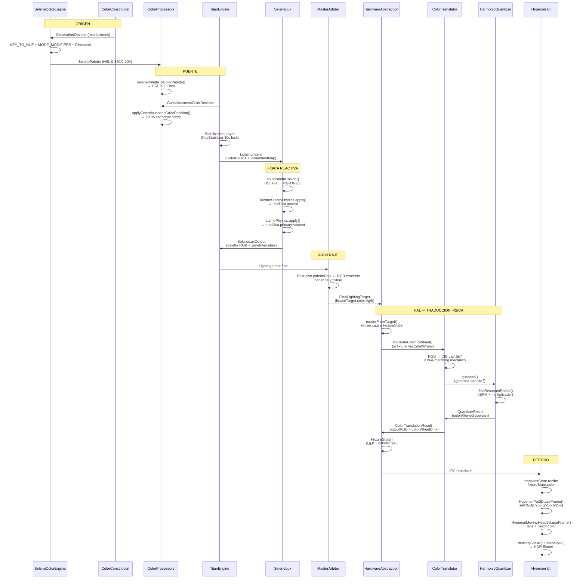

# WAVE 4522.1 — THE COLOR LEGACY TRACE
## Radiografía del Pipeline Cromático Legacy (SeleneColorEngine → Hyperion UI)

> **Estado:** INVESTIGACIÓN Y DOCUMENTACIÓN — Estrictamente PROHIBIDO proponer diseño de integración Aether.
> **Scope:** Mapeo exhaustivo del flujo de datos cromáticos desde la generación de paleta hasta su representación visual en la UI.
> **Fecha:** 2026-05-02

---

## 1. ARQUITECTURA GLOBAL DEL COLOR LEGACY

```mermaid
flowchart TB
    subgraph ORIGEN["1. ORIGEN — Constitución + Motor Cromático"]
        A1[ColorConstitution<br/>GenerationOptions]
        A2[SeleneColorEngine<br/>SelenePalette HSL]
    end

    subgraph MODS["2. MODIFICADORES — Consciencia + Física"]
        B1[ConsciousnessColorDecision<br/>satMod / brightMod]
        B2[ColorProcessors<br/>selenePaletteToColorPalette]
        B3[SeleneLux<br/>Genre Physics]
    end

    subgraph PUENTE["3. PUENTE — TitanEngine / LightingIntent"]
        C1[TitanEngine<br/>Stabilization Layer]
        C2[LightingIntent<br/>ColorPalette 0-1 + hex]
        C3[ZoneIntentMap<br/>paletteRole assignment]
    end

    subgraph HAL["4. HAL — Traducción Física"]
        D1[MasterArbiter<br/>FinalLightingTarget]
        D2[HardwareAbstraction<br/>renderFromTarget]
        D3[ColorTranslator<br/>RGB → RGBW/CMY/Wheel]
        D4[HarmonicQuantizer<br/>Beat-gated changes]
    end

    subgraph DESTINO["5. DESTINO — FixtureState + UI"]
        E1[FixtureState<br/>r,g,b 0-255 / colorWheel]
        E2[IPC Transport]
        E3[Hyperion 3D<br/>Par3D + MovingHead3D]
        E4[Hyperion 2D<br/>TacticalCanvas]
    end

    A1 -->|restricciones| A2
    A2 -->|SelenePalette HSL 0-360| B2
    B1 -->|±20% clamp| B2
    B2 -->|ColorPalette HSL 0-1 + hex| C1
    C1 -->|LightingIntent| C2
    C2 -->|zones con paletteRole| C3
    C3 -->|basePalette RGB| B3
    B3 -->|SeleneLuxOutput<br/>palette RGB 0-255| C1
    C1 --> D1
    D1 -->|fixtureTarget.color.r/g/b| D2
    D2 -->|translateColorToWheel| D3
    D3 -->|QuantizerResult| D4
    D4 -->|FixtureState[]| E1
    E1 -->|IPC broadcast| E2
    E2 -->|transientStore| E3
    E2 -->|transientStore| E4
```

---

## 2. EL ORIGEN — SeleneColorEngine + ColorConstitution

### 2.1 La Constitución Cromática (`engine/color/colorConstitutions.ts`)

Cada Vibe tiene una **Constitución** inmutable (`GenerationOptions`) que restringe lo que SeleneColorEngine puede generar. La Constitución es LEY.

| Vibe | `atmosphericTemp` | `thermalGravityStrength` | `saturationRange` | `lightnessRange` | Estrategia clave |
|------|-------------------|--------------------------|-------------------|------------------|-------------------|
| **Techno** | 9500K (polo frío) | 0.22 | [90, 100] | [45, 55] | Neon Protocol + Sidereal Clock |
| **Latino** | 6200K (neutro) | 0.12 | [75, 100] | [35, 60] | Tropical Mirror + Solar Flare |
| **Rock** | 3200K (polo cálido) | — | [85, 100] | [50, 65] | Complementary + Drum-reactive |
| **Chill** | 8000K (polo cian) | — | [50, 80] | [35, 55] | Analogous + Breathing |
| **Idle** | 6500K (neutro) | 0 | [70, 100] | [35, 60] | Sin restricciones |

**Mecanismos de restricción:**
- `forbiddenHueRanges`: Zonas de hue PROHIBIDAS (ej. Techno prohíbe naranjas 25°-80°)
- `allowedHueRanges`: Zonas permitidas (ej. Latino usa Sidereal Clock para rotar slots)
- `elasticRotation`: 15°-20° de escape si el hue cae en zona prohibida
- `hueRemapping`: Mapeo forzado (ej. Verde → Rojo en Rock)
- `neonProtocol`: Si un color cae en dangerZone → forzar S≥90%, L≥75%, o colapsar a blanco
- `thermalGravity`: Arrastra el hue hacia el polo térmico del Vibe (fuerza proporcional a distancia de 6000K)
- `siderealClock`: Carrusel temporal de 5-6 actos con `allowedHueRanges` y `lightnessRange` por slot
- `mudGuard`: Protección anti-barro para naranjas/amarillos en zonas tropicales

### 2.2 El Motor Cromático (`engine/color/SeleneColorEngine.ts`)

Selene genera una `SelenePalette` con 5 roles + metadata:

```typescript
export interface SelenePalette {
  primary: HSLColor;    // PARs, wash general
  secondary: HSLColor;  // Back PARs, Fibonacci rotation
  accent: HSLColor;     // Moving heads, beams, highlights
  ambient: HSLColor;    // Fills, backlighting suave
  contrast: HSLColor;   // Siluetas, sombras
  meta: PaletteMeta;    // strategy, temperature, confidence, transitionSpeed
}
```

**Fórmula fundamental:**
```
finalHue = KEY_TO_HUE[key] + MODE_MODIFIERS[mode].hueDelta
```

- `KEY_TO_HUE`: Mapeo sinestésico de notas musicales a HSL (C=0° rojo, A=270° índigo)
- `MODE_MODIFIERS`: Modo musical → temperatura emocional (major = +15° hue, +10% sat, +10% light; minor = -15° hue, -10% sat, -10% light)
- **Energía SOLO afecta saturación y brillo, NUNCA el hue base**
- **Syncopation** determina la estrategia de contraste:
  - Baja syncopation → `analogous`
  - Media syncopation → `triadic`
  - Alta syncopation → `complementary`
- **Fibonacci rotation**: `secondary` = `primary` + (φ × 360°) % 360 ≈ +222.5°

**Output scales:** HSL en rangos absolutos — H: 0-360, S: 0-100, L: 0-100.

---

## 3. MODIFICADORES — Consciencia + Física de Género

### 3.1 Decisión de Consciencia (`core/protocol/ConsciousnessOutput.ts`)

```typescript
export interface ConsciousnessColorDecision {
  suggestedHue?: number           // 0-360, DEBE estar en allowedHueRanges
  suggestedStrategy?: 'analogous' | 'complementary' | 'triadic' | ...
  saturationMod?: number           // 0.8-1.2 (±20%)
  brightnessMod?: number           // 0.8-1.2 (±20%)
  confidence: number
}
```

**Reglas de la Consciencia:**
- Sat/bright modifiers están **clampeados a ±20%** para evitar distorsiones extremas
- La consciencia **respeta la paleta base** — nunca cambia el hue directamente
- Si `energy > 0.85` (Energy Override), los modificadores de consciencia son **IGNORADOS**. La física tiene VETO TOTAL en drops.

### 3.2 ColorProcessors (`engine/color/ColorProcessors.ts`)

**Funciones puras, zero estado:**

| Función | Entrada | Salida | Descripción |
|---------|---------|--------|-------------|
| `selenePaletteToColorPalette()` | `SelenePalette` (HSL 0-360/0-100) | `ColorPalette` (HSL 0-1 + hex) | Normalización + pre-computo de hex para UI |
| `applyConsciousnessColorDecision()` | `ColorPalette` + `ConsciousnessColorDecision` | `ColorPalette` modificada | Aplica satMod/brightMod clampeados |
| `calculateZoneIntents()` | `IntensityAudioInput` (bass/mid/high/energy) | `ZoneIntentMap` | Asigna intensidades por zona + `paletteRole` |
| `calculateMasterIntensity()` | `energy` + `DimmerConfig` | `number` 0-1 | Noise gate (threshold 0.05) + mapeo floor/ceiling |

**ZoneIntentMap (asignación de roles):**
```typescript
front:  { intensity: mid*0.8 + bass*0.2,       paletteRole: 'primary'   }
back:   { intensity: bass*0.6 + energy*0.4,    paletteRole: 'accent'    }
left:   { intensity: high*0.5 + energy*0.5,    paletteRole: 'secondary' }
right:  { intensity: high*0.5 + energy*0.5,    paletteRole: 'ambient'   }
ambient:{ intensity: energy*0.3,                paletteRole: 'ambient'   }
```

### 3.3 SeleneLux — Física Reactiva de Género (`core/reactivity/SeleneLux.ts`)

SeleneLux recibe la `ColorPalette` (HSL 0-1) de TitanEngine, la convierte a RGB interno, y aplica **física de género** que puede mutar colores específicos:

```typescript
// Dentro de updateFromTitan()
const inputPalette = this.colorPaletteToRgb(basePalette);  // HSL 0-1 → RGB 0-255

// Techno: TechnoStereoPhysics modifica accent (strobe magenta/cian)
outputPalette.accent = result.palette.accent;

// Latino: LatinoStereoPhysics modifica primary + accent (solar flare dorado)
outputPalette.primary = result.palette.primary;
outputPalette.accent = result.palette.accent;

// Rock/Chill: No modifican paleta — la entrada se preserva
```

**Output de SeleneLux:** `SeleneLuxOutput.palette` contiene `{primary, secondary, ambient, accent}` en **RGB 0-255**.

---

## 4. EL PUENTE — TitanEngine + LightingIntent

### 4.1 TitanEngine Stabilization Layer (`engine/TitanEngine.ts`)

TitanEngine es el orchestrador que ensambla el `LightingIntent`. Para el color, opera en tres fases:

1. **KeyStabilizer** (buffer 10s, locking 30s): Evita cambios frenéticos de tonalidad
2. **MoodArbiter** (buffer 10s, locking 5s): Estabiliza BRIGHT/DARK/NEUTRAL
3. **StrategyArbiter** (rolling 15s, locking 30s): Sincronizado con KeyStabilizer — la paleta completa (key + strategy) baila junta por 30 segundos

### 4.2 LightingIntent — El Contrato de Color (`core/protocol/LightingIntent.ts`)

```typescript
export interface ColorPalette {
  primary:   HSLColor   // h:0-1, s:0-1, l:0-1, hex?:string
  secondary: HSLColor
  accent:    HSLColor
  ambient:   HSLColor
  strategy?:  string
}

export interface ZoneIntent {
  intensity: number        // 0-1
  paletteRole: 'primary' | 'secondary' | 'accent' | 'ambient'
  colorOverride?: HSLColor // Override específico de zona
}
```

**Observaciones críticas:**
- `LightingIntent.palette` almacena colores en **HSL normalizado 0-1** con campo `.hex` pre-computado para UI
- Las zonas NO llevan color directo — llevan un **paletteRole** que indexa en la paleta global
- El `hex` se pre-computa en `withHex()` para evitar conversiones repetidas en el renderer

### 4.3 Mechanics Bypass — Color Override (`LightingIntent.mechanics`)

```typescript
export interface LightingIntent {
  mechanics?: {
    moverL?: { intensity, pan, tilt }
    moverR?: { intensity, pan, tilt }
    colorOverride?: { h, s, l }  // HSL normalizado 0-1
  }
}
```

**WAVE 1072:** El `colorOverride` en mechanics fue **DEPRECATED**. Ahora el flujo oceánico pasa por `SeleneColorEngine.oceanicModulation` directamente. El mechanics solo transporta movimiento.

---

## 5. HAL — Traducción Física

### 5.1 MasterArbiter → FinalLightingTarget (`core/arbiter/ArbitrationDirector.ts`)

El Arbiter recibe `LightingIntent` de TitanEngine, lo mezcla con overrides manuales y efectos, y produce `FinalLightingTarget`. Cada fixture target tiene:

```typescript
interface FixtureTarget {
  fixtureId: string
  dimmer: number        // 0-255
  color: { r, g, b }   // 0-255 RGB
  color_wheel?: number  // 0-255 DMX (si aplica)
  pan, tilt, zoom, focus: number
  // ...
}
```

**Nota:** El Arbiter ya resuelve el `paletteRole` a un color RGB concreto antes de llegar al HAL.

### 5.2 HardwareAbstraction.renderFromTarget() (`hal/HardwareAbstraction.ts`)

```typescript
const baseState: FixtureState = {
  fixtureId,
  dimmer: fixtureTarget.dimmer,
  r: fixtureTarget.color.r,
  g: fixtureTarget.color.g,
  b: fixtureTarget.color.b,
  colorWheel: fixtureTarget.color_wheel,  // WAVE 1008.6: THE WHEELSMITH
  // ...
}

// WAVE 2042.20: BABEL FISH — Traducir RGB a rueda de color si el fixture la tiene
const translatedState = this.translateColorToWheel(baseState, fixture, fixtureTarget.color_wheel)
```

### 5.3 ColorTranslator — El Alquimista Cromático (`hal/translation/ColorTranslator.ts`)

**4 casos de traducción:**

| Caso | Tipo de fixture | Algoritmo | Output |
|------|-----------------|-----------|--------|
| **1. RGB** | LED PAR, LED wash | Pass-through directo | `outputRGB = targetRGB` |
| **2. RGBW** | LED RGBW | `W = min(R,G,B)`, `R'=R-W`, etc. | `RGBW` struct |
| **3. CMY** | Discharge CMY | `C=255-R`, `M=255-G`, `Y=255-B` | `CMY` struct |
| **4. Wheel** | Beam/Spot mecánico | CIE L*a*b* ΔE* o hue-matching | `colorWheelDmx` + nearest color name |

**Wheel Matching (WAVE 2096.1 + WAVE 3456):**
- **CIE76 ΔE***: RGB → XYZ → L*a*b* → distancia perceptual a cada slot de la rueda
- **WAVE 3456 Mechanical Hue Matcher**: Para ruedas mecánicas, el cristal solo controla matiz. Se usa matching por **hue circular** (no ΔE* completo) porque un azul puro (0,0,255) está muy lejos de un azul marino (5,114,182) en Lab, pero son conceptualmente el mismo color para una rueda mecánica.
- **Half-color positioning**: Si el target cae entre dos slots adyacentes, interpola el DMX value
- **poorMatch**: Si hue diff > 45°, marca como match pobre (UI puede mostrar warning)
- **Cache LRU**: Clave quantizada en Lab (step=4), máximo 512 entradas

### 5.4 HarmonicQuantizer — El Péndulo Armónico (`hal/translation/HarmonicQuantizer.ts`)

**Problema resuelto:** Selene piensa a 60fps. Las ruedas de color mecánicas necesitan 500ms+ para rotar. Cambios rápidos = rueda congelada o dañada.

**Algoritmo:**
1. Leer BPM desde `IntervalBPMTracker`
2. `beatPeriodMs = 60000 / BPM`
3. Encontrar multiplicador armónico más rápido (×1, ×2, ×4, ×8, ×16) cuyo período ≥ `minChangeTimeMs` del perfil del fixture
4. **Gate**: Solo permitir cambio de color cuando ha pasado el período armónico

**Desacoplamiento absoluto de canales:**
- `colorWheel / CMY` → **CUANTIZADO** (gated por período armónico)
- `dimmer / shutter / movement` → **PASS-THROUGH INMEDIATO** (siempre libres)

**Relación con HardwareSafetyLayer:** El Quantizer es la capa MUSICAL que previene conflictos con elegancia. El SafetyLayer sigue como red de seguridad de última instancia.

---

## 6. DESTINO — FixtureState + Hyperion UI

### 6.1 FixtureState — El Esqueleto del Color (`hal/mapping/FixtureMapper.ts`)

```typescript
export interface FixtureState {
  dimmer: number         // 0-255
  r: number              // 0-255
  g: number              // 0-255
  b: number              // 0-255
  colorWheel?: number    // 0-255 DMX (si fixture tiene rueda)
  hasColorWheel?: boolean
  hasColorMixing?: boolean
  // ... movement, optics, phantom channels
}
```

**DMX Channel Mapping (WAVE 687):**
El `FixtureMapper.statesToDMXPackets()` construye los canales DMX dinámicamente a partir de las definiciones del fixture JSON:
- `red`, `green`, `blue`, `white`, `amber`, `uv` → valores directos de `FixtureState.r/g/b/white/amber/uv`
- `color_wheel` → valor de `FixtureState.colorWheel` (traducido por ColorTranslator)
- `cyan`, `magenta`, `yellow` → valores CMY (traducidos por ColorTranslator)

### 6.2 IPC Transport

Los `FixtureState[]` se serializan y envían por IPC desde main → renderer a ~30-60fps. El payload incluye:
- `r, g, b` (0-255) para todos los fixtures
- `colorWheel` (0-255) para fixtures con rueda
- `dimmer` (0-255) para intensidad
- `pan, tilt, zoom, focus` para movers

### 6.3 Hyperion 3D — Consumo del Color

#### HyperionPar3D (`components/hyperion/views/visualizer/fixtures/HyperionPar3D.tsx`)

```typescript
// Dentro de useFrame() — lee directamente del transientStore (zero React cost)
const fixtureState = getTransientFixture(id)

if (fixtureState?.color) {
  liveColor.current.setRGB(
    fixtureState.color.r / 255,
    fixtureState.color.g / 255,
    fixtureState.color.b / 255
  )
}

// Lente: HDR boost para bloom del EffectComposer
lensMaterialRef.current.color.copy(liveColor.current)
if (isOn) {
  lensMaterialRef.current.color.multiplyScalar(1.0 + liveIntensity * 3.0)
}

// Halo interior — glow denso
haloMaterialRef.current.color.copy(liveColor.current)
haloMaterialRef.current.color.multiplyScalar(1.0 + liveIntensity * 1.5)

// PointLight — ilumina entorno cercano
pointLightRef.current.color.copy(liveColor.current)
pointLightRef.current.intensity = isOn ? liveIntensity * 2.5 : 0
```

**WAVE 2236:** Los componentes 3D leen **directamente del transientStore** dentro de `useFrame()`, bypassando completamente el ciclo de render de React. Esto permite 60fps fluido sin re-renders.

#### HyperionMovingHead3D (`components/hyperion/views/visualizer/fixtures/HyperionMovingHead3D.tsx`)

Mismo patrón que Par3D, pero adicionalmente:

```typescript
// Color del beam (cono volumétrico)
beamMaterialRef.current.color.copy(liveColor.current)
if (liveIntensity > 0.01) {
  beamMaterialRef.current.color.multiplyScalar(1.0 + liveIntensity * 1.5)
}
beamMaterialRef.current.opacity = liveIntensity * 0.4
```

**WAVE 2204 — HDR Bloom Resurrection:**
- `MeshBasicMaterial.color` en rango 0-1 nunca rompe el `luminanceThreshold` del Bloom (0.85)
- `multiplyScalar(1.0 + intensity * 2.0)` empuja el color a rango HDR (>1.0)
- A `dimmer=1.0`: color × 3.0 → luminancia ~3.0 → **BLOOM explota** (comportamiento deseado)
- A `dimmer=0.0`: color × 1.0 → sin HDR → sin bloom (correcto, está apagado)

### 6.4 Hyperion 2D — TacticalCanvas

El TacticalCanvas (web worker 2D offscreen) también consume `fixtureState.color.r/g/b` para pintar los fixtures en la vista top-down. La diferencia clave:
- **3D**: Usa `THREE.Color` + `AdditiveBlending` + `Bloom post-processing`
- **2D**: Usa Canvas 2D `fillStyle` con color RGB directo + opacidad proporcional a dimmer

---

## 7. FLUJO DETALLADO POR ROL DE PALETA



---

## 8. PUNTOS CRÍTICOS Y CUELLOS DE BOTELLA

### 8.1 Cuello de Botella: Color Wheel Matching
- **Problema:** CIE76 ΔE* entre azul puro (0,0,255) y azul marino (5,114,182) es grande en Lab, pero para una rueda mecánica son el mismo color conceptual
- **Solución WAVE 3456:** Mechanical Hue Matcher — usa diferencia de hue circular en lugar de ΔE* completo para fixtures con rueda mecánica
- **Tradeoff:** Menos preciso perceptualmente, pero correcto físicamente para el hardware

### 8.2 Cuello de Botella: Harmonic Quantizer vs. Strobe
- **Problema:** El Quantizer bloquea cambios de colorWheel a ritmo musical, pero los strobes binarios necesitan respuesta inmediata
- **Solución:** Desacoplamiento absoluto — solo `colorWheel/CMY` están cuantizados; `dimmer/shutter/movement` son pass-through

### 8.3 Cuello de Botella: Consistencia de Escalas
- **Problema:** El color viaja por 3 escalas diferentes:
  1. SeleneColorEngine: **HSL 0-360/0-100/0-100**
  2. LightingIntent: **HSL 0-1/0-1/0-1 + hex**
  3. SeleneLux interno: **RGB 0-255**
  4. FixtureState: **RGB 0-255**
- **Riesgo:** Conversión HSL→RGB→HSL introduce pérdida de precisión si no se usa el mismo algoritmo
- **Mitigación:** `SeleneColorEngine.hslToRgb()` y `LightingIntent.hslToRgb()` usan la misma fórmula W3C estándar

### 8.4 Cuello de Botella: Cache Coherencia
- **Problema:** ColorTranslator tiene cache LRU de 512 entradas con clave quantizada en Lab (step=4)
- **Riesgo:** Si la temperatura atmosférica modifica sutílmente el hue, el cache puede devolver un color antiguo
- **Mitigación:** El cache incluye `profileId` en la clave; cambios de perfil (vibe change) invalidan implícitamente

---

## 9. MAPA DE ARCHIVOS Y RESPONSABILIDADES

| Archivo | Responsabilidad Color | Tipo de dato color |
|---------|------------------------|-------------------|
| `engine/color/SeleneColorEngine.ts` | Generación de paleta musical | `SelenePalette` (HSL 0-360/0-100) |
| `engine/color/colorConstitutions.ts` | Restricciones por Vibe | `GenerationOptions` |
| `core/protocol/ConsciousnessOutput.ts` | Modificadores de consciencia | `ConsciousnessColorDecision` |
| `engine/color/ColorProcessors.ts` | Conversión + aplicación de mods | `ColorPalette` (HSL 0-1 + hex) |
| `engine/TitanEngine.ts` | Stabilization + ensamblaje Intent | `LightingIntent.palette` |
| `core/reactivity/SeleneLux.ts` | Física reactiva de género | `SeleneLuxOutput.palette` (RGB 0-255) |
| `core/arbiter/ArbitrationDirector.ts` | Resolución de roles a RGB | `FinalLightingTarget.fixtureTarget.color` |
| `hal/HardwareAbstraction.ts` | Render + traducción física | `FixtureState.r/g/b` |
| `hal/translation/ColorTranslator.ts` | RGB → RGBW/CMY/Wheel | `ColorTranslationResult` |
| `hal/translation/HarmonicQuantizer.ts` | Gate de cambios de color | `QuantizerResult` |
| `hal/mapping/FixtureMapper.ts` | Mapeo a canales DMX | `DMXPacket[]` |
| `components/hyperion/.../HyperionPar3D.tsx` | Render 3D PAR | `THREE.Color` |
| `components/hyperion/.../HyperionMovingHead3D.tsx` | Render 3D Mover + Beam | `THREE.Color` |
| `components/hyperion/.../TacticalCanvas.tsx` | Render 2D top-down | Canvas 2D `fillStyle` |

---

## 10. GLOSARIO DE TÉRMINOS CROMÁTICOS

| Término | Definición |
|---------|------------|
| **KEY_TO_HUE** | Mapeo sinestésico de notas musicales a ángulos HSL (C=0° rojo, A=270° índigo) |
| **MODE_MODIFIERS** | Delta de hue/sat/lightness por modo musical (major=+15°/+10%/+10%, minor=-15°/-10%/-10%) |
| **Fibonacci Rotation** | `secondary = primary + 222.5°` (φ × 360° mod 360) |
| **Thermal Gravity** | Fuerza que arrastra hues hacia el polo térmico del Vibe (frío=240°, cálido=40°) |
| **Neon Protocol** | Si un color cae en dangerZone → forzar S≥90%, L≥75%, o colapsar a blanco |
| **Elastic Rotation** | Escape de 15°-20° cuando un hue cae en zona prohibida |
| **Sidereal Clock** | Carrusel temporal que rota `allowedHueRanges` cada N minutos |
| **Mud Guard** | Protección que evita que naranjas/amarillos se vean marrones (eleva S y L) |
| **ColorTranslationResult** | Output de ColorTranslator: `outputRGB` + `colorWheelDmx` + `colorDistance` + `poorMatch` |
| **Resonant Period** | Período armónico musical (BPM × multiplicador) que respeta `minChangeTimeMs` del fixture |

---

## 11. CONCLUSIÓN DEL AUDITOR

El pipeline cromático legacy es una **cadena de 11 transformaciones** que convierte teoría musical pura (nota + modo) en valores DMX concretos. Los puntos de mayor complejidad arquitectónica son:

1. **La triple escala** (HSL 0-360 → HSL 0-1 → RGB 0-255) requiere coherencia algorítmica
2. **El ColorTranslator** es el único punto que conoce hardware real — todo upstream es abstracto
3. **El HarmonicQuantizer** es una capa de protección musical, no una restricción creativa
4. **SeleneLux** es el único punto donde la física reactiva puede mutar la paleta (Techno accent, Latino primary)
5. **La consciencia** tiene poder limitado (±20%) y es vetada en drops (energy > 0.85)

Este mapa proporciona la base necesaria para diseñar cualquier integración Aether del subsistema cromático sin romper el flujo legacy existente.
