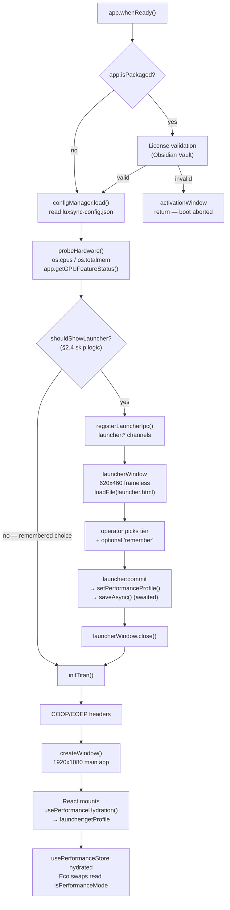

# VANGUARD LAUNCHER — ENGINEERING BLUEPRINT (WAVE 7580)

**Audience:** Implementing coder (GLM). Follow the Execution Steps in order. Do not skip ahead, do not refactor adjacent code, do not "improve" things not listed here.

**Goal:** A pre-boot configuration window that lets the operator pick a render fidelity tier (`hq` / `balanced` / `eco`) before the heavy React app mounts. The choice persists to `luxsync-config.json` and hydrates a new Zustand store that the Eco-Mode component swaps (see `hyperion_performance_audit2.md` §3.7) subscribe to.

**Non-goals for this wave:** Building the `<EcoSpectrum>` / `<EcoOracle>` fallback components. This blueprint delivers the *launcher, the persisted flag, and the store*. The fallback components are a separate wave that consumes `usePerformanceStore`.

---

## SECTION 0 — MANDATORY PRE-READING: Corrections to prior briefs

Three findings from source verification override assumptions you may carry in from the earlier context documents. **Read these before writing any code.**

### 0.1 Tailwind CSS is NOT available. Do not use utility classes.

`tailwindcss@^3.4.0` is listed in `devDependencies` but it is a **phantom dependency**:
- No `tailwind.config.js` exists anywhere in the repo.
- No `postcss.config.js` exists.
- A grep for `@tailwind`, `@apply`, or `tailwind` across all of `electron-app/src` returns **0 matches**.

The app styles exclusively with **plain CSS files** and **CSS custom properties** defined in `electron-app/src/styles/globals.css`. Any Tailwind class you write (`bg-slate-900`, `flex`, `p-4`) will silently do nothing. Use the real design tokens listed in §3.1.

### 0.2 The `lux:get-config` and `lux:save-config` IPC channels are BROKEN. Do not use them.

| Channel | Declared in preload | Handler status | Result |
|---|---|---|---|
| `lux:get-config` | `preload.ts:1117` | **No handler registered anywhere.** | `invoke()` rejects: "No handler registered" |
| `lux:save-config` | `preload.ts:1121` | Handler exists (`IPCHandlers.ts:660`) but calls `configManager.saveConfig(config)` — **a method that does not exist** on `ConfigManagerV2` | Guard `if (configManager?.saveConfig)` is always falsy → always returns `{ success: false }` |

Root cause: `IPCDependencies.configManager` is typed `any` (`IPCHandlers.ts:70`), so TypeScript never caught the missing method.

The **working** config channels are `config:get`, `config:set`, `config:save` (`IPCHandlers.ts:742-758`). However, these are registered inside `setupIPCHandlers()`, which runs in `initTitan()` — **which has not run yet when the Launcher is open.** Therefore:

> **The Launcher MUST define its own dedicated `launcher:*` IPC channels, registered before the Launcher window opens. Do not reuse or depend on any existing config channel.**

Side note for a future wave (**do not fix in this wave**): `useDevicePersistence` (`hooks/useDevicePersistence.ts:170`) calls `window.lux.getConfig()`, which means audio/DMX device restoration has been silently failing inside its `try/catch`. Log it as a separate ticket.

### 0.3 The launcher must be vanilla HTML, not React. There is an exact precedent.

The codebase already contains a pre-boot window: the **license Activation Window** (`main.ts:1300-1317`). It is built as:
- `electron/license/activation.html` — a single self-contained file: vanilla HTML + inline `<style>` + inline `<script>`, CSP-locked.
- `electron/license/preload-activation.js` — a minimal CJS preload exposing exactly 5 methods on one namespace, with **zero** access to `luxsync` / `lux` / `electron` / `luxDebug`.
- Loaded with `activationWindow.loadFile(...)`, not `loadURL`.

**You will mirror this pattern exactly.** Rationale:

1. **`vite.config.ts` has no multi-page input.** There is exactly one HTML entry (`index.html` → `/src/main.tsx`). Adding a React launcher requires adding `build.rollupOptions.input` with multiple entries and threading a dev-server route — a build-config change that risks the entire production bundle for cosmetic consistency.
2. **Self-defeating cost.** The Launcher's entire purpose is to protect legacy hardware from a heavy React bundle. Parsing React + ReactDOM to render three buttons that decide whether to parse React is architecturally backwards. Vanilla HTML paints in <50 ms on the target i3.
3. **Proven, reviewed, shipping pattern** already in the tree.

The mission brief asked for a `Launcher.tsx`. That is the one instruction in the brief I am overriding, and §3 specifies the vanilla structure instead. If the Lead Architect insists on React, see **Appendix B** for the delta — but it is not recommended.

---

## SECTION 1 — Architecture & Boot Flow

### 1.1 Current sequence (`main.ts:1164`)

```
app.whenReady()
  ├── [packaged only] Obsidian Vault license validation
  │     └── invalid → activationWindow (600x520, frameless) → return  [boot aborted]
  ├── await initTitan()                    line 1446   ← registers ALL IPC, boots backend
  ├── session COOP/COEP headers            line 1457
  ├── createWindow()                       line 1467   ← 1920x1080 main app
  └── setupTheiaWindowManager()             line 1472
```

### 1.2 New sequence



### 1.3 Placement invariants — these are hard requirements

| # | Invariant | Why |
|---|---|---|
| 1 | The launcher gate runs **after** license validation | An unlicensed user must never see a config screen. Activation returns early and aborts boot. |
| 2 | The launcher gate runs **before** `initTitan()` | `initTitan()` boots DMX drivers, audio workers, the Genesis engine, and the effects engine. Doing that work before the operator has chosen a tier defeats the purpose and wastes 2-4 s on slow hardware. |
| 3 | The launcher window is **fully closed** before `createWindow()` | `main.ts` keeps a single module-level `rendererAlive` flag (line 102) and a single `mainWindow` ref (line 97). Two live windows would race the flag. Await closure. |
| 4 | The config write is **awaited** before proceeding | The renderer reads the profile back over IPC after mount. An unflushed debounce would hand back a stale tier. Use `saveAsync()`, awaited — never `saveDebounced()`. |
| 5 | `launcher:*` handlers are registered **before** the window loads | The launcher's inline script calls `launcher:getProfile` on `DOMContentLoaded`. |
| 6 | The launcher must **never** be able to abort the boot silently | If the operator closes the launcher with the OS chrome / `Esc`, treat it as "accept current default and continue" — not `app.quit()`. This differs deliberately from the activation window, which *does* quit on close. |

---

## SECTION 2 — TypeScript Contracts

### 2.1 Config schema additions — `src/core/config/ConfigManagerV2.ts`

Add these exported types **above** the `LuxSyncPreferencesV2` interface:

```typescript
/**
 * WAVE 7580: Render fidelity tier chosen in the Vanguard Launcher.
 * - 'hq'       → full glow/blur/animation stack, worker canvas, 60 fps RAF
 * - 'balanced' → CSS blur tax removed, heavy components kept
 * - 'eco'      → CSS overrides + React component fallbacks + throttled stores
 */
export type PerformanceTier = 'hq' | 'balanced' | 'eco'

/**
 * Hardware capabilities probed once in the main process at boot.
 * Persisted so the Launcher can be skipped on subsequent runs, and so
 * support can read the operator's real hardware from the config file.
 */
export interface HardwareProfile {
  /** os.cpus().length */
  cpuCores: number
  /** Total system RAM in GB, rounded to 1 decimal (os.totalmem() / 1024^3) */
  totalMemoryGB: number
  /** app.getGPUFeatureStatus()['gpu_compositing'] === 'enabled' */
  gpuCompositing: boolean
  /** app.getGPUFeatureStatus()['2d_canvas'] === 'enabled' — drives the canvas-worker decision */
  accelerated2dCanvas: boolean
  /** Raw GPU feature map, retained verbatim for support diagnostics */
  gpuFeatures: Record<string, string>
  /** Primary display resolution — drives the 1366px compression breakpoints */
  screenWidth: number
  screenHeight: number
  /** ISO-8601 timestamp of this probe */
  probedAt: string
}

/**
 * The Launcher's persisted decision.
 */
export interface PerformanceProfile {
  /** The tier the app will boot with */
  tier: PerformanceTier
  /**
   * True when the operator explicitly picked a tier (or checked "remember").
   * False means the value is an auto-recommendation and the Launcher
   * should be shown again next boot.
   */
  userConfirmed: boolean
  /** Skip the Launcher on subsequent boots (the "remember" checkbox) */
  skipLauncher: boolean
  /** Snapshot of the hardware at the time of the decision */
  hardware: HardwareProfile | null
  /** The tier the scoring heuristic recommended — kept for telemetry/support */
  recommendedTier: PerformanceTier | null
  /** ISO-8601 timestamp of the decision */
  decidedAt: string
}
```

Add exactly one field to `LuxSyncPreferencesV2` (do not reorder or touch existing fields):

```typescript
export interface LuxSyncPreferencesV2 {
  version: '2.0.0'
  lastSaved: string
  lastOpenedShowPath: string | null
  dmx: DMXInterfaceConfig
  audio: AudioInputConfig
  seleneMode: 'idle' | 'reactive' | 'autonomous' | 'choreography'
  installationType: 'ceiling' | 'floor' | 'totem'
  ui: UIPreferences

  /** 🚀 WAVE 7580: Vanguard Launcher — render fidelity decision */
  performance: PerformanceProfile

  v1MigrationComplete: boolean
  localStorageScenesMigrated: boolean
}
```

Add the default to `DEFAULT_CONFIG_V2`:

```typescript
  performance: {
    tier: 'hq',
    userConfirmed: false,   // ← false ⇒ Launcher shows on first run
    skipLauncher: false,
    hardware: null,
    recommendedTier: null,
    decidedAt: new Date().toISOString(),
  },
```

**Migration safety:** `load()` already deep-merges loaded config over defaults for nested objects (`ConfigManagerV2.ts:235-242`). You **must** add `performance` to that merge, exactly like `dmx` / `audio` / `ui`:

```typescript
      this.config = {
        ...DEFAULT_CONFIG_V2,
        ...loadedV2,
        version: '2.0.0',
        dmx:   { ...DEFAULT_CONFIG_V2.dmx,   ...loadedV2.dmx },
        audio: { ...DEFAULT_CONFIG_V2.audio, ...loadedV2.audio },
        ui:    { ...DEFAULT_CONFIG_V2.ui,    ...loadedV2.ui },
        // 🚀 WAVE 7580
        performance: { ...DEFAULT_CONFIG_V2.performance, ...loadedV2.performance },
      }
```

Without that line, an existing `luxsync-config.json` (which has no `performance` key) yields `config.performance === undefined` and every downstream `.tier` read throws.

Also add the same key to the object literal built in `migrateFromV1()` (~line 260), since that path constructs the config field-by-field rather than by spread:

```typescript
      performance: { ...DEFAULT_CONFIG_V2.performance },
```

### 2.2 New typed accessors on `ConfigManagerV2`

Add next to the existing getters/setters. **Do not route this through `updateConfig()`** — that method is the `any`-typed legacy shim responsible for the §0.2 bug class.

```typescript
  // ═══════════════════════════════════════════════════════════════════════════
  // 🚀 WAVE 7580: VANGUARD LAUNCHER
  // ═══════════════════════════════════════════════════════════════════════════

  getPerformanceProfile(): PerformanceProfile {
    return this.config.performance
  }

  /**
   * Persist the Launcher's decision. Awaits the atomic write — the renderer
   * reads this back over IPC immediately after mount, so a debounced write
   * would hand back a stale tier.
   */
  async setPerformanceProfile(patch: Partial<PerformanceProfile>): Promise<boolean> {
    this.config.performance = { ...this.config.performance, ...patch }
    return this.saveAsync()
  }
```

### 2.3 Zustand store — `src/stores/performanceStore.ts` (new file)

Match the house style exactly: `create` from `zustand`, no middleware, no `persist` (persistence lives in the main process — see `launcher_architecture_context.md` §4.2), plus exported stable selectors (the codebase relies on these for React 19 correctness — see `luxsyncStore.ts:376`).

```typescript
/**
 * 🚀 PERFORMANCE STORE — WAVE 7580: VANGUARD LAUNCHER
 *
 * Holds the render fidelity tier chosen in the pre-boot Launcher.
 * Hydrated ONCE at app mount from the main process via `launcher:getProfile`.
 *
 * Persistence is NOT handled here — ConfigManagerV2 owns the on-disk state.
 * This store is a read-mostly mirror for the React tree.
 */

import { create } from 'zustand'

export type PerformanceTier = 'hq' | 'balanced' | 'eco'

export interface HardwareProfile {
  cpuCores: number
  totalMemoryGB: number
  gpuCompositing: boolean
  accelerated2dCanvas: boolean
  gpuFeatures: Record<string, string>
  screenWidth: number
  screenHeight: number
  probedAt: string
}

interface PerformanceState {
  // ─── STATE ───
  tier: PerformanceTier
  hardware: HardwareProfile | null
  /** False until hydrateFromMain() resolves. Gate Eco swaps on this. */
  isHydrated: boolean

  // ─── DERIVED (kept as plain fields, recomputed in setters) ───
  /** tier === 'eco' — the master switch for React component fallbacks */
  isPerformanceMode: boolean
  /** tier !== 'hq' — the switch for the CSS blur-tax override layer */
  isBlurDisabled: boolean
  /** tier === 'eco' — bypass transferControlToOffscreen, use the DOM tactical view */
  isCanvasWorkerDisabled: boolean

  // ─── ACTIONS ───
  setTier: (tier: PerformanceTier) => void
  hydrate: (payload: { tier: PerformanceTier; hardware: HardwareProfile | null }) => void
}

/** Single source of truth for tier → capability flags. */
function deriveFlags(tier: PerformanceTier) {
  return {
    tier,
    isPerformanceMode: tier === 'eco',
    isBlurDisabled: tier !== 'hq',
    isCanvasWorkerDisabled: tier === 'eco',
  }
}

export const usePerformanceStore = create<PerformanceState>((set) => ({
  ...deriveFlags('hq'),
  hardware: null,
  isHydrated: false,

  setTier: (tier) => set(deriveFlags(tier)),

  hydrate: ({ tier, hardware }) =>
    set({ ...deriveFlags(tier), hardware, isHydrated: true }),
}))

// ═══════════════════════════════════════════════════════════════════════════
// STABLE SELECTORS — React 19 correctness (mirrors luxsyncStore.ts pattern)
// ═══════════════════════════════════════════════════════════════════════════

export const selectIsPerformanceMode      = (s: PerformanceState) => s.isPerformanceMode
export const selectIsBlurDisabled         = (s: PerformanceState) => s.isBlurDisabled
export const selectIsCanvasWorkerDisabled = (s: PerformanceState) => s.isCanvasWorkerDisabled
export const selectTier                   = (s: PerformanceState) => s.tier
export const selectIsHydrated             = (s: PerformanceState) => s.isHydrated
```

> **Consumption rule for the future Eco wave:** always subscribe with a single primitive selector — `usePerformanceStore(selectIsPerformanceMode)`. Never `usePerformanceStore((s) => ({ ... }))`, which allocates a fresh object each render and re-renders forever.

### 2.4 IPC contract

Create `electron/launcher/launcherIpc.ts`. Four channels, one namespace, all `invoke` except the fire-and-forget cancel.

```typescript
/** WAVE 7580: Vanguard Launcher IPC contract. */

export interface LauncherProbePayload {
  hardware: HardwareProfile
  /** Heuristic recommendation from scoreHardware() */
  recommendedTier: PerformanceTier
  /** Currently persisted tier (the default selection in the UI) */
  currentTier: PerformanceTier
  /** App version, for the launcher footer */
  appVersion: string
}

export interface LauncherCommitRequest {
  tier: PerformanceTier
  /** The "Don't ask again" checkbox */
  skipLauncher: boolean
}

export interface LauncherCommitResult {
  ok: boolean
  error?: string
}

export interface LauncherGetProfileResult {
  tier: PerformanceTier
  hardware: HardwareProfile | null
}
```

| Channel | Direction | Type | Signature | Consumer |
|---|---|---|---|---|
| `launcher:probe` | renderer → main | `invoke` | `() => Promise<LauncherProbePayload>` | launcher.html, on `DOMContentLoaded` |
| `launcher:commit` | renderer → main | `invoke` | `(req: LauncherCommitRequest) => Promise<LauncherCommitResult>` | launcher.html, on INITIALIZE click |
| `launcher:cancel` | renderer → main | `send` | `() => void` | launcher.html, on `Esc` — closes window, keeps current tier |
| `launcher:getProfile` | renderer → main | `invoke` | `() => Promise<LauncherGetProfileResult>` | **main app** renderer, at mount, to hydrate the store |

**Lifecycle note:** `launcher:probe`, `launcher:commit`, and `launcher:cancel` are only meaningful while the launcher window lives, but `launcher:getProfile` is called by the *main app* later. Register all four in one `registerLauncherIpc()` call before the launcher opens, and **do not** remove any of them when the launcher closes — `launcher:getProfile` must survive.

### 2.5 Launcher preload API — `electron/launcher/preload-launcher.js`

Mirror `preload-activation.js` exactly: plain CJS (`require`, not `import`), one namespace, zero access to the main API surface.

```javascript
/**
 * WAVE 7580 — VANGUARD LAUNCHER
 * Minimal preload. Exposes 3 methods on `window.vanguard`.
 * ZERO access to luxsync, lux, electron, luxDebug.
 */

const { contextBridge, ipcRenderer } = require('electron')

contextBridge.exposeInMainWorld('vanguard', {
  probe:  () => ipcRenderer.invoke('launcher:probe'),
  commit: (req) => ipcRenderer.invoke('launcher:commit', req),
  cancel: () => ipcRenderer.send('launcher:cancel'),
})
```

### 2.6 Main-app preload addition — `electron/preload.ts`

Add to the existing `luxApi` object (the one exposed as `window.lux`), near the config block at line ~1113:

```typescript
  // ============================================
  // 🚀 WAVE 7580: VANGUARD LAUNCHER — performance profile
  // ============================================

  /** Read the tier chosen in the pre-boot Launcher (hydrates usePerformanceStore) */
  getPerformanceProfile: () =>
    ipcRenderer.invoke('launcher:getProfile'),
```

### 2.7 Hardware scoring heuristic

Put this in `electron/launcher/probeHardware.ts`. It must be **pure and deterministic** — no `Math.random()`, per the repo axioms.

```typescript
/**
 * Recommend a tier from the probed hardware.
 *
 * Thresholds are calibrated against the documented failure case in
 * hyperion_performance_audit2.md: a 13-year-old Intel i3, 4 GB RAM,
 * legacy Intel HD GPU with no accelerated 2D canvas.
 */
export function scoreHardware(hw: HardwareProfile): PerformanceTier {
  // Hard gate: without an accelerated 2D canvas, every box-shadow / blur is a
  // CPU Gaussian blur and the OffscreenCanvas worker falls back to software
  // skia. This is the single strongest predictor of the observed degradation.
  if (!hw.accelerated2dCanvas || !hw.gpuCompositing) return 'eco'

  // Memory gate: 4 GB total means Chromium is already swapping.
  if (hw.totalMemoryGB <= 4) return 'eco'

  // CPU gate: 2 cores cannot run the compositor + the render worker.
  if (hw.cpuCores <= 2) return 'eco'

  if (hw.totalMemoryGB <= 8 || hw.cpuCores <= 4) return 'balanced'

  return 'hq'
}
```

Probe implementation notes:
- `cpuCores` → `os.cpus().length`
- `totalMemoryGB` → `Math.round((os.totalmem() / 1024 ** 3) * 10) / 10`
- `gpuFeatures` → `app.getGPUFeatureStatus()` (main process only; returns `Record<string, string>`)
- `gpuCompositing` → `gpuFeatures['gpu_compositing'] === 'enabled'`
- `accelerated2dCanvas` → `gpuFeatures['2d_canvas'] === 'enabled'`
- `screenWidth/Height` → `screen.getPrimaryDisplay().size` (`screen` is already imported in `main.ts:19`)

> `app.getGPUFeatureStatus()` must be called **after** `app.whenReady()`. It is safe at the launcher gate.

### 2.8 Skip logic

```typescript
function shouldShowLauncher(profile: PerformanceProfile): boolean {
  if (process.argv.includes('--force-launcher')) return true  // dev/support escape hatch
  if (profile.skipLauncher && profile.userConfirmed) return false
  return true
}
```

Even when skipped, **still run the probe and refresh `hardware`** in the config — hardware changes (RAM upgrade, GPU driver install) should be recorded for support, and the write is a single debounced disk touch.

---

## SECTION 3 — UI / UX Spec

Window: **620 × 460**, `frame: false`, `resizable: false`. Single self-contained file at `electron/launcher/launcher.html`.

### 3.1 Design tokens (verbatim from `src/styles/globals.css`)

Redeclare these in the launcher's inline `<style>` — the launcher does **not** load `globals.css` (that would pull the Vite pipeline in).

```css
:root {
  --bg-deepest:   #0a0a0f;
  --bg-deep:      #12121a;
  --bg-surface:   #1a1a24;   /* verify against globals.css:14-16 before committing */
  --accent-primary:   #7C4DFF;  /* violet — primary brand */
  --accent-primary-dim: #5c35cc;
  --accent-secondary: #00E5FF;  /* cyan */
  --accent-success:   #22c55e;
  --accent-warning:   #fbbf24;
  --text-primary:   #FFFFFF;
  --text-secondary: #A0A0B0;
  --text-muted:     #6a6a7a;   /* verify */
  --border-subtle: #2a2a3a;
  --border-medium: #3a3a4a;
  --font-body: 'Inter', sans-serif;
  --font-mono: 'JetBrains Mono', monospace;
}
```

**Fonts:** `index.html` loads Inter / JetBrains Mono / Orbitron from Google Fonts over the network. The launcher **must not** do that — a pre-boot window that blocks on a font CDN will hang for seconds on a venue with bad wifi, and the CSP forbids it. Declare the stack with system fallbacks:

```css
font-family: 'JetBrains Mono', 'Consolas', 'Courier New', monospace;
```

### 3.2 CSP + drag region

Copy the activation window's hardening (`activation.html:5`):

```html
<meta http-equiv="Content-Security-Policy"
      content="default-src 'self'; style-src 'unsafe-inline'; script-src 'unsafe-inline'">
```

Frameless drag, matching `activation.html:20-25`: `body { -webkit-app-region: drag }` and `.container { -webkit-app-region: no-drag }`. Every interactive element must live inside a `no-drag` region or clicks will be swallowed by the drag handler.

### 3.3 DOM structure

```
body.vanguard                          [drag region, centers content]
└── main.vg-shell                      [no-drag, 560px, 1px border, top accent line via ::before]
    ├── header.vg-head
    │   ├── div.vg-mark                 [hexagon clip-path, violet gradient — mirrors .logo]
    │   ├── h1.vg-title                 "LUXSYNC VANGUARD"
    │   └── p.vg-sub                    "RENDER FIDELITY CONFIGURATION"
    │
    ├── section.vg-readout              [hardware probe — 2x3 grid of cells]
    │   ├── div.vg-cell  > label.vg-cell__k "CPU"      + span.vg-cell__v#hwCpu
    │   ├── div.vg-cell  > label.vg-cell__k "MEMORY"   + span.vg-cell__v#hwMem
    │   ├── div.vg-cell  > label.vg-cell__k "DISPLAY"  + span.vg-cell__v#hwRes
    │   ├── div.vg-cell  > label.vg-cell__k "GPU COMP" + span.vg-cell__v#hwGpu     [status dot]
    │   ├── div.vg-cell  > label.vg-cell__k "2D CANVAS"+ span.vg-cell__v#hwCanvas  [status dot]
    │   └── div.vg-cell  > label.vg-cell__k "VERDICT"  + span.vg-cell__v#hwVerdict
    │
    ├── section.vg-tiers                [radiogroup — 3 cards, horizontal]
    │   ├── button.vg-tier[data-tier="hq"]        > .vg-tier__name "HQ"       + .vg-tier__desc + .vg-tier__badge
    │   ├── button.vg-tier[data-tier="balanced"]  > …  "BALANCED"
    │   └── button.vg-tier[data-tier="eco"]       > …  "ECO"
    │
    ├── label.vg-remember               [checkbox] "Don't ask again on this machine"
    │
    └── footer.vg-foot
        ├── span.vg-version#appVersion
        └── button.vg-go#initBtn        "INITIALIZE LUXSYNC ▸"
```

### 3.4 Component CSS logic

**Shell** — mirrors `activation.html:24-43`:
```css
.vg-shell {
  -webkit-app-region: no-drag;
  width: 560px;
  padding: 32px 36px;
  background: var(--bg-deep);
  border: 1px solid var(--border-subtle);
  border-radius: 12px;
  position: relative;
  /* Single static shadow. NOT animated — this window must paint once. */
  box-shadow: 0 0 60px rgba(124, 77, 255, 0.06);
}
.vg-shell::before {           /* top accent hairline */
  content: '';
  position: absolute; top: -1px; left: -1px; right: -1px; height: 2px;
  background: linear-gradient(90deg, transparent, var(--accent-primary), transparent);
  border-radius: 12px 12px 0 0;
}
```

**Hardware readout** — monospace grid, right-aligned values:
```css
.vg-readout {
  display: grid;
  grid-template-columns: repeat(3, 1fr);
  gap: 1px;                            /* hairline separators via background */
  background: var(--border-subtle);
  border: 1px solid var(--border-subtle);
  border-radius: 6px;
  overflow: hidden;
  margin: 22px 0;
}
.vg-cell {
  background: var(--bg-deepest);
  padding: 10px 12px;
  display: flex; flex-direction: column; gap: 4px;
}
.vg-cell__k {
  font: 700 0.55rem/1 var(--font-mono);
  letter-spacing: 0.12em;
  color: var(--text-muted);
}
.vg-cell__v {
  font: 500 0.8rem/1 var(--font-mono);
  color: var(--text-primary);
}
/* Status colouring, applied by JS via a modifier class */
.vg-cell__v--ok   { color: var(--accent-success); }
.vg-cell__v--warn { color: var(--accent-warning); }
.vg-cell__v--bad  { color: #f87171; }
```

**Tier cards** — the only element with a hover/selected transition. Transition **only** cheap properties (`border-color`, `background-color`) — never `box-shadow` or `all`, per the audit's §1.1 findings:
```css
.vg-tiers { display: grid; grid-template-columns: repeat(3, 1fr); gap: 8px; }

.vg-tier {
  -webkit-app-region: no-drag;
  cursor: pointer;
  text-align: left;
  padding: 12px 14px;
  background: var(--bg-deepest);
  border: 1px solid var(--border-subtle);
  border-radius: 6px;
  transition: border-color 0.12s ease, background-color 0.12s ease;
}
.vg-tier:hover { border-color: var(--border-medium); background: var(--bg-surface); }

.vg-tier[aria-checked="true"] {
  border-color: var(--accent-primary);
  background: rgba(124, 77, 255, 0.08);
}
.vg-tier__name {
  display: block;
  font: 800 0.8rem/1 var(--font-mono);
  letter-spacing: 0.1em;
  color: var(--text-primary);
  margin-bottom: 5px;
}
.vg-tier__desc { display: block; font-size: 0.62rem; line-height: 1.45; color: var(--text-secondary); }

/* "RECOMMENDED" pill, shown on exactly one card */
.vg-tier__badge {
  display: none;                        /* JS flips to inline-block */
  margin-top: 8px; padding: 2px 6px;
  font: 700 0.5rem/1 var(--font-mono); letter-spacing: 0.08em;
  color: var(--accent-secondary);
  border: 1px solid rgba(0, 229, 255, 0.35);
  border-radius: 3px;
}
```

Tier card copy (exact strings):

| Tier | Name | Description |
|---|---|---|
| `hq` | `HQ` | `Full glow, blur and animation. GPU canvas worker. For modern hardware.` |
| `balanced` | `BALANCED` | `Blur and glow effects removed. All panels retained.` |
| `eco` | `ECO` | `Simplified panels, throttled telemetry, DOM stage view. Maximum stability.` |

**Primary action button:**
```css
.vg-go {
  -webkit-app-region: no-drag;
  width: 100%;
  margin-top: 20px;
  padding: 13px;
  font: 800 0.75rem/1 var(--font-mono);
  letter-spacing: 0.18em;
  color: #ffffff;
  background: var(--accent-primary);
  border: 1px solid var(--accent-primary);
  border-radius: 6px;
  cursor: pointer;
  transition: background-color 0.12s ease;
}
.vg-go:hover  { background: var(--accent-primary-dim); }
.vg-go:disabled { opacity: 0.45; cursor: wait; }
```

### 3.5 Interaction spec

| Event | Behaviour |
|---|---|
| `DOMContentLoaded` | `await window.vanguard.probe()` → fill the six readout cells; add `--ok`/`--bad` modifiers to the GPU/canvas cells; show the `RECOMMENDED` badge on `recommendedTier`; set `aria-checked="true"` on `currentTier` (fall back to `recommendedTier`). |
| Click a `.vg-tier` | Clear `aria-checked` on all three, set it on the clicked card, store the value in a module-scoped `selectedTier`. |
| Click `#initBtn` | Disable the button (prevents double-commit), `await window.vanguard.commit({ tier: selectedTier, skipLauncher: checkbox.checked })`. On `{ ok: true }` the main process closes the window — the renderer does nothing further. On `{ ok: false }` re-enable and show `.vg-error`. |
| `Esc` keydown | `window.vanguard.cancel()` — main closes the window and boots with the currently persisted tier. |
| Window close via OS | Main proceeds with the persisted tier. **Never `app.quit()`** (deliberate divergence from the activation window). |

**Accessibility:** `.vg-tiers` gets `role="radiogroup"`; each `.vg-tier` gets `role="radio"` and `aria-checked`. Use real `<button>` elements so keyboard focus works with zero extra JS.

---

## SECTION 4 — Execution Steps

Do these strictly in order. **Run `npx tsc --noEmit` after every step and do not advance while it is red.** Commit after each step.

### Step 1 — Types & config layer (no behaviour change)

**Files:** `src/core/config/ConfigManagerV2.ts`

1. Add `PerformanceTier`, `HardwareProfile`, `PerformanceProfile` exported types (§2.1).
2. Add the `performance: PerformanceProfile` field to `LuxSyncPreferencesV2`.
3. Add the `performance` block to `DEFAULT_CONFIG_V2`.
4. Add `performance: { ...DEFAULT_CONFIG_V2.performance, ...loadedV2.performance }` to the merge in `load()`.
5. Add `performance: { ...DEFAULT_CONFIG_V2.performance }` to the object built in `migrateFromV1()`.
6. Add `getPerformanceProfile()` and `async setPerformanceProfile()` (§2.2).

**Verify:** `npx tsc --noEmit` clean. Launch the app; confirm `luxsync-config.json` gains a `performance` block on next save and that no existing key was lost.

**Do not:** touch `updateConfig()`, `saveConfig` (it does not exist), or any existing IPC handler.

---

### Step 2 — Hardware probe (pure, testable, not yet wired)

**Files:** `electron/launcher/probeHardware.ts` (new)

1. `export function probeHardware(): HardwareProfile` — uses `os`, `app.getGPUFeatureStatus()`, `screen.getPrimaryDisplay().size`.
2. `export function scoreHardware(hw: HardwareProfile): PerformanceTier` — verbatim from §2.7.
3. `export function shouldShowLauncher(profile: PerformanceProfile): boolean` — verbatim from §2.8.

**Verify:** add `electron/launcher/probeHardware.test.ts` (the repo runs `vitest`). Cover `scoreHardware` only — it is pure:
- `{ accelerated2dCanvas: false, ... }` → `'eco'`
- `{ totalMemoryGB: 4, cpuCores: 2, ... }` → `'eco'`
- `{ totalMemoryGB: 8, cpuCores: 4, gpu ok }` → `'balanced'`
- `{ totalMemoryGB: 32, cpuCores: 16, gpu ok }` → `'hq'`

Run `npm run test`. Do not test `probeHardware()` itself — it touches Electron singletons.

---

### Step 3 — IPC handlers (registered, not yet reachable)

**Files:** `electron/launcher/launcherIpc.ts` (new)

1. Export the payload interfaces from §2.4.
2. `export function registerLauncherIpc(deps: { getLauncherWindow: () => BrowserWindow | null; onDecided: () => void }): void`

Handler behaviour:
- `launcher:probe` → build and return `LauncherProbePayload` from `probeHardware()` + `scoreHardware()` + `configManager.getPerformanceProfile().tier` + `app.getVersion()`.
- `launcher:commit` → `await configManager.setPerformanceProfile({ tier, skipLauncher, userConfirmed: true, hardware, recommendedTier, decidedAt: new Date().toISOString() })`, then close the launcher window and call `onDecided()`. Return `{ ok: true }`, or `{ ok: false, error }` on a write failure **without** closing the window.
- `launcher:cancel` → close the window, call `onDecided()`. No write.
- `launcher:getProfile` → return `{ tier, hardware }` from `configManager.getPerformanceProfile()`.

**Idempotency guard:** wrap registration so a double call cannot throw `Attempted to register a second handler`:
```typescript
let registered = false
export function registerLauncherIpc(deps) {
  if (registered) return
  registered = true
  /* ipcMain.handle(...) × 3 + ipcMain.on(...) × 1 */
}
```

**Verify:** `npx tsc --noEmit` clean. App still boots identically (nothing calls this yet).

---

### Step 4 — Launcher preload

**Files:** `electron/launcher/preload-launcher.js` (new)

Verbatim from §2.5. **Plain CommonJS `require`, not ESM `import`** — it mirrors `preload-activation.js`, which is shipped as raw `.js` and is *not* processed by the Vite electron plugin.

**Build wiring — this is the step most likely to be got wrong.** `vite.config.ts` compiles only the entries listed in its `electron([...])` array; `electron/license/preload-activation.js` is not among them, so confirm how it currently reaches `dist-electron/license/`. Inspect `package.json` `build.files` / `extraResources` and the `copy:phantom` script for the precedent, then add an equivalent copy step for `electron/launcher/`. **Do not** add the launcher preload as a Vite electron entry — that would convert it to ESM and break `require`.

**Verify:** run a production build (`npm run build`) and confirm `preload-launcher.js` and `launcher.html` land next to `main.js` in the packaged output. A launcher that works in dev and 404s in production is the expected failure mode if this is skipped.

---

### Step 5 — Launcher UI

**Files:** `electron/launcher/launcher.html` (new, self-contained)

Build the DOM (§3.3), inline `<style>` (§3.1, §3.4), inline `<script>` (§3.5), CSP meta (§3.2).

Constraints:
- No external requests — no font CDN, no images. Inline SVG only.
- No `box-shadow` or `filter` transitions; no `animation: ... infinite`. This window must paint once and idle at 0% CPU.
- No framework. No bundler. One file.

**Verify:** temporarily point the activation window's `loadFile` at `launcher.html` (or open it in a scratch BrowserWindow) to eyeball it before wiring the real gate. Revert that hack immediately after.

---

### Step 6 — Boot sequence integration (the risky step)

**Files:** `electron/main.ts`

Insert **after** the license-validation block (which returns early at line ~1319) and **before** `await initTitan()` (line 1446):

```typescript
  // ═══════════════════════════════════════════════════════════════════════════
  // 🚀 WAVE 7580: VANGUARD LAUNCHER — pre-boot render fidelity gate
  // ═══════════════════════════════════════════════════════════════════════════
  {
    configManager.load()                       // populate config before reading it
    const hardware = probeHardware()
    const profile  = configManager.getPerformanceProfile()

    registerLauncherIpc({ /* … */ })           // launcher:getProfile must outlive the window

    if (shouldShowLauncher(profile)) {
      await showLauncherWindow()                // resolves ONLY when the window is closed
    } else {
      // Refresh the hardware snapshot even when skipping
      void configManager.setPerformanceProfile({ hardware })
    }
  }
```

`showLauncherWindow()` returns a `Promise<void>` that resolves on the window's `closed` event:

```typescript
function showLauncherWindow(): Promise<void> {
  return new Promise((resolve) => {
    const win = new BrowserWindow({
      width: 620,
      height: 460,
      frame: false,
      resizable: false,
      title: 'LuxSync — Vanguard',
      icon: appIcon,
      webPreferences: {
        nodeIntegration: false,
        contextIsolation: true,
        preload: path.join(__dirname, 'launcher', 'preload-launcher.js'),
      },
    })
    win.loadFile(path.join(__dirname, 'launcher', 'launcher.html'))
    win.once('closed', () => resolve())        // resolve on close — never app.quit()
  })
}
```

**Hard requirements:**
- `await` the promise. A non-awaited launcher lets `initTitan()` race the config write (violates invariant #4).
- Resolve on `closed`, **not** on `launcher:commit`. Commit closes the window; `closed` is the single funnel for every exit path (commit, cancel, OS close).
- Do **not** assign the launcher window to the module-level `mainWindow` variable (line 97). Keep it in a separate local/module ref, or `mainWindow.on('closed')` → `doShutdown()` (line 539) will tear down the backend when the launcher closes.
- Do **not** register `launcher:*` inside the `if` — `launcher:getProfile` is needed later by the main app even when the launcher is skipped.

**Verify, in this order:**
1. First run with no `performance` key in config → launcher appears, pick ECO, app boots.
2. Inspect `luxsync-config.json` → `performance.tier === 'eco'`, `userConfirmed === true`, `hardware` populated.
3. Restart with "don't ask again" checked → launcher skipped, app boots straight through.
4. Restart with `--force-launcher` → launcher appears again.
5. Close the launcher with `Esc` and with the OS close button → app boots normally both times, no orphan process, no `doShutdown()` in the logs.
6. Confirm DMX output still works (proves `initTitan()` was not disturbed).

---

### Step 7 — Store + renderer hydration

**Files:** `src/stores/performanceStore.ts` (new), `src/hooks/usePerformanceHydration.ts` (new), `electron/preload.ts`, one mount-point component

1. Create `performanceStore.ts` verbatim from §2.3.
2. Add `getPerformanceProfile` to `luxApi` in `preload.ts` (§2.6).
3. Create the hydration hook, following the `useDevicePersistence` pattern (`hooks/useDevicePersistence.ts:152-186`) — including the module-scoped `_hasInitialized` flag, which is required to survive React 19 Strict Mode double-mount:

```typescript
let _hasHydrated = false

export function usePerformanceHydration(): void {
  useEffect(() => {
    if (_hasHydrated) return
    _hasHydrated = true
    ;(async () => {
      try {
        const res = await window.lux?.getPerformanceProfile?.()
        if (res) usePerformanceStore.getState().hydrate(res)
      } catch (err) {
        console.error('[PerformanceHydration] failed, staying on HQ defaults:', err)
      }
    })()
  }, [])
}
```

4. Call `usePerformanceHydration()` once, as high in the tree as possible — the same component that already calls `useDevicePersistence()`. Locate that call site; do not invent a new provider.

**Verify:** in DevTools, `usePerformanceStore.getState()` returns `{ tier: 'eco', isPerformanceMode: true, isHydrated: true, hardware: {...} }` after choosing ECO. Toggle tiers via the launcher and confirm the store reflects each choice on the next boot.

**Do not** wire any component to `isPerformanceMode` in this wave. Hydration correctness is the deliverable; consumption is the next wave.

---

### Step 8 — Documentation

Append to `AGENTS.md` (create at repo root if absent):
- The launcher's file locations and the `--force-launcher` flag.
- "Tailwind is NOT active in this repo — style with plain CSS + the `globals.css` custom properties."
- "`lux:get-config` / `lux:save-config` are dead channels; the live ones are `config:get` / `config:set` / `config:save`."

---

## SECTION 5 — Risk register

| # | Risk | Blast radius | Mitigation |
|---|---|---|---|
| 1 | Launcher window assigned to `mainWindow` → `closed` handler fires `doShutdown()` | App dies right after the launcher closes | Separate ref. Explicit in Step 6. Verify #5. |
| 2 | `performance` missing from `load()`'s merge | `config.performance` is `undefined`; every `.tier` read throws for every existing install | Step 1.4 + 1.5. Test with a pre-existing config file. |
| 3 | `preload-launcher.js` not copied to the packaged build | Works in dev, blank window in production | Step 4 build wiring + production-build verification. |
| 4 | `showLauncherWindow()` not awaited | `initTitan()` races the config write; renderer reads a stale tier | `await`. Invariant #4. |
| 5 | `launcher:*` registered inside the `if (shouldShowLauncher)` | `launcher:getProfile` unregistered on skip → hydration rejects → silently stuck on HQ | Register unconditionally. Step 3 + Step 6. |
| 6 | Google Fonts `<link>` copied into `launcher.html` | Pre-boot hang on venue wifi; CSP violation | §3.1 system-font stack. Grep the file for `fonts.googleapis` before committing. |
| 7 | Double-registration of IPC handlers on `activate` (macOS) | `Attempted to register a second handler` throw | `registered` guard, Step 3. |
| 8 | Launcher closed via OS chrome triggers `app.quit()` (copied from activation window) | Operator cannot start the app | Invariant #6. Verify #5. |

---

## APPENDIX A — File manifest

| Path | Status | Purpose |
|---|---|---|
| `electron/launcher/launcher.html` | new | Self-contained UI (HTML + CSS + JS) |
| `electron/launcher/preload-launcher.js` | new | CJS preload, exposes `window.vanguard` |
| `electron/launcher/launcherIpc.ts` | new | `launcher:*` handlers + payload types |
| `electron/launcher/probeHardware.ts` | new | Hardware probe + `scoreHardware` + `shouldShowLauncher` |
| `electron/launcher/probeHardware.test.ts` | new | Vitest coverage for `scoreHardware` |
| `electron/main.ts` | modified | Launcher gate + `showLauncherWindow()` |
| `electron/preload.ts` | modified | `luxApi.getPerformanceProfile` |
| `src/core/config/ConfigManagerV2.ts` | modified | Types, default, merge, accessors |
| `src/stores/performanceStore.ts` | new | Zustand store + selectors |
| `src/hooks/usePerformanceHydration.ts` | new | One-shot hydration hook |
| `vite.config.ts` / `package.json` | modified | Copy step for `electron/launcher/` assets |

**Reference files — read, do not modify:**
- `electron/license/activation.html` — the vanilla pre-boot window pattern
- `electron/license/preload-activation.js` — the minimal preload pattern
- `src/hooks/useDevicePersistence.ts` — the boot hydration pattern
- `src/stores/luxsyncStore.ts` — the store + stable-selector pattern
- `src/styles/globals.css` — the design tokens

---

## APPENDIX B — If the Lead Architect mandates React

Not recommended (§0.3). The required delta:

1. Add `electron-app/launcher.html` at project root (Vite resolves entries relative to root), with `<script type="module" src="/src/launcher/main-launcher.tsx">`.
2. Add multi-page input to `vite.config.ts`:
   ```typescript
   build: {
     rollupOptions: {
       input: {
         main: path.resolve(__dirname, 'index.html'),
         launcher: path.resolve(__dirname, 'launcher.html'),
       },
     },
   }
   ```
   This changes the production output layout for the **main** bundle too. Re-verify `mainWindow.loadFile(path.join(__dirname, '../dist/index.html'))` (`main.ts:536`) still resolves, and re-verify the `electron-builder` `files` globs.
3. Load conditionally on `isDev`:
   - dev: `win.loadURL('http://localhost:5173/launcher.html')`
   - prod: `win.loadFile(path.join(__dirname, '../dist/launcher.html'))`
4. Keep the preload as CJS regardless — the React entry does not change the preload contract.

Accepted costs: a React+ReactDOM parse before the fidelity decision, a production build-layout change touching the main bundle, and a dev-server dependency in the boot path.
